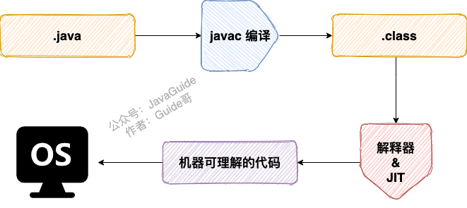

---
# 这是页面的图标
icon: page

# 这是文章的标题
title: Java - 基本概念与常识

# 设置作者
author: lllllan

# 设置写作时间
# time: 2020-01-22 16:07

# 一个页面只能有一个分类
category: Java

# 一个页面可以有多个标签
tag:
- Java基础

# 此页面会在文章列表置顶
# sticky: true

# 此页面会出现在首页的文章板块中
star: true

# 你可以自定义页脚
# footer:

---

::: warning

本文转载自以下文章，略有改动

- [Java基础常见知识&面试题总结 | JavaGuide](https://javaguide.cn/java/basis/java-basic-questions-01/)
- [java是解释执行吗](https://blog.csdn.net/qq_23191031/article/details/81677057)

:::

## 一、 Java语言的特点

1. 简单易学
2. 面向对象（封装，继承，多态）
3. 平台无关性（Java虚拟机，一次编译到处运行）
4. 解释执行（编译成字节码文件，java解释器对字节码进行解释执行）
5. 多线程
6. 分布式（强大、易于使用的联网能力）
7. 高性能（相对其他高级语言，[JIT](https://zhuanlan.zhihu.com/p/361250220)的发展）
8. 健壮性（强类型机制、异常处理、垃圾回收机制）
9. 安全性（安全机制以防止恶意代码的攻击）
10. 

### 1.1 编译与解释并存

由 Java 编写的程序需要先经过==编译==步骤，生成字节码（`.class` 文件），这种字节码必须由 Java 解释器来==解释执行==。

::: info 编译与解释

- 解释：
    - 好比做翻译，每说一句话， 就翻译一句话
    - 增删改一句话，重新翻译那句即可
- 编译：
    - 好比做翻译之后录制成磁带，整体一起录制
    - 增删改一句话，需要全部重新录制

因此解释的开发效率更高，但是执行速度慢；编译的执行速度更快，但是考法效率低

---

编写好的 Java 代码通过 JavaC ==编译== 成字节码文件，在运行的时候通过 JVM 内嵌的解释器将字节码文件 ==解释== 成机器码。

但是常见的 JVM 例如 Hotspot 虚拟机，都提供了 JIT(just in time 动态编译)机制，它可以将 ==反复执行的热点代码直接编译成机器码==，这种情况下就是编译执行了。

:::

::: tip 为什么要这么做？

编译型语言执行速度快、开发效率低，解释型语言开发效率快、执行速度慢。

编译与解释并存，（猜测应该）能融合两者的优点，提升开发效率的同时、保证执行速度。

---

java 代码被编译成字节码文件，字节码是平台无关的，是面向JVM编写的。JVM的接口是向下与硬件有关的，在不同平台上有不同的指令系统，才能支持字节码文件在不同的操作系统下解释执行，从而实现Java的跨平台性也就是可移植性

:::

### 1.2 Java 和 C++ 的区别

- 都是面向对象的语言，都支持封装、继承、多态
- Java不提供指针来直接访问内存，程序内存更加安全
- Java的类是单继承的，但是接口可以多继承；C++支持类多重继承
- Java有自动内存管理垃圾回收机制 （GC），不需要程序员手动释放无用内存
- C++同时支持方法重载和操作符重载，但是Java只支持方法重载（重载操作符增加了复杂性）
- 。。。

## 二、JVM & JDK & JRE

1. Java 虚拟机（JVM）是运行 Java 字节码的虚拟机。JVM 有针对不同系统的特定实现（Windows，Linux，macOS），目的是使用相同的字节码，它们都会给出相同的结果。
2. JRE 是 Java 运行时环境。它是运行已编译 Java 程序所需的所有内容的集合，包括 <u>Java 虚拟机（JVM），Java 类库，java 命令和其他的一些基础构件</u>。但是，它不能用于创建新程序。
3. JDK 是 Java Development Kit 缩写，它是功能齐全的 Java SDK。它拥有 JRE 所拥有的一切，还有编译器（javac）和工具（如 javadoc 和 jdb）。

::: tip JDK > JRE > JVM

[浅谈JDK、JRE、JVM区别与联系](https://blog.csdn.net/ancientear/article/details/79483592)

1. JVM不能单独执行class
2. JRE = JVM + lib（jvm工作需要的类库）。可以执行class
3. JDK包含JRE。可以开发、编译、执行

:::

### 2.1 Oracle JDK & OpenJDK （不懂）

[Java基础常见知识&面试题总结(上) | JavaGuide](https://javaguide.cn/java/basis/java-basic-questions-01/#oracle-jdk-vs-openjdk)

## 三、字节码及优点

JVM 可以理解的代码就叫做字节码（即扩展名为 `.class` 的文件），它不面向任何特定的处理器，只面向虚拟机。

- Java 语言通过字节码的方式，在一定程度上解决了传统解释型语言执行效率低的问题，同时又保留了解释型语言可移植的特点。
- 由于字节码并不针对一种特定的机器，因此，Java 程序无须重新编译便可在多种不同操作系统的计算机上运行。

