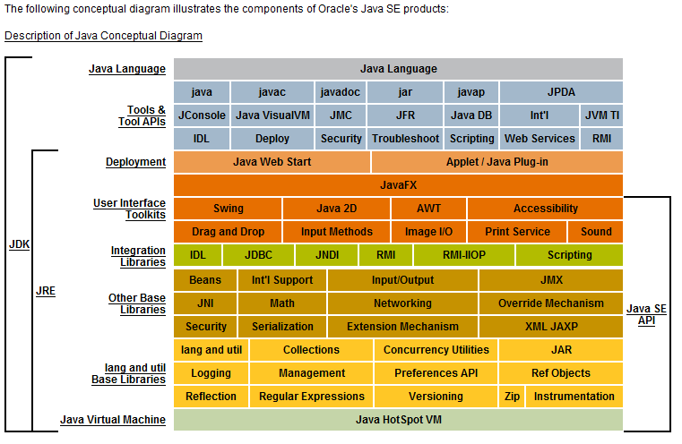

---
# 这是页面的图标
icon: page

# 这是文章的标题
title: Java - 基本概念与常识

# 设置作者
author: lllllan

# 设置写作时间
# time: 2020-01-22 16:07

# 一个页面只能有一个分类
category: Java

# 一个页面可以有多个标签
tag:
- Java基础

# 此页面会在文章列表置顶
# sticky: true

# 此页面会出现在首页的文章板块中
star: true

# 你可以自定义页脚
# footer:

---


::: warning

本文转载自以下文章，略有改动

- [Java基础常见知识&面试题总结 | JavaGuide](https://javaguide.cn/java/basis/java-basic-questions-01/)
- [java是解释执行吗](https://blog.csdn.net/qq_23191031/article/details/81677057)
- [浅谈JDK、JRE、JVM区别与联系](https://blog.csdn.net/ancientear/article/details/79483592)
- [什么是字节码？采用字节码的最大好处是什么？](https://blog.csdn.net/a4171175/article/details/90735888)

:::


## 一、 Java语言的特点

1. **简单性**：丢弃了C++中少用、难懂的特性，例如操作符重载、多继承、指针、内存管理等，不用手动管理对象的生命周期。
2. **面向对象**：封装，继承，多态
3. **平台无关性**：一次编译到处运行
4. **解释执行**：编译成字节码文件，java解释器对字节码进行解释执行
5. 多线程
6. 分布式（强大、易于使用的联网能力）
7. 高性能（相对其他高级语言，[JIT](https://zhuanlan.zhihu.com/p/361250220)的发展）
8. 健壮性（强类型机制、异常处理、垃圾回收机制）
9. 安全性（安全机制以防止恶意代码的攻击）
10. 


### 1.1 编译与解释并存

由 Java 编写的程序需要先经过 ==编译== 步骤，生成字节码（`.class` 文件），这种字节码必须由 Java 解释器来 ==解释执行==


::: info 编译与解释

- 解释：
    - 好比做翻译，每说一句话， 就翻译一句话
    - 增删改一句话，重新翻译那句即可
- 编译：
    - 好比做翻译之后录制成磁带，整体一起录制
    - 增删改一句话，需要全部重新录制


因此解释的开发效率更高，但是执行速度慢；编译的执行速度更快，但是考法效率低


---


编写好的 Java 代码通过 JavaC ==编译== 成字节码文件，在运行的时候通过 JVM 内嵌的解释器将字节码文件 ==解释== 成机器码。

但是常见的 JVM 例如 Hotspot 虚拟机，都提供了 JIT(just in time 动态编译)机制，它可以将 ==反复执行的热点代码直接编译成机器码==，这种情况下就是编译执行了。

:::


### 1.2 跨平台


java 代码被编译成字节码文件，字节码是平台无关的，是面向JVM编写的。JVM的接口是向下与硬件有关的，在不同平台上有不同的指令系统，才能支持字节码文件在不同的操作系统下解释执行，从而实现Java的跨平台性也就是可移植性


### 1.3 Java 和 C++ 的区别

- 都是面向对象的语言，都支持封装、继承、多态
- Java不提供指针来直接访问内存，程序内存更加安全
- Java的类是单继承的，但是接口可以多继承；C++支持类多重继承
- Java有自动内存管理垃圾回收机制 （GC），不需要程序员手动释放无用内存
- C++同时支持方法重载和操作符重载，但是Java只支持方法重载（重载操作符增加了复杂性）
- 。。。


## 二、JVM & JDK & JRE

1. Java 虚拟机（JVM）是运行 Java 字节码的虚拟机。JVM 有针对不同系统的特定实现（Windows，Linux，macOS），目的是使用相同的字节码，它们都会给出相同的结果。
2. JRE 是 Java 运行时环境。它是运行已编译 Java 程序所需的所有内容的集合，包括 <u>Java 虚拟机（JVM），Java 类库，java 命令和其他的一些基础构件</u>。但是，它不能用于创建新程序。
3. JDK 是 Java Development Kit 缩写，它是功能齐全的 Java SDK。它拥有 JRE 所拥有的一切，还有编译器（javac）和工具（如 javadoc 和 jdb）。


::: tip JDK > JRE > JVM

[浅谈JDK、JRE、JVM区别与联系](https://blog.csdn.net/ancientear/article/details/79483592)

1. JVM不能单独执行class
2. JRE = JVM + lib（jvm工作需要的类库）。可以执行class
3. JDK包含JRE。可以开发、编译、执行

:::





### 2.1 Oracle JDK & OpenJDK （不懂）

[Java基础常见知识&面试题总结(上) | JavaGuide](https://javaguide.cn/java/basis/java-basic-questions-01/#oracle-jdk-vs-openjdk)


## 三、字节码及优点

JVM 可以理解的代码就叫做字节码（即扩展名为 `.class` 的文件），它不面向任何特定的处理器，只面向虚拟机。

- Java 语言通过字节码的方式，在一定程度上解决了传统解释型语言执行效率低的问题，同时又保留了解释型语言可移植的特点。
- 由于字节码并不针对一种特定的机器，因此，Java 程序无须重新编译便可在多种不同操作系统的计算机上运行。


::: info 为什么

参考： [什么是字节码？采用字节码的最大好处是什么？](https://blog.csdn.net/a4171175/article/details/90735888)


**解释型语言**

- 优点：程序运行时才进行翻译，容易维护 、方便快速部署、不用停机维护。
- 缺点：每次运行都要解释一遍，性能较低


**编译型语言**

优点：编译器会对程序代码进行优化，并且只需要进行一次编译、效率较高

缺点：修个当个功能需要重新编译整个模块，不同的运行环境需要编译不同的机器码才能执行


**采用字节码：**

1. 先通过编译器对程序进行编译，会有一轮优化，能够一定程度上提高性能
2. 字节码面向虚拟机， 可由不同平台的虚拟机直接解释执行，不需要重新编译，实现可移植的特点

:::


## 四、Java 是值传递


### 4.1 值传递 & 引用传递

程序设计语言将实参传递给方法（或函数）的方式分为两种：

- **值传递** ：方法接收的是实参值的拷贝，会创建副本。
- **引用传递** ：方法接收的直接是实参所引用的对象在堆中的地址，不会创建副本，对形参的修改将影响到实参。

很多程序设计语言（比如 C++、 Pascal )提供了两种参数传递的方式，不过，在 Java 中只有值传递。


### 4.2 修改基本数据类型

```java
public static void main(String[] args) {
    int num1 = 10;
    int num2 = 20;
    swap(num1, num2);
    System.out.println("num1 = " + num1);
    System.out.println("num2 = " + num2);
}

public static void swap(int a, int b) {
    int temp = a;
    a = b;
    b = temp;
    System.out.println("a = " + a);
    System.out.println("b = " + b);
}

---------------------------------------------
    
a = 20
b = 10
num1 = 10
num2 = 20
```

- a和b只是从num1和num2复制得到了值，怎么操作都不会产生影响


### 4.3 修改引用类型中的值

```java
public static void main(String[] args) {
    int[] arr = { 1, 2, 3, 4, 5 };
    System.out.println(arr[0]);
    change(arr);
    System.out.println(arr[0]);
}

public static void change(int[] array) {
    // 将数组的第一个元素变为0
    array[0] = 0;
}

---------------------------------------------
   
1
0
```


### 4.4 修改引用类型的对象

```java
public class Person {
    private String name;
   // 省略构造函数、Getter&Setter方法
}

public static void main(String[] args) {
    Person xiaoZhang = new Person("小张");
    Person xiaoLi = new Person("小李");
    swap(xiaoZhang, xiaoLi);
    System.out.println("xiaoZhang:" + xiaoZhang.getName());
    System.out.println("xiaoLi:" + xiaoLi.getName());
}

public static void swap(Person person1, Person person2) {
    Person temp = person1;
    person1 = person2;
    person2 = temp;
    System.out.println("person1:" + person1.getName());
    System.out.println("person2:" + person2.getName());
}

-----------------------------------------------------------
    
person1:小李
person2:小张
xiaoZhang:小张
xiaoLi:小李
```


### 总结

Java 中将实参传递给方法（或函数）的方式是 **值传递** ：

- 如果参数是基本类型的话，很简单，传递的就是基本类型的字面量值的拷贝，会创建副本。
- 如果参数是引用类型，传递的就是实参所引用的对象在堆中地址值的拷贝，同样也会创建副本。
