---
# 这是页面的图标
icon: page

# 这是文章的标题
title: R2Coding - Java 基础知识

# 设置作者
author: lllllan

# 设置写作时间
# time: 2020-01-22 16:07

# 一个页面只能有一个分类
category: Java

# 一个页面可以有多个标签
tag:
- Java基础

# 此页面会在文章列表置顶
# sticky: true

# 此页面会出现在首页的文章板块中
star: true

# 你可以自定义页脚
# footer:
---


::: warning

全部抄自[Road 2 Coding](https://www.r2coding.com/#/)上提供资料

:::

## 一、 java语言的特点

- 面向对象
- 平台无关性

> 已编译的java程序可以在任何带 有jvm的平台上运行。
>
> `java` 代码编译为 `.class` 文件，然后打包成 `.jar` 文件，这样就能够在不同系统下运行了。

- 简单性

> 摒弃了C++中难以理解的多继承、指针、内存管理等概念，不用手动管理对象的生命周期

- 解释执行

> 静态页面，在编译期间救恩那个直到数据类型的语言，在运行前就能检查类型的正确性。
>
> 执行效率相比动态语言更高，速度更快

- 多线程 

> java **应该** 在 `用户空间` 实现的多线程，内核感知不到 java 存在多线程机制。

- 分布式

> 

- 健壮性

> 强类型机制、异常处理、垃圾的自动收集

- 高性能

> 

- 安全性


## 二、面向对象


### 2.1 初始化顺序

> - 静态属性
> - 静态方法快
> - 普通方法
> - 普通方法块
> - 构造函数
> - 方法

```java
public class Solution {

    private static String staticField = getStaticField();

    public static String getStaticField() {
        String staticFiled = "静态属性初始化";
        System.out.println(staticFiled);
        return staticFiled;
    }

    static {
        System.out.println("静态方法块初始化");
    }

    private String field = getField();

    public String getField() {
        String field = "普通属性初始化";
        System.out.println(field);
        return field;
    }

    {
        System.out.println("普通方法块初始化");
    }

    public Solution() {
        System.out.println("构造函数");
    }

    public static void main(String[] args) {
        new Solution();
    }
}
```

```out
静态属性初始化
静态方法块初始化
普通属性初始化
普通方法块初始化
构造函数
```


---

### 2.2 三大特性

- 封装
- 继承
- 多态


#### 访问控制权限


---

### 2.3 接口

- interface、implements
- 接口只能使用 `public` `default`  两种访问修饰符
- 接口只提供方法的定义。
- 接口不能被实例化，所以接口中不能有构造方法。
- 接口的实现类必须实现接口的全部方法。


---

### 2.4 抽象类

- abstract
- 只有抽象类中能有抽象方法，抽象类中不只有抽象方法。
- 抽象类不能被实例化。


---

### 2.5 内部类

- 内部类拥有外部类的访问权限

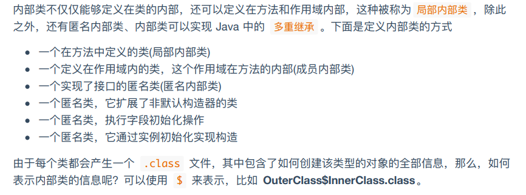


## 三、异常


### 3.1 Throwable

`Throable` 类是Java语言中所有 `错误(errors)` 和 `异常(exceptions)` 的父类。

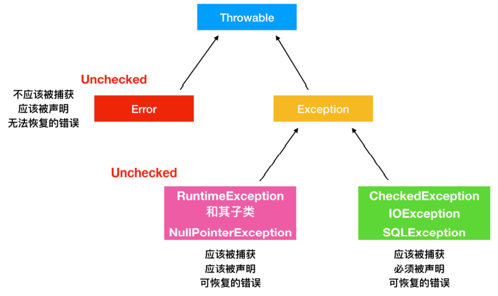


### 3.2 常见异常

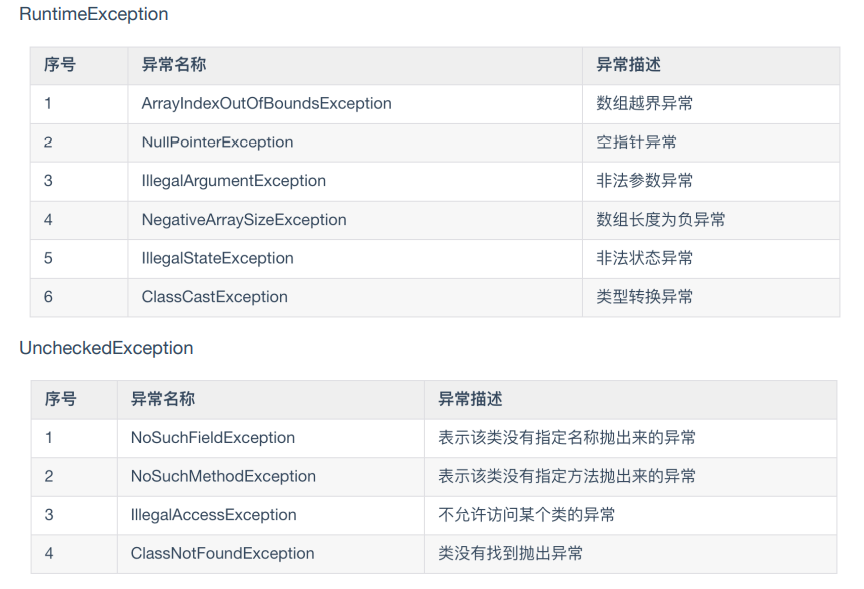


### 3.3 Error


## 四、集合


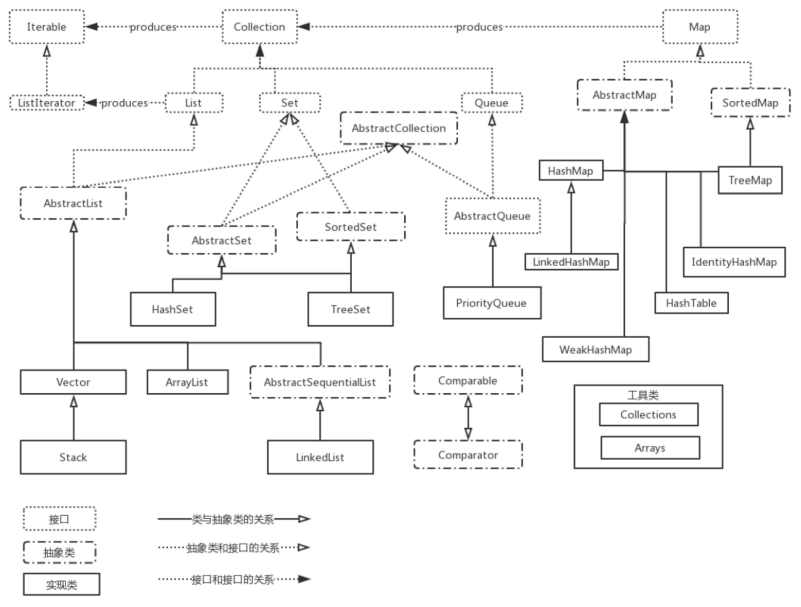


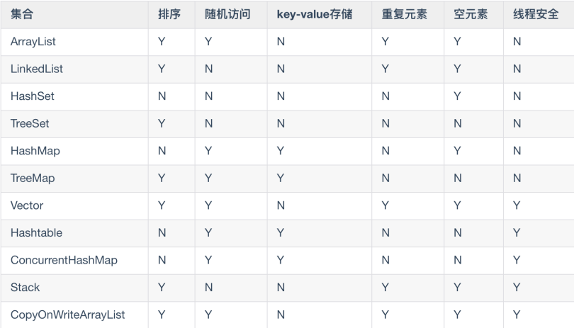


## 五、反射

Java反射机制是在程序的运行过程中，对于任何一个类，都能知道它的所有属性和方法；对于任意一个对象，都能知道调用它的任意属性和方法。

这种动态获取信息以及动态调用对象方法的功能称为Java语言的反射机制。

- 在运行时判断任意一个对象所属的类
- 在运行时判断任意一个类的对象
- 在运行时判断任意一个类所有的成员变量和方法
- 在运行时调用任意一个对象的方法


### 5.1 Class 类

当我们编写一个类，在生产的`.class` 文件中，就会产生一个 Class 对象。这个 Class 对象用于标识这个类的类型信息。

Class中没有公共的构造器，也就是说Class对象不能杯实例化。

其中包含了很多方法，详见《Java基础核心总结》P54


### 5.2 Field 类

Field 类提供类或接口中单独字段的信息，以及对单独字段的动态访问。


### 5.3 Method 类

传递 Object 对象及参数调用该对象对应的方法


### 5.4 ClassLoader 类

类装载器是用来把类装载进JVM的。ClassLoader使用的是双亲委托模型来搜索加载类的。

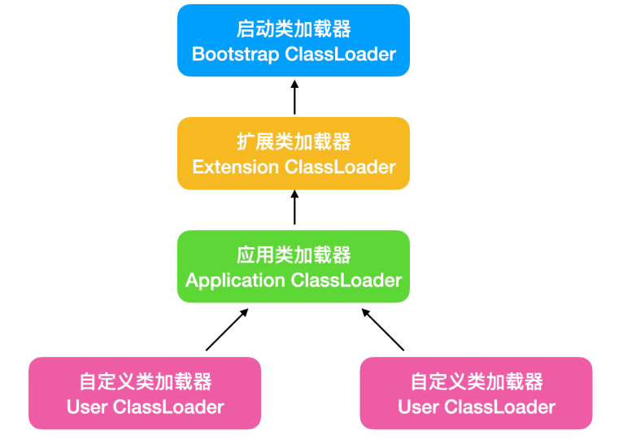


## 六、枚举

枚举是一个特殊的类，一般表示一组常量

```java
public enum Family {
    FATHER,
    MOTHER,
    SON,
    Daughter;
}
```

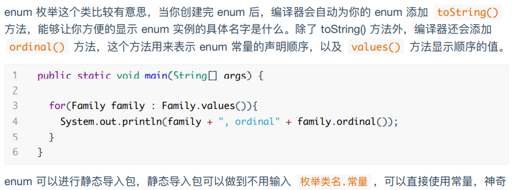


一般 switch 可以和 enum 一起连用，来构造一个小型的状态转换机

```java
enum Signal {
    GREEN, YELLOW, RED
}
public class TrafficLight {
    Signal color = Signal.RED;
    public void change() {
        switch (color) {
            case RED:
                color = Signal.GREEN;
                break;
            case YELLOW:
                color = Signal.RED;
                break;
            case GREEN:
                color = Signal.YELLOW;
                break;
        }
    }
}
```


## 七、IO

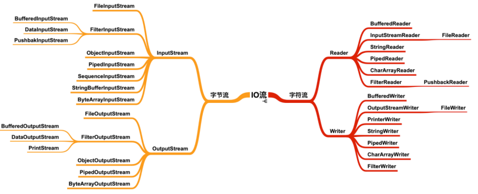


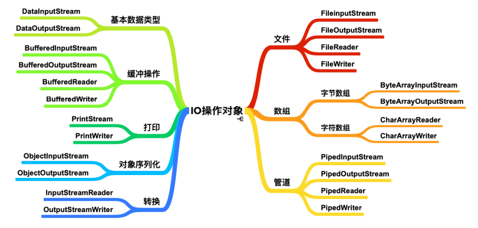


### 7.1 File 类

主要涉及 **文件创建、删除文件、获取文件描述**

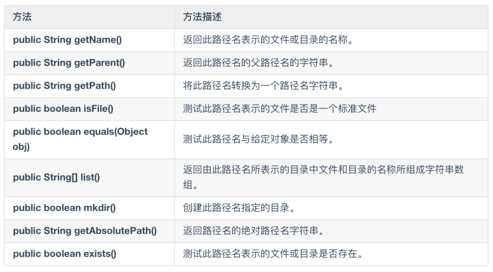


### 7.2 InputStream

字节输入模式的抽象类

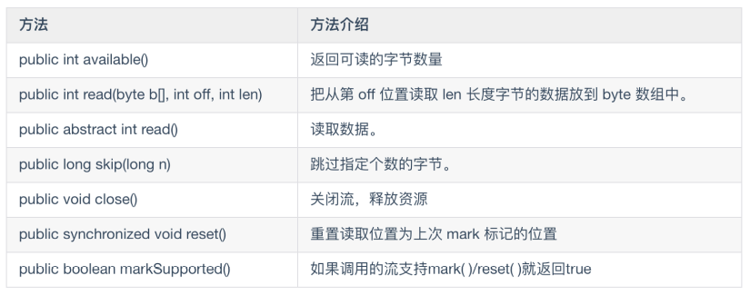


### 7.3 OutputStream

字节输出模式的抽象类 

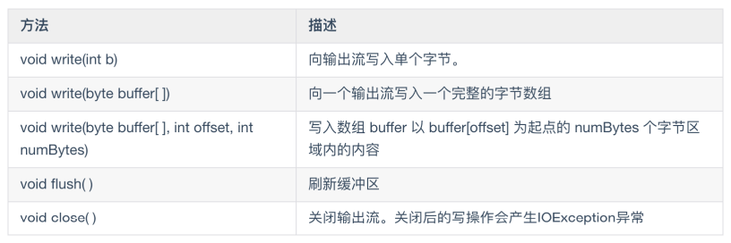


### 7.4 Reader

字符输入模式的抽象类

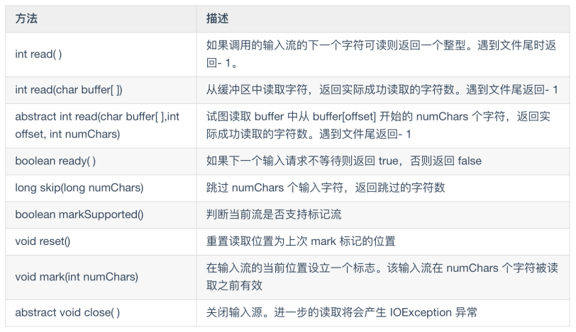


### 7.5 Writer

字符输出模式的抽象类

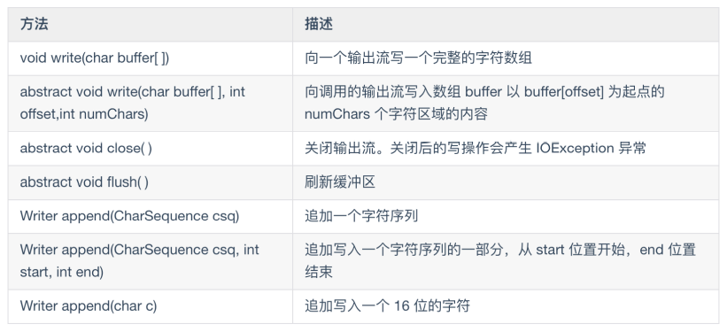


### 7.6 更多其他子类

详见 《Java基础核心总结》 p67


## 插眼：

### JDK、JRE、JVM

### switch 实现原理

### 深浅拷贝

### 代理，意义何在

### 面向对象三大特性

### 修饰符

### 集合


