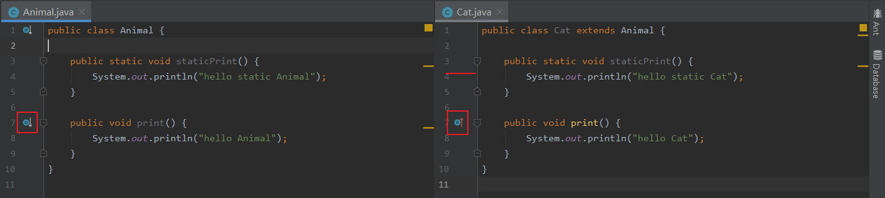

---
# 这是页面的图标
icon: page

# 这是文章的标题
title: Java - 基础语法

# 设置作者
author: lllllan

# 设置写作时间
# time: 2020-01-22 16:07

# 一个页面只能有一个分类
category: Java

# 一个页面可以有多个标签
tag:
- Java基础

# 此页面会在文章列表置顶
# sticky: true

# 此页面会出现在首页的文章板块中
star: true

# 你可以自定义页脚
# footer:

---


::: warning 本文转载自以下文章，略有改动

- [JavaGuide](https://javaguide.cn/)
- [还不知道泛型是什么？这一篇深入浅出泛型教学！](https://zhuanlan.zhihu.com/p/382239048)

:::


## 一、静态方法为什么不能调用非静态方法？

1. 静态方法是属于类的，在类加载的时候就会分配内存，可以通过类名直接访问。而非静态成员属于实例对象，只有在对象实例化之后才存在，需要通过类的实例对象去访问。
2. 在类的非静态成员不存在的时候静态成员就已经存在了，此时调用在内存中还不存在的非静态成员，属于非法操作。


::: tip 为什么要用静态方法？

- **更方便**：静态方法的好处就是不用生成类的实例就可以直接调用。
- **降低消耗**：只需要通过其类名就可以访问，不需要再消耗资源反复创建对象。

:::


## 二、常见语法


### 2.1  操作符 +=

`+=` 操作符会进行隐式自动类型转换

```java
byte a = 127;
byte b = 127;
a = a + b; // Error:(5, 15) java: 不兼容的类型: 从int转换到byte可能会有损失
a += b;    // a = -2
```

```java
short a = 1;
a = a + 1; // Error:(4, 15) java: 不兼容的类型: 从int转换到short可能会有损失
a += 1;    // a = 2
```

运算中的 `1` 默认是 `int`类型，那么将 `int` 类型赋值给 `short` 类型时，会出现类型转换错误。

而对于 `+=`，是 Java 语言规定的运算符， Java 编译器自己会进行特殊处理


### 2.2 switch 能否作用在  `byte`、`long`、`String`上？

switch 中放的只能是一个整数表达式或枚举常量。而整数表达式可以是 `int` 或 `Integer`

- 由于 `byte`、`short`、`char` 都可以隐式转换为 `int`，因此这些类型以及他们的包装类都是可以用的。
- `long` 不可以
- `String` 在 JDK1.7 之后可以使用


## 三、常见关键字


### 3.1 instanceof 关键字的作用 

`instanceof`  严格来说是Java中的一个双目运算符，用来测试一个对象是否为一个类的实例，用法 为： 

```java
boolean result = obj instanceof Class
```

​		其中 obj 为一个对象，Class 表示一个类或者一个接口，当 obj 为 Class 的对象，或者是其直接 或间接子类，或者是其接口的实现类，结果result 都返回 true，否则返回false。

​		 注意：编译器会检查 obj 是否能转换成右边的class类型，如果不能转换则直接报错，如果不能 确定类型，则通过编译，具体看运行时定。  

```java
int i = 0; 
System.out.println(i instanceof Integer);//编译不通过 i必须是引用类型，不能是基本类型 
System.out.println(i instanceof Object);//编译不通过
```

```java
Integer integer = new Integer(1); 
System.out.println(integer instanceof Integer);//true 
```

```java
//false ,在 JavaSE规范 中对 instanceof 运算符的规定就是：如果 obj 为 null，那么将返 回 false。 
System.out.println(null instanceof Object);
```


### 3.2 final有哪些用法

1. 被final修饰的类不可以被继承 
2. 被final修饰的方法不可以被重写 
3. 被final修饰的变量不可以被改变。如果修饰引用，那么表示引用不可变，引用指向的内容可变.
4. 被final修饰的方法，JVM会尝试将其内联，以提高运行效率 
5. 被final修饰的常量，在编译阶段会存入常量池中


## 四、重载和重写的区别


### 4.1 重载：

发生在同一个类中（或者父类和子类之间），方法名必须相同，参数类型不同、个数不同、顺序不同，方法返回值和访问修饰符可以不同。


### 4.2 重写

重写发生在运行期，是子类对父类的允许访问的方法的实现过程进行重新编写。

1. 返回值类型、方法名、参数列表必须相同，抛出的异常范围小于等于父类，访问修饰符范围大于等于父类。
2. 如果父类方法访问修饰符为 `private/final/static` 则子类就不能重写该方法，但是被 static 修饰的方法能够被再次声明。
3. 构造方法无法被重写


#### 4.2.1 Java 中是否可以重写一个 private 或者 static 方法？

重写，又称覆盖，是在 ==运行时绑定== 的。

- 子类不能访问或使用父类中的 private 方法，因此不能实现重写
- static 方法是编译时静态绑定的，就算子类中再写了一个同名同参的相同方法，也只是两个毫不相干的方法，不能称为重写。




::: tip 方法的重写发生在运行时

因为在编译时，编译器是无法知道我们到底是调用父类的方法还是子类的方法，相反的，只有在实际运行的时候，我们才知道应该调用哪个方法。这个也是java运行时多态的体现。

静态方法在类加载时就出现了，和重写不在同一个时期。通过 IDEA 也可以发现，普通方法 `print()` 的重写，方法左边有一个图标标识，而静态方法 `staticPrint()` 的两个方法，两者之间没有关系。

:::


#### 4.2.2 构造器是否可以被重写？

父类的私有属性、方法以及构造器都是不能被重写的。


### 4.3 总结

重写就是子类对父类方法的重新改造，外部样子不能改变，内部逻辑可以改变。

| 区别点     | 重载方法 | 重写方法                                                     |
| :--------- | :------- | :----------------------------------------------------------- |
| 发生范围   | 同一个类 | 子类                                                         |
| 参数列表   | 必须修改 | 一定不能修改                                                 |
| 返回类型   | 可修改   | 子类方法返回值类型应比父类方法返回值类型更小或相等           |
| 异常       | 可修改   | 子类方法声明抛出的异常类应比父类方法声明抛出的异常类更小或相等； |
| 访问修饰符 | 可修改   | 一定不能做更严格的限制（可以降低限制）                       |
| 发生阶段   | 编译期   | 运行期                                                       |


## 五、泛型

下面部分转载自 [还不知道泛型是什么？这一篇深入浅出泛型教学！](https://zhuanlan.zhihu.com/p/382239048)


### 5.1 为什么会有泛型

> 早期的Object类型可以接收任意的对象类型，但是在实际的使用中，会有类型转换的问题。也就存在这隐患，所以Java提供了**泛型**来解决这个安全问题。

```java
public static void main(String[] args) {
    //测试一下泛型的经典案例
    ArrayList arrayList = new ArrayList();
    arrayList.add("helloWorld");
    arrayList.add("taiziyenezha");
    arrayList.add(88);//由于集合没有做任何限定，任何类型都可以给其中存放

    for (int i = 0; i < arrayList.size(); i++) {
        //需求：打印每个字符串的长度,就要把对象转成String类型
        String str = (String) arrayList.get(i);
        System.out.println(str.length());
    }
}
```

运行这段代码，程序在运行时发生了异常：`Exception in thread "main" java.lang.ClassCastException: java.lang.Integer cannot be cast to java.lang.String`
发生了数据类型转换异常，这是为什么？

由于ArrayList可以存放任意类型的元素。例子中添加了一个String类型，添加了一个Integer类型，再使用时都以String的方式使用，导致取出时强制转换为String类型后，引发了ClassCastException，因此程序崩溃了。

这显然不是我们所期望的，如果程序有潜在的错误，我们更期望在编译时被告知错误，而不是在运行时报异常。而为了解决类似这样的问题（在编译阶段就可以解决），在jdk1.5后，泛型应运而生。让你在设计API时可以指定类或方法支持泛型，这样我们使用API的时候也变得更为简洁，并得到了编译时期的语法检查。

我们将第一行声明初始化ArrayList的代码更改一下，编译器就会在编译阶段就能够帮我们发现类似这样的问题。现在再看看效果。

```java
ArrayList<String> arrayList = new ArrayList<>();
arrayList.add("helloWorld");
arrayList.add("taiziyenezha");
arrayList.add(88);// 在编译阶段，编译器就会报错这样可以避免了我们类型强转时出现异常。
```


### 5.2 什么是泛型

**泛型**：是一种把明确类型的工作推迟到创建对象或者调用方法的时候才去明确的特殊的类型。也就是说在泛型使用过程中，操作的数据类型被指定为一个参数，而这种参数类型可以用在**类、方法和接口**中，分别被称为`泛型类`、`泛型方法`、`泛型接口`。


::: info 注意

一般在创建对象时，将未知的类型确定具体的类型。当没有指定泛型时，默认类型为Object类型。

:::


### 5.3 泛型的好处

- 避免了类型强转的麻烦。
- 它提供了编译期的**类型安全**，确保在泛型类型（通常为泛型集合）上只能使用正确类型的对象，避免了在运行时出现ClassCastException。


### 5.4 泛型的使用

略。
