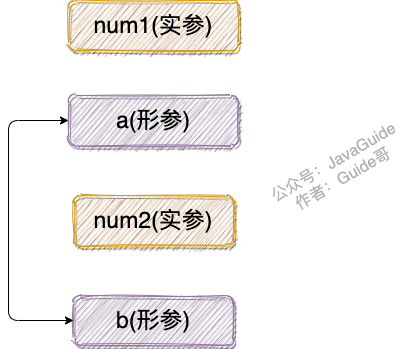
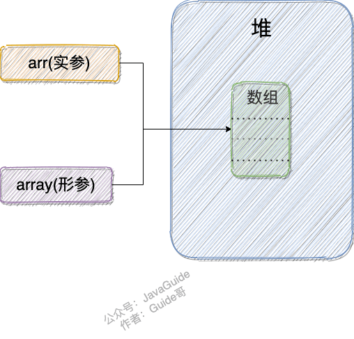

---
# 这是页面的图标
icon: page

# 这是文章的标题
title: java 是值传递

# 设置作者
author: lllllan

# 设置写作时间
# time: 2020-01-20

# 一个页面只能有一个分类
category: Java

# 一个页面可以有多个标签
tag:
- Java基础

# 此页面会在文章列表指定
# sticky: true

# 此页面会出现在首页的文章板块中
star: true

# 你可以自定义页脚
# footer: 
---


::: warning

全部抄自 [为什么 Java 中只有值传递？ | JavaGuide](https://javaguide.cn/java/basis/why-there-only-value-passing-in-java/)，略有改动

:::	


## 值传递 & 引用传递

程序设计语言将实参传递给方法（或函数）的方式分为两种：

- **值传递** ：方法接收的是实参值的拷贝，会创建副本。
- **引用传递** ：方法接收的直接是实参所引用的对象在堆中的地址，不会创建副本，对形参的修改将影响到实参。

很多程序设计语言（比如 C++、 Pascal )提供了两种参数传递的方式，不过，在 Java 中只有值传递。


## 实例


### 对基本数据类型进行修改

```java
public static void main(String[] args) {
    int num1 = 10;
    int num2 = 20;
    swap(num1, num2);
    System.out.println("num1 = " + num1);
    System.out.println("num2 = " + num2);
}

public static void swap(int a, int b) {
    int temp = a;
    a = b;
    b = temp;
    System.out.println("a = " + a);
    System.out.println("b = " + b);
}

---------------------------------------------
    
a = 20
b = 10
num1 = 10
num2 = 20
```

- a和b只是从num1和num2复制得到了值，怎么操作都不会产生影响




### 修改引用类型中的值

```java
public static void main(String[] args) {
    int[] arr = { 1, 2, 3, 4, 5 };
    System.out.println(arr[0]);
    change(arr);
    System.out.println(arr[0]);
}

public static void change(int[] array) {
    // 将数组的第一个元素变为0
    array[0] = 0;
}

---------------------------------------------
   
1
0
```




### 修改引用类型的对象

```java
public class Person {
    private String name;
   // 省略构造函数、Getter&Setter方法
}

public static void main(String[] args) {
    Person xiaoZhang = new Person("小张");
    Person xiaoLi = new Person("小李");
    swap(xiaoZhang, xiaoLi);
    System.out.println("xiaoZhang:" + xiaoZhang.getName());
    System.out.println("xiaoLi:" + xiaoLi.getName());
}

public static void swap(Person person1, Person person2) {
    Person temp = person1;
    person1 = person2;
    person2 = temp;
    System.out.println("person1:" + person1.getName());
    System.out.println("person2:" + person2.getName());
}

-----------------------------------------------------------
    
person1:小李
person2:小张
xiaoZhang:小张
xiaoLi:小李
```


## 总结

Java 中将实参传递给方法（或函数）的方式是 **值传递** ：

- 如果参数是基本类型的话，很简单，传递的就是基本类型的字面量值的拷贝，会创建副本。
- 如果参数是引用类型，传递的就是实参所引用的对象在堆中地址值的拷贝，同样也会创建副本。

