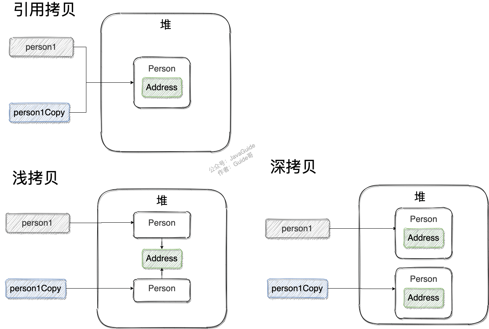

---
# 这是页面的图标
icon: page

# 这是文章的标题
title: Java - 面向对象

# 设置作者
author: lllllan

# 设置写作时间
# time: 2020-01-22 16:07

# 一个页面只能有一个分类
category: Java

# 一个页面可以有多个标签
tag:
- Java基础

# 此页面会在文章列表置顶
# sticky: true

# 此页面会出现在首页的文章板块中
star: true

# 你可以自定义页脚
# footer:

---


::: warning 本文转载自以下文章，略有改动

- [JavaGuide](https://javaguide.cn/)
- [2分钟让你明白什么是面向对象编程](https://zhuanlan.zhihu.com/p/75265007)
- [String为什么不可变 - 梦醒点灯](https://www.cnblogs.com/leskang/p/6110631.html)

:::


## 一、面向对象和面向过程的区别

**面向过程：**

面向过程的思想会将一件事情，拆分成一个个更具体的小任务，由一个个方法去完成他们。只要按顺序执行这些方法，就能完成这件事情。

**面向对象：**

面向对象的思想会把事物抽象成对象的概念，把一件事情拆分成一个个更具体的小问题，交由不同的对象分别完成以解决问题。

更详细生动的说明详见 [2分钟让你明白什么是面向对象编程](https://zhuanlan.zhihu.com/p/75265007)

| 项目名称 |                       面向对象程序设计                       |              面向过程程序设计（也叫结构化编程）              |
| :------: | :----------------------------------------------------------: | :----------------------------------------------------------: |
|   定义   | 面向对象顾名思义就是把现实中的事务都抽象成为程序设计中的“对象”，其基本思想是一切皆对象，是一种“自下而上”的设计语言，先设计组件，再完成拼装。 | 面向过程是“自上而下”的设计语言，先定好框架，再增砖添瓦。通俗点，就是先定好main()函数，然后再逐步实现main()函数中所要用到的其他方法。 |
|   特点   |                       封装、继承、多态                       |                        算法+数据结构                         |
|   优势   |                适用于大型复杂系统，方便复用、                |                   适用于简单系统，容易理解                   |
|   劣势   |                  比较抽象、性能比面向过程低                  |        难以应对复杂系统，难以复用，不易维护、不易扩展        |
|   对比   | 易维护、易复用、易扩展，由于面向对象有封装、继承、多态性的特性，可以设计出低耦合的系统，使系统 更加灵活、更加易于维护 | 性能比面向对象高，因为类调用时需要实例化，开销比较大，比较消耗资源;比如单片机、嵌入式开发、 Linux/Unix等一般采用面向过程开发，性能是最重要的因素 |
| 设计语言 |    Java、Smalltalk、EIFFEL、C++、Objective-、C#、Python等    |                          C、Fortran                          |

-  因为类调用时需要实例化，开销比较大，比较消耗资源，所以当性能是最重要的考量因素的时候，比如单片机、嵌入式开发、Linux/Unix 等一般采用面向过程开发。

-  因为面向对象有封装、继承、多态性的特性，所以可以设计出低耦合的系统，使系统更加灵活、更加易于维护。


::: tip 面向对象易维护、易复用、易扩展。面向过程性能相对较高。

:::


## 二、面向对象三大特征


### 2.1 封装

封装是指把一个对象的状态信息（也就是属性）隐藏在对象内部，不允许外部对象直接访问对象的内部信息。但是可以提供一些可以被外界访问的方法来操作属性。


::: tip 封装的好处

- 隐藏实现细节，提供公共的访问方式
- 提高代码的复用性
- 提高安全性（别人不能通过 变量名.属性名 的方式来修改私有的成员属性）

:::


```java
public class Student {
    private int id;//id属性私有化
    private String name;//name属性私有化

    //获取id的方法
    public int getId() { return id; }

    //设置id的方法
    public void setId(int id) { this.id = id; }

    //获取name的方法
    public String getName() { return name; }

    //设置name的方法
    public void setName(String name) { this.name = name; }
}
```


### 2.2 继承

继承是使用已存在的类的定义作为基础建立新类的技术，新类的定义可以增加新的数据或新的功能，也可以用父类的功能，但不能选择性地继承父类。通过使用继承，可以快速地创建新的类，可以提高代码的重用，程序的可维护性，节省大量创建新类的时间 ，提高我们的开发效率。

1. 子类拥有父类对象所有的属性和方法（包括私有属性和私有方法），但是父类中的私有属性和方法子类是无法访问，**只是拥有**。
2. 子类可以拥有自己属性和方法，即子类可以对父类进行扩展。
3. 子类可以用自己的方式实现父类的方法。


::: tip 继承的优点

1. 提高代码的复用性
2. 提高代码的易维护性
3. 提高代码的可扩展性
4. 使代码结构清晰

:::


::: tip 继承的缺点

1. 高耦合性：父子类联系紧密，修改父类的同时，需要兼顾子类
2. 破坏封装性、降低灵活性

:::


### 2.3 多态

表示一个对象具有多种的状态，具体表现为父类的引用指向子类的实例。

- 对象类型和引用类型之间具有继承（类）/实现（接口）的关系；
- 引用类型变量发出的方法调用的到底是哪个类中的方法，必须在程序**运行期间**才能确定；
- 多态不能调用“**只在子类存在但在父类不存在**”的方法；
- 如果子类重写了父类的方法，真正执行的是**子类覆盖**的方法，如果子类没有覆盖父类的方法，执行的是父类的方法。


::: tip 多态存在的必要条件

1. 要有继承
2. 要有重写
3. **父类引用指向子类对象**

::: 


::: tip 多态的好处

1. 提高了代码的可扩展性
2. 可替换性
3. 接口性：向子类提供共同接口，由子类来完善或覆盖
4. 灵活性
5. 简化性

::: 


## 三、对象和引用


### 3.1 对象实体和对象引用

一个对象引用可以指向 0 个或 1 个对象（一根绳子可以不系气球，也可以系一个气球）;一个对象可以有 n 个引用指向它（可以用 n 条绳子系住一个气球）。


### 3.2 对象相等和引用相等

对象的相等，比的是内存中存放的内容是否相等。而引用相等，比较的是他们指向的内存地址是否相等。


## 五、比较方法


### 4.1 == 和 equals() 的区别

**`==`** 对于基本类型和引用类型的作用效果是不同的：

- 对于基本数据类型来说，`==` 比较的是值。
- 对于引用数据类型来说，`==` 比较的是对象的内存地址。


::: tip Java 只有值传递

所以，对于 == 来说，不管是比较基本数据类型，还是引用数据类型的变量，其本质比较的都是值，只是引用类型变量存的值是对象的地址。

:::


**`equals()`** 作用不能用于判断基本数据类型的变量，只能用来判断两个对象是否相等。`equals()`方法存在于`Object`类中，而`Object`类是所有类的直接或间接父类。


### 4.2 hashCode() 与 equals()

因为两个相等的对象的 `hashCode` 值必须是相等。也就是说如果 `equals` 方法判断两个对象是相等的，那这两个对象的 `hashCode` 值也要相等。

如果重写 `equals()` 时没有重写 `hashCode()` 方法的话就可能会导致 `equals` 方法判断是相等的两个对象，`hashCode` 值却不相等。

更多解释见  [Java基础常见知识&面试题总结(上) | JavaGuide](https://javaguide.cn/java/basis/java-basic-questions-01/#hashcode-与-equals)


::: tip hashCode的作用

hashCode和equals有一个相同的作用，就是用作比较：

- equals 为true的两个对象相等，false则两个对象不相等
- hashCode 相同的两个对象不一定相等，但不同的两个对象一定不相等

:::


::: tip 为什么要有 hashCode？

**效率**
当一个对象逐渐复杂时，equals方法中的判定条件也会逐渐复杂，这个时候比较两个对象是否相等依旧使用equals的话，就会变得低效。

因此引出hashCode，通过一定的计算方式，为每个对象分配一个“哈希码”，让相等的对象都拥有相同的哈希码。之后需要比较两个对象的时候，先比较哈希码，如果哈希码都不相同，两个对象一定不相等。如果哈希码相同，再继续使用equals确定对象是否相等。

hashCode 方法相对与 equals 会更加高效，通过这两步判断，来确定两个对象是否相等

:::


## 六、构造方法


### 6.1 构造方法的特点

1. 名字与类名相同。
2. 没有返回值，但不能用 void 声明构造函数。
3. 生成类的对象时自动执行，无需调用。


::: tip 

构造方法不能被 override（重写）,但是可以 overload（重载）,所以你可以看到一个类中有多个构造函数的情况。

:::


### 6.2 无参构造函数的作用

1. 不写任何构造器，也会有一个默认的无参构造。但如果写了有参构造，就必须另写一个无参构造，否则就无法执行无参构造。
2. 子类的构造当中，如果没有指定 super() 来调用父类中某个构造方法，则会调用父类中的无参构。如果这个时候父类中存在有参构造而没有无参构造，就会出错。


### 6.3 构造器是否可以被重写？

父类的私有属性、方法以及构造器都是不能被重写的。


## 七、 `String`、`StringBuffer`、`StringBuilder`


### 7.1 `String` 为什么是不可变的

详细参考 [String为什么不可变 - 梦醒点灯](https://www.cnblogs.com/leskang/p/6110631.html)

在Java中String类其实就是对字符数组的封装。

```java
public final class String implements java.io.Serializable, Comparable<String>, CharSequence {
    private final char value[];
	//...
}
```

1. 保存字符串的数组被 `final` 修饰且为私有的，并且`String` 类没有提供/暴露修改这个字符串的方法。
2. `String` 类被 `final` 修饰导致其不能被继承，进而避免了子类破坏 `String` 不可变。


### 7.2 `String` 真的不可变吗？

一下内容转载自 [String为什么不可变 - 梦醒点灯](https://www.cnblogs.com/leskang/p/6110631.html)

String的成员变量是private final 的，也就是初始化之后不可改变。那么在这几个成员中， value比较特殊，因为他是一个引用变量，而不是真正的对象。value是final修饰的，也就是说final不能再指向其他数组对象，那么我能改变value指向的数组吗？


**反射**

```java
public static void testReflection() throws Exception {
     
    //创建字符串"Hello World"， 并赋给引用s
    String s = "Hello World"; 
     
    System.out.println("s = " + s); //Hello World
     
    //获取String类中的value字段
    Field valueFieldOfString = String.class.getDeclaredField("value");
     
    //改变value属性的访问权限
    valueFieldOfString.setAccessible(true);
     
    //获取s对象上的value属性的值
    char[] value = (char[]) valueFieldOfString.get(s);
     
    //改变value所引用的数组中的第5个字符
    value[5] = '_';
     
    System.out.println("s = " + s);  //Hello_World
}
```

打印结果为： s = Hello World

s = Hello_World

在这个过程中，s始终引用的同一个String对象，但是再反射前后，这个String对象发生了变化， 也就是说，通过反射是可以修改所谓的“不可变”对象的。但是一般我们不这么做。这个反射的实例还可以说明一个问题：如果一个对象，他组合的其他对象的状态是可以改变的，那么这个对象很可能不是不可变对象。例如一个Car对象，它组合了一个Wheel对象，虽然这个Wheel对象声明成了private final 的，但是这个Wheel对象内部的状态可以改变， 那么就不能很好的保证Car对象不可变。


### 7.3 `StringBuffer`、`StringBuilder`

`StringBuilder` 与 `StringBuffer` 都继承自 `AbstractStringBuilder` 类，在 `AbstractStringBuilder` 中也是使用字符数组保存字符串，不过没有使用 `final` 和 `private` 关键字修饰，最关键的是这个 `AbstractStringBuilder` 类还提供了很多修改字符串的方法比如 `append` 方法。

```java
abstract class AbstractStringBuilder implements Appendable, CharSequence {
    char[] value;
    public AbstractStringBuilder append(String str) {
        if (str == null)
            return appendNull();
        int len = str.length();
        ensureCapacityInternal(count + len);
        str.getChars(0, len, value, count);
        count += len;
        return this;
    }
  	//...
}
```


### 7.4 线程安全性


::: tip 

`String`、`StringBuffer` 是线程安全的，`StringBuilder` 非线程安全。

:::


- `String` 中的对象是不可变的，也就可以理解为常量，线程安全。
- `AbstractStringBuilder` 是 `StringBuilder` 与 `StringBuffer` 的公共父类，定义了一些字符串的基本操作，如 `expandCapacity`、`append`、`insert`、`indexOf` 等公共方法。
    - `StringBuffer` 对方法加了同步锁或者对调用的方法加了同步锁，所以是线程安全的。
    - `StringBuilder` 并没有对方法进行加同步锁，所以是非线程安全的。


### 7.5 性能

`StringBuilder` > `StringBuffer` > `String`

每次对 `String` 类型进行改变的时候，都会生成一个新的 `String` 对象，然后将指针指向新的 `String` 对象。`StringBuffer` 每次都会对 `StringBuffer` 对象本身进行操作，而不是生成新的对象并改变对象引用。相同情况下使用 `StringBuilder` 相比使用 `StringBuffer` 仅能获得 10%~15% 左右的性能提升，但却要冒多线程不安全的风险。 

1. 操作少量的数据: 适用 `String`
2. 单线程操作字符串缓冲区下操作大量数据: 适用 `StringBuilder`
3. 多线程操作字符串缓冲区下操作大量数据: 适用 `StringBuffer`


## 八、 `Object` 类的常见方法

```java
//native方法，用于返回当前运行时对象的Class对象，使用了final关键字修饰，故不允许子类重写。
public final native Class<?> getClass()
    
//native方法，用于返回对象的哈希码，主要使用在哈希表中，比如JDK中的HashMap。
public native int hashCode() 
    
//用于比较2个对象的内存地址是否相等，String类对该方法进行了重写用户比较字符串的值是否相等。
public boolean equals(Object obj)
    
//naitive方法，用于创建并返回当前对象的一份拷贝。一般情况下，对于任何对象 x，表达式 x.clone() != x 为true，x.clone().getClass() == x.getClass() 为true。Object本身没有实现Cloneable接口，所以不重写clone方法并且进行调用的话会发生CloneNotSupportedException异常。
protected native Object clone() throws CloneNotSupportedException
    
//返回类的名字@实例的哈希码的16进制的字符串。建议Object所有的子类都重写这个方法。
public String toString()
    
//native方法，并且不能重写。唤醒一个在此对象监视器上等待的线程(监视器相当于就是锁的概念)。如果有多个线程在等待只会任意唤醒一个。
public final native void notify()

//native方法，并且不能重写。跟notify一样，唯一的区别就是会唤醒在此对象监视器上等待的所有线程，而不是一个线程。
public final native void notifyAll()
    
//native方法，并且不能重写。暂停线程的执行。注意：sleep方法没有释放锁，而wait方法释放了锁 。timeout是等待时间。
public final native void wait(long timeout) throws InterruptedException
    
//多了nanos参数，这个参数表示额外时间（以毫微秒为单位，范围是 0-999999）。 所以超时的时间还需要加上nanos毫秒。
public final void wait(long timeout, int nanos) throws InterruptedException
    
//跟之前的2个wait方法一样，只不过该方法一直等待，没有超时时间这个概念
public final void wait() throws InterruptedException
    
//实例被垃圾回收器回收的时候触发的操作
protected void finalize() throws Throwable { }
```


## 九、深拷贝和浅拷贝、引用拷贝


::: tip

**浅拷贝**：浅拷贝会在堆上创建一个新的对象（区别于引用拷贝的一点），不过，如果原对象内部的属性是引用类型的话，浅拷贝会直接复制内部对象的引用地址，也就是说拷贝对象和原对象共用同一个内部对象。

**深拷贝** ：深拷贝会完全复制整个对象，包括这个对象所包含的内部对象。

:::


引用拷贝就是两个不同的引用指向同一个对象。



