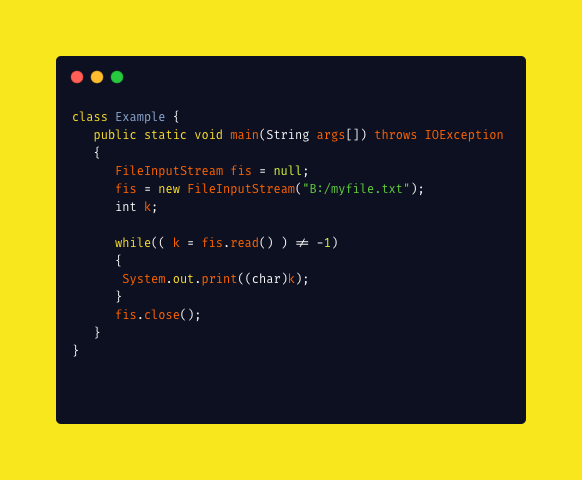

---
# 这是页面的图标
icon: page

# 这是文章的标题
title: Java - 异常

# 设置作者
author: lllllan

# 设置写作时间
# time: 2020-01-22 16:07

# 一个页面只能有一个分类
category: Java

# 一个页面可以有多个标签
tag:
- Java基础

# 此页面会在文章列表置顶
# sticky: true

# 此页面会出现在首页的文章板块中
star: true

# 你可以自定义页脚
# footer:

---


::: warning 本文转载自以下文章，略有改动

- [JavaGuide](https://javaguide.cn/)
-  [什么是java OOM？如何分析及解决oom问题？](https://www.cnblogs.com/ThinkVenus/p/6805495.html)

:::


## 一、异常类层次结构图

在 Java 中，所有的异常都有一个共同的祖先 `java.lang` 包中的 `Throwable` 类。`Throwable` 类有两个重要的子类 `Exception`（异常）和 `Error`（错误）。`Exception` 能被程序本身处理(`try-catch`)， `Error` 是无法处理的(只能尽量避免)。

- **`Exception`** :程序本身可以处理的异常，可以通过 `catch` 来进行捕获。`Exception` 又可以分为 **受检查异常**(必须处理) 和 **不受检查异常**(可以不处理)。

- **`Error`** ：`Error` 属于程序无法处理的错误 ，我们没办法通过 `catch` 来进行捕获 。例如，Java 虚拟机运行错误（`Virtual MachineError`）、虚拟机内存不够错误(`OutOfMemoryError`)、类定义错误（`NoClassDefFoundError`）等 。这些异常发生时，Java 虚拟机（JVM）一般会选择**线程终止**。


### 1.1 受检查异常

Java 代码在编译过程中，如果受检查异常没有被 `catch`/`throw` 处理的话，就没办法通过编译 。比如下面这段 IO 操作的代码

`IOException`、`FileNotFoundException` 、`SQLException`




### 1.2 不受检查异常

Java 代码在编译过程中 ，我们即使不处理不受检查异常也可以正常通过编译。

`RuntimeException` 及其子类都统称为非受检查异常，例如：`NullPointerException`、`NumberFormatException`（字符串转换为数字）、`ArrayIndexOutOfBoundsException`（数组越界）、`ClassCastException`（类型转换错误）、`ArithmeticException`（算术错误）等。


## 二、Throwable 类常用方法

- **`public String getMessage()`**:返回异常发生时的简要描述
- **`public String toString()`**:返回异常发生时的详细信息
- **`public String getLocalizedMessage()`**:返回异常对象的本地化信息。使用 `Throwable` 的子类覆盖这个方法，可以生成本地化信息。如果子类没有覆盖该方法，则该方法返回的信息与 `getMessage()`返回的结果相同
- **`public void printStackTrace()`**:在控制台上打印 `Throwable` 对象封装的异常信息


## 三、try-catch-finally

- **`try`块：** 用于捕获异常。其后可接零个或多个 `catch` 块，如果没有 `catch` 块，则必须跟一个 `finally` 块。
- **`catch`块：** 用于处理 try 捕获到的异常。
- **`finally` 块：** 无论是否捕获或处理异常，`finally` 块里的语句都会被执行。当在 `try` 块或 `catch` 块中遇到 `return` 语句时，**`finally` 语句块将在方法返回之前被执行。**


### 3.1 try/catch 中含有return，finally还会执行吗

结论：

1. 不管有没有出现异常，finally块中代码都会执行
2. 当try和catch中有return时，finally仍然会执行
3. finally是在return后面的表达式运算后执行的（此时并没有返回运算后的值，而是先把要返回的 值保存起来，管finally中的代码怎么样，返回的值都不会改变，任然是之前保存的值），所以函数 返回值是在finally执行前确定的
4. finally中最好不要包含return，否则程序会提前退出，返回值不是try或catch中保存的返回值。


::: tip

**在以下 3 种特殊情况下，`finally` 块不会被执行：**

1. 在 `try` 或 `finally`块中用了 `System.exit(int)`退出程序。但是，如果 `System.exit(int)` 在异常语句之后，`finally` 还是会被执行

2. 程序所在的线程死亡。

3. 关闭 CPU。

:::


### 3.2 使用 `try-with-resources` 来代替`try-catch-finally`

1. **适用范围（资源的定义）：** 任何实现 `java.lang.AutoCloseable`或者 `java.io.Closeable` 的对象
2. **关闭资源和 finally 块的执行顺序：** 在 `try-with-resources` 语句中，任何 catch 或 finally 块在声明的资源关闭后运行

```java
try (Scanner scanner = new Scanner(new File("test.txt"))) {
    while (scanner.hasNext()) {
        System.out.println(scanner.nextLine());
    }
} catch (FileNotFoundException fnfe) {
    fnfe.printStackTrace();
}
```


## 四、OutOfMemoryError

部分参考自 [什么是java OOM？如何分析及解决oom问题？](https://www.cnblogs.com/ThinkVenus/p/6805495.html)

OOM，全称“Out Of Memory”，翻译成中文就是“内存用完了”，来源于java.lang.OutOfMemoryError。看下关于的官方说明： Thrown when the Java Virtual Machine cannot allocate an object because it is out of memory, and no more memory could be made available by the garbage collector. 意思就是说，当JVM因为没有足够的内存来为对象分配空间并且垃圾回收器也已经没有空间可回收时，就会抛出这个error


### 4.1 堆溢出

一般的异常信息：`java.lang.OutOfMemoryError:Java heap spacess。`

java堆用于存储对象实例，我们只要不断的创建对象，并且保证GC Roots到对象之间有可达路径来 避免垃圾回收机制清除这些对象，就会在对象数量达到最大堆容量限制后产生内存溢出异常。


### 4.2 虚拟机栈和方法栈溢出

如果线程请求的栈深度大于虚拟机所允许的最大深度，将抛出 `StackOverflowError` 异常。 

如果虚拟机在扩展栈时无法申请到足够的内存空间，则抛出 `OutOfMemoryError` 异常 

这里需要注意当栈的大小越大可分配的线程数就越少。


### 4.3 运行时常量池溢出

异常信息：`java.lang.OutOfMemoryError:PermGenspace`
如果要向运行时常量池中添加内容，最简单的做法就是使用String.intern()这个Native方法。该方法 的作用是：如果池中已经包含一个等于此String的字符串，则返回代表池中这个字符串的String对 象；否则，将此String对象包含的字符串添加到常量池中，并且返回此String对象的引用。由于常量 池分配在方法区内，我们可以通过-XX:PermSize和-XX:MaxPermSize限制方法区的大小，从而间接 限制其中常量池的容量


### 4.4 方法区溢出

异常信息：`java.lang.OutOfMemoryError:PermGenspace`

方法区用于存放Class的相关信息，如类名、访问修饰符、常量池、字段描述、方法描述等。也有可 能是方法区中保存的class对象没有被及时回收掉或者class信息占用的内存超过了我们配置。


## 五、StackOverflow

堆栈溢出，StackOverflowError 的定义：当应用程序递归太深而发生堆栈溢出时，抛出该错误。
 因为栈一般默认为1-2m，一旦出现死循环或者是大量的递归调用，在不断的压栈过程中，造成栈容 量超过1m而导致溢出。 

栈溢出的原因：递归调用，大量循环或死循环，全局变量是否过多，数组、List、map数据过大。
