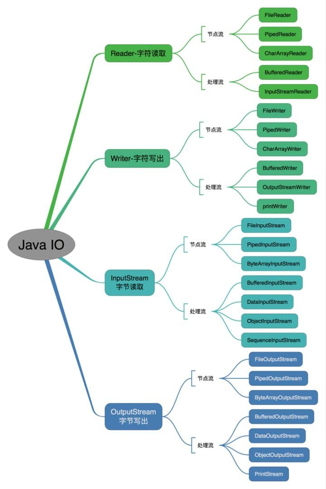

---
# 这是页面的图标
icon: page

# 这是文章的标题
title: Java - IO

# 设置作者
author: lllllan

# 设置写作时间
# time: 2020-01-22 16:07

# 一个页面只能有一个分类
category: Java

# 一个页面可以有多个标签
tag:
- Java基础

# 此页面会在文章列表置顶
# sticky: true

# 此页面会出现在首页的文章板块中
star: true

# 你可以自定义页脚
# footer:

---

::: warning 本文转载自以下文章，略有改动

- [JavaGuide](https://javaguide.cn/)

:::


## 一、（反）序列化

理解序列化 -> [序列化理解起来很简单](https://zhuanlan.zhihu.com/p/40462507)

- **序列化**： 将数据结构或对象转换成二进制字节流的过程
- **反序列化**：将在序列化过程中所生成的二进制字节流转换成数据结构或者对象的过程


### 1.1 为什么要序列化？

> 序列化最终的目的是为了对象可以**跨平台存储，和进行网络传输**。

我们进行跨平台存储和网络传输的方式就是IO，而我们的IO支持的数据格式就是字节数组。


因为我们单方面的只把对象转成字节数组还不行，因为没有规则的字节数组我们是没办法把对象的本来面目还原回来的，所以我们必须在把对象转成字节数组的时候就制定一种规则**（序列化）**，那么我们从IO流里面读出数据的时候再以这种规则把对象还原回来**（反序列化）。**

如果我们要把一栋房子从一个地方运输到另一个地方去，**序列化**就是我把房子拆成一个个的砖块放到车子里，然后留下一张房子原来结构的图纸，**反序列化**就是我们把房子运输到了目的地以后，根据图纸把一块块砖头还原成房子原来面目的过程


### 1.2 什么时候需要序列化？

凡是需要进行“跨平台存储”和”网络传输”的数据，都需要进行序列化。

本质上存储和网络传输 都需要经过 把一个对象状态保存成一种跨平台识别的字节格式，然后其他的平台才可以通过字节信息解析还原对象信息。


## 二、如果有些字段不想进行序列化（看不懂）

[Java基础知识&面试题总结 | JavaGuide # 如果有些字段不想进行序列化](https://javaguide.cn/java/basis/java基础知识总结/#java-序列化中如果有些字段不想进行序列化-怎么办)


## 三、获取用键盘输入常用的两种方法

1. `Scanner`

```java
Scanner input = new Scanner(System.in);
String s  = input.nextLine();
input.close();
```

2. `BufferedReader`

```java
BufferedReader input = new BufferedReader(new InputStreamReader(System.in));
String s = input.readLine();
```


## 四、IO流分类

- 按照流的流向分，可以分为输入流和输出流；
- 按照操作单元划分，可以划分为字节流和字符流；
- 按照流的角色划分为节点流和处理流（**对一个已存在的流的连接和封装，通过所封装的流的功能调用实现数据读写**）。




## 五、字符流的意义

**不管是文件读写还是网络发送接收，信息的最小存储单元都是字节，那为什么 I/O 流操作要分为字节流操作和字符流操作呢？**

字符流是由 Java 虚拟机将字节转换得到的，问题就出在这个过程还算是非常耗时，并且，如果我们不知道编码类型就很容易出现乱码问题。所以， I/O 流就干脆提供了一个直接操作字符的接口，方便我们平时对字符进行流操作。如果音频文件、图片等媒体文件用字节流比较好，如果涉及到字符的话使用字符流比较好。
