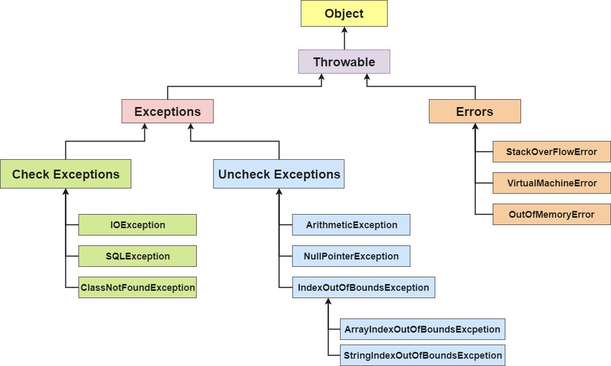
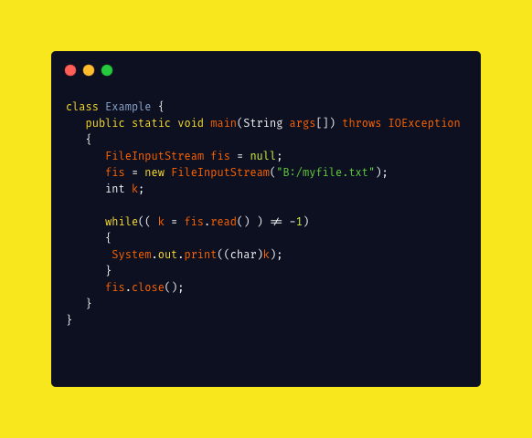

---
# 这是页面的图标
icon: page

# 这是文章的标题
title: JavaGuide - Java 基础知识

# 设置作者
author: lllllan

# 设置写作时间
# time: 2020-01-20

# 一个页面只能有一个分类
category: Java

# 一个页面可以有多个标签
tag:
- Java基础

# 此页面会在文章列表置顶
# sticky: true

# 此页面会出现在首页的文章板块中
star: true

# 你可以自定义页脚
# footer: 
---


::: warning

本文转载自以下文章，略有改动

- [Java基础常见知识&面试题总结 | JavaGuide](https://javaguide.cn/java/basis/java-basic-questions-01/)
- [java是解释执行吗](https://blog.csdn.net/qq_23191031/article/details/81677057)
- [浅谈JDK、JRE、JVM区别与联系](https://blog.csdn.net/ancientear/article/details/79483592)

:::


## 四、Java面向对象


## 五、反射


### 5.1 什么是反射

Java反射就是在运行状态中，对于任意一个类，都能够知道这个类的所有属性和方法；对于任意一个对象，都能够调用它的任意方法和属性；并且能改变它的属性。而这也是Java被视为动态（或准动态，为啥要说是准动态，因为一般而言的动态语言定义是程序运行时，允许改变程序结构或变量类型，这种语言称为动态语言。从这个观点看，Perl，Python，Ruby是动态语言，C++，Java，C#不是动态语言。）语言的一个关键性质。


### 5.2 反射能做什么？

我们知道反射机制允许程序在运行时取得任何一个已知名称的class的内部信息，包括包括其modifiers(修饰符)，fields(属性)，methods(方法)等，并可于运行时改变fields内容或调用methods。那么我们便可以更灵活的编写代码，代码可以在运行时装配，无需在组件之间进行源代码链接，降低代码的耦合度；还有动态代理的实现等等；但是需要注意的是反射使用不当会造成很高的资源消耗！


### 5.3 反射机制优缺点

- **优点** ： 可以让咱们的代码更加灵活、为各种框架提供开箱即用的功能提供了便利
- **缺点** ：让我们在运行时有了分析操作类的能力，这同样也增加了安全问题。比如可以无视泛型参数的安全检查（泛型参数的安全检查发生在编译时）。另外，反射的性能也要稍差点，不过，对于框架来说实际是影响不大的


### 5.4 反射的应用场景

[Java基础知识&面试题总结 | JavaGuide # 反射的应用场景](https://javaguide.cn/java/basis/java基础知识总结/#反射的应用场景)

（看不懂）


## 六、注解

[java 注解-最通俗易懂的讲解](https://zhuanlan.zhihu.com/p/37701743)


### 6.0 注解是什么

**初学者可以这样理解注解：想像代码具有生命，注解就是对于代码中某些鲜活个体的贴上去的一张标签。简化来讲，注解如同一张标签。**


### 6.1 注解的作用

- 提供信息给编译器： 编译器可以利用注解来探测错误和警告信息
- 编译阶段时的处理： 软件工具可以用来利用注解信息来生成代码、Html文档或者做其它相应处理。
- 运行时的处理： 某些注解可以在程序运行的时候接受代码的提取
  值得注意的是，注解不是代码本身的一部分。


### 6.2 注解的语法、定义、运用

暂且不谈，等到练习中认识即可


## 七、异常


### 7.1 异常类层次结构图

在 Java 中，所有的异常都有一个共同的祖先 `java.lang` 包中的 `Throwable` 类。`Throwable` 类有两个重要的子类 `Exception`（异常）和 `Error`（错误）。`Exception` 能被程序本身处理(`try-catch`)， `Error` 是无法处理的(只能尽量避免)。

- **`Exception`** :程序本身可以处理的异常，可以通过 `catch` 来进行捕获。`Exception` 又可以分为 **受检查异常**(必须处理) 和 **不受检查异常**(可以不处理)。

- **`Error`** ：`Error` 属于程序无法处理的错误 ，我们没办法通过 `catch` 来进行捕获 。例如，Java 虚拟机运行错误（`Virtual MachineError`）、虚拟机内存不够错误(`OutOfMemoryError`)、类定义错误（`NoClassDefFoundError`）等 。这些异常发生时，Java 虚拟机（JVM）一般会选择**线程终止**。

  




#### 7.1.1 受检查异常

Java 代码在编译过程中，如果受检查异常没有被 `catch`/`throw` 处理的话，就没办法通过编译 。比如下面这段 IO 操作的代码




#### 7.1.2 不受检查异常

Java 代码在编译过程中 ，我们即使不处理不受检查异常也可以正常通过编译。

`RuntimeException` 及其子类都统称为非受检查异常，例如：`NullPointerException`、`NumberFormatException`（字符串转换为数字）、`ArrayIndexOutOfBoundsException`（数组越界）、`ClassCastException`（类型转换错误）、`ArithmeticException`（算术错误）等。


### 7.2 Throwable 类常用方法

- **`public String getMessage()`**:返回异常发生时的简要描述
- **`public String toString()`**:返回异常发生时的详细信息
- **`public String getLocalizedMessage()`**:返回异常对象的本地化信息。使用 `Throwable` 的子类覆盖这个方法，可以生成本地化信息。如果子类没有覆盖该方法，则该方法返回的信息与 `getMessage()`返回的结果相同
- **`public void printStackTrace()`**:在控制台上打印 `Throwable` 对象封装的异常信息


### 7.3 try-catch-finally

- **`try`块：** 用于捕获异常。其后可接零个或多个 `catch` 块，如果没有 `catch` 块，则必须跟一个 `finally` 块。
- **`catch`块：** 用于处理 try 捕获到的异常。
- **`finally` 块：** 无论是否捕获或处理异常，`finally` 块里的语句都会被执行。当在 `try` 块或 `catch` 块中遇到 `return` 语句时，**`finally` 语句块将在方法返回之前被执行。**


::: tip

**在以下 3 种特殊情况下，`finally` 块不会被执行：**

1. 在 `try` 或 `finally`块中用了 `System.exit(int)`退出程序。但是，如果 `System.exit(int)` 在异常语句之后，`finally` 还是会被执行

2. 程序所在的线程死亡。

3. 关闭 CPU。

:::


### 7.4 使用 `try-with-resources` 来代替`try-catch-finally`

1. **适用范围（资源的定义）：** 任何实现 `java.lang.AutoCloseable`或者 `java.io.Closeable` 的对象
2. **关闭资源和 finally 块的执行顺序：** 在 `try-with-resources` 语句中，任何 catch 或 finally 块在声明的资源关闭后运行

```java
try (Scanner scanner = new Scanner(new File("test.txt"))) {
    while (scanner.hasNext()) {
        System.out.println(scanner.nextLine());
    }
} catch (FileNotFoundException fnfe) {
    fnfe.printStackTrace();
}
```


## 八、IO流


### 8.1 （反）序列化

理解序列化 -> [序列化理解起来很简单](https://zhuanlan.zhihu.com/p/40462507)

- **序列化**： 将数据结构或对象转换成二进制字节流的过程
- **反序列化**：将在序列化过程中所生成的二进制字节流转换成数据结构或者对象的过程


#### 8.1.1 为什么要序列化？

> 序列化最终的目的是为了对象可以**跨平台存储，和进行网络传输**。

我们进行跨平台存储和网络传输的方式就是IO，而我们的IO支持的数据格式就是字节数组。


因为我们单方面的只把对象转成字节数组还不行，因为没有规则的字节数组我们是没办法把对象的本来面目还原回来的，所以我们必须在把对象转成字节数组的时候就制定一种规则**（序列化）**，那么我们从IO流里面读出数据的时候再以这种规则把对象还原回来**（反序列化）。**

如果我们要把一栋房子从一个地方运输到另一个地方去，**序列化**就是我把房子拆成一个个的砖块放到车子里，然后留下一张房子原来结构的图纸，**反序列化**就是我们把房子运输到了目的地以后，根据图纸把一块块砖头还原成房子原来面目的过程


#### 8.1.2 什么时候需要序列化？

凡是需要进行“跨平台存储”和”网络传输”的数据，都需要进行序列化。

本质上存储和网络传输 都需要经过 把一个对象状态保存成一种跨平台识别的字节格式，然后其他的平台才可以通过字节信息解析还原对象信息。


### 8.2 如果有些字段不想进行序列化（看不懂）

[Java基础知识&面试题总结 | JavaGuide # 如果有些字段不想进行序列化](https://javaguide.cn/java/basis/java基础知识总结/#java-序列化中如果有些字段不想进行序列化-怎么办)


### 8.3 获取用键盘输入常用的两种方法

1. `Scanner`

```java
Scanner input = new Scanner(System.in);
String s  = input.nextLine();
input.close();
```

2. `BufferedReader`

```java
BufferedReader input = new BufferedReader(new InputStreamReader(System.in));
String s = input.readLine();
```


### 8.4 IO流分类

- 按照流的流向分，可以分为输入流和输出流；
- 按照操作单元划分，可以划分为字节流和字符流；
- 按照流的角色划分为节点流和处理流（**对一个已存在的流的连接和封装，通过所封装的流的功能调用实现数据读写**）。


### 8.5 字符流的意义

**不管是文件读写还是网络发送接收，信息的最小存储单元都是字节，那为什么 I/O 流操作要分为字节流操作和字符流操作呢？**

字符流是由 Java 虚拟机将字节转换得到的，问题就出在这个过程还算是非常耗时，并且，如果我们不知道编码类型就很容易出现乱码问题。所以， I/O 流就干脆提供了一个直接操作字符的接口，方便我们平时对字符进行流操作。如果音频文件、图片等媒体文件用字节流比较好，如果涉及到字符的话使用字符流比较好。