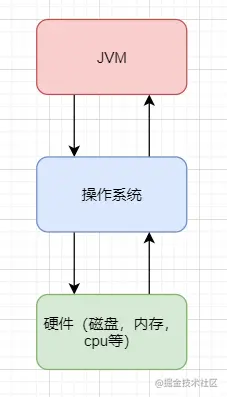
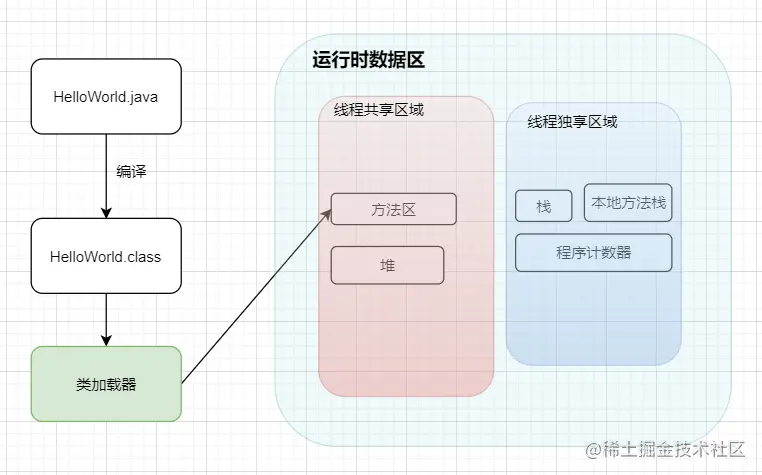

---
# 这是页面的图标
icon: page

# 这是文章的标题
title: 认识 JVM

# 设置作者
author: lllllan

# 设置写作时间
# time: 2020-01-20

# 一个页面只能有一个分类
category: Java

# 一个页面可以有多个标签
tag:
- JVM

# 此页面会在文章列表置顶
# sticky: true

# 此页面会出现在首页的文章板块中
star: true

# 你可以自定义页脚
# footer: 
---


::: warning 

本文转载自 [大白话带你认识JVM](https://juejin.cn/post/6844904048013869064#heading-28)，略有改动

:::


## 一、JVM的基本介绍

JVM，Java Virtual Machine。是一个虚构出来的计算机，是一种规范。




### 1.1 Java 文件如何被运行

比如我们现在写了一个 `HelloWorld.java` 好了，那这个 `HelloWorld.java` 抛开所有东西不谈，那是不是就类似于一个文本文件，只是这个文本文件它写的都是英文，而且有一定的缩进而已。

那我们的 **JVM** 是不认识文本文件的，所以它需要一个 **编译** ，让其成为一个它会读二进制文件的 `HelloWorld.class`


#### 1.1.1 类加载器

如果 `JVM` 想要执行这个 `.class` 文件，我们需要将其装进一个 **类加载器** 中，它就像一个搬运工一样，会把所有的 `.class` 文件全部搬进JVM里面来。


#### 1.1.2 方法区

**方法区** 是用于存放类似于元数据信息方面的数据的，比如类信息，常量，静态变量，编译后代码···等

类加载器将 `.class` 文件搬过来就是先丢到这一块上


#### 1.1.3 堆

**堆** 主要放了一些存储的数据，比如对象实例，数组···等，它和方法区都同属于 **线程共享区域** 。也就是说它们都是 **线程不安全** 的


#### 1.1.4 栈

**栈** 这是我们的代码运行空间。我们编写的每一个方法都会放到 **栈** 里面运行。

我们会听说过 本地方法栈 或者 本地方法接口 这两个名词，不过我们基本不会涉及这两块的内容，它俩底层是使用C来进行工作的，和Java没有太大的关系。


#### 1.1.5 程序计数器

主要就是完成一个加载工作，类似于一个指针一样的，指向下一行我们需要执行的代码。和栈一样，都是 **线程独享** 的，就是说每一个线程都会有自己对应的一块区域而不会存在并发和多线程的问题。




#### 小结

1. Java文件经过编译后变成 `.class` 字节码文件
2. 字节码文件通过 **类加载器** 被搬运到 JVM 虚拟机中
3. 虚拟机主要的5大块：方法区，堆都为线程共享区域，有线程安全问题，栈和本地方法栈和计数器都是独享区域，不存在线程安全问题，而 JVM 的调优主要就是围绕堆，栈两大块进行


### 1.2 简单例子

一个简单的学生类：

```java
public class Student {
    public String name;
    
    public Student(String name) {
        this.name = name;
    }
    
    public void sayName() {
        System.out.println("student's name is " + name);
    }
}
```


一个 main 方法：

```java
public class App {
    public static void main(String[] args) {
        Student student = new Student("jack");
        student.sayName();
    }
}
```


执行步骤：

1. 编译好 `App.java` 后得到 `App.class` 后，执行 `App.class`，系统会启动一个 JVM 进程，从 `classpath` 路径中找到一个名为 `App.class` 的二进制文件，将 App 的类信息加载到运行时数据区的方法区内，这个过程叫做 **App 类的加载**
2. JVM 找到 App 的主程序入口，执行main方法
3. 这个main中的第一条语句为 Student student = new Student("tellUrDream") ，就是让 JVM 创建一个Student对象，但是这个时候方法区中是没有 Student 类的信息的，所以 JVM 马上加载 Student 类，把 Student 类的信息放到方法区中
4. 加载完 Student 类后，JVM 在堆中为一个新的 Student 实例分配内存，然后调用构造函数初始化 Student 实例，这个 Student 实例持有 **指向方法区中的 Student 类的类型信息** 的引用
5. 执行student.sayName();时，JVM 根据 student 的引用找到 student 对象，然后根据 student 对象持有的引用定位到方法区中 student 类的类型信息的方法表，获得 sayName() 的字节码地址。
6. 执行sayName()

