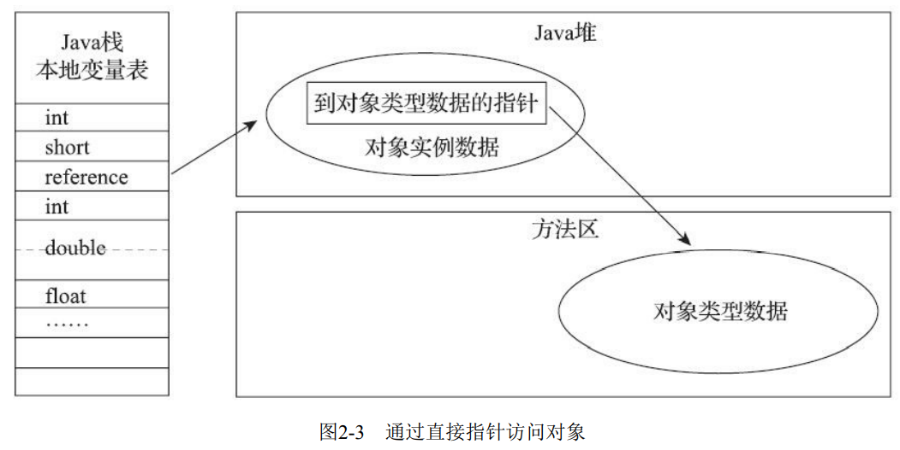

---
# 这是页面的图标
icon: page

# 这是文章的标题
title: 《深入理解JVM》第二章、Java内存区域与内存溢出异常

# 设置作者
author: lllllan

# 设置写作时间
# time: 2020-01-20

# 一个页面只能有一个分类
category: Java

# 一个页面可以有多个标签
tag:
- JVM

# 此页面会在文章列表置顶
# sticky: true

# 此页面会出现在首页的文章板块中
star: true

# 你可以自定义页脚
# footer: 
---

> Java与C++之间有一堵由内存动态分配和垃圾收集技术所围成的高墙，墙外面的人想进去，墙里 面的人却想出来。

## 一、运行时数据区域

### 1.1 程序计数器

程序计数器（Program Counter Register）是一块较小的内存空间，是 ==线程私有== 的，它可以看作是 ==当前线程所执行的 字节码的行号指示器== 。在Java虚拟机的概念模型里，字节码解释器工作时就是通过改变这个计数器 的值来选取下一条需要执行的字节码指令，它是程序控制流的指示器，分支、循环、跳转、异常处 理、线程恢复等基础功能都需要依赖这个计数器来完成。

- 如果线程正在执行的是一个Java方法，这个计数器记录的是正在执行的虚拟机字节码指令的地 址
- 如果正在执行的是本地（Native）方法，这个计数器值则应为空（Undefined）。

==此内存区域是唯 一一个在《Java虚拟机规范》中没有规定任何OutOfMemoryError情况的区域==

### 1.2 Java 虚拟机栈

与程序计数器一样，Java虚拟机栈（Java Virtual Machine Stack）也是 ==线程私有== 的，它的生命周期与线程相同。虚拟机栈描述的是Java方法执行的线程内存模型：每个方法被执行的时候，Java虚拟机都 会同步创建一个 ==栈帧，用于存储局部变量表、操作数栈、动态连接、方法出口等信息== 。每一个方法被调用直至执行完毕的过程，就对应着一个栈帧在虚拟机栈中从入栈到出栈的过程。

::: tip 堆和栈

经常有人把Java内存区域笼统地划分为堆内存（Heap）和栈内存（Stack），这种划分方式直接继承自C和C++程序的内存结构。

但实际上 Java 的内存区域划分要更加的复杂

:::

局部变量表存放了编译期可知的各种Java虚拟机基本数据类型、对象引用、returnAddress 类型

- **基本数据类型**：boolean、byte、char、short、int、 float、long、double
- **对象引用**：reference 类型，可能是一个指向对象起始 地址的引用指针，也可能是指向一个代表对象的句柄或者其他与此对象相关的位置
- **returnAddress**：指向了一条字节码指令的地址

> 这些数据类型在局部变量表中的存储空间以局部 ==变量槽（Slot）== 来表示，其中64位长度的long和 double类型的数据会占用两个变量槽，其余的数据类型只占用一个。局部变量表所需的内存空间在 ==编译期间完成分配== ，当进入一个方法时，这个方法需要在栈帧中分配多大的局部变量空间是完全确定 的，在方法运行期间不会改变局部变量表的大小（指变量槽的数量）

::: info 异常状况

- 如果线程请求的栈深度大于虚拟机所允许的深度，将抛出 `StackOverflowError` 异常
- 如果Java虚拟机栈容量可以动态扩展，当栈扩展时无法申请到足够的内存会抛出 `OutOfMemoryError` 异常

:::

### 1.3 本地方法栈

本地方法栈（Native Method Stacks）与虚拟机栈所发挥的作用是非常相似的，都是 ==线程私有== ，其区别只是虚拟机栈为虚拟机执行Java方法（也就是字节码）服务，而本地方法栈则是 ==为虚拟机使用到的本地（Native） 方法服务==

> 《Java虚拟机规范》对本地方法栈中方法使用的语言、使用方式与数据结构并没有任何强制规 定，因此具体的虚拟机可以根据需要自由实现它，**甚至有的Java虚拟机（譬如Hot-Spot虚拟机）直接 就把本地方法栈和虚拟机栈合二为一**

::: info 异常状况

- 如果线程请求的栈深度大于本地方法栈所允许的深度，将抛出 `StackOverflowError` 异常
- 如果本地方法栈容量可以动态扩展，当栈扩展时无法申请到足够的内存会抛出 `OutOfMemoryError` 异常

:::

### 1.4 Java 堆

Java堆是被 ==所有线程共享== 的一块内存区域，在 ==虚拟机启动时创建== 。此内存区域的唯一目的就是 ==存放对象实例== ，Java 世界里 ==“几乎”== 所有的对象实例都在这里分配内存。

::: tip 几乎

由于 **即时编译技术** 的进步，尤其是 **逃逸分析技术** 的日渐强大，**栈上分配** 、 **标量替换优化手段** 已经导致一些微妙的变化悄然发生，所以说Java对象实例都分配在堆上也渐渐变得不是那么绝对了

:::

Java堆是垃圾收集器管理的内存区域，因此一些资料中它也被称作“GC堆”（Garbage Collected Heap，幸好国内没翻译成“垃圾堆”）

如果从分配内存的角度看，所有线程共享的Java堆中可以划分出多个线程私有的分配缓冲区 （Thread Local Allocation Buffer，TLAB），以提升对象分配时的效率

::: info 异常状况

如果在Java堆中没有内存完成实例分配，并且堆也无法再 扩展时，Java虚拟机将会抛出 `OutOfMemoryError` 异常

:::

### 1.5 方法区

方法区（Method Area）与Java堆一样，是各个 ==线程共享== 的内存区域，它用于 ==存储已被虚拟机加载的类型信息、常量、静态变量、即时编译器编译后的代码缓存等数据== 

> 永久代不等于方法区，只是使用永久代来实现方法区

方法区中的内存挥手目标主要是针对常量池的挥手和类型的卸载，但是因为回收条件苛刻、回收效果不佳。

::: info 异常状况

如果方法区无法满足新的内存分配需求时，将抛出 `OutOfMemoryError` 异常。

:::

### 1.6 运行时常量池

运行时常量池（Runtime Constant Pool）是 ==方法区的一部分==

Class文件中除了有类的版本、字 段、方法、接口等描述信息外，还有一项信息是 **常量池表** （Constant Pool Table），用于 ==存放编译期生成的各种字面量与符号引用== ，这部分内容将在类加载后存放到方法区的运行时常量池中。

运行时常量池相对于Class文件常量池的另外一个重要特征是具备 **动态性** ，Java语言并不要求常量 一定只有编译期才能产生，也就是说，并非预置入Class文件中常量池的内容才能进入方法区运行时常 量池，运行期间也可以将新的常量放入池中，这种特性被开发人员利用得比较多的便是String类的 intern()方法。

::: info 异常状况

当常量池无法再申请到内存 时会抛出 `OutOfMemoryError` 异常

:::

### 1.7 直接内存

直接内存（Direct Memory） ==并不是虚拟机运行时数据区的一部分== ，也不是《Java虚拟机规范》中 定义的内存区域。但是这部分内存也被频繁地使用，而且也可能导致 `OutOfMemoryError` 异常出现，

## 二、HotSpot 虚拟机中的对象

### 2.1 对象的创建过程

1. **类加载检查**

   > 首先将去检查这个指令的参数是否能在常量池中定位到 一个类的符号引用，并且检查这个符号引用代表的类是否已被加载、解析和初始化过。如果没有，那 必须先执行相应的类加载过程

2. **分配内存**

   > 为对象分配空间的任务实际上便等同于把一块确定 大小的内存块从Java堆中划分出来
   >
   > - ==指针碰撞== ： 假设Java堆中内存是绝对规整的，所有被使用过的内存都被放在一 边，空闲的内存被放在另一边，中间放着一个指针作为分界点的指示器，那所分配内存就仅仅是把那 个指针向空闲空间方向挪动一段与对象大小相等的距离
   > - ==空闲列表== ： 但如果Java堆中的内存并不是规整的，已被使用的内存和空闲的内存相互交错在一起，那 就没有办法简单地进行指针碰撞了，虚拟机就必须维护一个列表，记录上哪些内存块是可用的，在分 配的时候从列表中找到一块足够大的空间划分给对象实例，并更新列表上的记录
   >
   > 选择哪种分配方式由Java堆是否规整决定，而Java堆是否规整又由所采用 的垃圾收集器是否带有 ==空间压缩整理（Compact）== 的能力决定

   ::: tip 非线程安全

   在并发情况下也并 ==不是线程安全的== ，可能出现正在给对象 A分配内存，指针还没来得及修改，对象B又同时使用了原来的指针来分配内存的情况。解决这个问题有两种可选方案：

   1. 对分配内存空间的动作进行同步处理——实际上虚拟机是采用 ==CAS配上失败重试== 的方式保证更新操作的原子性

   2. 另外一种是把内存分配的动作按照线程划分在不同的空间之中进 行，即每个线程在Java堆中预先分配一小块内存，称为 ==本地线程分配缓冲== （Thread Local Allocation Buffer，TLAB），哪个线程要分配内存，就在哪个线程的本地缓冲区中分配，只有本地缓冲区用完 了，分配新的缓存区时才需要同步锁定。

   :::

3. **对象字段初始化为零值**

   > 将分配到的内存空间（但不包括对象头）都初始化为零值，这步操作保证了对象的实例字段 在Java代码中可以不赋初始值就直接使用，使程序能访问到这些字段的数据类型所对应的零值。

4. **设置对象头**

   > 设置这个对象是哪个类的实例、如何才能找到 类的元数据信息、对象的哈希码（实际上对象的哈希码会延后到真正调用Object::hashCode()方法时才 计算）、对象的GC分代年龄等信息

5. **执行构造函数**

### 2.2 对象的内存布局

对象在堆内存中的存储布局可以划分为三个部分：对象头（Header）、实例数据（Instance Data）和对齐填充（Padding）

#### 2.2.1 对象头

HotSpot虚拟机对象的对象头部分包括两类信息

1. **对象自身的运行数据：** 如哈 希码（HashCode）、GC分代年龄、锁状态标志、线程持有的锁、偏向线程ID、偏向时间戳等

   > 

2. **类型指针：** 对象指向它的类型元数据的指针，Java虚拟机通过这个指针 来确定该对象是哪个类的实例。

   > 并不是所有的虚拟机实现都必须在对象数据上保留类型指针，换句话 说，查找对象的元数据信息并不一定要经过对象本身

#### 2.2.2 实例数据

来实例数据部分是对象真正存储的有效信息，即我们在程序代码里面所定义的各种类型的字 段内容，无论是从父类继承下来的，还是在子类中定义的字段都必须记录起来

#### 2.2.3 对齐填充

这并不是必然存在的，也没有特别的含义，它仅仅起着占位符的作用。

由于HotSpot虚拟机的自动内存管理系统要求对象起始地址必须是8字节的整数倍，换句话说就是 任何对象的大小都必须是 **8字节的整数倍**。对象头部分已经被精心设计成正好是8字节的倍数（1倍或者 2倍），因此，如果对象实例数据部分没有对齐的话，就需要通过对齐填充来补全。

### 2.3 对象的访问定位

对象访问方式也是由虚拟机实 现而定的，主流的访问方式主要有使用句柄和直接指针两种：

#### 2.3.1 句柄访问

Java堆中将可能会划分出一块内存来作为句柄池，reference中存储的就是对象的句柄地址，而句柄中包含了对象实例数据与类型数据各自具体的地址信息

::: tip 句柄的优势

是reference中存储的是稳定句柄地 址，在对象被移动（垃圾收集时移动对象是非常普遍的行为）时只会改变句柄中的实例数据指针，而 reference本身不需要被修改。

:::

#### 2.3.2 直接指针访问

Java堆中对象的内存布局就必须考虑如何放置访问类型数据的相关 信息，reference中存储的直接就是对象地址，如果只是访问对象本身的话，就不需要多一次间接访问的开销

::: tip 指针的优势

是速度更快，它节省了一次指针定位的时间开销，由于对象访 问在Java中非常频繁，因此这类开销积少成多也是一项极为可观的执行成本。

对于HotSpot而言，它主要使用第二种方式进行对象访问。

:::
