---
# 这是页面的图标
icon: page

# 这是文章的标题
title: 《深入理解JVM》第三章、垃圾收集器与内存分配策略

# 设置作者
author: lllllan

# 设置写作时间
# time: 2020-01-20

# 一个页面只能有一个分类
category: Java

# 一个页面可以有多个标签
tag:
- JVM
- 深入理解Java虚拟机

# 此页面会在文章列表置顶
# sticky: true

# 此页面会出现在首页的文章板块中
star: true

# 你可以自定义页脚
# footer: 
---


::: warning 转载声明

- [HotSpot VM中的准确式GC、OopMap、Safepoint、抢先式中断、主动式中断、Safe Region和RememberedSet](https://blog.csdn.net/weixin_42090746/article/details/103942247)
- [再谈HotSpot JVM GC机制中的写屏障](https://blog.csdn.net/nazeniwaresakini/article/details/105947623)

:::


## 一、概述

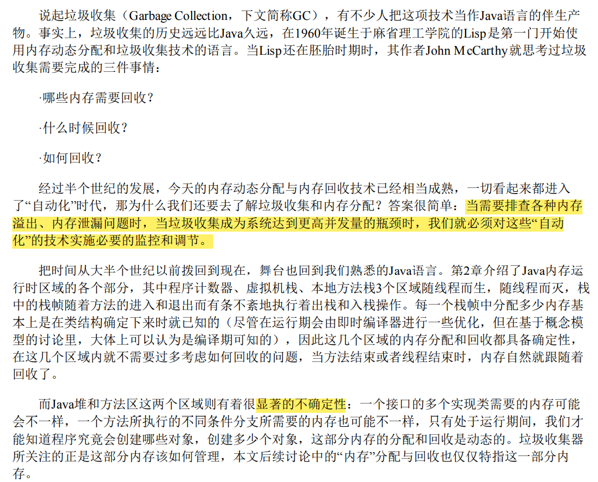


## 二、对象已死

垃圾收集器在对堆进行回收前，第一件事情就是要确定这些对象之中哪些还“存活”着，哪些已经“死去”（“死去”即不可能再被任何途径使用的对 象）了


### 2.1 引用计数算法

在对象中添加一个引用计数器，每当有一个地方引用它时，计数器值就加一；当引用失效时，计数器值就减一；任何时刻计数器为零的对象就是不可 能再被使用的。

- 优点：原理简单，判定效率也很高
- 缺点：单纯的引用计数 就很难解决对象之间相互循环引用的问题


```java
/**
 * testGC()方法执行后，objA和objB会不会被GC呢？
 * @author zzm
 */
public class ReferenceCountingGC {
    public Object instance = null;
    private static final int _1MB = 1024 * 1024;
    /**
     * 这个成员属性的唯一意义就是占点内存，以便能在GC日志中看清楚是否有回收过
     */
    private byte[] bigSize = new byte[2 * _1MB];
    public static void testGC() {
        ReferenceCountingGC objA = new ReferenceCountingGC();
        ReferenceCountingGC objB = new ReferenceCountingGC();
        objA.instance = objB;
        objB.instance = objA;
        objA = null;
        objB = null;
        // 假设在这行发生GC，objA和objB是否能被回收？
        System.gc();
    }
}
```

实际上虚拟机并没有因为这两个对象互相引用就放弃回收它们，这也从侧面说明了Java虚拟机并不是通过引用计数算法来判断对象 是否存活的。


### 2.2 可达性分析算法

通过一系列称为 ==“GC Roots”== 的根对象作为起始节点集，从这些节点开始，根据引用关系 **向下搜索** ，搜索过程所走过的路径称为 ==“引用链”== （Reference Chain），如果某个对象到GC Roots间没有任何引用链相连， 或者用图论的话来说就是从GC Roots到这个对象不可达时，则证明此对象是不可能再被使用的。


::: tip GC Roots 包括的对象

1. 在虚拟机栈（栈帧中的 **本地变量表）中引用的对象**，譬如各个线程被调用的方法堆栈中使用到的 参数、局部变量、临时变量等
2. 在方法区中类 **静态属性引用的对象**，譬如Java类的引用类型静态变量
3. 在方法区中 **常量引用的对象**，譬如字符串常量池（String Table）里的引用
4. 在本地方法栈中JNI（即通常所说的 **Native方法）引用的对象**
5. Java **虚拟机内部的引用**，如基本数据类型对应的Class对象，一些常驻的异常对象（比如 NullPointExcepiton、OutOfMemoryError）等，还有系统类加载器
6. 所有被 **同步锁（synchronized关键字）持有的对象**
7. 反映Java虚拟机内部情况的JMXBean、JVMTI中注册的回调、本地代码缓存等。


根据用户所选用的垃圾收集器以及当前回收的内存区域不同，还 **可以有其他对象“临时性”地加入**，共同构成完整GC Roots集合。

:::


### 2.3 再谈引用

> 在JDK 1.2版之前，Java里面的引用是很传统的定义： **如果reference类型的数据中存储的数值代表的是另外一块内存的起始地址，就称该reference数据是代表 某块内存、某个对象的引用**。这种定义并没有什么不对，只是现在看来有些过于狭隘了，一个对象在 这种定义下只有“被引用”或者“未被引用”两种状态，对于描述一些“食之无味，弃之可惜”的对象就显 得无能为力。譬如我们希望能描述一类对象：当内存空间还足够时，能保留在内存之中，如果内存空 间在进行垃圾收集后仍然非常紧张，那就可以抛弃这些对象——很多系统的缓存功能都符合这样的应 用场景。


在JDK 1.2版之后，Java对引用的概念进行了扩充，将引用分为强引用（Strongly Re-ference）、软 引用（Soft Reference）、弱引用（Weak Reference）和虚引用（Phantom Reference）4种，这4种引用强 度依次逐渐减弱。


- **强引用** 是最传统的“引用”的定义，是指在程序代码之中普遍存在的引用赋值，即类似 `Object obj=new Object()` 这种引用关系。无论任何情况下，只要强引用关系还存在，垃圾收集器就永远不会回 收掉被引用的对象。 
- **软引用** 是用来描述一些<u>还有用，但非必须</u>的对象。只被软引用关联着的对象， ==在系统将要发生内存溢出异常前，会把这些对象列进回收范围之中进行第二次回收，如果这次回收还没有足够的内存，才会抛出内存溢出异常== 。 在JDK 1.2版之后提供了 `SoftReference` 类来实现软引用。 
- **弱引用** 也是用来描述那些非必须对象，但是它的强度比软引用更弱一些，被弱引用关联的对象只 能生存到下一次垃圾收集发生为止。 ==当垃圾收集器开始工作，无论当前内存是否足够，都会回收掉只 被弱引用关联的对象== 。在JDK 1.2版之后提供了 `WeakReference` 类来实现弱引用。 
- **虚引用** 也称为“幽灵引用”或者“幻影引用”，它是最弱的一种引用关系。一个对象是否有虚引用的 存在，完全不会对其生存时间构成影响，也无法通过虚引用来取得一个对象实例。为一个对象设置虚 引用关联的唯一目的只是为了能在这个对象被收集器回收时收到一个系统通知。在JDK 1.2版之后提供 了 `PhantomReference` 类来实现虚引用


### 2.4 生存还是死亡

即使在可达性分析算法中判定为不可达的对象，也不是“非死不可”的，这时候它们暂时还处于“缓刑”阶段。

要真正宣告一个对象死亡，至少要经历两次标记过程：

1. 如果对象在进行可达性分析后发现没有与GC Roots相连接的引用链，那它将会被第一次标记，随后进行一次筛选
2. 筛选的条件是此对象是 否有必要执行 `finalize()` 方法。假如对象没有覆盖finalize()方法，或者finalize()方法已经被虚拟机调用 过，那么虚拟机将这两种情况都视为“没有必要执行”。

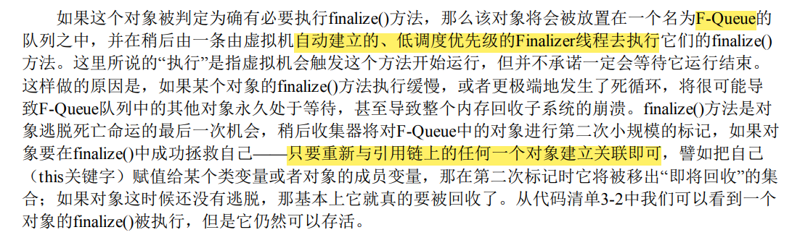

```java
/**
* 此代码演示了两点：
* 1.对象可以在被GC时自我拯救。
* 2.这种自救的机会只有一次，因为一个对象的finalize()方法最多只会被系统自动调用一次
* @author zzm
*/
public class FinalizeEscapeGC {
    public static FinalizeEscapeGC SAVE_HOOK = null;
    public void isAlive() {
        System.out.println("yes, i am still alive :)");
    }
    @Override
    protected void finalize() throws Throwable {
        super.finalize();
        System.out.println("finalize method executed!");
        FinalizeEscapeGC.SAVE_HOOK = this;
    }
    public static void main(String[] args) throws Throwable {
        SAVE_HOOK = new FinalizeEscapeGC();
        //对象第一次成功拯救自己
        SAVE_HOOK = null;
        System.gc();
        // 因为Finalizer方法优先级很低，暂停0.5秒，以等待它
        Thread.sleep(500);
        if (SAVE_HOOK != null) {
            SAVE_HOOK.isAlive();
        } else {
            System.out.println("no, i am dead :(");
        }
        // 下面这段代码与上面的完全相同，但是这次自救却失败了
        SAVE_HOOK = null;
        System.gc();
        // 因为Finalizer方法优先级很低，暂停0.5秒，以等待它
        Thread.sleep(500);
        if (SAVE_HOOK != null) {
            SAVE_HOOK.isAlive();
        } else {
            System.out.println("no, i am dead :(");
        }
    }
}
```

```java
finalize method executed!
yes, i am still alive :)
no, i am dead :(
```

代码中有两段完全一样的代码片段，执行结果却是一次逃脱成功，一次失败了。这是因为任何一个对象的finalize()方法都只会被系统自动调用一次，如果对象面临下一次回收，它的finalize()方法不会被再次执行，因此第二段代码的自救行动失败了。


### 2.5 回收方法区

方法区垃圾收集 的“性价比”通常也是比较低的：在Java堆中，尤其是在新生代中，对常规应用进行一次垃圾收集通常 可以回收70%至99%的内存空间，相比之下，方法区回收囿于苛刻的判定条件，其区域垃圾收集的回 收成果往往远低于此。


**方法区的垃圾收集主要回收两部分内容：废弃的常量和不再使用的类型。**

判定一个常量是否“废弃”还是相对简单，而要判定一个类型是否属于“不再被使用的类”的条件就 比较苛刻了。需要同时满足下面三个条件：

1. 该类 **所有的实例都已经被回收**，也就是Java堆中不存在该类及其任何派生子类的实例。
2. 加载该类的 **类加载器已经被回收**，这个条件除非是经过精心设计的可替换类加载器的场景，如 OSGi、JSP的重加载等，否则通常是很难达成的。
3. 该类对应的 **`java.lang.Class` 对象没有在任何地方被引用**，无法在任何地方通过反射访问该类的方 法。


## 三、垃圾收集算法

从如何判定对象消亡的角度出发，垃圾收集算法可以划分为 ==“引用计数式垃圾收集”== （Reference Counting GC）和 ==“追踪式垃圾收集”== （Tracing GC）两大类，这两类也常被称作“直接垃圾收集”和“间接 垃圾收集”。由于引用计数式垃圾收集算法在本书讨论到的主流Java虚拟机中均未涉及，所以我们暂不 把它作为正文主要内容来讲解，本节介绍的所有算法均属于追踪式垃圾收集的范畴


### 3.1 分代收集理论

1. 弱分代假说：绝大多数对象都是朝生夕灭的
2. 强分代假说：熬过越多次垃圾收集过程的对象就越难以消 亡

这两个分代假说共同奠定了多款常用的垃圾收集器的一致的设计原则：**收集器应该将Java堆划分出不同的区域，然后将回收对象依据其年龄（年龄即对象熬过垃圾收集过程的次数）分配到不同的区 域之中存储。**

3. 跨代引用假说：跨代引用对于同代应用来说仅占极少数

   > 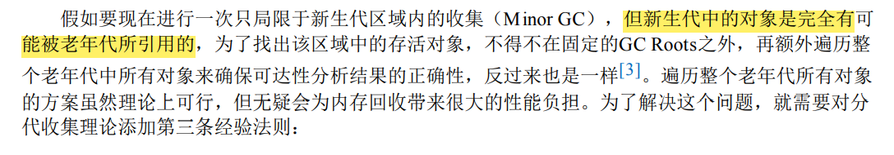

依据这条假说，我们就不应再为了少量的跨代引用去扫描整个老年代，也不必浪费空间专门记录 每一个对象是否存在及存在哪些跨代引用，只需 **在新生代上建立一个全局的数据结构**（该结构被称 为“记忆集”，Remembered Set），这个结构把老年代划分成若干小块，**标识出老年代的哪一块内存会存在跨代引用**。此后当发生Minor GC时，只有包含了跨代引用的小块内存里的对象才会被加入到GC Roots进行扫描。虽然这种方法需要在对象改变引用关系（如将自己或者某个属性赋值）时维护记录数 据的正确性，会增加一些运行时的开销，但比起收集时扫描整个老年代来说仍然是划算的。


::: info 收集

- 部分收集 `Partial GC`：指目标不是完整收集整个 Java 堆的垃圾收集
  - 新生代收集 `Minor GC/Young GC`：新生代的垃圾收集
  - 老年代收集 `Major GC/Old GC`：老年代的垃圾收集，目前只有 **CMS收集器** 会有单独收集老年代
  - 混合收集 `Mixed GC`：收集整个新生代和部分老年代，目前只有 **G1收集器** 会这么做
- 整堆收集 `Full GC`：整个 Java堆和方法区的收集

:::


### 3.2 标记-清除算法

算法分为“**标记**”和“**清除**”两个阶段：首先标记出所有需要回 收的对象，在标记完成后，统一回收掉所有被标记的对象，也可以反过来，标记存活的对象，统一回 收所有未被标记的对象。

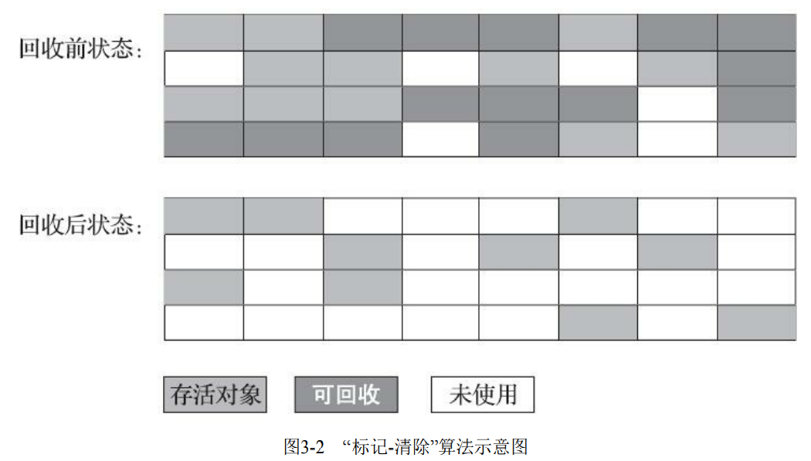

::: tip 缺点：

1. **执行效率不稳定：** 如果Java堆中包含大量对象，而且其中大部分是需要被回收的，这时必须进行大量标记和清除的动作，导致标记和清除两个过程的执行效率都随对象数量增长而降低
2. **空间的碎片化问题：** 标记、清除之后会产生大量不连续的内存碎片，空间碎片太多可能会导致当以后在程序运行过程中需要分配较大对象时无法找到足够的连续内存而不得不提前触发另一次垃圾收集动作

:::


### 3.3 标记-复制算法

它将可用 内存按容量划分为大小相等的两块，每次只使用其中的一块。当这一块的内存用完了，就将还存活着 的对象复制到另外一块上面，然后再把已使用过的内存空间一次清理掉。

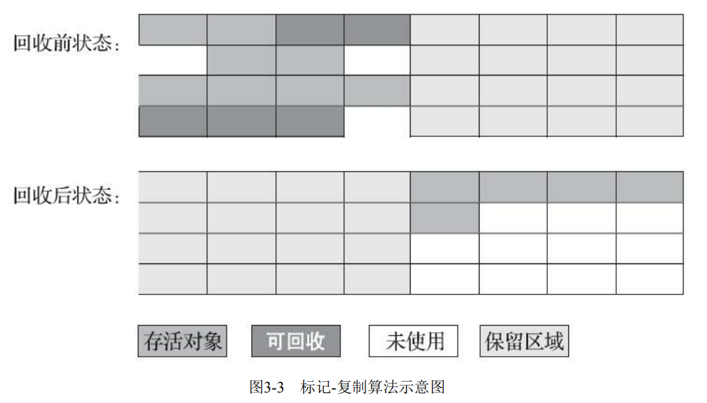

每次都是针对整个半区进行内存回收，分配内存时也就不用考虑有 空间碎片的复杂情况，只要移动堆顶指针，按顺序分配即可。这样实现简单，运行高效


::: tip 缺点

1. **执行效率不稳定：** 如果内存中多数对象都是存 活的，这种算法将会产生大量的内存间复制的开销，但对于多数对象都是可回收的情况，算法需要复 制的就是占少数的存活对象
2. **空间浪费：** 这种复制回收算法的代价是将可用内存缩小为了原来的一半

:::


::: info 朝生夕灭

IBM公司曾有一项专门研 究对新生代“朝生夕灭”的特点做了更量化的诠释——新生代中的对象有98%熬不过第一轮收集。因此也不必担心在垃圾回收时存在大量存活的对象需要去复制转移，甚至都不需要按照 `1:1` 的比例来划分新生代的空间。

:::


::: danger Appel 式回收

HotSpot虚拟机的 Serial、ParNew 等新生代收集器均采用了这种策略来设 计新生代的内存布局


Appel式回收的具体做法是把新生代分为一块较大的 `Eden` 空间和两块较小的 `Survivor` 空间，每次分配内存只使用Eden和其中一块Survivor。发生垃圾搜集时，将Eden和Survivor中仍 然存活的对象一次性复制到另外一块Survivor空间上，然后直接清理掉Eden和已用过的那块Survivor空间


HotSpot虚拟机默认Eden和Survivor的大小比例是8∶1，也即每次新生代中可用内存空间为整个新 生代容量的90%（Eden的80%加上一个Survivor的10%），只有一个Survivor空间，即10%的新生代是会 被“浪费”的。


当然，98%的对象可被回收仅仅是“普通场景”下测得的数据，任何人都没有办法百分百 保证每次回收都只有不多于10%的对象存活，因此Appel式回收还有一个充当罕见情况的“逃生门”的安 全设计，当Survivor空间不足以容纳一次Minor GC之后存活的对象时，就需要 ==依赖其他内存区域（实 际上大多就是老年代）进行分配担保（Handle Promotion）==

:::


### 3.4 标记-整理算法

标记-清除算法与标记-整理算法的本质差异在于前者是一种非移动式的回收算法，而后者是移动式的。

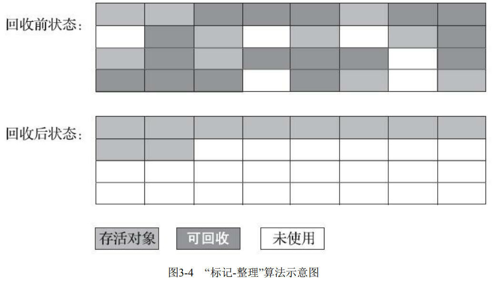

::: tip 缺点

1. 在老年代这种每次回收都有大量对象存活区域，移动存活对象并更新 所有引用这些对象的地方将会是一种极为负重的操作，而且这种对象移动操作必须全程暂停用户应用 程序才能进行
2. 但如果跟标记-清除算法那样完全不考虑移动和整理存活对象的话，弥散于堆中的存活对象导致的 空间碎片化问题就只能依赖更为复杂的内存分配器和内存访问器来解决。

基于以上两点，是否移动对象都存在弊端，移动则内存回收时会更复杂，不移动则内存分配时会 更复杂

:::


## 四、HotSpot 的算法实现细节


### 4.1 根节点枚举

我们知道要判断一个对象是否可以被回收，是通过判断这个对象与GC Roots之间是否存在引用链，这个过程叫做可达性分析。而这个过程中，业务线程是需要停止的，不然在遍历时，引用发生变化，那么分析到的结果就是不准确的。也就是说这个过程需要“Stop the world”。为了提高效率，我们需要这个过程尽可能地快，以减少系统停顿时间。


迄今为止， ==所有收集器在根节点枚举这一步骤时都是必须暂停用户线程的== 。在枚举根节点的期间，根节点集合的对象引用关系应该保持不变，这是枚举根节点应该保证的 **一致性** 。如果这点都不能满足，分析结果也就无法保证，因此垃圾手机过程必须停顿所有用户线程。

> 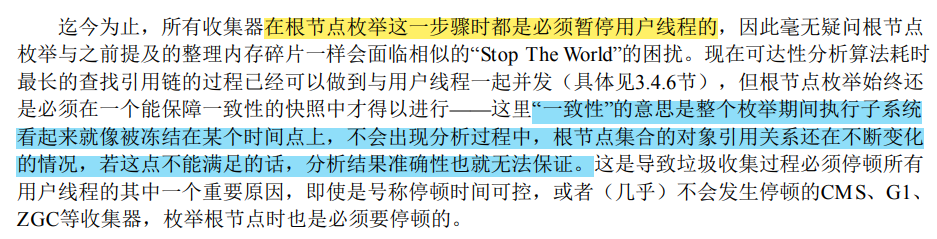

> 在JDK1.0时，Sun公司发布JVM，称为Sun Classic VM，这款虚拟机只支持纯解释器方式来执行java代码，如果想使用JIT编译期就必须进行外挂，但是外挂后解释器就不工作了，总之两者不兼容。不止于此这款JVM，遍历GC Roots时，扫描内存中全局变量和栈上的本地变量表时，并不知道这个位置存的是基本数据类型还是对象引用，需要额外判断，效率很低。Classic VM其使用的是基于句柄的访问方式，每次定位都需要两次定位，其速度就可想而知了，这种方式称为“保守式内存管理”和 ==保守式GC==。


::: info 准确式GC 和 OopMap

目前主流Java虚拟机都是使用 ==准确式垃圾收集== ，即虚拟机知道内存中某个位置存储的数据是什么类型，在GC时，只需遍历引用类型即可，而不需要一个不漏地检查完所有执行上下文和全局的引用位置。

其用来维护哪些地方存有引用的数据结构就叫做 ==OopMap==。在 HotSpot 中一旦类记载完成的时候，HotSpot 会将对象内什么偏移量上是什么类型的数据计算出来，在即时编译过程中，在特定位置记录下栈里和寄存器里哪些位置是引用。这样收集器在扫描时就可以直接获取这些信息了。 

:::


### 4.2 安全点

OopMap存储的是哪些地方存有引用。但是维护这个数据结构太难了，系统在多线程地跑，对象千千万万，时时刻刻引用关系都在发生变化，不管是采用频繁地修改OopMap的值，还没每执行一条指令（只有执行指令，引用关系才会改变）都创建一个OopMap都是不可取的。


::: info 安全点

HotSpot 提出只在某些特殊的位置记录引用信息，这些特殊的位置就被称为 ==安全点==（Safepoint）。程序也只会在这些Safepoint才会停下来。


:::


安全点位置选取的原则：

- **是否具有让程序长时间执行的特征**。“长时间执行” 的最明显特征就是指令序列的复用，例如方法调用、循环跳转、异常跳转等都属于指令序列服用，只有具有这些功能的指令才会产生安全点
- **如何在垃圾收集发生时让所有线程（不包括执行JNI调用的线程）都跑到最近的安全点**。抢先式中断、主动式中断


::: note  两种中断

**抢先式中断：** 抢先式中断不需要线程的执行代码 主动去配合，在垃圾收集发生时，系统首先把所有用户线程全部中断，如果发现有用户线程中断的地方不在安全点上，就恢复这条线程执行，让它一会再重新中断，直到跑到安全点上。

**主动式中断：** 是当垃圾收集需要中断线程的时候，不直接对线程操作，仅仅简单地设置一 个标志位，各个线程执行过程时会不停地主动去轮询这个标志，一旦发现中断标志为真时就自己在最 近的安全点上主动中断挂起

:::


### 4.3 安全区域

安全点机制保证了程序执行时，在不太长的时间内就会遇到可进入垃圾收集过程的安全点

但是，程序“不执行”的时候呢？所谓的程序不执行就是没有分配处理器时间，典型的 场景便是用户线程处于Sleep状态或者Blocked状态，这时候线程无法响应虚拟机的中断请求，不能再走 到安全的地方去中断挂起自己，虚拟机也显然不可能持续等待线程重新被激活分配处理器时间。对于 这种情况，就必须引入安全区域（Safe Region）来解决。


::: info 安全区域

==安全区域== 是指能够确保在某一段代码片段之中，引用关系不会发生变化，因此，在这个区域中任 意地方开始垃圾收集都是安全的。我们也可以把安全区域看作被扩展拉伸了的安全点。

:::


当用户线程执行到安全区域里面的代码时，**首先会标识自己已经进入了安全区域**，那样当这段时 间里虚拟机要发起垃圾收集时就不必去管这些已声明自己在安全区域内的线程了。当线程要 **离开安全区域时，它要检查虚拟机是否已经完成了根节点枚举**（或者垃圾收集过程中其他需要暂停用户线程的 阶段），如果完成了，那线程就当作没事发生过，继续执行；否则它就必须一直等待，直到收到可以 离开安全区域的信号为止


### 4.4 记忆集和卡表

::: info 记忆集

所有涉及部分区域收集（Partial GC）行为的 垃圾收集器，都会面临对象跨代引用的问题。 ==记忆集== 是一种用于记录从非收集区域指向收集区域的指针集合的抽象数据结构

:::


这种记录全部含跨代引用对象的实现方案，无论是空间占用还是维护成本都相当高昂。而在垃圾 收集的场景中，收集器只需要通过记忆集判断出某一块非收集区域是否存在有指向了收集区域的指针就可以了，并不需要了解这些跨代指针的全部细节。

- **字长精度**：每个记录精确到一个机器字长（就是处理器的寻址位数，如常见的32位或64位，这个 精度决定了机器访问物理内存地址的指针长度），该字包含跨代指针。 
- **对象精度**：每个记录精确到一个对象，该对象里有字段含有跨代指针。 
- **卡精度**：每个记录精确到一块内存区域，该区域内有对象含有跨代指针


::: info 卡表

==卡表== 就是记忆集的一种具体实现，它定义了记忆集的记录精度、与堆内存的映射关系等。（关于卡表与记忆集的关系，读者不妨按照Java语言中HashMap与Map的关系来类比理解。）

:::


HotSpot 虚拟机中卡表就是一个字节数组，其中每一个元素都对应着其标识的内存区域中一块特定大小的内存块，这个内存块称为 ==卡页== 。一个卡页的内存中通常包含不止一个对象，只要卡页内有一个（或更多）对象的字段存在着跨代 指针，那就将对应卡表的数组元素的值标识为1，称为这个元素变脏（Dirty），没有则标识为0。

在垃圾收集发生时，只要筛选出卡表中变脏的元素，就能轻易得出哪些卡页内存块中包含跨代指针，把它 们加入GC Roots中一并扫描。

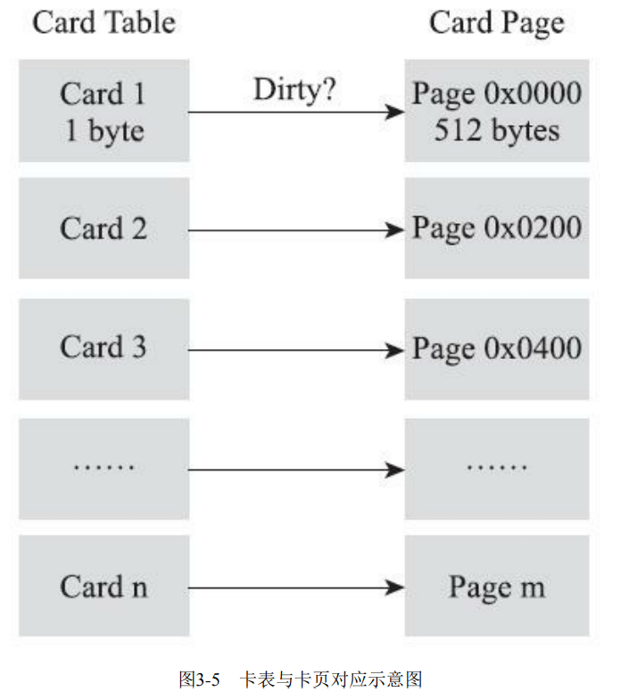


### 4.5 写屏障

我们已经解决了如何使用记忆集来缩减GC Roots扫描范围的问题，但还没有解决卡表元素如何维护的问题，例如它们何时变脏、谁来把它们变脏等。

1. **何时变脏：** 有其他分代区域中对象引用了本区域对象时，其对应的 卡表元素就应该变脏，变脏时间点原则上应该发生在引用类型字段赋值的那一刻
2. **如何变脏：** 通过写屏障技术维护卡表状态


::: info 写屏障

==写屏障== 可以看作在虚拟机层面对“引用类型字段赋值”这个动作的AOP切 面，在引用对象赋值时会产生一个环形（Around）通知，供程序执行额外的动作，也就是说赋值的前后都在写屏障的覆盖范畴内。

换句话就是 **对一个对象引用进行写操作（即引用赋值）之前或之后附加执行的逻辑**，相当于为引用赋值挂上的一小段钩子代码。

:::


除了写屏障的开销外，卡表在高并发场景下还面临着“伪共享”（False Sharing）问题。伪共享是处 理并发底层细节时一种经常需要考虑的问题

::: info 伪共享问题

现代中央处理器的缓存系统中是以缓存行（Cache Line） 为单位存储的，当多线程修改互相独立的变量时，如果这些变量恰好共享同一个缓存行，就会彼此影 响（写回、无效化或者同步）而导致性能降低，这就是 ==伪共享问题==

:::

为了避免 伪共享问题：

- 一种简单的解决方案是 **不采用无条件的写屏障，而是先检查卡表标记**，只有当该卡表元 素未被标记过时才将其标记为变脏。
- 在JDK 7之后，HotSpot虚拟机增加了一个新的参数 `-XX：+UseCondCardMark`，用来决定是否开启 卡表更新的条件判断；开启会增加一次额外判断的开销，但能够避免伪共享问。


### 4.6 并发的可达性分析

可达性分析算法理论上要求全过程都基于一个能保障一致性的快照中才能够进行分析， 这意味着必须全程冻结用户线程的运行。从GC Roots再继续往下遍历对象 图，这一步骤的停顿时间就必定会与Java堆容量直接成正比例关系了：堆越大，存储的对象越多，对 象图结构越复杂，要标记更多对象而产生的停顿时间自然就更长。

> 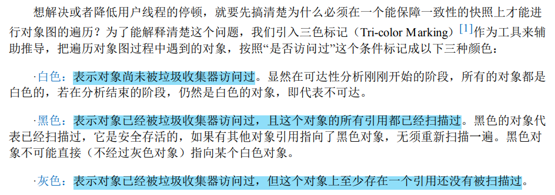
>
> 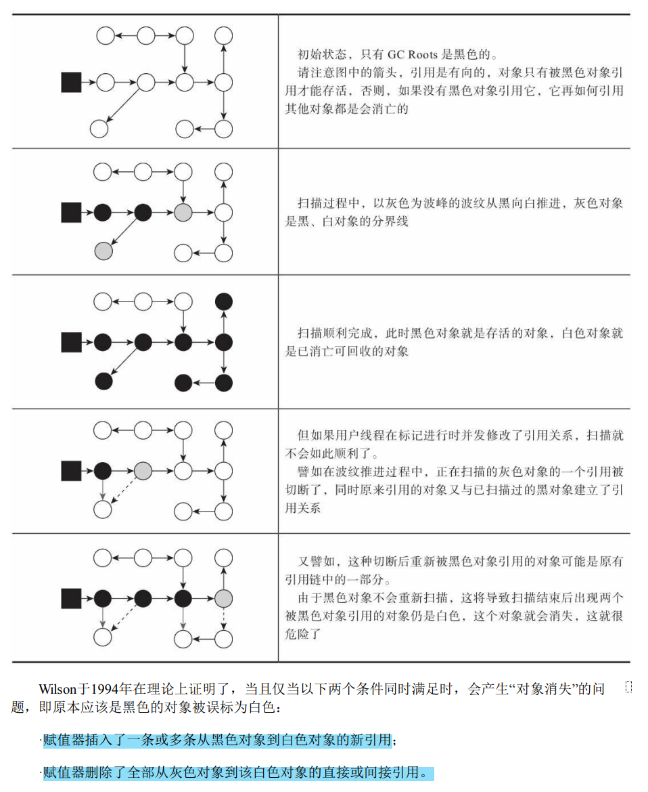

因此，我们要解决并发扫描时的对象消失问题，只需破坏这两个条件的任意一个即可。由此分别 产生了两种解决方案：==增量更新==（Incremental Update）和 ==原始快照==（Snapshot At The Beginning， SATB）。

- 增量更新：黑色对象一旦新插入了指向白色对象的引用之后，它就变回灰色对象了。等并发扫描结束之后，再将这些记录过的引用关系中的黑色对象为根，重新扫描一次
- 原始快照：无论引用关系删除与否，都会按照刚刚开始扫描那一刻的对象图快照来进行搜索


## 五、经典垃圾收集器

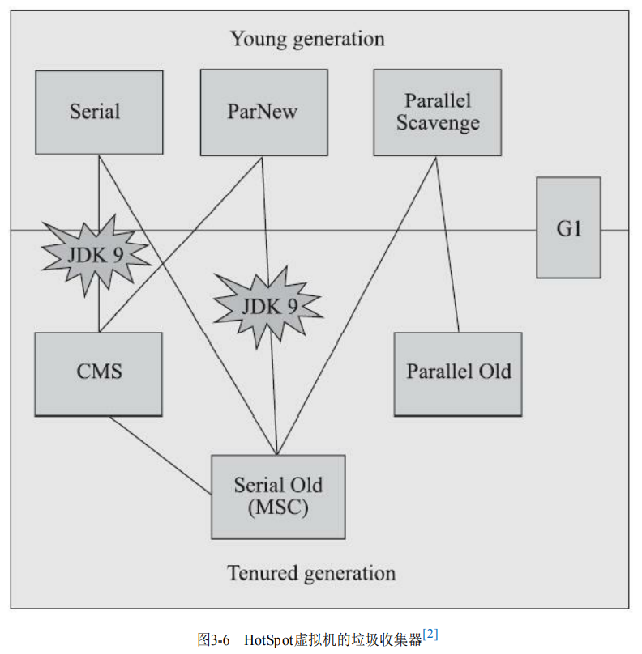


### 5.1 Serial 收集器

Serial 收集器是一个 ==单线程工作、新生代的收集器== ，要求在进行垃圾收集时，必须暂停其他所有工作线程，直到收集结束。


**优点：**

- 简单高效
- 额外的内存消耗最小
- 最高的单线程收集效率

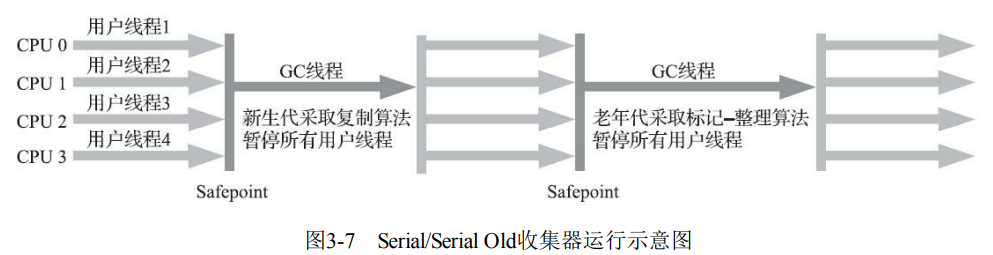


### 5.2 ParNew 收集器

ParNew 收集器实质上是 Serial 收集器的 ==多线程并行版本==。**优势：除了Serial收集器外，目前只有它能与CMS 收集器配合工作**

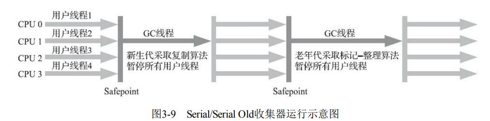

::: info CMS收集器

JDK5 发布的 CMS 收集器是HotSpot虚拟机中第一款真正意义上 ==支持并发== 的垃圾收集器，它首次 实现了让垃圾收集线程与用户线程（基本上）同时工作。是一个 ==老年代的收集器==

:::


> 随着垃圾收集器技术的不 断改进，更先进的G1收集器带着CMS继承者和替代者的光环登场。G1是一个面向全堆的收集器，不 再需要其他新生代收集器的配合工作。ParNew可以说是HotSpot虚拟机中第一款退出历史舞台的垃圾收集器。


::: info 并行和并发

- **并行：** 描述多条垃圾收集器之间的关系。同一时间可以有多条这样的线程在协同工作，默认此时用户线程处于等待状态。
- **并发：** 描述垃圾收集器线程和用户线程之间的关系。垃圾收集器线程可以和用户线程同时运行。

:::


### 5.3 Parallel Scavenge 收集器

Parallel Scavenge 收集器是一款 ==基于标记-复制算法实现的、新生代的、并行收集的多线程收集器== 。该收集器关注的目标是达到一个可控制的吞吐量。


$$
吞吐量 = \frac{运行用户代码时间}{运行用户代码时间 + 运行垃圾收集时间}
$$

- 停顿时间越短就越适合需要与用户交互或需要保证服务响应质量的程序，良 好的响应速度能提升用户体验
- 而高吞吐量则可以最高效率地利用处理器资源，尽快完成程序的运算 任务，主要适合在后台运算而不需要太多交互的分析任务


### 5.4 Serial Old 收集器

Serial Old 收集器是 Serial 收集器的 ==老年代版本，是基于标记-整理算法实现的单线程收集器。==


