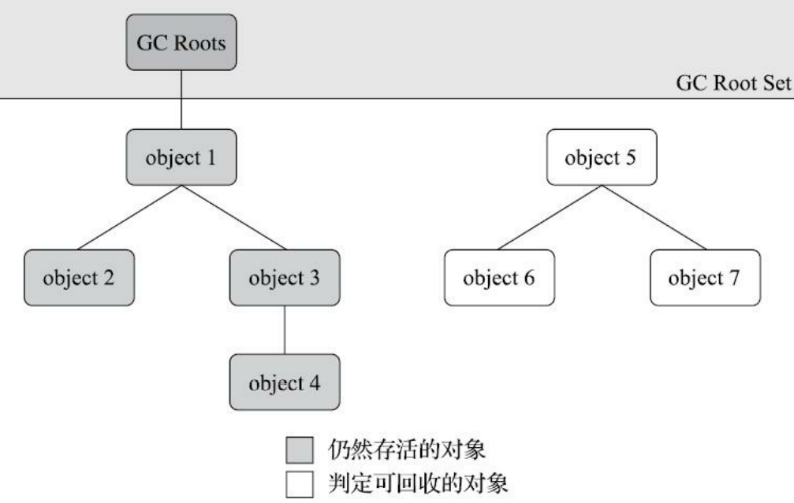

---
# 这是页面的图标
icon: page

# 这是文章的标题
title: 《深入理解JVM》第三章、垃圾收集器与内存分配策略

# 设置作者
author: lllllan

# 设置写作时间
# time: 2020-01-20

# 一个页面只能有一个分类
category: Java

# 一个页面可以有多个标签
tag:
- JVM
- 深入理解Java虚拟机

# 此页面会在文章列表置顶
# sticky: true

# 此页面会出现在首页的文章板块中
star: true

# 你可以自定义页脚
# footer: 
---


## 一、概述


## 二、对象已死

垃圾收集器在对堆进行回收前，第一件事情就是要确定这些对象之中哪些还“存活”着，哪些已经“死去”（“死去”即不可能再被任何途径使用的对 象）了


### 2.1 引用计数算法

在对象中添加一个引用计数器，每当有一个地方引用它时，计数器值就加一；当引用失效时，计数器值就减一；任何时刻计数器为零的对象就是不可 能再被使用的。

- 优点：原理简单，判定效率也很高
- 缺点：单纯的引用计数 就很难解决对象之间相互循环引用的问题


```java
/**
 * testGC()方法执行后，objA和objB会不会被GC呢？
 * @author zzm
 */
public class ReferenceCountingGC {
    public Object instance = null;
    private static final int _1MB = 1024 * 1024;
    /**
     * 这个成员属性的唯一意义就是占点内存，以便能在GC日志中看清楚是否有回收过
     */
    private byte[] bigSize = new byte[2 * _1MB];
    public static void testGC() {
        ReferenceCountingGC objA = new ReferenceCountingGC();
        ReferenceCountingGC objB = new ReferenceCountingGC();
        objA.instance = objB;
        objB.instance = objA;
        objA = null;
        objB = null;
        // 假设在这行发生GC，objA和objB是否能被回收？
        System.gc();
    }
}
```

实际上虚拟机并没有因为这两个对象互相引用就放弃回收它们，这也从侧面说明了Java虚拟机并不是通过引用计数算法来判断对象 是否存活的。


### 2.2 可达性分析算法

通过一系列称为 ==“GC Roots”== 的根对象作为起始节点集，从这些节点开始，根据引用关系 **向下搜索** ，搜索过程所走过的路径称为 ==“引用链”== （Reference Chain），如果某个对象到GC Roots间没有任何引用链相连， 或者用图论的话来说就是从GC Roots到这个对象不可达时，则证明此对象是不可能再被使用的。



::: tip GC Roots 包括的对象

1. 在虚拟机栈（栈帧中的 **本地变量表）中引用的对象**，譬如各个线程被调用的方法堆栈中使用到的 参数、局部变量、临时变量等
2. 在方法区中类 **静态属性引用的对象**，譬如Java类的引用类型静态变量
3. 在方法区中 **常量引用的对象**，譬如字符串常量池（String Table）里的引用
4. 在本地方法栈中JNI（即通常所说的 **Native方法）引用的对象**
5. Java **虚拟机内部的引用**，如基本数据类型对应的Class对象，一些常驻的异常对象（比如 NullPointExcepiton、OutOfMemoryError）等，还有系统类加载器
6. 所有被 **同步锁（synchronized关键字）持有的对象**
7. 反映Java虚拟机内部情况的JMXBean、JVMTI中注册的回调、本地代码缓存等。


根据用户所选用的垃圾收集器以及当前回收的内存区域不同，还 **可以有其他对象“临时性”地加入**，共同构成完整GC Roots集合。

:::
