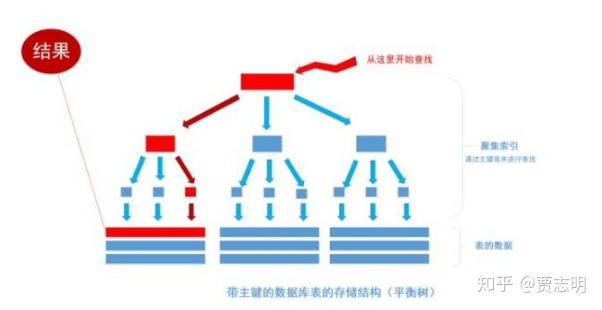

---
# 这是页面的图标
icon: page

# 这是文章的标题
title: MySQL 面试题合集

# 设置作者
author: lllllan

# 设置写作时间
# time: 2020-01-20

# 一个页面只能有一个分类
category: 数据库

# 一个页面可以有多个标签
tag:

# 此页面会在文章列表置顶
# sticky: true

# 此页面会出现在首页的文章板块中
star: true

# 你可以自定义页脚
# footer: 
---

::: warning 转载自一下文章，略有改动

:::

## 一、数据库三范式

### 1.1 第一范式 1NF

**列不可再分**

数据库中每一列都是不可分割的基本数据项，同一列中不能有多个值，即实体中的某个属性不能有多个值或者不能有重复的属性。

第一范式是对关系模式的基本要求。

### 1.2 第二范式 2NF

**行可以唯一区分，主键约束**

在第一范式的基础上，消除了非主属性对于码的部分函数依赖。满足每个表中必须有主关键字，其他数据元素与主关键字一一对应。

::: info 各种依赖

- **函数依赖：** 若在一张表中，在属性X指确定的情况下，必定能确定属性Y的是值，那么就可以说Y函数依赖于X，写作`x -> Y`
- **部分函数依赖：** 如果 `X -> Y`，并且存在X的一个真子集 X0，使得 `X0 -> Y`，则称Y对X部分函数依赖。比如学生基本信息表 R 中（学号，身份证号，姓名）当然学号属性取值是唯一的，在 R 关系中，（学号，身份证号）->（姓名），（学号）->（姓名），（身份证号）->（姓名）；所以姓名部分函数依赖与（学号，身份证号）；
- **完全函数依赖：** 在一个关系中，若某个非主属性数据项依赖于全部关键字称之为完全函数依赖。比如学生基本信息表 R（学号，班级，姓名）假设不同的班级学号有相同的，班级内学号不能相同，在 R 关系中，（学号，班级）->（姓名），但是（学号）->(姓名)不成立，（班级）->(姓名)不成立，所以姓名完全函数依赖与（学号，班级）；
- **传递函数依赖：** 在关系模式 R(U) 中，设X、Y、Z是U的不同的属性子集，如果X确定Y，Y确定Z，且有X不包含Y，Y不确定X，`(X v Y) ^ Z = 空`，则称Z传递函数依赖于X。传递函数依赖会导致数据冗余和异常。比如在关系 R(学号 , 姓名, 系名，系主任)中，学号 → 系名，系名 → 系主任，所以存在非主属性系主任对于学号的传递函数依赖

::: 

### 1.3 第三范式 3NF

**非主属性互补依赖**

在第二范式基础上，消除了非主属性对码的传递函数依赖。满足表中的所有数据元素不但要能唯一地被关键字所表示，而且他们之间还必须相互独立、不存在其他函数关系。

### 总结

1. 第一范式：属性不可再分
2. 第二范式：第一范式基础上，消除了非主属性对于码的部分函数依赖
3. 第三范式，第二范式基础上，消除了非主属性对于码的传递函数依赖

## 二、事务

**事务：** 多条sql语句，要么全部成功，要么全部失败。

### 2.1 事务的特性

- **原子性：** 一个事务是一个不可分割的工作单位，事务中包括的操作要么都做，要么都不做。

- **一致性：** 事务的执行使数据从一个状态转换为另一个状态，但是对于整个数据的完整性保持稳定。

    > 比如A转账100元给B，不管操作是否成功，A和B的账户总额是不变的。

- **隔离性：** 一个事务内部的操作及使用的数据对并发的其他事务是隔离的，并发执行的各个事务之间不能互相干扰。

- **持久性：** 一个事务一旦提交，它对数据库中数据的改变就应该是永久性的。接下来的其他操作或故障不应该对其有任何影响。

## 三、索引

在关系数据库中，索引是一种**单独的、物理的**对数据库表中一列或多列的值进行排序的一种 ==存储结构== ，它是某个表中<u>一列或若干列值的集合和相应的指向表中物理标识这些值的数据页的逻辑指针清单</u>。索引的作用相当于图书的目录，可以根据目录中的页码快速找到所需的内容。

### 3.1 索引的优缺点

**优点**

1. 大大加快数据的检索速度
2. 创建唯一性索引，保证数据库表中每一行数据的唯一性
3. 加速表和表之间的连接
4. 在使用分组和排序子句进行数据检索时，可以显著减少查询中分组和排序的时间。

**缺点**

1. 索引需要占物理空间。
2. 当对表中的数据进行增加、删除和修改的时候，索引也要动态的维护，降低了数据的维护速度。

### 3.2 索引类型

1. 普通索引

2. 唯一索引：不允许其中任何两行具有相同索引值

3. 主键索引

4. 聚集索引：该索引中键值的逻辑顺序决定了表中相应行的物理顺序

    

## 四、MySQL 存储引擎及使用场景

### 4.1 什么是存储引擎

**数据库引擎是数据库 ==底层软件组织==**

MySQL中的数据用各种不同的技术存储在文件（或者内存）中。这些技术中的每一种技术都使用不同的存储机制、索引技巧、锁定水平并且最终提供广泛的不同的功能和能力。通过选择不同的技术，你能够获得额外的速度或者功能，从而改善你的应用的整体功能。

### 4.2 MySQL 各种存储引擎

|     功能     | MyISAM  | MEMORY  |   InnoDB   | Archive |
| :----------: | :-----: | :-----: | :--------: | :-----: |
|   存储限制   |  256TB  |   RAM   |    64TB    |  None   |
|   支持事务   |   No    |   No    |  ==Yes==   |   No    |
| 支持全文索引 | ==Yes== |   No    |     No     |   No    |
|  支持树索引  |   Yes   |   Yes   |    Yes     |   No    |
| 支持哈希索引 |   No    | ==Yes== |     No     |   No    |
| 支持数据缓存 |   No    |   N/A   |  ==Yes==   |   No    |
|   支持外键   |   No    |   No    |  ==Yes==   |   No    |
|      锁      | 全表锁  | 全表锁  | ==行级锁== |         |

### 4.3 存储引擎的选择

1. 如果需要提供提交、回滚和恢复的 ==事务安全== 能力，并要求 ==并发控制==  → InnoDB
2. 如果数据表主要用来 ==插入和查询== 记录 → MyISAM
3. 如果只是临时存放数据，==数据量不大==，并且**不需要提高数据的安全性** → MEMORY
4. 如果 ==只有插入和查询== → Archive，支持高并发的插入，但是非事务安全

### 4.4 MyISAM 和 InnoDB 的区别

**区别：**

1. InnoDB 支持事务，MyISAM 不支持事务。这是 MySQL 将默认存储引擎从 MyISAM 编程的 InnoDB 的重要原因之一。
2. InnoDB 支持外键，MyISAM 不支持。
3. InnoDB 是聚集索引，MyISAM 是非聚集索引。
4. InnoDB 不保存表的具体行数，执行 `select count(*) from table` 需要全表扫描。 而 MyISAM 用一个变量保存了整个表的行数，查询行数时速度更快。
5. InnoDB 最小的锁粒度是行锁，MyISAM 最小的锁粒度是表锁。一个更新语句会锁住整张表，导致其他查询和更新都会被阻塞，因此并发访问受限。

**如何选择：**

1. 需要支持事务，InnoDB
2. 主要是查询工作，MyISAM；如果读写也频繁，InnoDB
3. MyISAM 系统崩溃后恢复更困难

