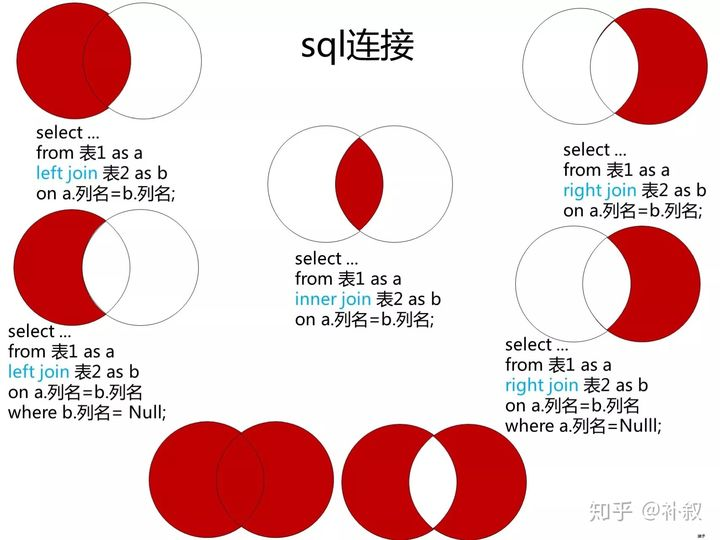
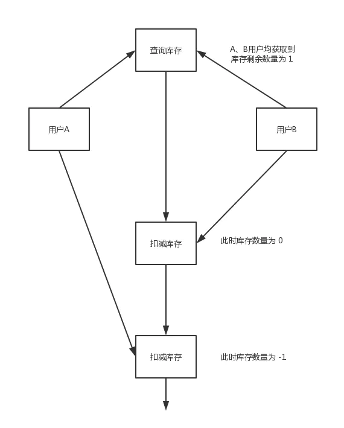

---
# 这是页面的图标
icon: page

# 这是文章的标题
title: MySQL 面试题合集

# 设置作者
author: lllllan

# 设置写作时间
# time: 2020-01-20

# 一个页面只能有一个分类
category: 数据库

# 一个页面可以有多个标签
tag:

# 此页面会在文章列表置顶
# sticky: true

# 此页面会出现在首页的文章板块中
star: true

# 你可以自定义页脚
# footer: 
---

::: warning 转载自一下文章，略有改动

- [SQL：多表查询](https://zhuanlan.zhihu.com/p/91973413)
- [MySQL中的悲观锁](https://www.jianshu.com/p/8a70a4af7eac)

:::

## 一、数据库三范式

### 1.1 第一范式 1NF

**列不可再分**

数据库中每一列都是不可分割的基本数据项，同一列中不能有多个值，即实体中的某个属性不能有多个值或者不能有重复的属性。

第一范式是对关系模式的基本要求。

### 1.2 第二范式 2NF

**行可以唯一区分，主键约束**

在第一范式的基础上，消除了非主属性对于码的部分函数依赖。满足每个表中必须有主关键字，其他数据元素与主关键字一一对应。

::: info 各种依赖

- **函数依赖：** 若在一张表中，在属性X指确定的情况下，必定能确定属性Y的是值，那么就可以说Y函数依赖于X，写作`x -> Y`
- **部分函数依赖：** 如果 `X -> Y`，并且存在X的一个真子集 X0，使得 `X0 -> Y`，则称Y对X部分函数依赖。比如学生基本信息表 R 中（学号，身份证号，姓名）当然学号属性取值是唯一的，在 R 关系中，（学号，身份证号）->（姓名），（学号）->（姓名），（身份证号）->（姓名）；所以姓名部分函数依赖与（学号，身份证号）；
- **完全函数依赖：** 在一个关系中，若某个非主属性数据项依赖于全部关键字称之为完全函数依赖。比如学生基本信息表 R（学号，班级，姓名）假设不同的班级学号有相同的，班级内学号不能相同，在 R 关系中，（学号，班级）->（姓名），但是（学号）->(姓名)不成立，（班级）->(姓名)不成立，所以姓名完全函数依赖与（学号，班级）；
- **传递函数依赖：** 在关系模式 R(U) 中，设X、Y、Z是U的不同的属性子集，如果X确定Y，Y确定Z，且有X不包含Y，Y不确定X，`(X v Y) ^ Z = 空`，则称Z传递函数依赖于X。传递函数依赖会导致数据冗余和异常。比如在关系 R(学号 , 姓名, 系名，系主任)中，学号 → 系名，系名 → 系主任，所以存在非主属性系主任对于学号的传递函数依赖

::: 

### 1.3 第三范式 3NF

**非主属性互补依赖**

在第二范式基础上，消除了非主属性对码的传递函数依赖。满足表中的所有数据元素不但要能唯一地被关键字所表示，而且他们之间还必须相互独立、不存在其他函数关系。

### 总结

1. 第一范式：属性不可再分
2. 第二范式：第一范式基础上，消除了非主属性对于码的部分函数依赖
3. 第三范式，第二范式基础上，消除了非主属性对于码的传递函数依赖

## 二、事务

**事务：** 多条sql语句，要么全部成功，要么全部失败。

### 2.1 事务的特性

- **原子性：** 一个事务是一个不可分割的工作单位，事务中包括的操作要么都做，要么都不做。

- **一致性：** 事务的执行使数据从一个状态转换为另一个状态，但是对于整个数据的完整性保持稳定。

    > 比如A转账100元给B，不管操作是否成功，A和B的账户总额是不变的。

- **隔离性：** 一个事务内部的操作及使用的数据对并发的其他事务是隔离的，并发执行的各个事务之间不能互相干扰。

- **持久性：** 一个事务一旦提交，它对数据库中数据的改变就应该是永久性的。接下来的其他操作或故障不应该对其有任何影响。

### 2.2 并发事务带来的问题

1. **脏读：** 当一个事务正在访问数据并且修改了数据，但这个修改还没有提交。此时另一个事务访问读取了这个数据，并使用了这个数据。因为这个数据时提交以前的数据，但是马上会被修改，所以这个被读到的数据称为 ==脏数据== ，依据脏数据的操作可能是不正确的

2. **丢失修改：** 两个事务同时访问并修改了同一个数据，但最后只保留了其中一个修改，而丢失了另一个修改

    > 事务1、2同时读取表中的数据 `A = 20`，并且都做了相同的修改 `A = A - 1`。两次修改应该让 `A = A - 2 = 18`，但是因为 **丢失修改** ，只有一次修改成功，最后数据变成 `A = A - 1 = 19`

3. **不可重复读：** 由于一个事务对数据的修改，导致另一个事务对这个数据的两次访问前后不一致
4. **幻读：** 由于一个事务插入了新的数据，导致另一个事务的某次查询比之前多了一些本来不存在的记录

::: info 不可重复读和幻读的区别

- 不可重复读的重点是 **修改** ，导致另一个事务对某个数据的访问前后不一致
- 幻读的重点在于 **新增或删除** ，导致另一个事务多次读取记录时发现增多或减少

:::

### 2.3 事务隔离级别

1. **READ-UNCOMMITTED 读取未提交：** 最低的隔离级别，允许读取尚未提交的数据变更，可能会导致 脏读、幻读、不可重复读
2. **READ-COMMITTED 读取已提交：** 允许读取并发事务已提交的数据，可以阻止脏读，但是幻读和不可重复读扔有可能发生
3. **REPEATABLE-READ 可重复读：** 对同意字段的多次读取结果是一致的，除非数据被本身事务修改，可以阻止脏读和不可重复度，但幻读仍有可能发生
4. **SERIALZABLE 可串行化：** 最高的隔离级别，所有的事务依次逐个执行，事务之间不可能产生干扰。

|     隔离级别     | 脏读 | 不可重复读 | 幻读 |
| :--------------: | :--: | :--------: | :--: |
| READ-UNCOMMITTED |  √   |     √      |  √   |
|  READ-COMMITTED  |      |     √      |  √   |
| REPEATABLE-READ  |      |            |  √   |
|   SERIALIZABLE   |      |            |      |

::: tip MySQL 的默认隔离级别

InnoDB 存储引擎在 ==**REPEATABLE-READ**== 事务隔离级别下使用的是 ==**Next-Key Lock算法**== ，可以做到避免幻读。

因为隔离的级别越低，事务请求的锁越少，所以大部分数据库系统的隔离级别都是 **READ-COMMITTED**，而 InnoDB 默认使用 **REPEATABLE-READ** 既能达到最高的隔离级别、也不会任何性能损失。

==InnoDB 存储引擎在 **分布式事务** 的情况下一般会用到 **SERIALIZABLE** 隔离级别==

:::

## 三、索引

在关系数据库中，索引是一种**单独的、物理的**对数据库表中一列或多列的值进行排序的一种 ==存储结构== ，它是某个表中<u>一列或若干列值的集合和相应的指向表中物理标识这些值的数据页的逻辑指针清单</u>。索引的作用相当于图书的目录，可以根据目录中的页码快速找到所需的内容。

### 3.1 索引的优缺点

**优点**

1. 大大加快数据的检索速度
2. 创建唯一性索引，保证数据库表中每一行数据的唯一性
3. 加速表和表之间的连接
4. 在使用分组和排序子句进行数据检索时，可以显著减少查询中分组和排序的时间。

**缺点**

1. 索引需要占物理空间。
2. 当对表中的数据进行增加、删除和修改的时候，索引也要动态的维护，降低了数据的维护速度。

### 3.2 索引类型

1. 普通索引

2. 唯一索引：不允许其中任何两行具有相同索引值

3. 主键索引

4. 聚集索引：该索引中键值的逻辑顺序决定了表中相应行的物理顺序

    

### 3.3 索引操作（保留）

### 3.4 什么时候不要使用索引

- 经常增删改的列不要建立索引
- 有大量重复的列不要建立索引
- 表记录太少不要建立索引

## 四、MySQL 存储引擎及使用场景

### 4.1 什么是存储引擎

**数据库引擎是数据库 ==底层软件组织==**

MySQL中的数据用各种不同的技术存储在文件（或者内存）中。这些技术中的每一种技术都使用不同的存储机制、索引技巧、锁定水平并且最终提供广泛的不同的功能和能力。通过选择不同的技术，你能够获得额外的速度或者功能，从而改善你的应用的整体功能。

### 4.2 MySQL 各种存储引擎

|     功能     | MyISAM  | MEMORY  |   InnoDB   | Archive |
| :----------: | :-----: | :-----: | :--------: | :-----: |
|   存储限制   |  256TB  |   RAM   |    64TB    |  None   |
|   支持事务   |   No    |   No    |  ==Yes==   |   No    |
| 支持全文索引 | ==Yes== |   No    |     No     |   No    |
|  支持树索引  |   Yes   |   Yes   |    Yes     |   No    |
| 支持哈希索引 |   No    | ==Yes== |     No     |   No    |
| 支持数据缓存 |   No    |   N/A   |  ==Yes==   |   No    |
|   支持外键   |   No    |   No    |  ==Yes==   |   No    |
|      锁      | 全表锁  | 全表锁  | ==行级锁== |         |

### 4.3 存储引擎的选择

1. 如果需要提供提交、回滚和恢复的 ==事务安全== 能力，并要求 ==并发控制==  → InnoDB
2. 如果数据表主要用来 ==插入和查询== 记录 → MyISAM
3. 如果只是临时存放数据，==数据量不大==，并且**不需要提高数据的安全性** → MEMORY
4. 如果 ==只有插入和查询== → Archive，支持高并发的插入，但是非事务安全

### 4.4 MyISAM 和 InnoDB 的区别

**区别：**

1. InnoDB 支持事务，MyISAM 不支持事务。这是 MySQL 将默认存储引擎从 MyISAM 编程的 InnoDB 的重要原因之一。
2. InnoDB 支持外键，MyISAM 不支持。
3. InnoDB 是聚集索引，MyISAM 是非聚集索引。
4. InnoDB 不保存表的具体行数，执行 `select count(*) from table` 需要全表扫描。 而 MyISAM 用一个变量保存了整个表的行数，查询行数时速度更快。
5. InnoDB 最小的锁粒度是行锁，MyISAM 最小的锁粒度是表锁。一个更新语句会锁住整张表，导致其他查询和更新都会被阻塞，因此并发访问受限。

**如何选择：**

1. 需要支持事务，InnoDB
2. 主要是查询工作，MyISAM；如果读写也频繁，InnoDB
3. MyISAM 系统崩溃后恢复更困难

## 五、优化手段

### 5.1 SQL语句优化

1. 查询语句中不要使用 `select *`
2. 尽量减少子查询，使用关联查询替代（`left join, right join, inner join`）
3. 减少使用 `in, not in`，使用 `exists, not exists` 或关联查询替代（ ==存疑== ）
4. or 的查询尽量使用 `union, union all` 代替（在确认没有重复数据或者不用剔除重复数据时，用 `union all` 更好）
5. 尽量避免在 where 子句中使用 `!=, <>` 操作符，否则将引擎放弃使用索引而进行全表扫描
6. 应尽量避免在 where 子句中对字段进行 null 值判断，否则将导致引擎放弃使用索引而进行全表 扫描，如： `select id from t where num is null` 可以在num上设置默认值0，确保表中num列没有 null值，然后这样查询： `select id from t where num=0`

### 5.2 大表优化

1. 限定数据范围：务必禁止不带任何限制数据范围条件的查询语句

2. 读/写分离：经典的数据库拆分方案，主库负责写、从库负责读 （ ==数据库拆分？== ）

3. 垂直分区：根据数据库里数据表的相关性进行拆分

    > 例如用户表中既有用户的登录信息又有用户的基本信息，就可以拆分成两个单独的表，甚至放到单独的库做分库。
    >
    > - 优点：可以使列数据变小，在查询时减少读取的Block数，减少I/O次数。可以简化表的结构，易于维护
    > - 缺点：主键会出现冗余，需要管理冗余列，并会引起join操作，会让事务变得更加复杂

4. 水平分区：保持数据表结构不变，通过某种策略存储数据分片。这样每一片数据分散到不同的表或库中，达到了分布式的目的。水平拆分可以支撑非常大的数据量。

### 5.3 分库分表的id主键处理 （ ==保留== ）

## 六、关键字

### 6.1 drop、delete、truncate

#### 6.1.1 用法不同

- drop 丢弃数据：`drop table`，直接删除表
- truncate 清空数据：`truncate table`，值删除表中的数据，再插入数据时自增id又从1开始
- delete 删除数据：`delete from table where ?`，删除某一列的数据

#### 6.1.2 不同的数据库语言

truncate 和 drop 属于 DDL（数据定义语言）语句，操作立即生效，原数据不妨到 rollback segement 中，不能回滚，操作不处罚 tigger。

delete 语句是 DML（数据库操作语言）语句，这个操作会放到 rollback segement中，事务提交之后才生效

**DML 和  DDL：**

- DML 是数据库操作语言 Data Manipulation Language，指对数据库中表记录的操作，主要包括插入、更新、删除和查询
- DDL 是数据库定义语言 Data Definition Language，是对数据库内部对象进行创建、删除、修改的操作语言。

#### 6.1.3 执行速度不同

一般来说：drop > truncate > delete

> `delete`命令执行的时候会产生数据库的`binlog`日志，而日志记录是需要消耗时间的，但是也有个好处方便数据回滚恢复。
>
> `truncate`命令执行的时候不会产生数据库日志，因此比`delete`要快。除此之外，还会把表的自增值重置和索引恢复到初始大小等。
>
> `drop`命令会把表占用的空间全部释放掉。
>
> Tips：你应该更多地关注在使用场景上，而不是执行效率。

 

### 6.2 varchar 和 char 的区别

- char 固定长度，加入申请了 `char(10)` ，那么无论实际存储多少内容，该字段都占用了10个字符
- varchr 是变长，申请的只是最大长度，占用的控件时实际的字符长度+1

从效率角度 `char > varchar` ，因此使用中如果确定某字段值的长度，可以使用 char，否则应该尽量使用 varchar

### 6.3 varchar(10) 和 int(10)

varchar的10代表了申请的空间长度,也是可以存储的数据的最大长度,而int的10只是代表了展示的长度,不足10位以0填充.也就是说,int(1)和int(10)所能存储的数字大小以及占用的空间都是相同的,只是在展示时按照长度展示.

## 七、视图

视图是指计算机数据库中的视图，是一个虚拟表，其内容由查询定义。同真实的表一样，视图包含一系列带有名称的列和行数据。但是，视图并不在数据库中以存储的数据值集形式存在。行和列数据来自由定义视图的查询所引用的表，并且在引用视图时动态生成。

## 八、查询

### 8.1 多表查询

## 九、MVCC （ ==保留== ）

### 9.1 什么是 MVCC

全称 `Multi-Version Concurrency Control`，即多版本并发控制，主要是为了提高数据库的并发性能。

是一种用来解决读 - 写冲突的无 锁并发控制。也就是为事务分配单向增长的时间戳，为每个修改保存一个版本。

### 9.2 MVCC 解决什么问题

> 最原生的锁，锁住一个资源后会禁止其他任何线程访问同一个资源。但是很多应用的一个特点都是读多写少的场景，很多数据的读取次数远大于修改的次数，而读取数据间互相排斥显得不是很必要。

在并发读写数据库时，可以做到在读操作时不用阻塞写操作，写操作也不用阻塞读操作，提高了数 据库并发读写的性能。同时还可以解决脏读、幻读、不可重复读等事务隔离问题，但不能解决更新 丢失问题。

### 9.3 MVCC 实现原理 （ ==保留== ）

## 十、锁

### 10.1 MySQL数据库的锁

- 共享锁（读锁）：不堵塞，多个用户可以同时读取同一资源，相互之间没有影响
- 排他锁（写锁）：一个写操作阻塞其他的读锁和写锁，值允许一个用户进行写入，防止其他用户读取正在写入的资源
- 表锁：系统开销最小，会锁定整张表，MyISAM使用锁
- 行锁：容易出现死锁，发生冲突概率低，并发高，InnoDB支持行锁。

### 10.2 锁升级 （ ==不懂== ）

- MySQL 行锁只能加在索引上，如果操作不走索引，就会升级为表锁。因为 InnoDB 的行锁是加 在索引上的，如果不走索引，自然就没法使用行锁了，原因是 InnoDB 是将 primary key index 和相关的行数据共同放在 B+ 树的叶节点。InnoDB 一定会有一个 primary key，secondary index 查找的时候，也是通过找到对应的 primary，再找对应的数据行。
-  当非唯一索引上记录数超过一定数量时，行锁也会升级为表锁。测试发现当非唯一索引相同的 内容不少于整个表记录的二分之一时会升级为表锁。因为当非唯一索引相同的内容达到整个记 录的二分之一时，索引需要的性能比全文检索还要大，查询语句优化时会选择不走索引，造成 索引失效，行锁自然就会升级为表锁

### 10.3 乐观锁和悲观锁

#### 10.3.1 悲观锁

[MySQL中的悲观锁](https://www.jianshu.com/p/8a70a4af7eac)

悲观锁主要用于保护数据的完整性。当多个事务并发执行时，某个事务对数据应用了锁，则其他事务只能等该事务执行完了，才能进行对该数据进行修改操作。

> 在商品购买场景中，当有多个用户对某个库存有限的商品同时进行下单操作。若采用先查询库存，后减库存的方式进行库存数量的变更，将会导致超卖的产生。
>
> 
>
> 若使用悲观锁，当B用户获取到某个商品的库存数据时，用户A则会阻塞，直到B用户完成减库存的整个事务时，A用户才可以获取到商品的库存数据。则可以避免商品被超卖。

悲观锁采用的是「先获取锁再访问」的策略，来保障数据的安全。但是加锁策略，依赖数据库实现，会增加数据库的负担，且会增加死锁的发生几率。此外，对于不会发生变化的只读数据，加锁只会增加额外不必要的负担。在实际的实践中，对于并发很高的场景并不会使用悲观锁，因为当一个事务锁住了数据，那么其他事务都会发生阻塞，会导致大量的事务发生积压拖垮整个系统。

