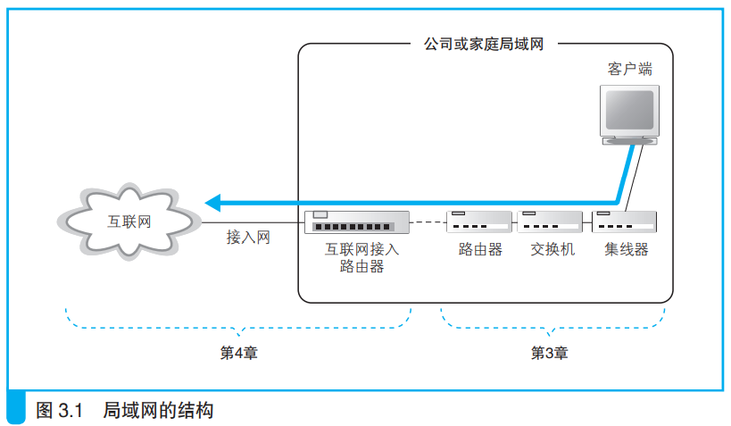
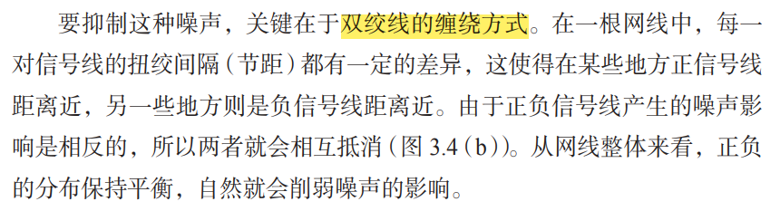
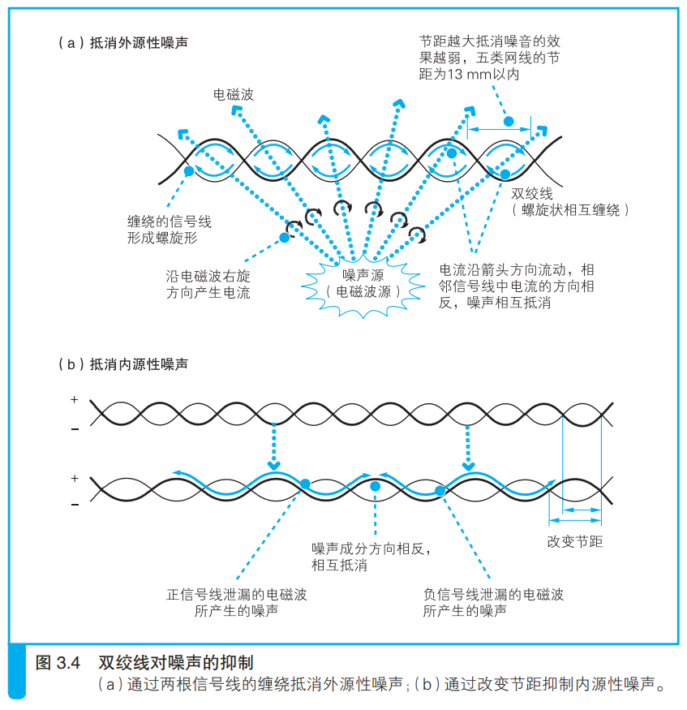
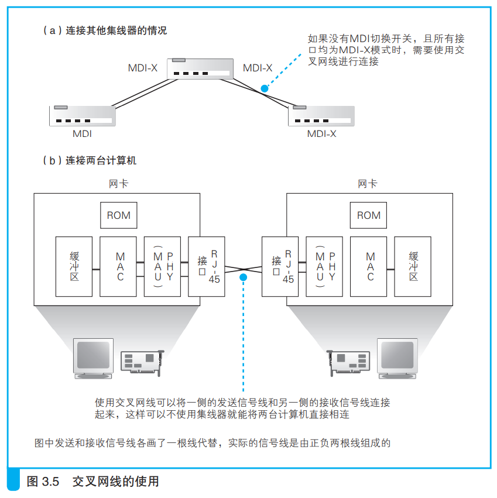

---
# 这是页面的图标
icon: page

# 这是文章的标题
title: 第三章、从网线到网络设备

# 设置作者
author: lllllan

# 设置写作时间
# time: 2020-01-20

# 一个页面只能有一个分类
category: 计算机基础

# 一个页面可以有多个标签
tag:
- 计算机网络
- 网络是怎样连接的

# 此页面会在文章列表指定
# sticky: true

# 此页面会出现在首页的文章板块中
star: true

# 你可以自定义页脚
# footer: 
---

## 一、信号在网线和集线器中传输

### 1.1 每个包都是独立传输的

### 1.2 网线中的信号衰减

以太网信号的本质是正负变化的电压。

信号在网线的传输过程中，能量会逐渐损失。网线越长，信号衰减就越严重。

同时噪声也会进一步加剧信号的失真。

### 1.3 双绞线抑制噪声

> 产生噪声的原因是网线周围的电磁波，当电磁波接触到金属等导体时，在其中就会产生电流。信号和噪声的电流混杂在一起之后，导致信号的波形发生失真。

影响网线的电磁波分为两种：

#### 来自网线之外的其他设备：

当电磁波接触到信号线时，会沿电磁波传播的右旋方向产生电流。

如果我们将信号线缠绕在一起，信号线就变成了螺旋形，其中两根信号线产生的噪声电流方向就会相反，从而使得噪声电流相互抵消。

#### 相邻信号线泄露出来：

这种内部产生的噪声称为 **串扰**

### 1.4 集线器将信号发往所有线路

> 集线器将信号发送给所有连接在它上面的线路。

