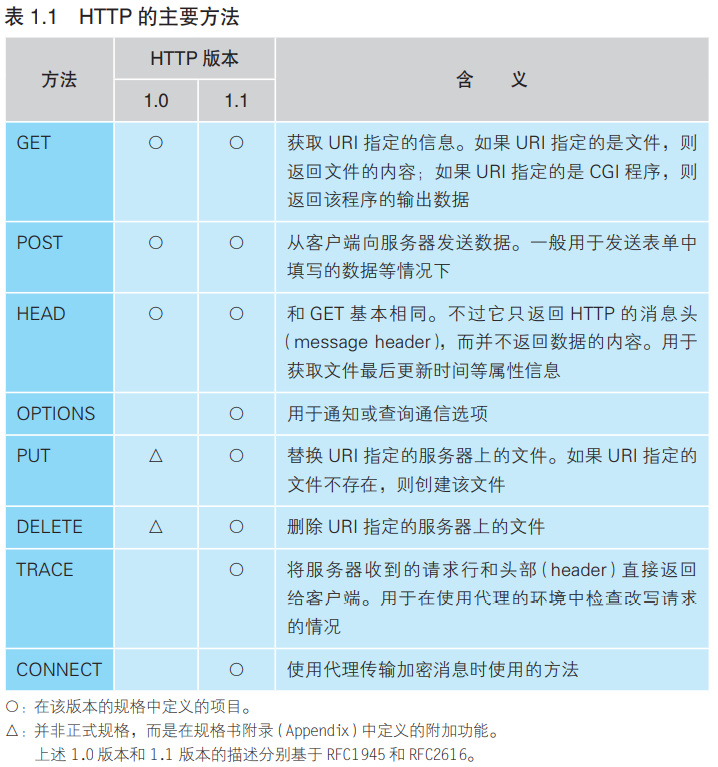
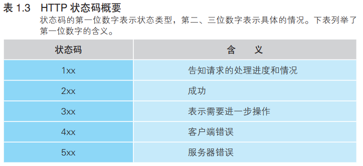
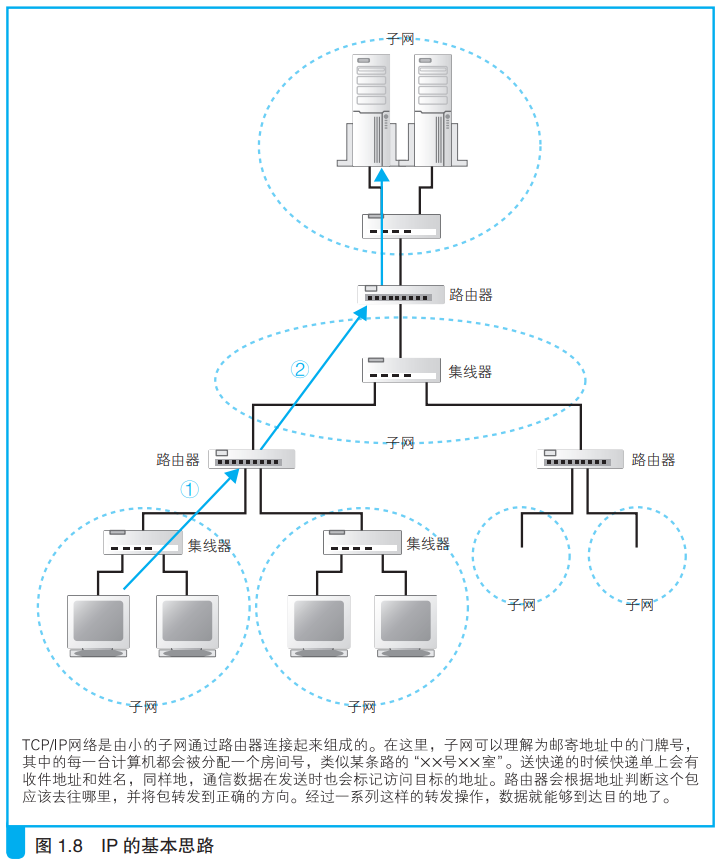
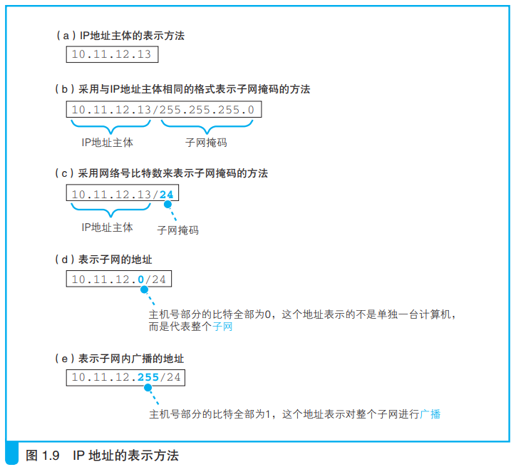
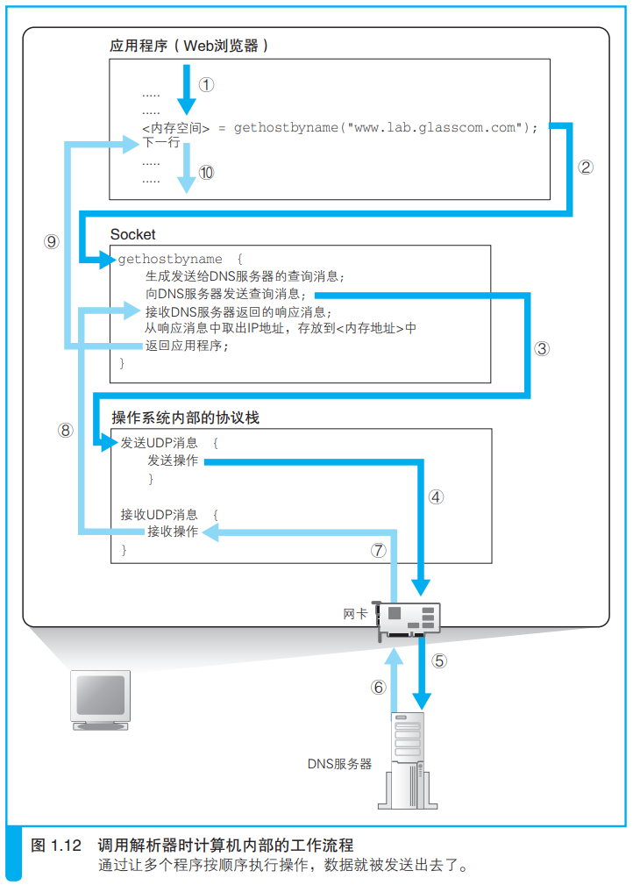
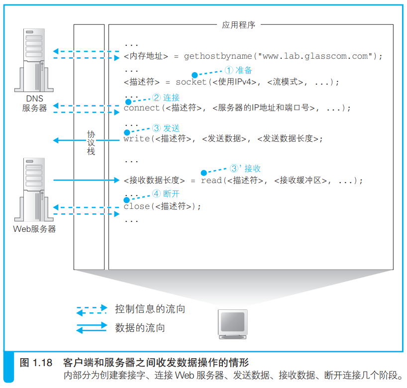
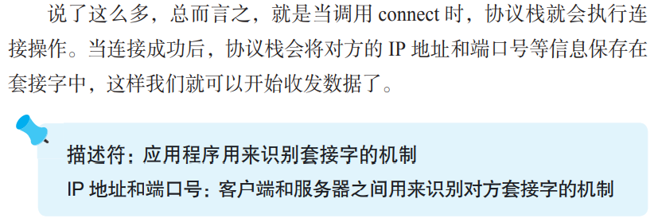

---
# 这是页面的图标
icon: page

# 这是文章的标题
title: 第一章、浏览器生成消息

# 设置作者
author: lllllan

# 设置写作时间
# time: 2020-01-20

# 一个页面只能有一个分类
category: 计算机基础

# 一个页面可以有多个标签
tag:
- 计算机网络
- 网络是怎样连接的

# 此页面会在文章列表置顶
# sticky: true

# 此页面会出现在首页的文章板块中
star: true

# 你可以自定义页脚
# footer: 
---

::: warning

本文作为 《网络是怎样连接的》 的笔记，绝大部分内容均抄自该书。

:::

## 一、生成 HTTP 请求消息

### 1.1 网址（URL, Uniform Resource Locator）

### 1.2 解析 URL

### 1.3 文件名省略

- 当 URL 以 `/` 结尾时，服务器会默认访问该路径下的 `index.html` 或 `default.html` 文件
- 当 URL 连 `/` 和文件类型都省略的时候：

（实测：当一个文件没有文件类型的时候，不允许和一个同名文件夹同时存在。而当这个文件有后缀时，应该会访问同名文件夹）

### 1.4 HTTP 基本思路

- 对什么 + 进行怎样的操作

### 1.5 生成 HTTP 请求信息

> **一条请求消息中只能写一个URI**。如果需要获取多个文件，必须对每个文件单独发送一条请求

更多字段信息见文档 44 页。

### 1.6 服务器响应

> 状态码时一个数字，主要用来向程序告知执行的结果
>
> 响应短语是一段文字，用来向人们告知执行的结果

## 二、向 DNS 服务器查询 Web 服务器的 IP 地址

### 2.1 IP 地址的基本知识

- IP 地址是 32 比特的数字，被分成了4组
- 子网掩码也是 32 比特的数字
  - **左边全1的部分表示网络号**
  - **右边全0的部分表示主机号**

### 2.2 域名和IP地址并用的理由

- 域名比IP地址更容易记忆
- IP地址的传输比域名更高效（IP地址只是4字节的数字，域名最长可以是255字节的字符）

于是让人来使用域名，让路由器来使用IP地址，这个机制就是**DNS**。

### 2.3 Socket 库提供查询 IP 地址的功能

> **域名解析**：通过DNS查询IP地址的操作。

> **解析器**：负责执行域名解析的DNS客户端。（解析器实际上是一段程序。）

​	库是一堆通用程序组件的集合，他们具有诸多好处：

- 节省编程工作量
- 实现程序的标准化
- 等等

​	Socket库也是一种库，其中包含的程序组件可以让其他的应用程序调用操作系统的网络功能，而解析器就是这个库中的其中一种程序组件。

### 2.4 通过解析器向DNS服务器发出查询

- 调用解析器
- 解析器向DNS服务器发送查询消息
- DNS服务器返回响应消息
- 解析器从响应消息中取出IP地址并写入内存

根据域名查询IP地址时，浏览器会使用Socket库中的解析器。

### 2.5 解析器的内部原理

>  **控制流程转移**：由于调用了其他程序，原本运行的程序进入暂停状态，而被调用的程序开始运行。

- 从上往下顺序执行应用程序编写的操作内容，当到达需要调用解析器的部分时
- 控制流程转移到解析器，解析器会生成要发送给DNS服务器的查询消息
- 委托操作系统内部的协议栈来发送这个消息（因为解析器本身并不具备使用网络收发数据的功能

向DNS服务器发送消息时，也需要知道DNS服务器的IP地址。这是这个地址实现设置好了，不需要再查询。

## 三、DNS 服务器

### 3.1 DNS 服务器的基本工作

DNS 服务器的基本工作就是根据需要查询的域名和记录类型查找相关的记录，并向客户端返回响应消息。

- 域名：服务器、邮件服务器（邮件地址@后面的部分）的名称
- Class：代表互联网的IN
- 记录类型：表示域名对应何种类型的记录。

### 3.2 域名的层次结构

由于存在着不计其数的服务器，不可能将所有服务器的信息保存在一台DNS服务器中，只能是将这些信息分布保存在多台DNS服务器中。

- 按域名以分层次的结构来保存
- 域名中越靠右的位置表示气层级越高
- 每个域都是作为一个整体存放在DNS服务器中的

### 3.3 寻找相应的 DNS 服务器并获取 IP 地址

- 负责管理下级域的 DNS 服务器的 IP 地址注册到他们的上级 DNS 服务器中
- com和jp 的上面存在一个 根域
- 所有 DNS 服务器中都保存有根域的 DNS 服务器信息

### 3.4 通过缓存加快 DNS 服务器的响应

DNS 服务器有一个缓存功能，可以记住之前查询过的域名

- 如果要查询的域名和相关信息已经在缓存中，那么就可以直接返回响应。
- 当查询的域名不存在时，“不存在”这一响应结果也会被缓存
- 缓存信息设置有一个有效期，当信息超过有效期后，数据会从缓存中删除
- DNS服务器返回响应时，会告知这一响应结果是来自缓存还是来自负责管理该域名的DNS服务器

## 四、委托协议栈发送消息

### 4.1 数据收发操作概览

> 委托操作系统内部的协议栈发送HTTP消息，适用于**任何**网络应用程序。

- 创建套接字（出入口） —— **创建套接字阶段**
- 【客户端】向【服务器端】套接字连接管道 —— **连接阶段**
- 收发数据 —— **通信阶段**
- 断开管道并删除套接字 —— **断开阶段**

> 这个管道中，*数据流动是**双向**的*

### 4.2 创建套接字阶段

> 创建套接字需要调用 Socket 库中的 **socket 程序组件**

客户端创建套接字：

- 调用 Socket 库中的 socket 程序组件
- 控制流程转移到 socket 内部并执行创建套接字操作
- 控制流程交回应用程序

> 套接字创建完成以后，协议栈返回一个**描述符**，用来标识该套接字

### 4.3 连接阶段

> 连接阶段需要调用 Socket 库中的 **connect 程序组件**

调用 connect 时需要指定三个参数：描述符、服务器IP地址、端口号

### 4.4 通信阶段

> 通信阶段需要调用 Socket 库中的 **write 程序组件**、**read 程序组件**

发送数据：

- 生成 HTTP 请求消息
- 指定描述符和要发送的数据，由协议栈将数据发送到服务器

接收数据：

- 指定存放响应消息的内存地址（称为接收缓冲区）
- read 将接收到的响应消息存放到接收缓冲区中

### 4.5 断开阶段

> 断开阶段需要调用 Socket 库中的 **close 程序组件**

- Web服务器在发送完响应消息之后，会首先调用 close 来断开连接
- 客户端中 read 执行接收数据时，会告知浏览器通信阶段已结束
- 浏览器调用 close 进入断开阶段

### 4.6 各阶段功能和调用组件

|    阶段    |           组件            |
| :--------: | :-----------------------: |
| 创建套接字 |          socket           |
|    连接    |          connect          |
|    通信    | 发送：write 接收：read |
|    断开    |           close           |

## 五、本章回顾

- 网址前的 `http` 代表什么意思

> HTTP，即超文本传输协议，是 HyperText Transfer Protocol的缩写。

- 用来识别连接在互联网上的计算机和服务器的地址叫什么

> IP 地址

- 根据Web服务器的域名来查询IP地址时所用的服务器叫什么

> DNS 服务器

- 向DNS服务器发送请求消息的程序叫什么

> 协议栈

