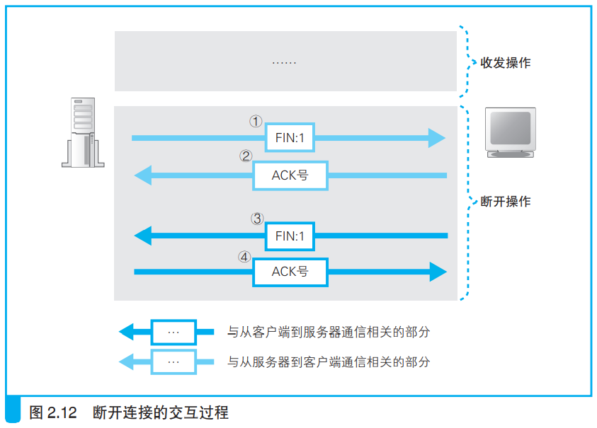
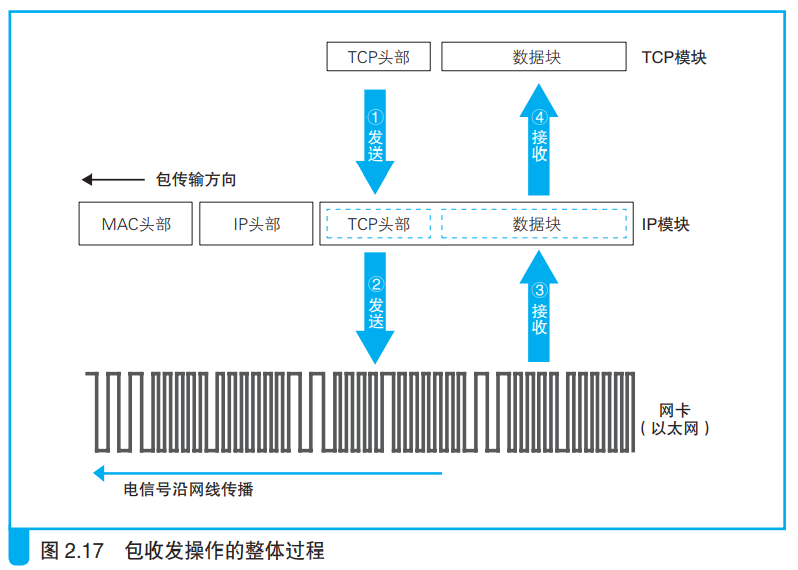

---
# 这是页面的图标
icon: page

# 这是文章的标题
title: 第二章、用电信号传输 TCP/IP 数据

# 设置作者
author: lllllan

# 设置写作时间
# time: 2020-01-20

# 一个页面只能有一个分类
category: 计算机基础

# 一个页面可以有多个标签
tag:
- 计算机网络
- 网络是怎样连接的

# 此页面会在文章列表置顶
# sticky: true

# 此页面会出现在首页的文章板块中
star: true

# 你可以自定义页脚
# footer: 
---

::: warning

本文作为 《网络是怎样连接的》 的笔记，绝大部分内容均抄自该书。

:::

## 零、前情提要

1. 创建套接字。
2. 连接服务器。
3. 收发数据。
4. 断开连接并删除套接字。
5. IP与以太网的包收发操作。
6. 用UDP协议收发数据的操作。

## 一、创建套接字

### 1.1 协议栈的内部结构

> 浏览器、邮件等**一般应用程序收发数据时用TCP**；
>
> **DNS查询等收发较短的控制数据时用UDP**。

> **ICMP用于告知网络包传送过程中产生的错误以及各种控制消息**；
>
> **ARP用于根据IP地址查询相应的以太网MAC地址**。

### 1.2 套接字的实体就是通信控制信息

> 协议栈是根据套接字中记录的控制信息来工作的。

### 1.3 调用 socket 时的操作

> 创建套接字时，首先分配一个套接字所需的内存空间，让后向其中写入初始状态。

## 二、连接服务器

### 2.1 连接

> 连接实际上是通信双方交换控制信息，在套接字中记录一些必要信息并准备数据收发的一连串操作。

- 把服务器的IP地址和端口号等信息告知协议栈
- 客户端向服务器传达开始通信的请求
- 开辟一个空间作为缓冲区

### 2.2 负责保存控制信息的头部

通信操作中使用的控制信息分为两类：

- 头部中记录的信息
- 套接字中记录的信息

### 2.3 连接操作的实际过程

- 在TCP模块处创建表示连接控制信息的头部
- 通过TCP头部中的发送方和接收方端口号可以找到要连接的套接字
  - TCP模块将信息发送给IP模块并委托它进行发送
  - IP模块执行网络包发送到达服务器
  - 服务器上的IP模块将接收的信息传递给TCP模块
  - 服务器上的TCP模块根据TCP头部中的信息找到端口号对应的套接字
  - 在套接字中写入相应信息，修改状态为正在连接，并向客户端返回响应
- 客户端接收到服务器的套接字信息，向服务器再次发回消息表示接收成功

## 三、收发数据

### 3.1 将 HTTP 请求交给协议栈

协议栈接收到数据后，先将数据存到内部的发送缓冲区。根据以下两个维度的判断，再将HTTP请求发送出去：

- 当从应用程序收到的数据长度超过或接近MSS时再发送出去，可以避免发送大量小包的问题。
  - **MTU**：一个网络包的最大长度，一般是1500字节
  - **MSS**：除去头部之后，一个网络包所能容纳的TCP数据的最大长度
- 协议栈内部有一个计时器，当经过一定时间以后，就会把网络包发送出去。

> 应用程序在发送数据时可以指定一些选项，比如指定“不等待填满缓冲区直接发送“，协议栈就会按照要求直接发送。

### 3.2 对较大数据进行拆分

当一个HTTP请求的长度，超过了网络包的最大长度，就需要对该请求进行拆分。

### 3.3 使用ACK号确认网络包收到

- 发送方：从第xxx字节开始，共有xxx字节
- 接收方：收到到第xxx字节之前的全部数据

> 在得到对方的确认之前，发送过的包会保存在发送缓存区。如果对方一直没有返回某些包的ACK号，就会重新发送这些包。

### 3.4 根据网络包平均往返时间调整ACK号等待时间

TCP会在发送数据的过程中持续测量ACK号的返回时间，如果ACK号返回变慢，则相应延长等待时间；如果ACK号马上就能返回，则相应缩短等待时间。

### 3.5 使用窗口有效管理ACK号

> 滑动窗口：在发送一个包之后，不等待ACK号返回，直接发送后续的一系列包。
>
> 接收方需要告诉发送方自己最多能接收多少数据，然后发送方根据这个值对数据发送操作进行控制，这就是滑动窗口的基本思路。

如果不等待ACK号返回一直自顾自地持续发送，就可能出现发送包的频率超过接收方的处理能力的情况。

接收方收到包之后会保存在接收缓冲区中，计算ACK号并返回给发送方，还要将数据传递给应用程序。如果这些操作还未完成，就有新的数据包到达，都会暂存早接收缓冲区中。但是当接收缓冲区中已经存满，再发送数据包也不可能存的下，这时候发送方的发送频率就超出了接收方的处理能力。

因此接收方会实现告知发送方自己的处理能力（接收缓冲区的大小），发送方会根据已发送的数据包、接收方的缓冲区计算，判断是否还可以继续发送数据。

### 3.6 ACK与窗口的合并

**问题描述：**

当接收方接收到一个数据包，计算好ACK号返回给发送方。假设接收方的接收缓冲区中就只够保存一个数据包，返回了ACK号并不代表他可以继续接收新的数据包。因为还需要将这个数据传递给应用程序，到这个时候才可以从缓冲区将数据包删除，腾出空间来接收新的数据包。

从这个角度出发，接收方收到一个数据包，分别要返回一个ACK号和更新窗口的信息。如果是这样的话，要返回的包就太多了，会导致网络效率的下降。

**解决：**

接收方计算好ACK号时、窗口更新时，不会马上把包发送出去。

而是等ACK号和窗口更新，或者多个ACK号一起合并发送，以此来减少包的数量。

### 3.7 接收HTTP响应消息

## 四、从服务器断开并删除套接字

### 4.1 断开连接

> - 协议栈在设计上允许**任何一方**（客户端/服务器端）先发起断开过程
> - 无论哪种，完成数据发送的一方都会发起断开过程。（无非谁先谁后而已）

eg：

- 服务器端先断开连接：
  - 调用 Socket 库中的 close
  - 生成一个包含断开信息的 TCP 头部，控制位中 **FIN** 比特位为1
  - 协议栈委托 IP 模块向客户端发送数据
  - 套接字中记录断开操作的信息
- 客户端接收断开信息：
  - 收到服务器发来的 **FIN** 为1的 TCP 头部
  - 协议栈将套接字标记为断开操作状态
  - 向服务器返回一个 **ACK** 号
- 客户端断开连接：
  - 执行和服务器相同的操作
  - 服务器也向客户端返回一个 **ACK** 号

### 4.2 删除套接字

> 通信结束以后，会等待一段时间再删除套接字

**原因：**

 		如果服务器向客户端发送 **FIN**，而客户端向服务器返回的 **ACK** 号丢失了，那么服务器可能会重新发送一次 **FIN**。但是服务器没有等待，直接删除了这个套接字。

​		之后新的任务到达，有一个新的套接字分配得到了这个端口号。而客户端因为服务器重新发送的 **FIN**，返回的 **ACK** 号达到了。这时候服务器就会断开这个刚刚创建的新的套接字。

### 4.3 数据收发小结

## 五、IP 与以太网的包的收发操作

### 5.1 包的基本知识

数据收发过程中的双方，在不同时刻可能互为接收方和发送方，因此统称为 **终端节点**

数据包会经过一个个的网络转发设备，最后到达接收方。

- 发送方将接收方的 IP 地址写入 IP头部
- IP 协议根据这一 IP地址查找包的传输方向，从而确定下一个路由器的位置
- **IP协议查出下一个路由器的以太网地址（MAC地址）**，并将地址写入MAC头部
- IP协议委托以太网协议将包传输

> - 路由器根据目标地址判断下一个路由器的位置 —— IP协议
> - 集线器在子网中将网络包传输到下一个路由 —— 以太网协议

### 5.2 包收发操作概览

1. TCP模块委托IP模块发送包：
   - TCP模块在数据块前面加上TCP头部
   - **指定通信对象的IP地址**
   - 整个传递给IP模块
2. IP模块封装数据包：
   - **IP模块会添加IP头部和MAC头部**
   - 转交给网络硬件
3. 网络包在网卡间传递
4. 接收方接收网络包：
   - 网卡将包转化为数字信息传递给IP模块
   - IP模块解除IP头部和MAC头部，将TCP头部和数据块传递给TCP模块
   - TCP模块处理数据

> **IP模块的职责就是将委托的东西打包送到对方手里。不关心TCP头部和数据内容，也不关心TCP的操作。**

### 5.3 IP头部

### 5.4 MAC头部

IP模块根据路由表 Gateway 栏的内容判断应该把包发送给谁。

再根据IP地址查询MAC地址

### 5.5 ARP查询目标路由器的MAC地址

- ARP利用广播对所有设备问 `XX这个IP地址是谁的，请把你的MAC地址告诉我`，然后等待目标路由器将MAC地址返回

- ARP缓存

- MAC地址

- ARP缓存过几分钟就会将原记录删除，以防因为IP地址的改变而导致通信异常

### 5.6 以太网基本知识

### 5.7 发送光电信号

> 网卡的ROM中保存着全世界唯一的MAC地址，这是在生产网卡时写入的
>
> 网卡中保存的MAC地址会由网卡驱动程序读取并分配给MAC模块

### 5.8 给网络包添加控制数据

> MAC模块将网络包从缓存中取出，并在开头加上 **报头** 和 **起始帧分节符**，在末尾加上 **帧校验序列(FCS)**

- 用电信号来表达数字信息，让0和1分别对应特定的电压和电流
  - **数据信号如果出现连续的1或0，由于电流和电压没有变化，我们没办法判断其中每个比特从哪里切分**
- 再发送一组用来区分比特间隔的时钟信号
  - **当距离较远、网线较长时，两条线路的长度可能会发生差异，数据信号和时钟信号的传输会产生时间差，时钟就会偏移**
- 将数据信号和时钟信号叠加在一起
  - **由于时钟信号是按固定频率变化的，只要找到这个变化的周期就能从中提取出时钟信号，进而计算出数据信号**

### 5.9 向集线器发送网络包

> 发送信号的两种操作：使用集线器的**半双工模式**、使用交换机的**全双工模式**

​	半双工模式中，需要先判断网线中是否存在其他设备发送的信号。如果有，需要等待信号传输完毕才能发送，否则两组信号会发生碰撞。

1. **MAC 模块将数字信号按每个比特转换成电信号**

2. **PHY（MAU）模块将该信号进行格式转换**并通过网线发送出去、监控接受线路中有无信号进来

>  协议栈的TCP会负责搞定可能发生的错误，因此发送信号是没有必要检查错误

### 5.10 接受返回包

**接受步骤：**

1. 把通过接受线路的所有信号都接收进来
2. PHY（MAU）模块将信号转换成通用格式并发送给 MAC 模块
3. MAC 模块从头开始将信号转换成数字信息，并存放到缓冲区
4. 检查 FCS 和 MAC 地址，将数据受污染和地址不一致的包直接丢弃
5. 网卡通过 **中断机制** 通知计算机收到一个包
   1. 网卡向扩展总线中的中断信号发送信号
   2. 该信号通过中断控制器连接到CPU
   3. CPU暂时挂起正在处理的任务，切换到中断处理程序
   4. 中断处理程序调用网卡驱动
   5. 网卡执行接收操作
6. 网卡根据包中不同协议类型，将包发送给不同的栈

### 5.11 将服务器的响应包从IP传递给TCP

**IP模块的任务：**

1. 检查IP头部，确认格式是否正确
2. 查看接收方IP地址，如果有误通过ICMP消息告知对方
3. 分片重组：如果原始的包被分成了多个小包，需要将他们还原成原始的包

**TCP模块的任务：**

1. 找到对应套接字，根据通信记录执行操作：
   - 如果包的内容是应用程序数据，则返回确认接收的包，并将数据放入缓冲区，等待应用程序来读取
   - 如果是建立或断开连接的控制包，则返回相应的响应控制包，并告知应用程序建立或断开连接的操作状态

## 六、UDP 协议的收发操作

### 6.1 不需要重发的数据用 UDP 更高效

> TCP为了实现可靠性和高效传输，需要将数据分片发送，并将对方未接收的数据包重新发送。

### 6.2 控制用的短数据

像DNS查询等交换控制信息的操作基本上都可以在一个包的大小范围内解决，这种场景既可以用UDP来代替TCP

> UDP只负责发送包，不管任何可能出现的错误

### 6.3 音频和视频数据

音频和视频数据必须在规定时间内送达，（一旦错过播放时间，重发数据也没用）因此无需重发数据。这种情况下使用UDP发送数据的效率更高

## 七、本章回顾

- 表示网络包收件人的接收方IP地址是位于IP头部还是TCP头部？

> **IP头部。**接收方IP地址最初从应用程序获得， 经由TCP模块告知IP模块

- 端口号所用来指定服务器程序的种类，那么他位于TCP头部还是IP头部？

> **TCP头部。**连接操作的第一步是在TCP模块处创建表示连接控制信息的头部。通过TCP头部中的发送方和接收方端口号可以找到要连接的套接字。

- 会对包是否正确送达进行确认的是TCP还是IP呢？

> TCP

- 根据IP地址查询MAC地址的机制叫什么？

> ARP
>
> 在以太网中，有一种叫作广播的方法，可以把包发给连接在同一以太网中的所有设备。ARP就是利用广播对所有设备提问：“××这个IP地址是谁的？请把你的MAC地址告诉我。”然后就会有人回答：“这个IP地址是我的，我的MAC地址是××××。”

- 在收到ACK号之前继续发送下一个包的方式叫什么？

> 滑动窗口方式

