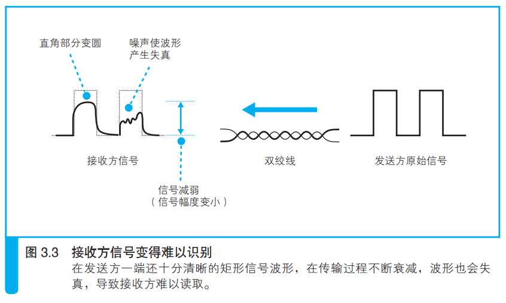
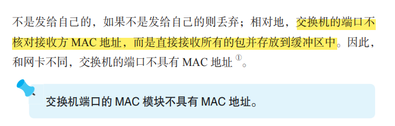
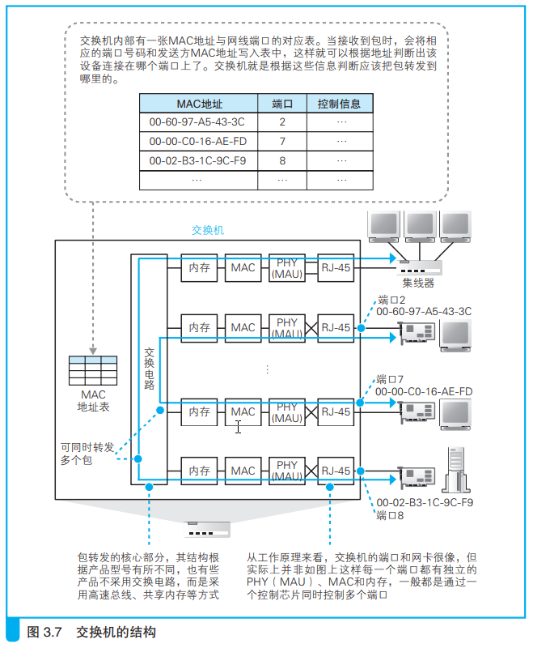
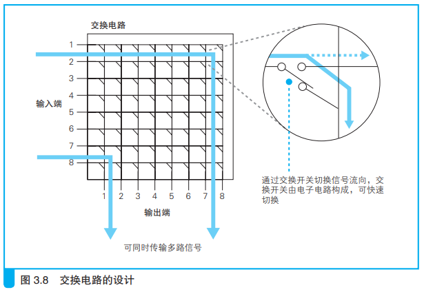
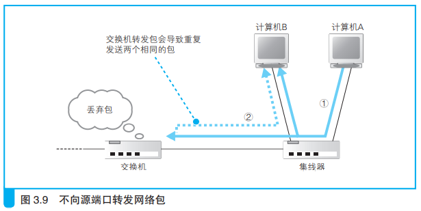

---
# 这是页面的图标
icon: page

# 这是文章的标题
title: 第三章、从网线到网络设备

# 设置作者
author: lllllan

# 设置写作时间
# time: 2020-01-20

# 一个页面只能有一个分类
category: 计算机基础

# 一个页面可以有多个标签
tag:
- 计算机网络
- 网络是怎样连接的

# 此页面会在文章列表置顶
# sticky: true

# 此页面会出现在首页的文章板块中
star: true

# 你可以自定义页脚
# footer: 
---

::: warning

本文作为 《网络是怎样连接的》 的笔记，绝大部分内容均抄自该书。

:::

## 一、信号在网线和集线器中传输

### 1.1 每个包都是独立传输的

### 1.2 网线中的信号衰减

以太网信号的本质是正负变化的电压。

信号在网线的传输过程中，能量会逐渐损失。网线越长，信号衰减就越严重。

同时噪声也会进一步加剧信号的失真。

### 1.3 双绞线抑制噪声

> 产生噪声的原因是网线周围的电磁波，当电磁波接触到金属等导体时，在其中就会产生电流。信号和噪声的电流混杂在一起之后，导致信号的波形发生失真。

影响网线的电磁波分为两种：

#### 来自网线之外的其他设备：

当电磁波接触到信号线时，会沿电磁波传播的右旋方向产生电流。

如果我们将信号线缠绕在一起，信号线就变成了螺旋形，其中两根信号线产生的噪声电流方向就会相反，从而使得噪声电流相互抵消。

#### 相邻信号线泄露出来：

这种内部产生的噪声称为 **串扰**

### 1.4 集线器将信号发往所有线路

> 集线器将信号发送给所有连接在它上面的线路。

###### 

## 二、交换机的包转发操作

### 2.1 交换机根据地址表进行转发

1. 信号到达网线接口，由 `PHY(MAU)` 模块进行接收
2.  `PHY(MAU)` 模块将网线中的信号转换为通用格式，并传递给 `MAC` 模块
3.  `MAC` 模块将信号转换为数字信息，并进行 `FCS` 校验错误，没有问题的放到缓冲区中
4. 查询 `MAC` 地址表，找到对应端口并通过交换电路将包发送到该端口

信号线排列成网格状，每一个交叉点都有一个交换开关，交换开关是电子控制的，通过切换开关的状态就可以改变信号的流向。

当网络包通过交换电路到达发送端口时，端口中的 `MAC` 模块和 `PHY(MAU)` 模块会执行发送操作，将信号发送到网线中。

1. 首先确认没有其他设备再发送信号，即确认信号收发模块中的接收线路没有信号进来
    1. 如果监测到其他设备正在发送信号，则需要等待信号发送完毕
    2. 如果没有其他信号，或者其他信号已经发送完毕，这是就可以将包的数字信息转换为电信号发送出去
2. 发送过程中还需要对接收信号进行监控
    1. 如果发送过程中检测到其他设备发送信号，就意味着出现了信号碰撞，这是需要发送阻塞信号以停止网络中所有的发送操作，等待一段时间后再尝试重新发送

### 2.2 MAC地址表的维护

1. 收到包时，将发送方的 MAC 地址以及其输入端口的号码写入 MAC 地址表中
2. 删除地址表中某条记录，防止设备移动时产生问题

eg：开会时把笔记本电脑从办公室拿到会议室，这是设备就发生了移动。只要笔记本电脑连接到会议室的交换机，这台交换就会根据笔记本电脑发出的包来更新它的地址表。而对于目的地的交换机来说，不需要什么特别的措施就能正常工作。

### 2.3 特殊操作

发现某个包的目标端口和源端口相同，即某台计算机给自己发送了一个包：

- 计算机A发送的包到达集线器后会被集线器转发到所有端口上，因此交换机和计算机B都会收到
- 交换机接收到之后查看地址表，将该包原路返回集线器
- 集线器接收到之后再次转发给所有端口，因此计算机AB都会收到

这种情况下计算机B就会收到两个相同的包，会导致无法正常通信。

**因此当交换机发现一个包要发回到源端口时，就会直接丢弃这个包。**

如果交换机的地址表中找不到指定的 MAC 地址，有可能是因为具有该地址的设备还没有向交换机发送过包、或者这个设备一段时间内没有工作导致地址被从地址表中删除。

这种情况下交换机只能将包转发到除了源端口以外的所有端口，这样做不会出现什么问题，因为只有相应的接收者才接受包，其他设备会忽略这个包。

::: info 发送多余的包会不会造成网络拥塞？

发送了包之后设备会作出响应，只要返回了响应包，交换机就可以将它写入地址表，下次就不需要转发给所有端口了。局域网中每秒可以传输上千个包，多出一两个并无大碍

:::

::: tip 如果接收方 MAC地址是一个广播地址，那么交换机会将包转发给除源端口以外的所有端口

:::
