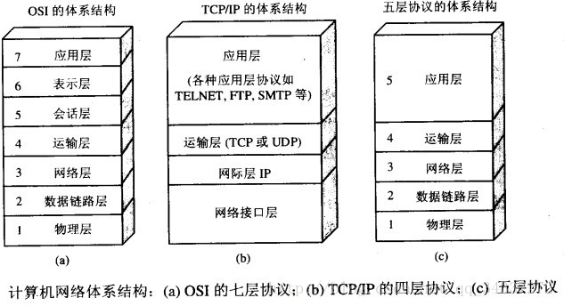

---
# 这是页面的图标
icon: page

# 这是文章的标题
title: 计算机网络-常见面试题

# 设置作者
author: lllllan

# 设置写作时间
# time: 2020-01-20

# 一个页面只能有一个分类
category: 计算机基础

# 一个页面可以有多个标签
tag:
- 计算机网络
- 面试题

# 此页面会在文章列表置顶
# sticky: true

# 此页面会出现在首页的文章板块中
star: true

# 你可以自定义页脚
# footer: 
---

::: warning

本文转载自以下文章，略有改动。

- [计算机网络常见面试题 | JavaGuide](https://javaguide.cn/cs-basics/network/计算机网络常见面试题/)
- [被问懵逼了：TCP 握手没成功怎么办？](https://blog.csdn.net/qq_34827674/article/details/119809480)

:::

## 一、OSI 与 TCP/ IP 各层的结构与功能，都有哪些协议？

> **开放式系统互联通信参考模型**（英语：Open System Interconnection Reference Model，缩写为 OSI），简称为**OSI模型**（OSI model），一种[概念模型](https://baike.baidu.com/item/概念模型/3187025)，由[国际标准化组织](https://baike.baidu.com/item/国际标准化组织/779832)提出，一个试图使各种计算机在世界范围内互连为网络的标准框架。
>
> TCP/IP是一组用于实现网络互连的[通信协议](https://baike.baidu.com/item/通信协议)。Internet[网络体系结构](https://baike.baidu.com/item/网络体系结构)以TCP/IP为核心。基于TCP/IP的参考模型将协议分成四个层次，它们分别是：网络访问层、网际互联层（[主机](https://baike.baidu.com/item/主机)到主机）、[传输层](https://baike.baidu.com/item/传输层)、和应用层。

### 1.1 应用层 - 进程之间

**应用层(application-layer）的任务是通过应用进程间的交互来完成特定网络应用**。应用层协议定义的是应用进程（进程：主机中正在运行的程序）间的通信和交互的规则。对于不同的网络应用需要不同的应用层协议。在互联网中应用层协议很多，如**域名系统 DNS**，支持万维网应用的 **HTTP 协议**，支持电子邮件的 **SMTP 协议**等等。我们把 应用层交互的数据单元称为**报文** 。

### 1.2 运输层 - 主机之间

**运输层(transport layer)的主要任务就是负责向两台主机进程之间的通信提供通用的数据传输服务**。应用进程利用该服务传送应用层报文。“通用的”是指并不针对某一个特定的网络应用，而是多种应用可以使用同一个运输层服务。由于一台主机可同时运行多个线程，因此运输层有复用和分用的功能。所谓复用就是指多个应用层进程可同时使用下面运输层的服务，分用和复用相反，是运输层把收到的信息分别交付上面应用层中的相应进程。

#### 运输层使用协议

1. **传输控制协议 TCP**（Transmission Control Protocol）--提供**面向连接**的，**可靠的**数据传输服务。
2. **用户数据协议 UDP**（User Datagram Protocol）--提供**无连接**的，尽最大努力的数据传输服务（**不保证数据传输的可靠性**）。

### 1.3 网络层

**在计算机网络中进行通信的两个计算机之间可能会经过很多个数据链路，也可能还要经过很多通信子网。网络层的任务就是选择合适的网间路由和交换结点， 确保数据及时传送。** 在发送数据时，网络层把运输层产生的报文段或用户数据报封装成分组和包进行传送。在 TCP/IP 体系结构中，由于网络层使用 **IP 协议**，因此分组也叫 **IP 数据报** ，简称 **数据报**。

互联网是由大量的异构（heterogeneous）网络通过路由器（router）相互连接起来的。互联网使用的网络层协议是无连接的网际协议（Internet Protocol）和许多路由选择协议，因此互联网的网络层也叫做**网际层**或**IP 层**。

### 1.4 数据链路层

**数据链路层(data link layer)通常简称为链路层。两台主机之间的数据传输，总是在一段一段的链路上传送的，这就需要使用专门的链路层的协议。** 在两个相邻节点之间传送数据时，**数据链路层将网络层交下来的 IP 数据报组装成帧**，在两个相邻节点间的链路上传送帧。每一帧包括数据和必要的控制信息（如同步信息，地址信息，差错控制等）。

==数据链路层不仅要查错，还要纠错==

### 1.5 物理层

**物理层(physical layer)的作用是实现相邻计算机节点之间比特流的透明传送，尽可能屏蔽掉具体传输介质和物理设备的差异，** 使其上面的数据链路层不必考虑网络的具体传输介质是什么。“透明传送比特流”表示经实际电路传送后的比特流没有发生变化，对传送的比特流来说，这个电路好像是看不见的。

### 总结（协议记不住）

## 二、TCP 三次握手

所谓三次握手(Three-way Handshake)，是指建立一个TCP连接时，需要客户端和服务器总共发送3个包。

### 2.0 TCP 三次握手漫画图解

- 客户端 → 发送带有 SYN 标志的数据包 → 服务端
- 服务端 → 发送带有 SYN/ACK 标志的数据包 → 客户端
- 客户端 → 发送带有带有 ACK 标志的数据包 → 服务端

### 2.1 三次握手流程

> **最开始的时候客户端和服务器都是处于CLOSED状态。主动打开连接的为客户端，被动打开连接的是服务器。**

1. **服务器进入监听状态 - LISTEN**：TCP服务器进程先创建传输控制块TCB，时刻准备接受客户进程的连接请求，此时服务器就进入了LISTEN（监听）状态；
2. **客户发送连接请求 - SYN-SENT**：TCP客户进程也是先创建传输控制块TCB，然后向服务器发出连接请求报文，这是报文首部中的同部位 `SYN = 1`，同时选择一个初始序列号 `seq = x` ，此时，TCP客户端进程进入了 `SYN-SENT`（同步已发送状态）状态。TCP规定，SYN报文段（SYN=1的报文段）不能携带数据，但需要消耗掉一个序号。
3. **服务器返回确认报文 - SYN-RCVD**：TCP服务器收到请求报文后，如果同意连接，则发出确认报文。确认报文中应该 `ACK = 1，SYN = 1`，确认号是 `ack = x+1`，同时也要为自己初始化一个序列号 `seq = y`，此时，TCP服务器进程进入了SYN-RCVD（同步收到）状态。这个报文也不能携带数据，但是同样要消耗一个序号。
4. **客户再次发送确认 - ESTABLSHED**：TCP客户进程收到确认后，还要向服务器给出确认。确认报文的`ACK = 1，ack = y + 1`，自己的序列号 `seq = x + 1`，此时，TCP连接建立，客户端进入ESTABLISHED（已建立连接）状态。TCP规定，ACK报文段可以携带数据，但是如果不携带数据则不消耗序号。
5. **开始通信 - ESTABLISHED**：当服务器收到客户端的确认后也进入ESTABLISHED状态，此后双方就可以开始通信了。

::: center

|                            客户端                            |                            服务器                            |
| :----------------------------------------------------------: | :----------------------------------------------------------: |
|                                                              |         创建传输控制块TCB 进入监听状态 - LISTEN          |
| 创建传输控制块TCB 发送请求报文，`SYN=1, seq=x` 进入同步已经发送状态 - SYN-SENT |                                                              |
|                                                              | 发送确认报文，`ACK=1, SYN=1, ack=x+1, seq=y` 进入同步收到状态 - SYN-RCVD |
| 发送确认把稳，`ACK=1, ack=y+1, seq=x+1` 进入已建立连接状态 - ESTABLISHED |                                                              |
|                                                              |               进入已建立连接状态 - ESTABLISHED               |

:::

### 2.2 为什么要三次握手 ⭐

**三次握手的目的是建立可靠的通信信道，就是双方确认自己与对方的发送与接收是正常的。**

1. 第一次握手：Client 什么都不能确认；Server 确认了对方发送正常，自己接收正常
2. 第二次握手：Client 确认了：自己发送、接收正常，对方发送、接收正常；Server 确认了：对方发送正常，自己接收正常
3. 第三次握手：Client 确认了：自己发送、接收正常，对方发送、接收正常；Server 确认了：自己发送、接收正常，对方发送、接收正常

### 2.3 第二次握手传回了ACK，为什么还要传SYN？

> 发送ACK是对客户端请求的确认。
>
> 回传SYN是服务器对客户端的连接请求。

**SYN 同步序列编号(**Synchronize Sequence Numbers) 是 TCP/IP 建立连接时使用的握手信号。在客户机和服务器之间建立正常的 TCP 网络连接时，客户机首先发出一个 SYN 消息，服务器使用 SYN-ACK 应答表示接收到了这个消息，最后客户机再以 ACK(Acknowledgement）消息响应。这样在客户机和服务器之间才能建立起可靠的 TCP 连接，数据才可以在客户机和服务器之间传递

### 2.4 为什么还需要第三次握手？⭐

**主要防止已经失效的连接请求报文突然又传送到了服务器，从而产生错误。**

如果使用的是两次握手建立连接，假设有这样一种场景，客户端发送了第一个请求连接并且没有丢失，只是因为在网络结点中滞留的时间太长了，由于TCP的客户端迟迟没有收到确认报文，以为服务器没有收到，此时重新向服务器发送这条报文，此后客户端和服务器经过两次握手完成连接，传输数据，然后关闭连接。此时此前滞留的那一次请求连接，网络通畅了到达了服务器，这个报文本该是失效的，但是，两次握手的机制将会让客户端和服务器再次建立连接，这将导致不必要的错误和资源的浪费。

如果采用的是三次握手，就算是那一次失效的报文传送过来了，服务端接受到了那条失效报文并且回复了确认报文，但是客户端不会再次发出确认。由于服务器收不到确认，就知道客户端并没有请求连接。

### 2.5 TCP 三次握手期间的异常

#### 2.5.1 第一次握手丢失

当客户端想和服务端建立 TCP 连接的时候，首先第一个发的就是 SYN 报文，然后进入到 `SYN-SENT` 状态。

如果这份报文丢失了，服务端就接收不到，自然就不会向客户端返回确认报文；而客户端迟迟都接收不到确认报文，就会触发超时重传机制。

不同版本的操作系统可能超时时间不同，这个超时时间是写死在内核里的。当客户端在 1 秒后没收到服务端的 SYN-ACK 报文后，客户端就会重发 SYN 报文。

在 Linux 里，客户端的 SYN 报文最大重传次数由 `tcp_syn_retries` 内核参数控制，这个参数是可以自定义的，默认值一般是 5。

通常，第一次超时重传是在 1 秒后，第二次超时重传是在 2 秒，第三次超时重传是在 4 秒后，第四次超时重传是在 8 秒后，第五次是在超时重传 16 秒后。没错，每次超时的时间是上一次的 2 倍。

当第五次超时重传后，会继续等待 32 秒，如果服务端仍然没有回应 ACK，客户端就不再发送 SYN 包，然后断开 TCP 连接。

所以，总耗时是 1+2+4+8+16+32=63 秒，大约 1 分钟左右。

#### 2.5.2 第二次握手丢失

当服务端收到客户端的第一次握手后，就会回 `SYN-ACK` 报文给客户端，这个就是第二次握手，此时服务端会进入 `SYN-RCVD` 状态。

第二次握手的 SYN-ACK 报文其实有两个目的 ：

- ACK， 是对第一次握手的确认报文
- SYN，是服务端发起建立 TCP 连接的报文

因为第二次握手报文里是包含对客户端的第一次握手的 ACK 确认报文，所以，如果客户端迟迟没有收到第二次握手，那么客户端就觉得可能自己的 SYN 报文（第一次握手）丢失了，于是**客户端就会触发超时重传机制，重传 SYN 报文**。

因为第二次握手中包含服务端的 SYN 报文，所以当客户端收到后，需要给服务端发送 ACK 确认报文（第三次握手），服务端才会认为该 SYN 报文被客户端收到了。那么，如果第二次握手丢失了，服务端就收不到第三次握手，于是**服务端这边会触发超时重传机制，重传 SYN-ACK 报文**。

因此，当第二次握手丢失了，客户端和服务端都会重传：

- 客户端会重传 `SYN` 报文，也就是第一次握手，最大重传次数由 `tcp_syn_retries` 内核参数决定。；
- 服务端会重传 `SYN-ACK` 报文，也就是第二次握手，最大重传次数由 `tcp_synack_retries` 内核参数决定。

#### 2.5.3 第三次握手丢失

客户端收到服务端的 SYN-ACK 报文后，就会给服务端回一个 ACK 报文，也就是第三次握手，此时客户端状态进入到 ESTABLISH 状态。

因为这个第三次握手的 ACK 是对第二次握手的 SYN 的确认报文，所以当第三次握手丢失了，如果服务端那一方迟迟收不到这个确认报文，就会触发超时重传机制，重传 SYN-ACK 报文，直到收到第三次握手，或者达到最大重传次数。

注意，ACK 报文是不会有重传的，当 ACK 丢失了，就由对方重传对应的报文。

## 三、TCP四次挥手

### 3.0 为什么要四次挥手

断开一个 TCP 连接则需要“四次挥手”：

- 客户端-发送一个 FIN，用来关闭客户端到服务器的数据传送
- 服务器-收到这个 FIN，它发回一 个 ACK，确认序号为收到的序号加 1 。和 SYN 一样，一个 FIN 将占用一个序号
- 服务器-关闭与客户端的连接，发送一个 FIN 给客户端
- 客户端-发回 ACK 报文确认，并将确认序号设置为收到序号加 1

任何一方都可以在数据传送结束后发出连接释放的通知，待对方确认后进入半关闭状态。当另一方也没有数据再发送的时候，则发出连接释放通知，对方确认后就完全关闭了 TCP 连接。

举个例子：A 和 B 打电话，通话即将结束后，A 说“我没啥要说的了”，B 回答“我知道了”，但是 B 可能还会有要说的话，A 不能要求 B 跟着自己的节奏结束通话，于是 B 可能又巴拉巴拉说了一通，最后 B 说“我说完了”，A 回答“知道了”，这样通话才算结束。

### 3.1 四次挥手流程

> 数据传输完毕后，双方都可释放连接。最开始的时候，客户端和服务器都是处于ESTABLISHED状态，**然后客户端主动关闭，服务器被动关闭**。

1. 客户端进程发出连接释放报文，并且停止发送数据。释放数据报文首部，`FIN = 1`，其序列号为 `seq = u`（等于前面已经传送过来的数据的最后一个字节的序号加1），此时，客户端进入 `FIN-WAIT-1`（终止等待1）状态。 TCP规定，FIN报文段即使不携带数据，也要消耗一个序号。
2. 服务器收到连接释放报文，发出确认报文，`ACK = 1，ack = u + 1`，并且带上自己的序列号 `seq = v`，此时，服务端就进入了 `CLOSE-WAIT`（关闭等待）状态。TCP服务器通知高层的应用进程，客户端向服务器的方向就释放了，这时候处于半关闭状态，即客户端已经没有数据要发送了，但是服务器若发送数据，客户端依然要接受。这个状态还要持续一段时间，也就是整个CLOSE-WAIT状态持续的时间。
3. 客户端收到服务器的确认请求后，此时，客户端就进入 `FIN-WAIT-2`（终止等待2）状态，等待服务器发送连接释放报文（在这之前还需要接受服务器发送的最后的数据）。
4. 服务器将最后的数据发送完毕后，就向客户端发送连接释放报文，`FIN = 1，ack = u+ 1`，由于在半关闭状态，服务器很可能又发送了一些数据，假定此时的序列号为 `seq = w`，此时，服务器就进入了 `LAST-ACK`（最后确认）状态，等待客户端的确认。
5. 客户端收到服务器的连接释放报文后，必须发出确认，`ACK = 1，ack = w + 1`，而自己的序列号是`seq = u + 1`，此时，客户端就进入了TIME-WAIT（时间等待）状态。**注意此时TCP连接还没有释放，必须经过2∗MSL（最长报文段寿命）的时间后，当客户端撤销相应的TCB后，才进入CLOSED状态**。
6. 服务器只要收到了客户端发出的确认，立即进入 `CLOSED` 状态。同样，撤销TCB后，就结束了这次的TCP连接。可以看到，服务器结束TCP连接的时间要比客户端早一些。

### 3.2 为什么客户端最后还要等待2MSL？⭐

MSL（Maximum Segment Lifetime）（最长报文段寿命），TCP允许不同的实现可以设置不同的MSL值。

第一，保证客户端发送的最后一个ACK报文能够到达服务器，因为这个ACK报文可能丢失，站在服务器的角度看来，我已经发送了 `FIN + ACK` 报文请求断开了，客户端还没有给我回应，应该是我发送的请求断开报文它没有收到，于是服务器又会重新发送一次，而客户端就能在这个2MSL时间段内收到这个重传的报文，接着给出回应报文，并且会重启2MSL计时器。

第二，防止类似与“三次握手”中提到了的“已经失效的连接请求报文段”出现在本连接中。客户端发送完最后一个确认报文后，在这个2MSL时间中，就可以使本连接持续的时间内所产生的所有报文段都从网络中消失。这样新的连接中不会出现旧连接的请求报文。

### 3.3 为什么建立连接是三次握手，关闭连接确是四次挥手呢？

客户端和服务端未必能同时结束通信，存在一方发送完全部数据、而另一方还有数据要继续发送的情况。所以双方都必须分别发送连接释放报文和ACK

### 3.4 如果已经建立了连接，但是客户端突然出现故障了怎么办？

TCP还设有一个保活计时器，显然，客户端如果出现故障，服务器不能一直等下去，白白浪费资源。服务器每收到一次客户端的请求后都会重新复位这个计时器，时间通常是设置为2小时，若两小时还没有收到客户端的任何数据，服务器就会发送一个探测报文段，以后每隔75秒发送一次。若一连发送10个探测报文仍然没反应，服务器就认为客户端出了故障，接着就关闭连接。

## 四、TCP、UDP协议的区别

UDP 在传送数据之前不需要先建立连接，远地主机在收到 UDP 报文后，不需要给出任何确认。虽然 UDP 不提供可靠交付，但在某些情况下 UDP 却是一种最有效的工作方式（一般用于即时通信），比如： QQ 语音、 QQ 视频 、直播等等

TCP 提供面向连接的服务。在传送数据之前必须先建立连接，数据传送结束后要释放连接。 TCP 不提供广播或多播服务。由于 TCP 要提供可靠的，面向连接的传输服务（TCP 的可靠体现在 TCP 在传递数据之前，会有三次握手来建立连接，而且在数据传递时，有确认、窗口、重传、拥塞控制机制，在数据传完后，还会断开连接用来节约系统资源），这一难以避免增加了许多开销，如确认，流量控制，计时器以及连接管理等。这不仅使协议数据单元的首部增大很多，还要占用许多处理机资源。TCP 一般用于文件传输、发送和接收邮件、远程登录等场景。

## 五、TCP协议如何保证可靠传输

1. 应用数据被分割成 TCP 认为最适合发送的数据块。
2. TCP 给发送的每一个包进行编号，接收方对数据包进行排序，把有序数据传送给应用层。
3. **校验和：** TCP 将保持它首部和数据的检验和。这是一个端到端的检验和，目的是检测数据在传输过程中的任何变化。如果收到段的检验和有差错，TCP 将丢弃这个报文段和不确认收到此报文段。
4. TCP 的接收端会丢弃重复的数据。
5. **流量控制：** TCP 连接的每一方都有固定大小的缓冲空间，TCP 的接收端只允许发送端发送接收端缓冲区能接纳的数据。当接收方来不及处理发送方的数据，能提示发送方降低发送的速率，防止包丢失。TCP 使用的流量控制协议是可变大小的滑动窗口协议。 （TCP 利用**滑动窗口**实现流量控制）
6. **拥塞控制：** 当网络拥塞时，减少数据的发送。
7. **ARQ 协议：** 也是为了实现可靠传输的，它的基本原理就是每发完一个分组就停止发送，等待对方确认。在收到确认后再发下一个分组。
8. **超时重传：** 当 TCP 发出一个段后，它启动一个定时器，等待目的端确认收到这个报文段。如果不能及时收到一个确认，将重发这个报文段。

### 5.1 ARQ协议

**自动重传请求**（Automatic Repeat-reQuest，ARQ）是 OSI 模型中数据链路层和传输层的错误纠正协议之一。它通过使用确认和超时这两个机制，在不可靠服务的基础上实现可靠的信息传输。如果发送方在发送后一段时间之内没有收到确认帧，它通常会重新发送。ARQ 包括<u>停止等待 ARQ 协议和连续 ARQ 协议</u>。

#### 5.1.1 停止等待 ARQ 协议

停止等待协议是为了实现可靠传输的，它的基本原理就是每发完一个分组就停止发送，等待对方确认（回复 ACK）。如果过了一段时间（超时时间后），还是没有收到 ACK 确认，说明没有发送成功，需要重新发送，直到收到确认后再发下一个分组。

在停止等待协议中，若接收方收到重复分组，就丢弃该分组，但同时还要发送确认。

::: tip 优缺点

- **优点：** 简单
- **缺点：** 信道利用率低，等待时间长

:::

1. **无差错情况:**

   发送方发送分组, 接收方在规定时间内收到, 并且回复确认. 发送方再次发送。

2. **出现差错情况（超时重传）:**

   停止等待协议中超时重传是指只要超过一段时间仍然没有收到确认，就重传前面发送过的分组（认为刚才发送过的分组丢失了）。因此每发送完一个分组需要设置一个超时计时器，其重传时间应比数据在分组传输的平均往返时间更长一些。这种自动重传方式常称为 **自动重传请求 ARQ** 。另外在停止等待协议中若收到重复分组，就丢弃该分组，但同时还要发送确认。**连续 ARQ 协议** 可提高信道利用率。发送维持一个发送窗口，凡位于发送窗口内的分组可连续发送出去，而不需要等待对方确认。接收方一般采用累积确认，对按序到达的最后一个分组发送确认，表明到这个分组位置的所有分组都已经正确收到了。 

3. **确认丢失和确认迟到**

   - **确认丢失** ：确认消息在传输过程丢失。当 A 发送 M1 消息，B 收到后，B 向 A 发送了一个 M1 确认消息，但却在传输过程中丢失。而 A 并不知道，在超时计时过后，A 重传 M1 消息，B 再次收到该消息后采取以下两点措施：1. 丢弃这个重复的 M1 消息，不向上层交付。 2. 向 A 发送确认消息。（不会认为已经发送过了，就不再发送。A 能重传，就证明 B 的确认消息丢失）。

   - **确认迟到** ：确认消息在传输过程中迟到。A 发送 M1 消息，B 收到并发送确认。在超时时间内没有收到确认消息，A 重传 M1 消息，B 仍然收到并继续发送确认消息（B 收到了 2 份 M1）。此时 A 收到了 B 第二次发送的确认消息。接着发送其他数据。过了一会，A 收到了 B 第一次发送的对 M1 的确认消息（A 也收到了 2 份确认消息）。处理如下：1. A 收到重复的确认后，直接丢弃。2. B 收到重复的 M1 后，也直接丢弃重复的 M1。

#### 5.1.2 连续 ARQ 协议

连续 ARQ 协议可提高信道利用率。发送方维持一个发送窗口，凡位于发送窗口内的分组可以连续发送出去，而不需要等待对方确认。接收方一般采用累计确认，对按序到达的最后一个分组发送确认，表明到这个分组为止的所有分组都已经正确收到了。

::: tip 优缺点

- **优点：** 信道利用率高，容易实现，即使确认丢失，也不必重传。
- **缺点：** 不能向发送方反映出接收方已经正确收到的所有分组的信息。 比如：发送方发送了 5 条 消息，中间第三条丢失（3 号），这时接收方只能对前两个发送确认。发送方无法知道后三个分组的下落，而只好把后三个全部重传一次。这也叫 Go-Back-N（回退 N），表示需要退回来重传已经发送过的 N 个消息。

:::

### 5.2 滑动窗口和流量控制

**TCP 利用滑动窗口实现流量控制。流量控制是为了控制发送方发送速率，保证接收方来得及接收。** 接收方发送的确认报文中的窗口字段可以用来控制发送方窗口大小，从而影响发送方的发送速率。将窗口字段设置为 0，则发送方不能发送数据。 

### 5.3 拥塞控制

在某段时间，若对网络中某一资源的需求超过了该资源所能提供的可用部分，网络的性能就要变坏。这种情况就叫拥塞。拥塞控制就是为了防止过多的数据注入到网络中，这样就可以使网络中的路由器或链路不致过载。拥塞控制所要做的都有一个前提，就是网络能够承受现有的网络负荷。拥塞控制是一个全局性的过程，涉及到所有的主机，所有的路由器，以及与降低网络传输性能有关的所有因素。相反，流量控制往往是点对点通信量的控制，是个端到端的问题。流量控制所要做到的就是抑制发送端发送数据的速率，以便使接收端来得及接收。

为了进行拥塞控制，TCP 发送方要维持一个 **拥塞窗口(cwnd)** 的状态变量。拥塞控制窗口的大小取决于网络的拥塞程度，并且动态变化。发送方让自己的发送窗口取为拥塞窗口和接收方的接受窗口中较小的一个。

TCP 的拥塞控制采用了四种算法，即 **慢开始** 、 **拥塞避免** 、**快重传** 和 **快恢复**。在网络层也可以使路由器采用适当的分组丢弃策略（如主动队列管理 AQM），以减少网络拥塞的发生。

- **慢开始：** 慢开始算法的思路是当主机开始发送数据时，如果立即把大量数据字节注入到网络，那么可能会引起网络阻塞，因为现在还不知道网络的符合情况。经验表明，较好的方法是先探测一下，即由小到大逐渐增大发送窗口，也就是由小到大逐渐增大拥塞窗口数值。cwnd 初始值为 1，每经过一个传播轮次，cwnd 加倍。
- **拥塞避免：** 拥塞避免算法的思路是让拥塞窗口 cwnd 缓慢增大，即每经过一个往返时间 RTT 就把发送放的 cwnd 加 1.
- **快重传与快恢复：** 在 TCP/IP 中，快速重传和恢复（fast retransmit and recovery，FRR）是一种拥塞控制算法，它能快速恢复丢失的数据包。没有 FRR，如果数据包丢失了，TCP 将会使用定时器来要求传输暂停。在暂停的这段时间内，没有新的或复制的数据包被发送。有了 FRR，如果接收机接收到一个不按顺序的数据段，它会立即给发送机发送一个重复确认。如果发送机接收到三个重复确认，它会假定确认件指出的数据段丢失了，并立即重传这些丢失的数据段。有了 FRR，就不会因为重传时要求的暂停被耽误。 　当有单独的数据包丢失时，快速重传和恢复（FRR）能最有效地工作。当有多个数据信息包在某一段很短的时间内丢失时，它则不能很有效地工作。

​	
