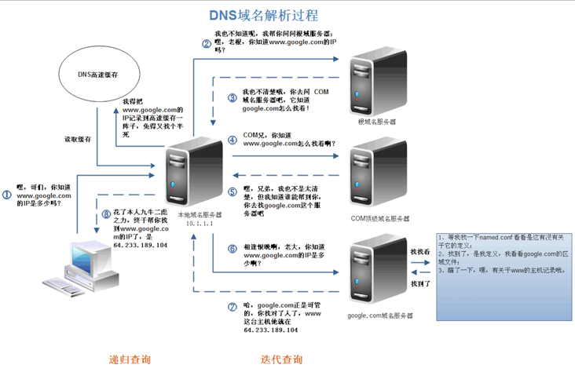

---
# 这是页面的图标
icon: page

# 这是文章的标题
title: 从输入 url 网址到显示页面的过程

# 设置作者
author: lllllan

# 设置写作时间
time: 2022-2-22

# 一个页面只能有一个分类
category: 计算机基础

# 一个页面可以有多个标签
tag:
- 计算机网络
- 面试题

# 此页面会在文章列表置顶
# sticky: true

# 此页面会出现在首页的文章板块中
star: true

# 你可以自定义页脚
# footer: 
---

::: warning

本文转载自 [前端经典面试题: 从输入URL到页面加载发生了什么？ - SegmentFault 思否](https://segmentfault.com/a/1190000006879700)，略有改动

:::

## 从输入 url 到页面显示发生了什么

总体来说分为以下几个过程:

1. DNS解析
2. TCP连接
3. 发送HTTP请求
4. 服务器处理请求并返回HTTP报文
5. 浏览器解析渲染页面
6. 连接结束

## 一、DNS 解析

**DNS解析的过程就是寻找哪台机器上有你需要资源的过程。**

当你在浏览器中输入一个地址时，例如 `www.baidu.com`，其实不是百度网站真正意义上的地址。互联网上每一台计算机的唯一标识是它的IP地址，但是IP地址并不方便记忆。用户更喜欢用方便记忆的网址去寻找互联网上的其它计算机，也就是上面提到的百度的网址。所以互联网设计者需要在用户的方便性与可用性方面做一个权衡，这个权衡就是一个网址到IP地址的转换，这个过程就是DNS解析。它实际上充当了一个翻译的角色，实现了网址到IP地址的转换。网址到IP地址转换的过程是如何进行的?

### 1.1 DNS 解析过程

**DNS解析是一个递归查询的过程。**

###### 

上述图片是查找 `www.google.com` 的IP地址过程。首先在本地域名服务器中查询IP地址，如果没有找到的情况下，本地域名服务器会向根域名服务器发送一个请求，如果根域名服务器也不存在该域名时，本地域名会向com顶级域名服务器发送一个请求，依次类推下去。直到最后本地域名服务器得到google的IP地址并把它缓存到本地，供下次查询使用。从上述过程中，可以看出网址的解析是一个从右向左的过程: `com -> google.com -> www.google.com`。但是你是否发现少了点什么，根域名服务器的解析过程呢？事实上，真正的网址是 `www.google.com.` ，并不是我多打了一个 `.` ，这个 `.` 对应的就是根域名服务器，默认情况下所有的网址的最后一位都是.，既然是默认情况下，为了方便用户，通常都会省略，浏览器在请求DNS的时候会自动加上，所有网址真正的解析过程为:  `. -> .com -> google.com. -> www.google.com.`。

### 1.2 DNS 缓存

了解了DNS的过程，可以为我们带来哪些？上文中请求到google的IP地址时，经历了8个步骤，这个过程中存在多个请求(同时存在UDP和TCP请求)。如果每次都经过这么多步骤，是否太耗时间？如何减少该过程的步骤呢？那就是DNS缓存。

DNS 服务器有一个缓存功能，可以记住之前查询过的域名

- 如果要查询的域名和相关信息已经在缓存中，那么就可以直接返回响应。
- 当查询的域名不存在时，“不存在”这一响应结果也会被缓存
- 缓存信息设置有一个有效期，当信息超过有效期后，数据会从缓存中删除
- DNS服务器返回响应时，会告知这一响应结果是来自缓存还是来自负责管理该域名的DNS服务器

### 1.3 DNS 负载均衡

不知道大家有没有思考过一个问题: DNS返回的IP地址是否每次都一样？如果每次都一样是否说明你请求的资源都位于同一台机器上面，那么这台机器需要多高的性能和储存才能满足亿万请求呢？其实真实的互联网世界背后存在成千上百台服务器，大型的网站甚至更多。但是在用户的眼中，它需要的只是处理他的请求，哪台机器处理请求并不重要。DNS可以返回一个合适的机器的IP给用户，例如可以根据每台机器的负载量，该机器离用户地理位置的距离等等，这种过程就是DNS负载均衡，又叫做DNS重定向。大家耳熟能详的CDN(Content Delivery Network)就是利用DNS的重定向技术，DNS服务器会返回一个跟用户最接近的点的IP地址给用户，CDN节点的服务器负责响应用户的请求，提供所需的内容。