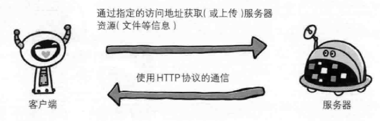
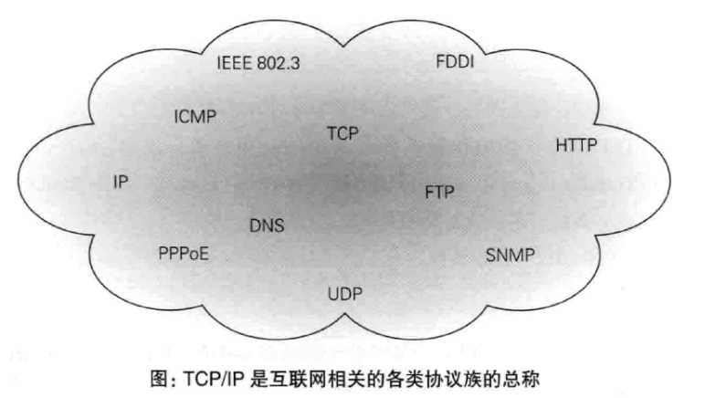

---
# 这是页面的图标
icon: page

# 这是文章的标题
title: 第一章、了解Web及网络基础

# 设置作者
author: lllllan

# 设置写作时间
# time: 2020-01-20

# 一个页面只能有一个分类
category: 计算机基础

# 一个页面可以有多个标签
tag:
- 计算机网络
- 图解HTTP

# 此页面会在文章列表置顶
# sticky: true

# 此页面会出现在首页的文章板块中
star: true

# 你可以自定义页脚
# footer: 

---

::: warning

本文作为 《图解HTTP》 的笔记，绝大部分内容均抄自该书。

:::

## 一、使用HTTP协议访问Web

Web使用一种名为 HTTP(HyperText Transfer Protocal，超文本传输协议)的协议作为规范，完成从客户端到服务器等一系列运作流程。

## 二、HTTP的诞生

（简单了解）

## 三、网络基础 TCP/IP

通常使用的网络是在 TCP/IP 协议族的基础上运作的，而 HTTP 属于它内部的一个子集。

### 3.1 TCP/IP 协议族

TCP/IP 协议族规定了通信双方必须遵守的一些规则。

### 3.2 TCP/IP 的分层管理

TCP/IP 协议族按层次分别为： **应用层、传输层、网络层、数据链路层**

::: tip 分层的好处

如果互联网只由一个协议统筹，某个地方需要改变设计时，就必须把所有部分整体替换掉。而分层之后只需把变动的层替换掉即可。

设计也变得相对简单。处于应用层上的应用可以只考虑分派给自己的任务，而不需要弄清对方在地球上哪个地方、对方的传输路线是怎么样的、是否能确保传输送达等问题

:::

#### 3.2.1 应用层

应用层决定了向用户提供应用服务时通信的活动。HTTP、FTP

#### 3.2.2 传输层

传输层对上层应用层，提供处于网络连接中的两台计算机之间的数据传输。TCP、UDP

#### 3.2.3 网络层（网际层）

网络层用来处理在网络上流动的数据包。数据包时网络传输的最小数据单位。该层规定了通过怎样的路径（所谓的传输路线）到达对方计算机，并把数据传送给对方。

与对方计算机之间通过多台计算机或网络设备传输时，网络层的作用就是在众多的选项内选择一条传输路线。

#### 3.2.4 数据链路层（网络接口层）

用来处理连接网络的硬件部分。操作系统、设备驱动、网卡、光纤等物理课件部分。
