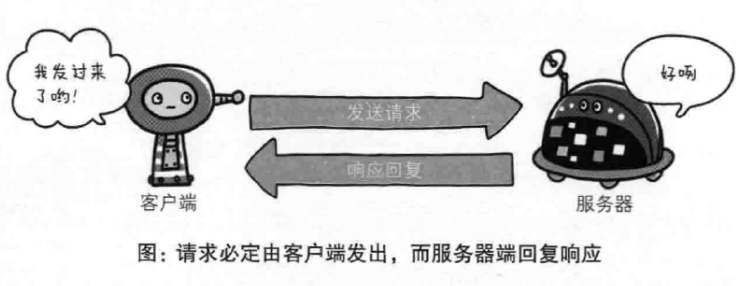
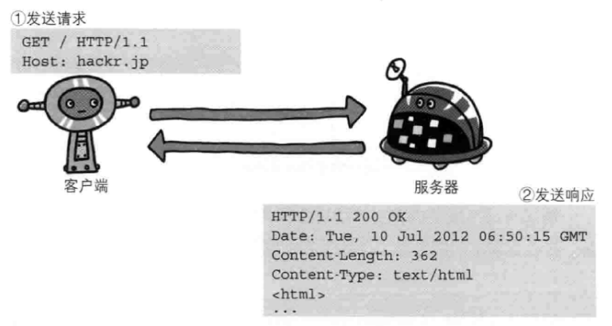
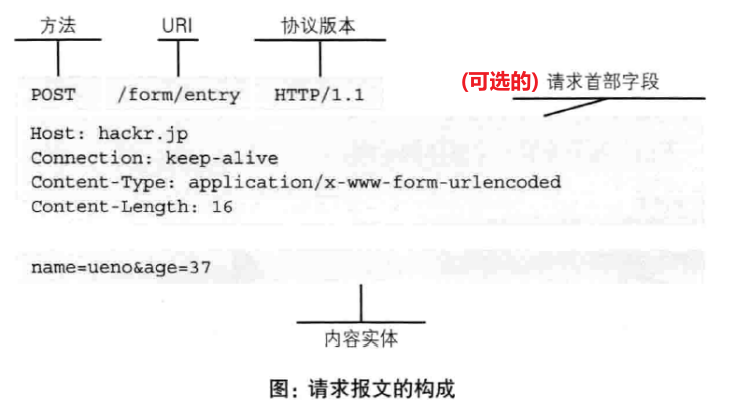
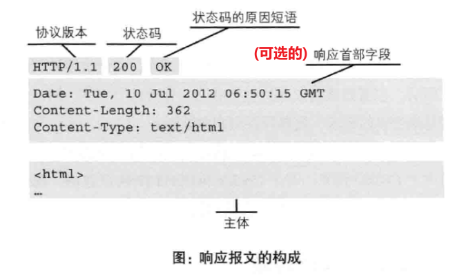

---
# 这是页面的图标
icon: page

# 这是文章的标题
title: 第二章、简单的HTTP协议

# 设置作者
author: lllllan

# 设置写作时间
# time: 2020-01-20

# 一个页面只能有一个分类
category: 计算机基础

# 一个页面可以有多个标签
tag:
- 计算机网络
- 图解HTTP

# 此页面会在文章列表置顶
# sticky: true

# 此页面会出现在首页的文章板块中
star: true

# 你可以自定义页脚
# footer: 

---

::: warning

本文作为 《图解HTTP》 的笔记，绝大部分内容均抄自该书。

:::

## 一、HTTP 协议用于客户端和服务器之间的通信

## 二、通过请求和响应的交换达成信息

### 2.1 由客户端发出请求

HTTP 协议规定，请求从客户端发出，最后服务器端响应该请求并返回。即肯定是先从客户端开始建立通信，服务器端在没有接收到请求之前不会发送响应。

### 2.2 请求报文和响应报文

