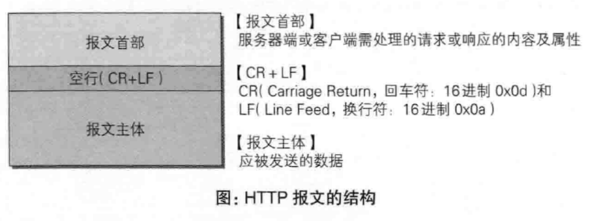
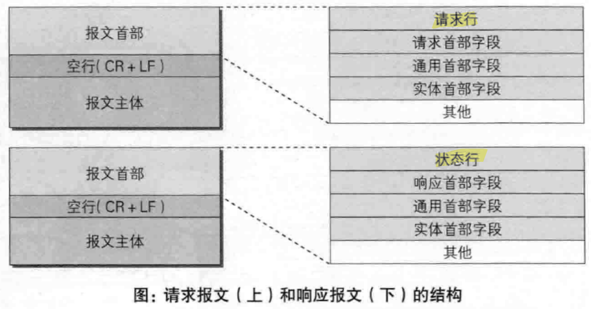
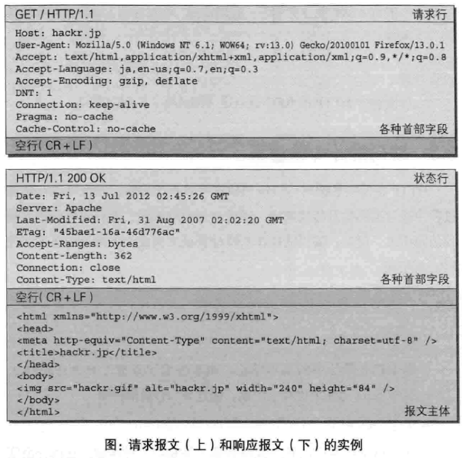

---
# 这是页面的图标
icon: page

# 这是文章的标题
title: 第三章、HTTP报文内的HTTP信息

# 设置作者
author: lllllan

# 设置写作时间
# time: 2020-01-20

# 一个页面只能有一个分类
category: 计算机基础

# 一个页面可以有多个标签
tag:
- 计算机网络
- 图解HTTP

# 此页面会在文章列表置顶
# sticky: true

# 此页面会出现在首页的文章板块中
star: true

# 你可以自定义页脚
# footer: 
---

::: warning

本文作为 《图解HTTP》 的笔记，绝大部分内容均抄自该书。

:::

## 一、HTTP 报文

用于HTTP协议交互的信息称为HTTP报文，大致可以分为报文首部和报文主体两部分。

## 二、报文结构

- 请求行：包含用于请求的方法，请求URI和HTTP版本
- 状态行：包含表明响应结果的状态码，原因短语和HTTP版本
- 首部字段：包含表示请求和响应的各种条件和属性的各类首部（通用、请求、响应、实体）

