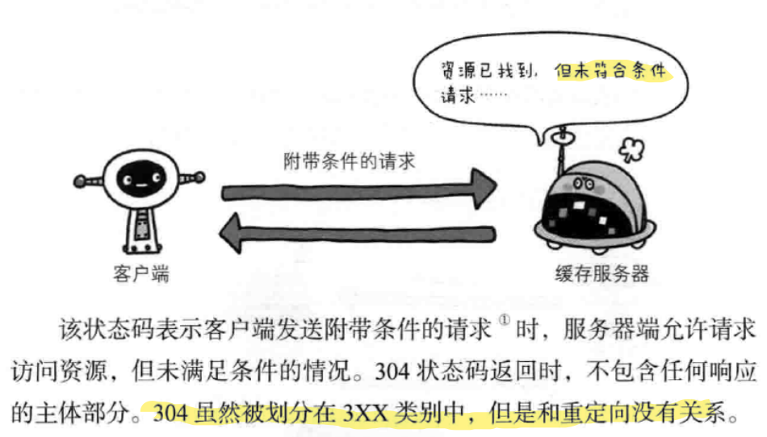

---
# 这是页面的图标
icon: page

# 这是文章的标题
title: 第四章、返回结果的Http状态码

# 设置作者
author: lllllan

# 设置写作时间
# time: 2020-01-20

# 一个页面只能有一个分类
category: 计算机基础

# 一个页面可以有多个标签
tag:
- 计算机网络
- 图解HTTP

# 此页面会在文章列表置顶
# sticky: true

# 此页面会出现在首页的文章板块中
star: true

# 你可以自定义页脚
# footer: 

---

::: warning

本文作为 《图解HTTP》 的笔记，绝大部分内容均抄自该书。

:::

## 一、状态码告知从服务器返回的请求结果

## 二、2XX 成功

### 200 OK

### 204 No Content

### 206 Partical Content

## 三、3XX 重定向

### 301 Moved Permanently

### 302 Found

### 303 See Other

::: tip

:::

### 304 Not Modified

