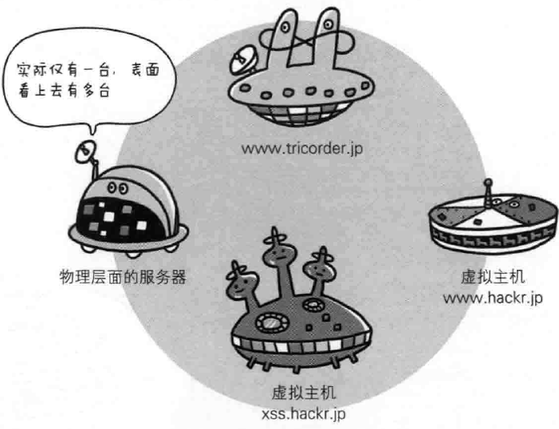
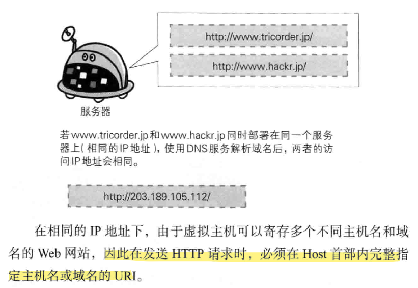

---
# 这是页面的图标
icon: page

# 这是文章的标题
title: 第五章、与HTTP协作的Web服务器

# 设置作者
author: lllllan

# 设置写作时间
# time: 2020-01-20

# 一个页面只能有一个分类
category: 计算机基础

# 一个页面可以有多个标签
tag:
- 计算机网络
- 图解HTTP

# 此页面会在文章列表置顶
# sticky: true

# 此页面会出现在首页的文章板块中
star: true

# 你可以自定义页脚
# footer: 

---

::: warning

本文作为 《图解HTTP》 的笔记，绝大部分内容均抄自该书。

:::

## 一、用单台虚拟主机实现多个域名

HTTP/1.1 规范允许一台 HTTP 服务器搭建多个 Web 站点。

