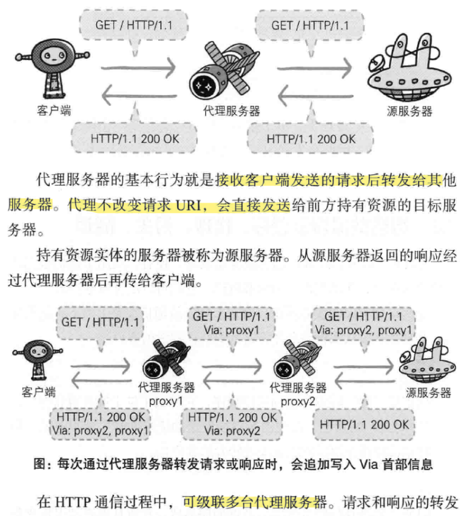
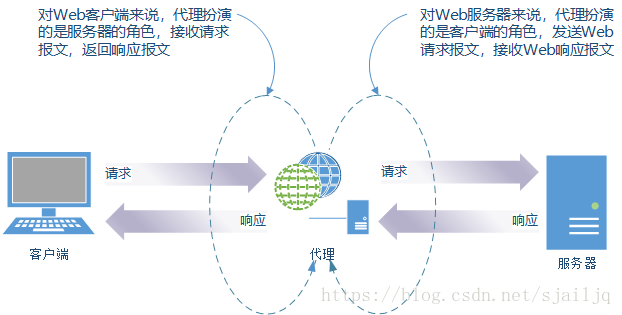
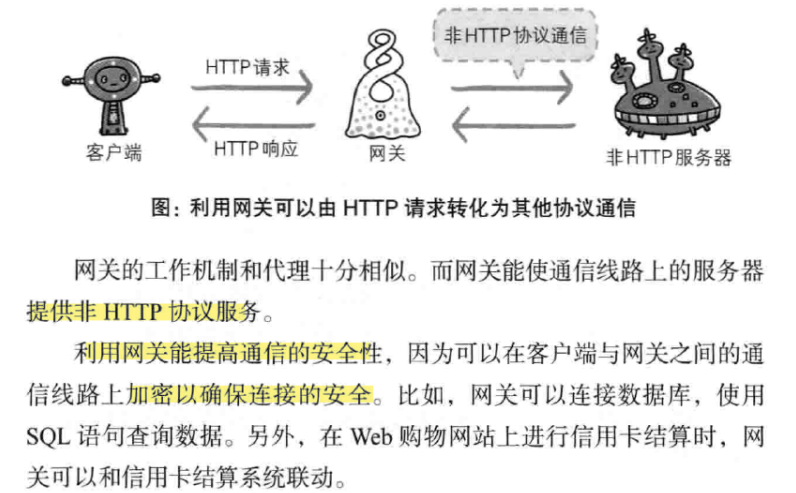
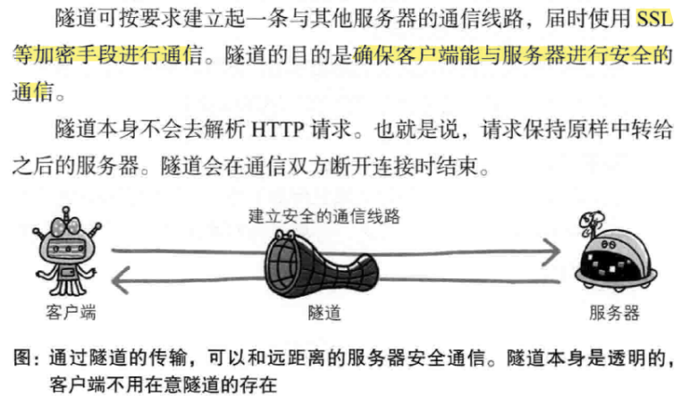

---
# 这是页面的图标
icon: page

# 这是文章的标题
title: 第五章、与HTTP协作的Web服务器

# 设置作者
author: lllllan

# 设置写作时间
# time: 2020-01-20

# 一个页面只能有一个分类
category: 计算机基础

# 一个页面可以有多个标签
tag:
- 计算机网络
- 图解HTTP

# 此页面会在文章列表置顶
# sticky: true

# 此页面会出现在首页的文章板块中
star: true

# 你可以自定义页脚
# footer: 

---

::: warning 转载声明

- 《图解HTTP》 
- [代理、网关与隧道](https://blog.csdn.net/sjailjq/article/details/82287345)

:::

## 一、用单台虚拟主机实现多个域名

HTTP/1.1 规范允许一台 HTTP 服务器搭建多个 Web 站点。

>  举例来说，客户端使用HTTP协议访问服务器时，会经常采用类似www.hacker.jp这样的域名。   在互联网上，域名通过DNS服务映射到IP地址（域名解析）之后访问目标网站。由此可见，当请求发送到服务器时，已经是以IP地址形式访问了。那么问题就来了：如果一台服务器内托管了www.hacker.jp和www.tricoder.jp这两个域名，而两个域名经解析后的IP地址又是相同的，当服务器收到请求时就要弄清究竟要访问那个域名。

## 二、通信数据转发程序：代理、网关、隧道

### 2.1 代理

::: info 代理

==代理== 是一种具有转发功能的 **应用程序**。

:::

::: tip 代理的特点

1. 客户端不知道真正的服务器是谁，服务器也不知道客户端是什么样的
2. 客户端同代理服务器，代理服务器同服务器，这两者之间使用的通讯协议是一样的
3. 代理服务器会对接收的请求进行解析，重新封装后再发送给服务器；在服务器响应后，对响应进行解析，重新封装后再发送给客户端。

:::

::: note 代理是否使用缓存、是否修改报文

- **缓存代理：** 缓存代理会预先将资源的副本保存到代理服务器上，当代理再次接收到对相同资源的请求时，就可以将之前缓存的资源作为响应返回。
- **透明代理：** 不对报文做任何加工

:::

### 2.2 网关

::: info 网关

==网关== 是转发其他服务器通信数据的 **服务器**

:::

### 2.3 隧道

::: info 隧道

==隧道== 是在相隔甚远的客户端和服务器两者之间进行中转、并保持双方通信连接的 **应用程序**

:::

