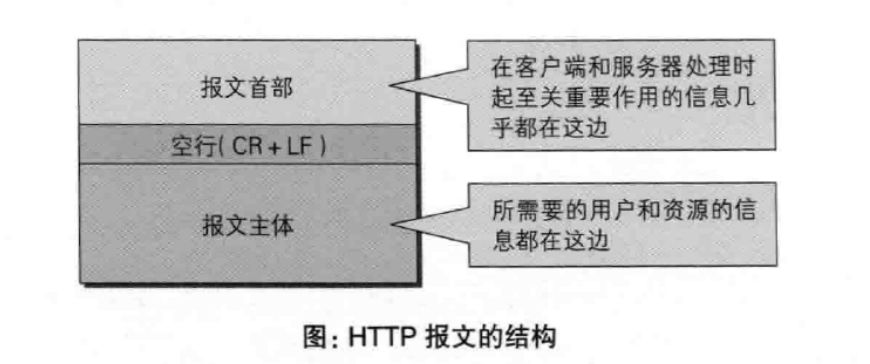
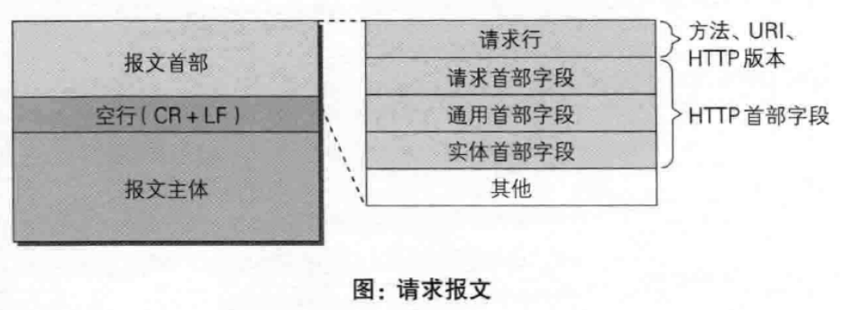
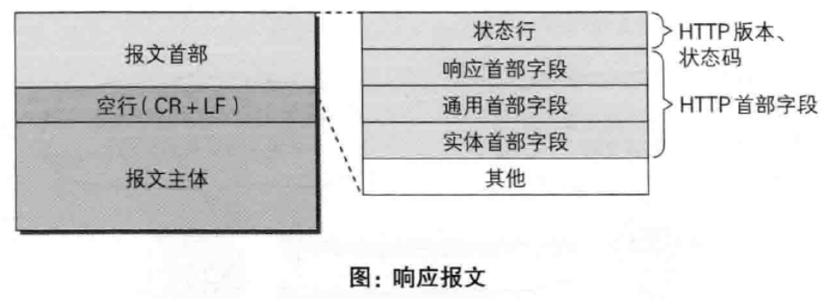
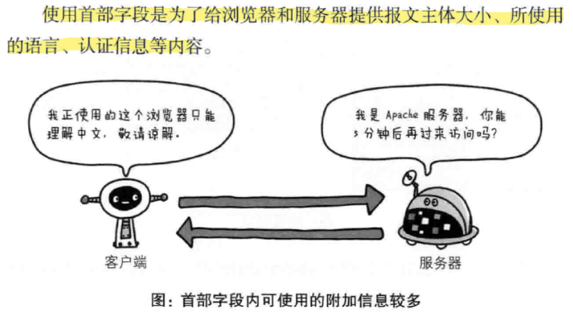

---
# 这是页面的图标
icon: page

# 这是文章的标题
title: 《图解HTTP》第六章、Http 首部

# 设置作者
author: lllllan

# 设置写作时间
# time: 2020-01-20

# 一个页面只能有一个分类
category: 计算机基础

# 一个页面可以有多个标签
tag:
- 计算机网络
- 图解HTTP

# 此页面会在文章列表置顶
# sticky: true

# 此页面会出现在首页的文章板块中
star: true

# 你可以自定义页脚
# footer: 


---


::: warning 转载声明

- 《图解HTTP》 

:::


## 一、HTTP 报文首部

**HTTP协议的请求报文和响应报文中必定包含HTTP首部**




### 请求报文

HTTP 请求报文中报文首部由 **方法、URI、HTTP版本、HTTP首部字段等部分** 构成




### 响应报文

HTTP 响应报文中报文首部由 **HTTP版本、状态码（数字和原因短语）、HTTP首部** 三部分构成




## 二、HTTP 首部字段


### 2.1 HTTP 首部字段传递重要信息




### 2.2 HTTP 首部字段结构

HTTP 首部字段是由首部字段名和字段值构成，中间用冒号分隔。

```java
// 首部字段名:字段值
    
Content-Type: text/html
Keep-Alive: timeout=15, max=100
```


::: tip HTTP 首部字段重复会怎么样

这种情况在规范内尚未明确，根据浏览器内部逻辑不同，结果可能不同。

:::


### 2.3 四种HTTP首部字段类型


**通用首部字段**

请求和响应报文都会使用的首部

----


**请求首部字段**

从客户端向服务器发送请求报文时使用的首部。

----


**响应首部字段**

从服务器向客户端返回响应报文时使用的首部。

---


**实体首部字段**

针对请求报文和响应报文的实体部分使用的首部。


### 2.4 首部字段一览

HTTP/1.1 规范定义了47种首部字段。太多了自行百度。


### 2.5 非首部字段

比如 Cookie、Set-Cookie、Content-Disposition等


### 2.6 End-to-end 首部和 Hop-by-hop 首部

HTTP首部字段将定义成缓存代理和非缓存代理的行为，分成两种类型：


**端到端首部 End-to-end**

此类别中的首部会转发给请求/响应对应的 ==最终接收目标，且必须保存在由缓存生成的响应中，另外规定他必须被转发==

---


**逐跳首部**

此类别的首部 ==只对单次转发有效== ，会因为通过缓存和代理而不再转发。HTTP/1.1 和之后的版本要求提供 Connection 首部字段

