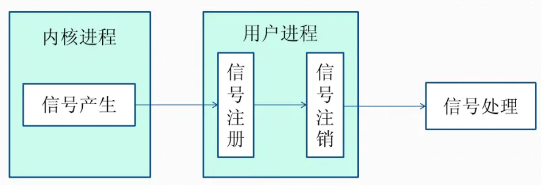

---
# 这是页面的图标
icon: page

# 这是文章的标题
title: 操作系统-常见面试题

# 设置作者
author: lllllan

# 设置写作时间
# time: 2020-01-20

# 一个页面只能有一个分类
category: 计算机基础

# 一个页面可以有多个标签
tag:
- 操作系统
- 面试题

# 此页面会在文章列表置顶
# sticky: true

# 此页面会出现在首页的文章板块中
star: true

# 你可以自定义页脚
# footer: 
---

::: warning

本文转载自以下文章：

- [操作系统常见面试题总结 | JavaGuide](https://javaguide.cn/cs-basics/operating-system/操作系统常见面试题&知识点总结/)
- [什么是操作系统？ - 知乎 (zhihu.com)](https://zhuanlan.zhihu.com/p/105945721)
- [进程间通信IPC (InterProcess Communication)](https://www.jianshu.com/p/c1015f5ffa74)

:::

## 一、操作系统基础

### 1.1 操作系统

[什么是操作系统？ - 知乎 (zhihu.com)](https://zhuanlan.zhihu.com/p/105945721)

操作系统(Operation System, OS) 是指控制和管理整个计算机系统的硬件和软件资源，并合理的组织和调度计算机的工作和资源的分配，以提供给用户和其它软件方便的接口和环境，它是计算机系统中最基本的系统软件。

**操作系统说明：**

1. 负责管理协调硬件、软件等计算机资源的工作
2. 为上层的应用程序、用户提供简单易用的服务
3. 操作系统是系统软件，而不是硬件

### 1.2 系统调用

根据进程访问资源的特点，我们可以把进程在系统上的运行分为两个级别：

1. 用户态(user mode)：用户态运行的进程可以直接读取用户程序的数据。
2. 内核态(kernel mode)：可以简单的理解系统态运行的进程或程序几乎可以访问计算机的任何资源，不受限制。

我们运行的程序基本都是运行在用户态，如果我们调用操作系统提供的系统态级别的子功能咋办呢？那就需要系统调用了！

也就是说在我们运行的用户程序中，凡是与系统态级别的资源有关的操作（如文件管理、进程控制、内存管理等)，都必须通过系统调用方式向操作系统提出服务请求，并由操作系统代为完成。

这些系统调用按功能大致可分为如下几类：

- 设备管理。完成设备的请求或释放，以及设备启动等功能。
- 文件管理。完成文件的读、写、创建及删除等功能。
- 进程控制。完成进程的创建、撤销、阻塞及唤醒等功能。
- 进程通信。完成进程之间的消息传递或信号传递等功能。
- 内存管理。完成内存的分配、回收以及获取作业占用内存区大小及地址等功能。

## 二、进程和线程

### 2.1 进程和线程的区别

**概念：**

- **进程**：是并发执行的程序在执行过程中<u>分配和管理资源的基本单位</u>，是一个动态概念，竞争计算机系统资源的基本单位。
- **线程**：是进程的一个执行单元，是进程内科调度实体。比进程更小的独立运行的基本单位。线程也被称为轻量级进程。

**关系：**

1. 一个线程只属于一个进程，一个进程至少有一个线程
2. 资源分配给进程，同一进程的所有线程共享该进程的资源
3. 处理及分配给线程，真正在处理机上运行的是线程
4. 线程在执行过程中，需要协作同步。不同进程的线程间要利用消息通信的办法实现同步。

**区别：**

|          |              进程              |             线程             |
| :------: | :----------------------------: | :--------------------------: |
|   调度   |    分配和管理资源的基本单位    |     调度和分配的基本单位     |
|   资源   |           相互间独立           |       共享本进程的资源       |
|  健壮性  | 一个进程的崩溃不会影响其他进程 | 一个线程的崩溃会影响整个进程 |
|  并发性  |          可以并发执行          |         可以并发执行         |
| 系统开销 |               大               |              小              |

**JVM角度：**

一个进程中可以有多个线程，多个线程共享进程的**堆**和**方法区 (JDK1.8 之后的元空间)资源，但是每个线程有自己的程序计数器**、**虚拟机栈** 和 **本地方法栈**。

### 2.2 进程的状态

- **创建状态(new)** ：进程正在被创建，尚未到就绪状态。
- **就绪状态(ready)** ：进程已处于准备运行状态，即进程获得了除了处理器之外的一切所需资源，一旦得到处理器资源(处理器分配的时间片)即可运行。
- **运行状态(running)** ：进程正在处理器上上运行(单核 CPU 下任意时刻只有一个进程处于运行状态)。
- **阻塞状态(waiting)** ：又称为等待状态，进程正在等待某一事件而暂停运行如等待某资源为可用或等待 IO 操作完成。即使处理器空闲，该进程也不能运行。
- **结束状态(terminated)** ：进程正在从系统中消失。可能是进程正常结束或其他原因中断退出运行。

### 2.3 进程间的通信方式

下面部分转载自 [进程间通信IPC (InterProcess Communication)](https://www.jianshu.com/p/c1015f5ffa74)

每个进程各自有不同的用户地址空间，任何一个进程的全局变量在另一个进程中都看不到，所以进程之间要交换数据必须通过内核，在内核中开辟一块缓冲区，进程1把数据从用户空间拷到内核缓冲区，进程2再从内核缓冲区把数据读走，内核提供的这种机制称为**进程间通信**

#### 2.3.1 管道/匿名管道

**用于具有亲缘关系的父子进程间或者兄弟进程之间的通信。**

> 管道的实质是一个内核缓冲区，进程以先进先出的方式从缓冲区存取数据，管道一端的进程顺序的将数据写入缓冲区，另一端的进程则顺序的读出数据。
>  该缓冲区可以看做是一个循环队列，读和写的位置都是自动增长的，不能随意改变，一个数据只能被读一次，读出来以后在缓冲区就不复存在了。
>  当缓冲区读空或者写满时，有一定的规则控制相应的读进程或者写进程进入等待队列，当空的缓冲区有新数据写入或者满的缓冲区有数据读出来时，就唤醒等待队列中的进程继续读写。

特点和局限：

- 只支持单向数据流
- 只能用于具有亲缘关系的进程之间
- 没有名字
- 管道的缓冲区是有限的（管道制存在于内存中，在管道创建时，为缓冲区分配一个页面大小）
- 管道所传送的是无格式字节流，这就要求管道的读出方和写入方必须事先约定好数据的格式，比如多少字节算作一个消息（或命令、或记录）等等；

#### 2.3.2 有名管道 FIFO

**有名管道以磁盘文件的方式存在，可以实现本机任意两个进程通信。**

> 有名管道不同于匿名管道之处在于它提供了一个路径名与之关联，**以有名管道的文件形式存在于文件系统中**，这样，**即使与有名管道的创建进程不存在亲缘关系的进程，只要可以访问该路径，就能够彼此通过有名管道相互通信**，因此，通过有名管道不相关的进程也能交换数据。值的注意的是，有名管道严格遵循**先进先出(first in first out)**,对匿名管道及有名管道的读总是从开始处返回数据，对它们的写则把数据添加到末尾。它们不支持诸如lseek()等文件定位操作。**有名管道的名字存在于文件系统中，内容存放在内存中。**

管道总结：

- 管道是特殊类型的文件，在满足**先入先出**的原则条件下可以进行读写，但不能进行定位读写。
- 管道都是单向的。其中匿名管道只能在有亲缘关系的进程间通信；有名管道以磁盘文件的方式存在，可以实现本机任意两个进程通信。
- **匿名管道阻塞问题：** 匿名管道无需显示打开，创建时直接返回文件描述符，在读写时需要确定对方的存在，否则将退出。如果当前进程向无名管道的一端写数据，必须确定另一端有某一进程。如果写入无名管道的数据超过其最大值，写操作将阻塞，如果管道中没有数据，读操作将阻塞，如果管道发现另一端断开，将自动退出。
- **有名管道阻塞问题：** 有名管道在打开时需要确实对方的存在，否则将阻塞。即以读方式打开某管道，在此之前必须一个进程以写方式打开管道，否则阻塞。此外，可以以读写（O_RDWR）模式打开有名管道，即当前进程读，当前进程写，不会阻塞。

#### 2.3.3 信号

**信号是一种比较复杂的通信方式，用于通知接收进程某个事件已经发生**

- 信号是Linux系统中用于进程间互相通信或者操作的一种机制，信号可以在任何时候发给某一进程，而无需知道该进程的状态。
- 如果该进程当前并未处于执行状态，则该信号就有内核保存起来，知道该进程回复执行并传递给它为止。
- 如果一个信号被进程设置为阻塞，则该信号的传递被延迟，直到其阻塞被取消是才被传递给进程。

#### 2.3.4 消息队列

**消息队列是消息的链表,具有特定的格式,存放在内存中并由消息队列标识符标识。**

特点总结：

- 消息队列是消息的链表,具有特定的格式,存放在内存中并由消息队列标识符标识
- 消息队列允许一个或多个进程向它写入与读取消息
- 管道和消息队列的通信数据都是先进先出的原则
- 消息队列可以实现消息的随机查询,消息不一定要以先进先出的次序读取,也可以按消息的类型读取.比FIFO更有优势
- 消息队列克服了信号承载信息量少，管道只能承载无格式字 节流以及缓冲区大小受限等缺
- 目前主要有两种类型的消息队列：POSIX消息队列以及System V消息队列，系统V消息队列目前被大量使用。系统V消息队列是随内核持续的，只有在内核重起或者人工删除时，该消息队列才会被删除。

#### 2.3.5 共享内存

**使得多个进程可以访问同一块内存空间，不同进程可以及时看到对方进程中对共享内存中数据的更新。这种方式需要依靠某种同步操作，如互斥锁和信号量等。可以说这是最有用的进程间通信方式。**

- 使得多个进程可以可以直接读写同一块内存空间，是最快的可用IPC形式。是针对其他通信机制运行效率较低而设计的。
- 为了在多个进程间交换信息，内核专门留出了一块内存区，可以由需要访问的进程将其映射到自己的私有地址空间。进程就可以直接读写这一块内存而不需要进行数据的拷贝，从而大大提高效率。
- 由于多个进程共享一段内存，因此需要依靠某种同步机制（如信号量）来达到进程间的同步及互斥。

#### 2.3.6 信号量

**信号量是一个计数器，用于多进程对共享数据的访问，信号量的意图在于进程间同步。这种通信方式主要用于解决与同步相关的问题并避免竞争条件。**

> 操作流程：
>
> 1. **创建一个信号量**：这要求调用者指定初始值，对于二值信号量来说，它通常是1，也可是0。
> 2. **等待一个信号量**：该操作会测试这个信号量的值，如果小于0，就阻塞。也称为P操作。
> 3. **挂出一个信号量**：该操作将信号量的值加1，也称为V操作。

#### 2.3.7 套接字

**主要用于在客户端和服务器之间通过网络进行通信**

> 套接字是一种通信机制，凭借这种机制，客户/服务器（即要进行通信的进程）系统的开发工作既可以在本地单机上进行，也可以跨网络进行。也就是说它可以让不在同一台计算机但通过网络连接计算机上的进程进行通信。
>
> 套接字是支持TCP/IP的网络通信的基本操作单元，可以看做是不同主机之间的进程进行双向通信的端点，简单的说就是通信的两方的一种约定，用套接字中的相关函数来完成通信过程。
