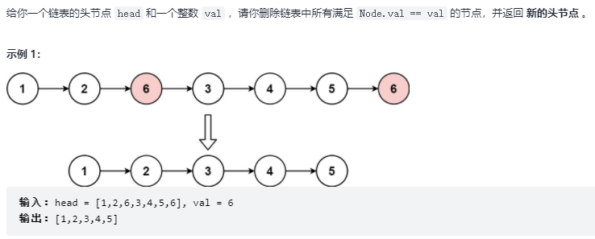

---
# 这是页面的图标
icon: page

# 这是文章的标题
title: 链表练习

# 设置作者
author: lllllan

# 设置写作时间
# time: 2020-01-20

# 一个页面只能有一个分类
category: 刷题

# 一个页面可以有多个标签
tag:

# 此页面会在文章列表置顶
# sticky: true

# 此页面会出现在首页的文章板块中
star: true

# 你可以自定义页脚
# footer: 
---


## 一、虚拟头节点


### 1.1 [203. 移除链表元素 - 力扣](https://leetcode-cn.com/problems/remove-linked-list-elements/)

> 

```java
/**
 * Definition for singly-linked list.
 * public class ListNode {
 * int val;
 * ListNode next;
 * ListNode() {}
 * ListNode(int val) { this.val = val; }
 * ListNode(int val, ListNode next) { this.val = val; this.next = next; }
 * }
 */
class Solution { 

    public ListNode removeElements(ListNode head, int val) {
        ListNode it = new ListNode();
        it.next = head;

        ListNode ans = it;
        while (it.next != null) {
            if (it.next.val == val) {
                it.next = it.next.next;
            } else {
                it = it.next;
            }
        }
        return ans.next;
    }
}
```

