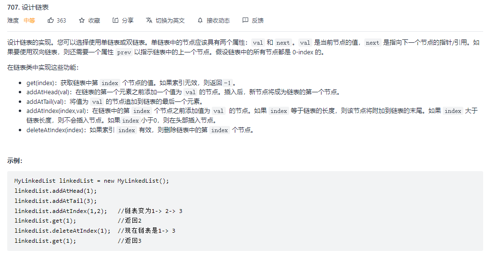
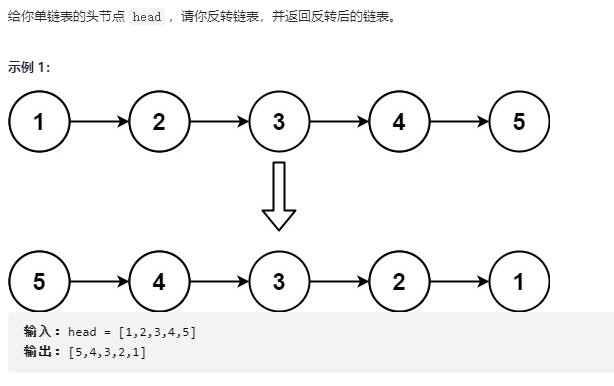

---
# 这是页面的图标
icon: page

# 这是文章的标题
title: 链表练习

# 设置作者
author: lllllan

# 设置写作时间
# time: 2020-01-20

# 一个页面只能有一个分类
category: 刷题

# 一个页面可以有多个标签
tag:

# 此页面会在文章列表置顶
# sticky: true

# 此页面会出现在首页的文章板块中
star: true

# 你可以自定义页脚
# footer: 
---


## 一、虚拟头节点


### 1.1 [203. 移除链表元素 - 力扣](https://leetcode-cn.com/problems/remove-linked-list-elements/)

> 

```java
/**
 * Definition for singly-linked list.
 * public class ListNode {
 * int val;
 * ListNode next;
 * ListNode() {}
 * ListNode(int val) { this.val = val; }
 * ListNode(int val, ListNode next) { this.val = val; this.next = next; }
 * }
 */
class Solution { 

    public ListNode removeElements(ListNode head, int val) {
        ListNode it = new ListNode();
        it.next = head;

        ListNode ans = it;
        while (it.next != null) {
            if (it.next.val == val) {
                it.next = it.next.next;
            } else {
                it = it.next;
            }
        }
        return ans.next;
    }
}
```


## 二、链表常规操作


### 2.1 [707. 设计链表 - 力扣](https://leetcode-cn.com/problems/design-linked-list/)

> 

```java
class MyLinkedList {

    class ListNode {
        int val;
        ListNode next;

        public ListNode() {
        }

        public ListNode(int val) {
            this.val = val;
        }
    }

    ListNode head;

    public MyLinkedList() {
        this.head = new ListNode();
    }

    public int get(int index) {
        ListNode it = this.head;
        while (it.next != null) {
            it = it.next;
            if (index-- == 0) {
                return it.val;
            }
        }
        return -1;
    }

    public void addAtHead(int val) {
        ListNode tmp = new ListNode(val);
        tmp.next = this.head.next;
        this.head.next = tmp;
    }

    public void addAtTail(int val) {
        ListNode tmp = new ListNode(val);
        ListNode it = this.head;
        while (it.next != null) {
            it = it.next;
        }
        it.next = tmp;
    }

    public void addAtIndex(int index, int val) {
        ListNode tmp = new ListNode(val);

        ListNode it = this.head;
        while (it.next != null) {
            if (index-- == 0) {
                tmp.next = it.next;
                it.next = tmp;
                break;
            }
            it = it.next;
        }
        if (index-- == 0) {
            it.next = tmp;
        }
    }

    public void deleteAtIndex(int index) {
        ListNode it = this.head;
        while (it.next != null) {
            if (index-- == 0) {
                it.next = it.next.next;
                break;
            }
            it = it.next;
        }
    }
}

/**
 * Your MyLinkedList object will be instantiated and called as such:
 * MyLinkedList obj = new MyLinkedList();
 * int param_1 = obj.get(index);
 * obj.addAtHead(val);
 * obj.addAtTail(val);
 * obj.addAtIndex(index,val);
 * obj.deleteAtIndex(index);
 */
```


## 三、链表反转


### 3.1 [206. 反转链表 - 力扣 ](https://leetcode-cn.com/problems/reverse-linked-list/)

> 

```java
/**
 * Definition for singly-linked list.
 * public class ListNode {
 * int val;
 * ListNode next;
 * ListNode() {}
 * ListNode(int val) { this.val = val; }
 * ListNode(int val, ListNode next) { this.val = val; this.next = next; }
 * }
 */
class Solution { 
    public ListNode reverseList(ListNode head) {
        if (head == null || head.next == null) return head;

        ListNode pre = null;
        while (head != null) {
            ListNode it = head.next;
            head.next = pre;
            pre = head;
            head = it;
        }
        return pre;
    }
}
```

