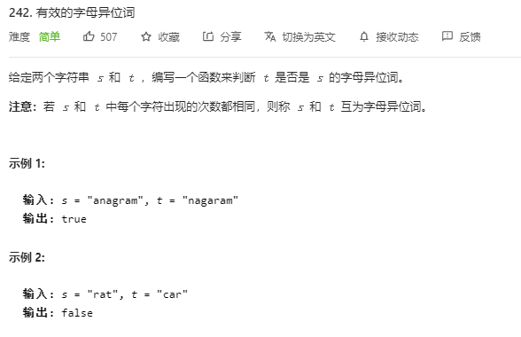
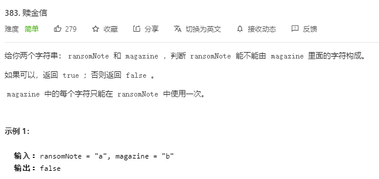
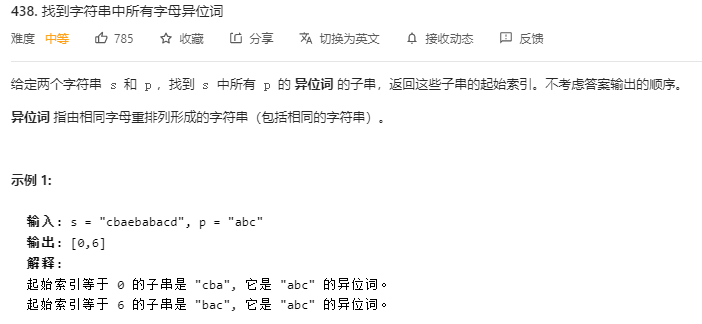
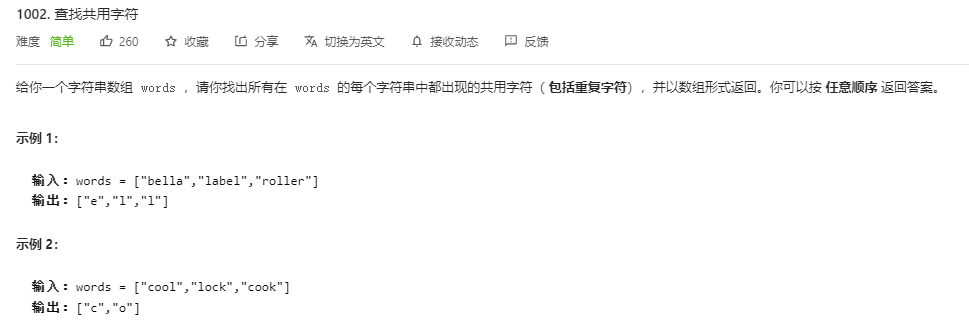
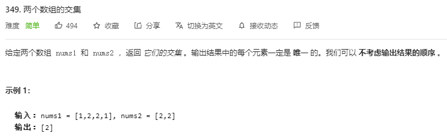
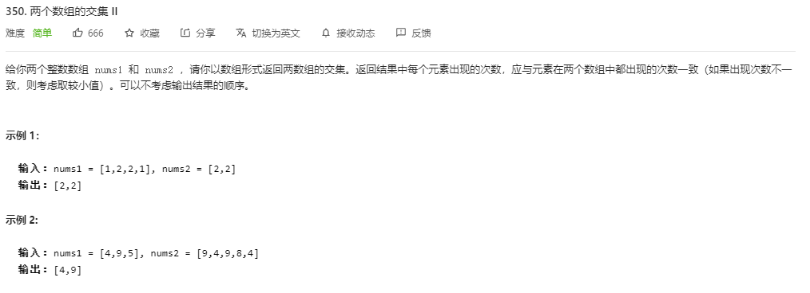
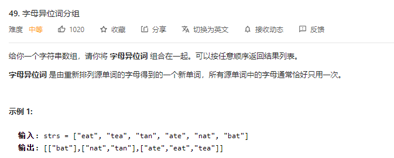

---
# 这是页面的图标
icon: page

# 这是文章的标题
title: 哈希表练习

# 设置作者
author: lllllan

# 设置写作时间
# time: 2020-01-20

# 一个页面只能有一个分类
category: 刷题

# 一个页面可以有多个标签
tag:

# 此页面会在文章列表置顶
# sticky: true

# 此页面会出现在首页的文章板块中
star: true

# 你可以自定义页脚
# footer: 

---


## 一、使用数组


### 1.1 [242. 有效的字母异位词 - 力扣](https://leetcode-cn.com/problems/valid-anagram/)

> 

```java
class Solution {
    public boolean isAnagram(String s, String t) {
        if (s.length() != t.length()) return false;

        int[] cnt = new int[30];

        for (int i = 0, len = s.length(); i < len; ++i) {
            char c = s.charAt(i);
            cnt[c - 'a']++;
        }

        for (int i = 0, len = t.length(); i < len; ++i) {
            char c = t.charAt(i);
            cnt[c - 'a']--;
        }

        for (int i = 0; i < 26; ++i) {
            if (cnt[i] != 0) return false;
        }
        return true;
    }
}
```


### 1.2 [383. 赎金信 - 力扣](https://leetcode-cn.com/problems/ransom-note/)

> 

```java
class Solution {
    public boolean canConstruct(String ransomNote, String magazine) {

        int[] cnt = new int[30];
        for (int i = 0, len = ransomNote.length(); i < len; ++i) {
            char c = ransomNote.charAt(i);
            cnt[c - 'a']++;
        }
        for (int i = 0, len = magazine.length(); i < len; ++i) {
            char c = magazine.charAt(i);
            cnt[c - 'a']--;
        }
        for (int i = 0; i < 26; ++i) {
            if (cnt[i] > 0) return false;
        }
        return true;
    }
}
```


### 1.3 [438. 找到字符串中所有字母异位词 - 力扣](https://leetcode-cn.com/problems/find-all-anagrams-in-a-string/)

> 

```java
class Solution {

    public boolean check(int[] cnt) {
        for (int i = 0; i < 26; ++i) {
            if (cnt[i] != 0) return false;
        }
        return true;
    }

    public List<Integer> findAnagrams(String s, String p) {
        LinkedList<Integer> ans = new LinkedList<>();
        if (s.length() < p.length()) return ans;

        int[] cnt = new int[30];
        int len = p.length();
        for (int i = 0; i < len; ++i) {
            char c = p.charAt(i);
            cnt[c - 'a']++;
            c = s.charAt(i);
            cnt[c - 'a']--;
        }
        if (check(cnt)) ans.add(0);

        for (int i = len, sz = s.length(); i < sz; ++i) {
            char c = s.charAt(i);
            char c1 = s.charAt(i - len);
            cnt[c - 'a']--;
            cnt[c1 - 'a']++;
            if (check(cnt)) ans.add(i - len + 1);
        }

        return ans;
    }
}
```


### 1.4 [1002. 查找共用字符 - 力扣](https://leetcode-cn.com/problems/find-common-characters/)

> 

```java
class Solution {
    public List<String> commonChars(String[] words) {
        if (words.length == 0) return new LinkedList<>();

        int[] cnt = new int[30];
        for (int i = 0, len = words[0].length(); i < len; ++i) {
            cnt[words[0].charAt(i) - 'a']++;
        }

        for (int i = 1, sz = words.length; i < sz; ++i) {
            String s = words[i];
            int[] tmp = new int[30];
            for (int j = 0, len = s.length(); j < len; ++j) {
                tmp[s.charAt(j) - 'a']++;
            }
            for (int j = 0; j < 26; ++j) {
                cnt[j] = Math.min(cnt[j], tmp[j]);
            }
        }

        List<String> list = new LinkedList<>();
        for (int i = 0; i < 26; ++i) {
            for (int j = 0; j < cnt[i]; ++j) {
                list.add(String.valueOf((char) (i + 'a')));
            }
        }
        return list;
    }
}
```


### 1.5 [349. 两个数组的交集 - 力扣](https://leetcode-cn.com/problems/intersection-of-two-arrays/)

> 

```java
class Solution {
    public int[] intersection(int[] nums1, int[] nums2) {
        int[] cnt = new int[1001];

        for (int i = 0, len = nums1.length; i < len; ++i) {
            cnt[nums1[i]] = 1;
        }
        for (int i = 0, len = nums2.length; i < len; ++i) {
            if (cnt[nums2[i]] == 1) cnt[nums2[i]] = 2;
        }

        List<Integer> list = new LinkedList<>();
        for (int i = 0; i < 1001; ++i) {
            if (cnt[i] == 2) list.add(i);
        }

        int[] ans = new int[list.size()];
        for (int i = 0, len = list.size(); i < len; ++i) {
            ans[i] = list.get(i);
        }
        return ans;

    }
}
```


### 1.6 [350. 两个数组的交集 II - 力扣](https://leetcode-cn.com/problems/intersection-of-two-arrays-ii/)

> 

```java
class Solution {
    public int[] intersect(int[] nums1, int[] nums2) {
        int[] cnt = new int[1001];

        for (int i = 0, len = nums1.length; i < len; ++i) {
            cnt[nums1[i]]++;
        }
        List<Integer> list = new LinkedList<>();
        for (int i = 0, len = nums2.length; i < len; ++i) {
            if (cnt[nums2[i]]-- > 0) list.add(nums2[i]);
        }

        int[] ans = new int[list.size()];
        for (int i = 0, len = list.size(); i < len; ++i) {
            ans[i] = list.get(i);
        }
        return ans;
    }
}
```


## 二、Map


### 2.1 [49. 字母异位词分组 - 力扣](https://leetcode-cn.com/problems/group-anagrams/)

> 

字母异位词排序之后能够得到相同的字符串

```java
class Solution {
    public List<List<String>> groupAnagrams(String[] strs) {
        Map<String, List<String>> map = new HashMap<>();
        for (String str : strs) {
            char[] chars = str.toCharArray();
            Arrays.sort(chars);
            String key = new String(chars);
            List<String> orDefault = map.getOrDefault(key, new LinkedList<String>());
            orDefault.add(str);
            map.put(key, orDefault);
        }
        return new LinkedList<List<String>>(map.values());
    }
}
```

