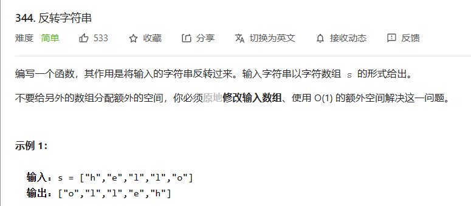
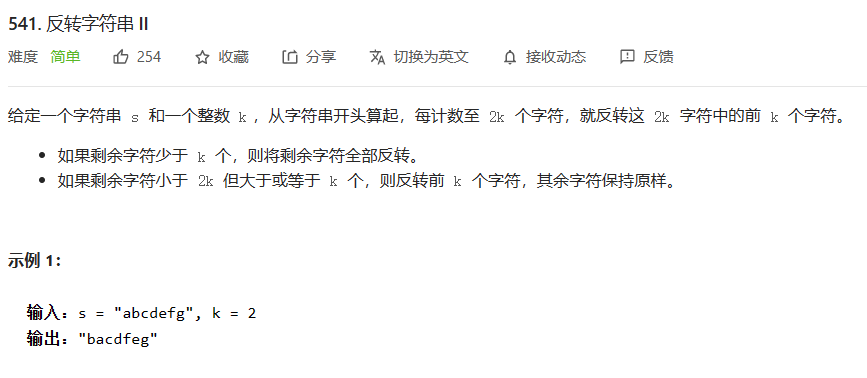
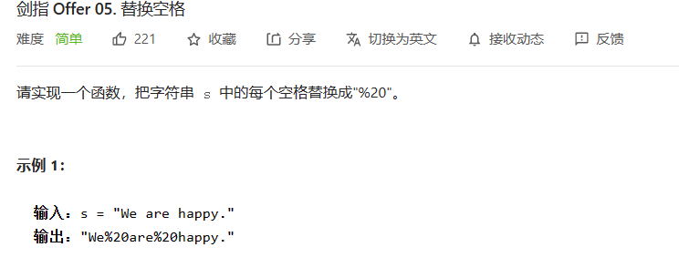
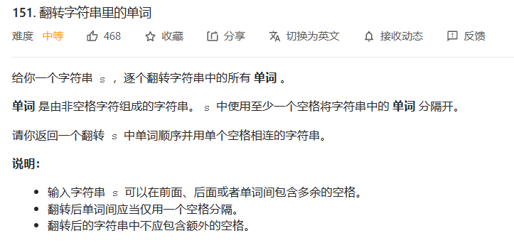
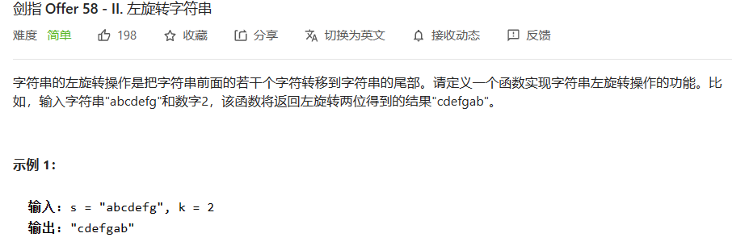

---
# 这是页面的图标
icon: page

# 这是文章的标题
title: 字符串练习

# 设置作者
author: lllllan

# 设置写作时间
# time: 2020-01-20

# 一个页面只能有一个分类
category: 刷题

# 一个页面可以有多个标签
tag:

# 此页面会在文章列表置顶
# sticky: true

# 此页面会出现在首页的文章板块中
star: true

# 你可以自定义页脚
# footer: 
---


## 一、指针应用


### 1.1 [344. 反转字符串 - 力扣](https://leetcode-cn.com/problems/reverse-string/)

> 

```java
class Solution {
    public void reverseString(char[] s) {
        for (int i = 0, len = s.length; i < len / 2; ++i) {
            char tmp = s[i];
            s[i] = s[len - i - 1];
            s[len - i - 1] = tmp;
        }
    }
}
```


### 1.2 [541. 反转字符串 II - 力扣](https://leetcode-cn.com/problems/reverse-string-ii/)

> 

```java
@SuppressWarnings({"all"})
class Solution {
    public void reverse(char[] s, int l, int r) {
        while (l < r) {
            char tmp = s[l];
            s[l] = s[r];
            s[r] = tmp;
            l++;
            r--;
        }
    }

    public String reverseStr(String s, int k) {
        char[] str = s.toCharArray();

        boolean flag = true;
        for (int i = 0, len = s.length(); i < len; i += k) {
            if (flag) {
                reverse(str, i, Math.min(i + k - 1, len - 1));
            }
            flag ^= true;
        }

        return new String(str);
    }
}
```


## 二、库函数


### 2.1 [剑指 Offer 05. 替换空格 - 力扣](https://leetcode-cn.com/problems/ti-huan-kong-ge-lcof/)

> 

```java
class Solution {
    public String replaceSpace(String s) {
        return s.replaceAll(" ", "%20");
    }
}
```


### 2.2 [151. 翻转字符串里的单词 - 力扣](https://leetcode-cn.com/problems/reverse-words-in-a-string/)

> 

```java
@SuppressWarnings({"all"})
class Solution {

    public String reverseWords(String s) { 

        char[] str = s.toCharArray();
        StringBuffer sb = new StringBuffer("");

        boolean flag = false;
        for (int i = 0, len = s.length(); i < len; ++i) {
            while (i < len && s.charAt(i) == ' ') ++i;
            int r = i + 1;
            while (r < len && s.charAt(r) != ' ') ++r;


            if (i < len) {
                if (flag) {
                    sb = new StringBuffer(" ").append(sb);
                }
                flag = true;
                sb = new StringBuffer(new String(str, i, r - i)).append(sb);
            }

            i = r;
        }

        return sb.toString();
    }
}
```


### 2.3 [剑指 Offer 58 - II. 左旋转字符串 - 力扣](https://leetcode-cn.com/problems/zuo-xuan-zhuan-zi-fu-chuan-lcof/)

> 

```java
class Solution {
    public String reverseLeftWords(String s, int n) {
        return new StringBuffer(s.substring(n, s.length())).append(s.substring(0, n)).toString();
    }
}
```

