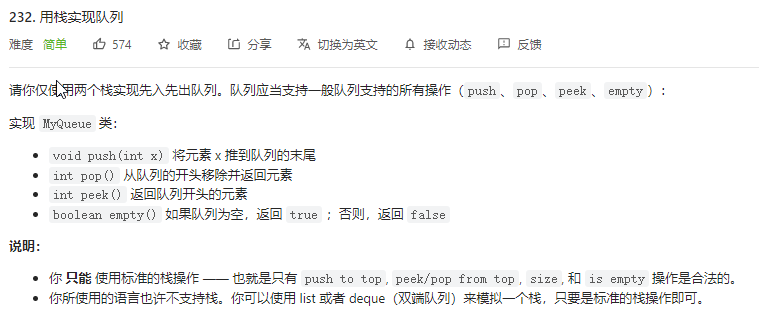
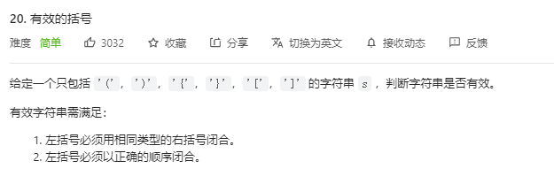
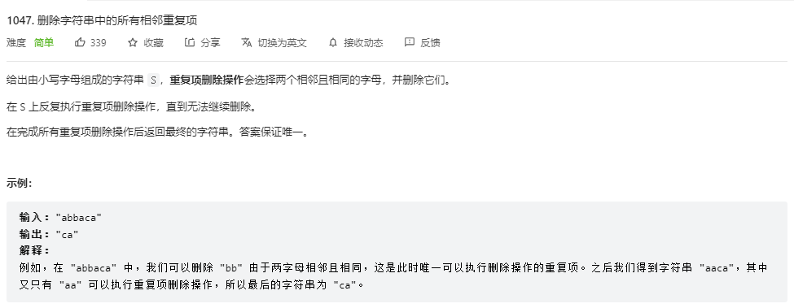
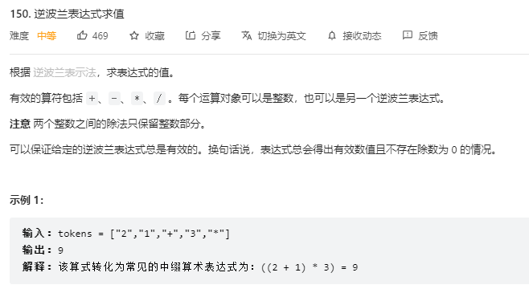
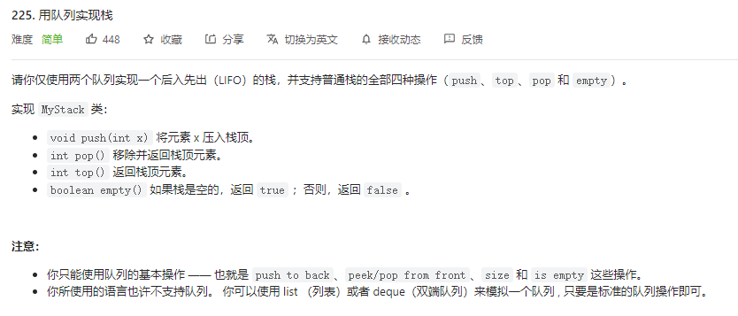

---
# 这是页面的图标
icon: page

# 这是文章的标题
title: 栈与队列

# 设置作者
author: lllllan

# 设置写作时间
# time: 2020-01-20

# 一个页面只能有一个分类
category: 刷题

# 一个页面可以有多个标签
tag:

# 此页面会在文章列表置顶
# sticky: true

# 此页面会出现在首页的文章板块中
star: true

# 你可以自定义页脚
# footer: 

---


## 一、栈


### 1.1 [232. 用栈实现队列 - 力扣](https://leetcode-cn.com/problems/implement-queue-using-stacks/)

> 

```java
import java.util.Stack;

class MyQueue {

    Stack<Integer> in, out;

    public MyQueue() {
        in = new Stack<>();
        out = new Stack<>();
    }

    public void push(int x) {
        in.add(x);
    }

    public void CheckOut() {
        if (out.size() == 0) {
            while (in.size() > 0) out.add(in.pop());
        }
    }

    public int pop() {
        CheckOut();
        return out.pop();
    }

    public int peek() {
        CheckOut();
        return out.peek();
    }

    public boolean empty() {
        return in.empty() && out.empty();
    }
}

/**
 * Your MyQueue object will be instantiated and called as such:
 * MyQueue obj = new MyQueue();
 * obj.push(x);
 * int param_2 = obj.pop();
 * int param_3 = obj.peek();
 * boolean param_4 = obj.empty();
 */
```


### 1.2 [20. 有效的括号 - 力扣](https://leetcode-cn.com/problems/valid-parentheses/)

> 

```java
import java.util.Stack;

class Solution {
    public boolean isValid(String s) {
        Stack<Character> st = new Stack<>();
        for (int i = 0, len = s.length(); i < len; ++i) {
            char c = s.charAt(i);
            if (c == '(' || c == '[' || c == '{') st.add(c);
            else {
                if (st.size() > 0) {
                    if (st.peek() == '(' && c == ')') st.pop();
                    else if (st.peek() == '[' && c == ']') st.pop();
                    else if (st.peek() == '{' && c == '}') st.pop();
                    else st.add(c);
                } else st.add(c);
            }
        }
        return st.empty();
    }
}
```


### 1.3 [1047. 删除字符串中的所有相邻重复项 - 力扣](https://leetcode-cn.com/problems/remove-all-adjacent-duplicates-in-string/)

> 

```java
import java.util.Stack;

class Solution {
    public String removeDuplicates(String s) {
        Stack<Character> st = new Stack<>();
        for (int i = 0, len = s.length(); i < len; ++i) {
            char c = s.charAt(i);
            if (st.size() > 0 && st.peek() == c) {
                st.pop();
            } else st.add(c);
        }

        StringBuilder sb = new StringBuilder("");
        while (st.size() > 0) sb.append(st.pop());
        return sb.reverse().toString();
    }
}
```


### 1.4 [150. 逆波兰表达式求值 - 力扣](https://leetcode-cn.com/problems/evaluate-reverse-polish-notation/)

> 

```java
import java.util.Stack;

class Solution {
    public int evalRPN(String[] tokens) {
        Stack<Integer> st = new Stack<>();
        for (String s : tokens) {
            if (s.equals("+")) {
                st.add(st.pop() + st.pop());
            } else if (s.equals("-")) {
                int a = st.pop(), b = st.pop();
                st.add(b - a);
            } else if (s.equals("*")) {
                st.add(st.pop() * st.pop());
            } else if (s.equals("/")) {
                int a = st.pop(), b = st.pop();
                st.add(b / a);
            } else {
                st.add(Integer.valueOf(s));
            }
        }
        return st.pop();
    }
}
```


## 二、队列


### 2.1 [225. 用队列实现栈 - 力扣](https://leetcode-cn.com/problems/implement-stack-using-queues/)

> 

```java
import java.util.LinkedList;
import java.util.Queue;

class MyStack {
    Queue<Integer> A, B;

    public MyStack() {
        A = new LinkedList<>();
        B = new LinkedList<>();
    }

    public int getTop(Queue<Integer> a, Queue<Integer> b) {
        while (a.size() > 1) {
            b.add(a.poll());
        }
        return a.peek();
    }

    public void push(int x) {
        if (B.size() > 0) B.add(x);
        else A.add(x);
    }

    public int pop() {
        if (A.size() > 0) {
            getTop(A, B);
            return A.poll();
        } else {
            getTop(B, A);
            return B.poll();
        }
    }

    public int top() {
        if (A.size() > 0) {
            int x = getTop(A, B);
            B.add(A.poll());
            return x;
        } else {
            int x = getTop(B, A);
            A.add(B.poll());
            return x;
        }
    }

    public boolean empty() {
        return A.isEmpty() && B.isEmpty();
    }
}

/**
 * Your MyStack object will be instantiated and called as such:
 * MyStack obj = new MyStack();
 * obj.push(x);
 * int param_2 = obj.pop();
 * int param_3 = obj.top();
 * boolean param_4 = obj.empty();
 */
```

