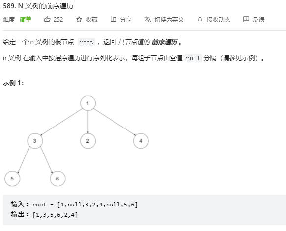
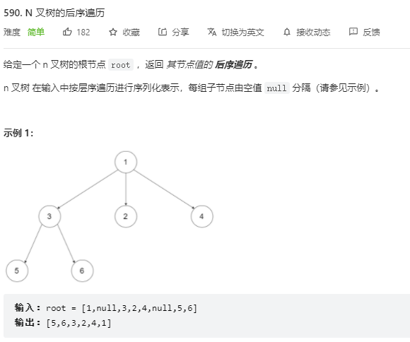
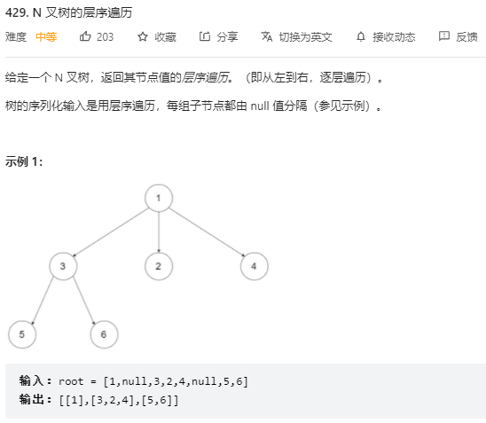
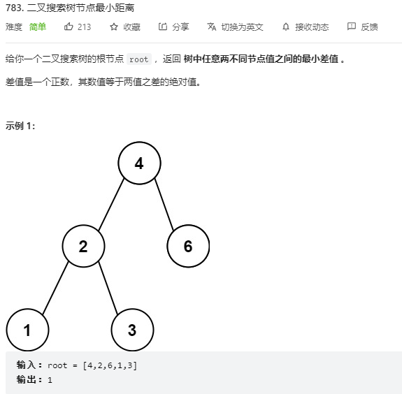
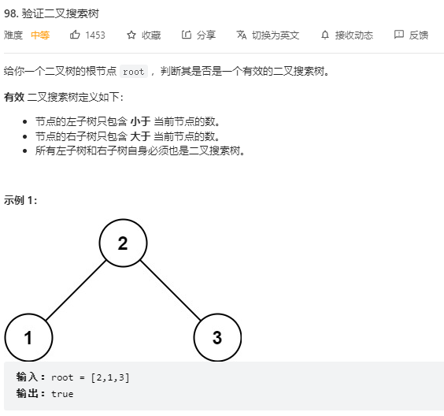

---
# 这是页面的图标
icon: page

# 这是文章的标题
title: 树相关练习

# 设置作者
author: lllllan

# 设置写作时间
# time: 2020-01-20

# 一个页面只能有一个分类
category: 刷题

# 一个页面可以有多个标签
tag:

# 此页面会在文章列表置顶
# sticky: true

# 此页面会出现在首页的文章板块中
star: true

# 你可以自定义页脚
# footer: 
---


## 一、树遍历


### 1. [144. 二叉树的前序遍历 - 力扣（LeetCode） (leetcode-cn.com)](https://leetcode-cn.com/problems/binary-tree-preorder-traversal/)

> 

```java
/**
 * Definition for a binary tree node.
 * public class TreeNode {
 *     int val;
 *     TreeNode left;
 *     TreeNode right;
 *     TreeNode() {}
 *     TreeNode(int val) { this.val = val; }
 *     TreeNode(int val, TreeNode left, TreeNode right) {
 *         this.val = val;
 *         this.left = left;
 *         this.right = right;
 *     }
 * }
 */
class Solution {

    List<Integer> list = new LinkedList<>();

    public void pre(TreeNode root) {
        if (root == null) return;
        list.add(root.val);
        pre(root.left);
        pre(root.right);
    }

    public List<Integer> preorderTraversal(TreeNode root) {
        pre(root);
        return list;
    }
}
```


### 2. [94. 二叉树的中序遍历 - 力扣（LeetCode） (leetcode-cn.com)](https://leetcode-cn.com/problems/binary-tree-inorder-traversal/)

```java
/**
 * Definition for a binary tree node.
 * public class TreeNode {
 *     int val;
 *     TreeNode left;
 *     TreeNode right;
 *     TreeNode() {}
 *     TreeNode(int val) { this.val = val; }
 *     TreeNode(int val, TreeNode left, TreeNode right) {
 *         this.val = val;
 *         this.left = left;
 *         this.right = right;
 *     }
 * }
 */
class Solution {

    List<Integer> list = new LinkedList<>();

    public void inorder(TreeNode root) {
        if (root == null) return;
        inorder(root.left);
        list.add(root.val);
        inorder(root.right);
    }

    public List<Integer> inorderTraversal(TreeNode root) {
        inorder(root);
        return list;
    }
}
```


### 3. [145. 二叉树的后序遍历 - 力扣（LeetCode） (leetcode-cn.com)](https://leetcode-cn.com/problems/binary-tree-postorder-traversal/)

```java
/**
 * Definition for a binary tree node.
 * public class TreeNode {
 *     int val;
 *     TreeNode left;
 *     TreeNode right;
 *     TreeNode() {}
 *     TreeNode(int val) { this.val = val; }
 *     TreeNode(int val, TreeNode left, TreeNode right) {
 *         this.val = val;
 *         this.left = left;
 *         this.right = right;
 *     }
 * }
 */
class Solution {

    List<Integer> list = new LinkedList<>();

    public void post(TreeNode root) {
        if (root == null) return;
        post(root.left);
        post(root.right);
        list.add(root.val);
    }

    public List<Integer> postorderTraversal(TreeNode root) {
        post(root);
        return list;
    }
}
```


### 4. [589. N 叉树的前序遍历 - 力扣（LeetCode） (leetcode-cn.com)](https://leetcode-cn.com/problems/n-ary-tree-preorder-traversal/)

> 

```java
/*
// Definition for a Node.
class Node {
    public int val;
    public List<Node> children;

    public Node() {}

    public Node(int _val) {
        val = _val;
    }

    public Node(int _val, List<Node> _children) {
        val = _val;
        children = _children;
    }
};
*/

class Solution {

    List<Integer> list = new LinkedList<>();

    public void pre(Node root) {
        if (root == null) return;
        list.add(root.val);
        for (Node node : root.children) {
            pre(node);
        }
    }

    public List<Integer> preorder(Node root) {
        pre(root);
        return list;
    }
}
```


### 5. [590. N 叉树的后序遍历 - 力扣（LeetCode） (leetcode-cn.com)](https://leetcode-cn.com/problems/n-ary-tree-postorder-traversal/)

> 

```java
/*
// Definition for a Node.
class Node {
    public int val;
    public List<Node> children;

    public Node() {}

    public Node(int _val) {
        val = _val;
    }

    public Node(int _val, List<Node> _children) {
        val = _val;
        children = _children;
    }
};
*/

class Solution {

    List<Integer> list = new LinkedList<>();

    public void post(Node root) {
        if (root == null) return;
        for (Node node : root.children) {
            post(node);
        }
        list.add(root.val);
    }

    public List<Integer> postorder(Node root) {
        post(root);
        return list;
    }
}
```


### 6. [429. N 叉树的层序遍历 - 力扣（LeetCode） (leetcode-cn.com)](https://leetcode-cn.com/problems/n-ary-tree-level-order-traversal/)

> 

```java
/*
// Definition for a Node.
class Node {
    public int val;
    public List<Node> children;

    public Node() {}

    public Node(int _val) {
        val = _val;
    }

    public Node(int _val, List<Node> _children) {
        val = _val;
        children = _children;
    }
};
*/

class Solution {
    List<List<Integer>> list = new LinkedList<>();
    Queue<Node> Q = new LinkedList<>();

    public List<List<Integer>> levelOrder(Node root) {
        if (root == null) return list;
        Q.add(root);
        while (Q.size() > 0) {
            int len = Q.size();
            List<Integer> l = new LinkedList<>();
            for (int i = 0; i < len; ++i) {
                Node node = Q.poll();
                if (node == null) continue;
                l.add(node.val);
                for (Node child : node.children) {
                    Q.add(child);
                }
            }
            list.add(l);
        }
        return list;
    }
}
```


## 二、二叉搜索树

### 1. [783. 二叉搜索树节点最小距离 - 力扣（LeetCode） (leetcode-cn.com)](https://leetcode-cn.com/problems/minimum-distance-between-bst-nodes/)

> 

```java
/**
 * Definition for a binary tree node.
 * public class TreeNode {
 *     int val;
 *     TreeNode left;
 *     TreeNode right;
 *     TreeNode() {}
 *     TreeNode(int val) { this.val = val; }
 *     TreeNode(int val, TreeNode left, TreeNode right) {
 *         this.val = val;
 *         this.left = left;
 *         this.right = right;
 *     }
 * }
 */
class Solution {

    int ans = Integer.MAX_VALUE;

    public int[] dfs(TreeNode root) {
        int left = root.val;
        int right = root.val;
        if (root.left != null) {
            int[] arr = dfs(root.left);
            left = arr[0];
            ans = Math.min(ans, root.val - arr[1]); 
        }
        if (root.right != null) { 
            int[] arr = dfs(root.right);
            right = arr[1];
            ans = Math.min(ans, arr[0] - root.val);
        }
        return new int[]{left, right};
    }

    public int minDiffInBST(TreeNode root) {
        dfs(root);
        return ans;
    }
}
```


### 2. [98. 验证二叉搜索树 - 力扣（LeetCode） (leetcode-cn.com)](https://leetcode-cn.com/problems/validate-binary-search-tree/)

> 

```java
/**
 * Definition for a binary tree node.
 * public class TreeNode {
 *     int val;
 *     TreeNode left;
 *     TreeNode right;
 *     TreeNode() {}
 *     TreeNode(int val) { this.val = val; }
 *     TreeNode(int val, TreeNode left, TreeNode right) {
 *         this.val = val;
 *         this.left = left;
 *         this.right = right;
 *     }
 * }
 */
class Solution {

    boolean ans = true;

    public int[] dfs(TreeNode root) { 
        int left = root.val;
        int right = root.val;

        if (root.left != null) {
            if (root.val <= root.left.val) ans = false;
            int[] arr = dfs(root.left);
            left = arr[0];
            if (root.val <= arr[1]) ans = false;
        }
        if (root.right != null) {
            if (root.val >= root.right.val) ans = false;
            int[] arr = dfs(root.right);
            right = arr[1];
            if (root.val >= arr[0]) ans = false;
        }

        return new int[]{left, right};
    }

    public boolean isValidBST(TreeNode root) {
        dfs(root);
        return ans;
    }
}
```

