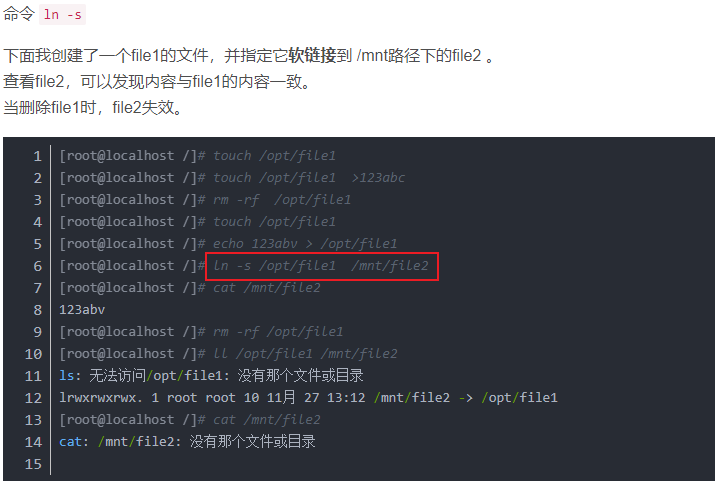
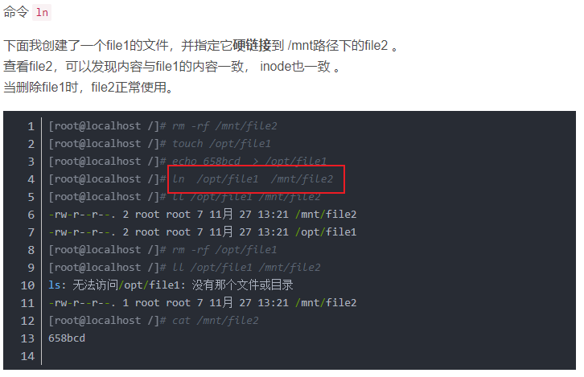
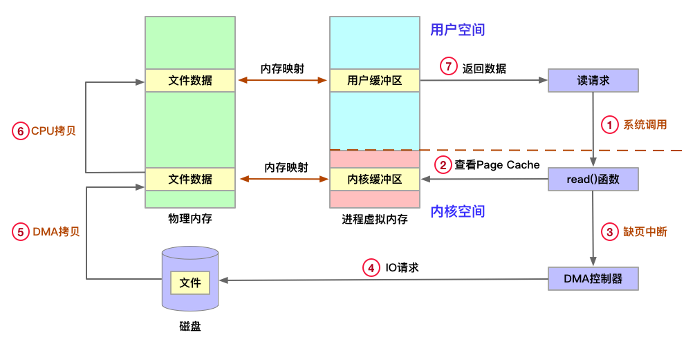
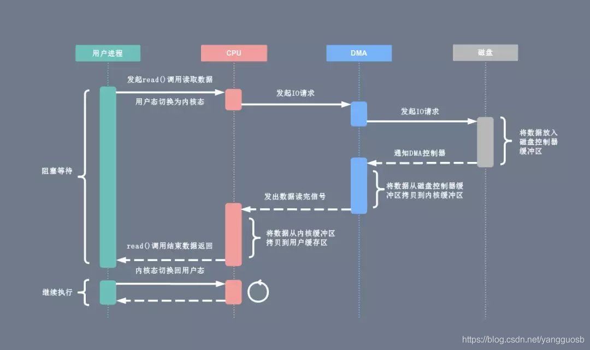
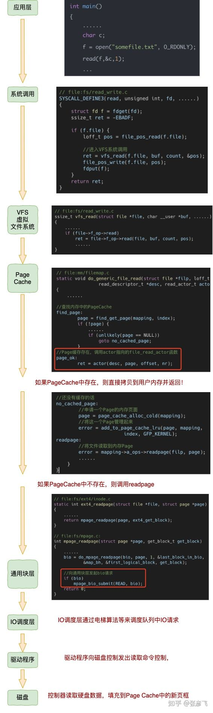
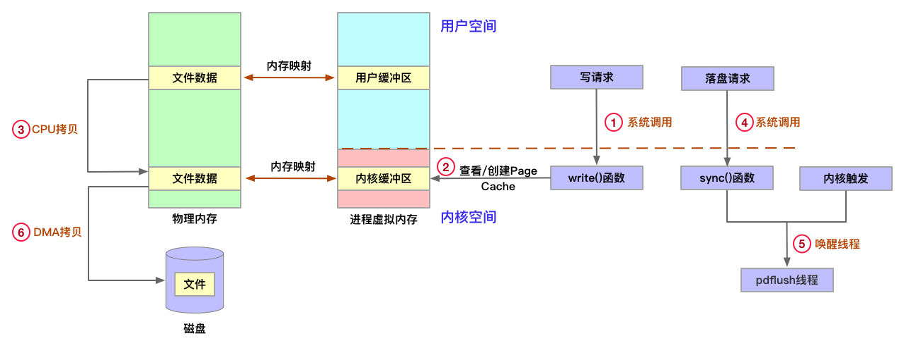
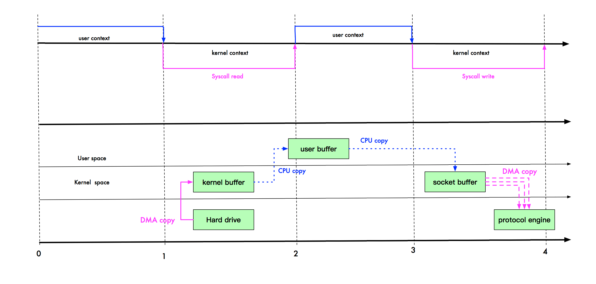
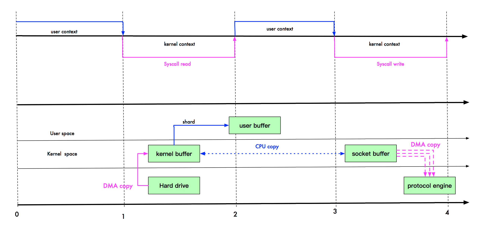

---
# 这是页面的图标
icon: page

# 这是文章的标题
title: TikTok 后端开发 一面

# 设置作者
author: lllllan

# 设置写作时间
# time: 2020-01-20

# 一个页面只能有一个分类
category: 面经

# 一个页面可以有多个标签
tag:

# 此页面会在文章列表置顶
# sticky: true

# 此页面会出现在首页的文章板块中
star: true

# 你可以自定义页脚
# footer: 
---


::: warning 

转载自以下文章：

1. [面试经验｜个人秋招经验和面筋分享](https://leetcode-cn.com/circle/discuss/JlrHm3/)
2. [剖析Linux内核文件系统之（inode）](https://zhuanlan.zhihu.com/p/385384549)
3. [什么是软连接什么是硬链接](https://blog.csdn.net/qq_26129413/article/details/110228234)
3. [Linux基础之文件读写流程](https://blog.csdn.net/yangguosb/article/details/77886826)
3. [深度理解 Linux 读取文件过程！](https://zhuanlan.zhihu.com/p/371574406)
3. [零拷贝 - 莫那-鲁道](https://www.cnblogs.com/stateis0/p/10960579.html)

:::


## 一、 Linux 文件系统相关


### 1.1 inode结构

> inode(发音：eye-node)译成中文就是[索引节点](https://baike.baidu.com/item/索引节点/4506518)，它用来存放档案及目录的基本信息，包含时间、档名、使用者及群组等。

（截图转载自 [剖析Linux内核文件系统之（inode）](https://zhuanlan.zhihu.com/p/385384549)）


*inode* 是 UNIX 操作系统中的一种数据结构，其本质是结构体，它包含了与文件系统中各个文件相关的一些重要信息:

- inode 编号
- 用来识别文件类型，以及用于 stat C 函数的模式信息
- 文件的链接数目
- 属主的ID (UID)
- 属主的组 ID (GID)
- 文件的大小
- 文件所使用的磁盘块的实际数目
- 最近一次修改的时间 
- 最近一次访问的时间
- 最近一次更改的时间


### 1.2 软链接

> 软链接又叫[符号链接](https://baike.baidu.com/item/符号链接/7177630)，这个文件包含了另一个文件的路径名。可以是任意文件或目录，可以链接不同文件系统的文件。

类同与 `windos` 的快捷方式，给文件创建一个快速的访问路径，它依赖于原文件，与普通文件没什么不同，inode 都指向同一个文件在硬盘中的区块。当原文件出现问题后，该链接不可用。

1. 可以应用于目录
2. 可以跨文件系统
3. 不会增加被链接文件的链接次数
4. 大小为指定的绝对路径所包含的字符总数
5. 有自己的inode号
6. 权限无关紧要


**如何实现软链接：**

```shell
ln -s
```

（截图转载自 [什么是软连接什么是硬链接](https://blog.csdn.net/qq_26129413/article/details/110228234)）




### 1.3 硬链接

> 硬链接（hard link，也称链接）就是一个文件的一个或多个文件名。再说白点，所谓[链接](https://baike.baidu.com/item/链接/2665501)无非是把文件名和计算机文件系统使用的节点号链接起来。因此我们可以用多个文件名与同一个文件进行链接，这些文件名可以在同一目录或不同目录。

- 硬链接，以文件副本的形式存在。但不占用实际空间。
- 不允许给目录创建硬链接。
- 硬链接只有在同一个文件系统中才能创建。
- 删除其中一个硬链接文件并不影响其他有相同 inode 号的文件。


**如何实现硬链接：**

```shell
ln
```

（截图转载自 [什么是软连接什么是硬链接](https://blog.csdn.net/qq_26129413/article/details/110228234)）




### 1.4 文件描述符是什么，怎么去修改，最多允许多少？

> [内核](https://baike.baidu.com/item/内核/108410)（kernel）利用文件描述符（file descriptor）来访问文件。文件描述符是[非负整数](https://baike.baidu.com/item/非负整数/2951833)。打开现存文件或新建文件时，内核会返回一个文件描述符。读写文件也需要使用文件描述符来指定待读写的文件。

（其他不知道，查了看不懂）


## 二、 Linux 读写数据


### 2.1 读流程

1. 应用程序发起读请求，触发 **系统调用 `read()` 函数**，用户切换为 ==内核态==
2. 文件系统通过 `目录项 -> inode -> address_space -> 页缓存树`，查询 Page Cache 是否存在
3. Page Cache 不存在产生缺页中断， **CPU 向 DMA 发出控制指令**
4. DMA 控制器将数据从主存或硬盘拷贝到内核空间的缓冲区
5. DMA 磁盘控制器向 CPU 发出数据读完的信号，由 CPU 负责将**数据从内核缓冲区拷贝到用户缓冲区**
6. 用户进程由内核态切换回 ==用户态== ，获得文件数据








### 2.2 写流程

1. 应用程序发起写请求，触发 **系统调用 `write()` 函数**，用户态切换为 ==内核态==
2. 文件系统通过 `目录项 -> inode -> address_space -> 页缓存树`，查询 Page Cache是否存在，如果不存在则需要创建
3. Page Cache 存在后，CPU 将数据**从用户缓冲区拷贝到内核缓冲区**，Page Cache 变为脏页，写流程返回
4. 用户主动触发刷盘或者达到特定条件内核触发刷盘，唤醒 pdflush 线程将内核缓冲区的数据刷入磁盘




### 2.3 Mmap 和 sendFile 函数零拷贝的原理


#### 2.3.1 传统IO的劣势

```java
File file = new File("index.html");
RandomAccessFile raf = new RandomAccessFile(file, "rw");
 
byte[] arr = new byte[(int) file.length()];
raf.read(arr);
 
Socket socket = new ServerSocket(8080).accept();
socket.getOutputStream().write(arr);
```

1. 调用 read，用户态变为内核态。**第一次数据拷贝**：DMA（Direct Memory Access 直接测内存存取，即不适用CPU拷贝数据到内存，而是DMA引擎传输数据到内存，用于解放CPU）引擎从磁盘读取文件，并将数据放入到内核缓冲区
2. 内核态变为用户态。**第二次数据拷贝**：即内核缓冲区的数据拷贝到用户缓冲区
3. 调用 write，用户态变为内核态。**第三次数据拷贝**：系统将用户缓冲区的数据拷贝到Socket缓冲区
4. **第四次数据拷贝**：数据异步从 Socket 缓冲区，使用DMA引擎拷贝到网络协议引擎
5. 内核态变为用户态。



**复制拷贝操作太多了**


#### 2.3.2 Mmap 优化

Mmap 通过内存映射，将文件映射到内核缓冲区，同时，用户空间可以共享内核空间的数据。这样，在进行网络传输时，就可以减少内核空间到用户空间的拷贝次数。如下图



如上图，user buffer 和 kernel buffer 共享 index.html。如果你想把硬盘的 index.html 传输到网络中，再也不用拷贝到用户空间，再从用户空间拷贝到 Socket 缓冲区。

  现在，你只需要从内核缓冲区拷贝到 Socket 缓冲区即可，这将减少一次内存拷贝（从 4 次变成了 3 次），但不减少上下文切换次数。

