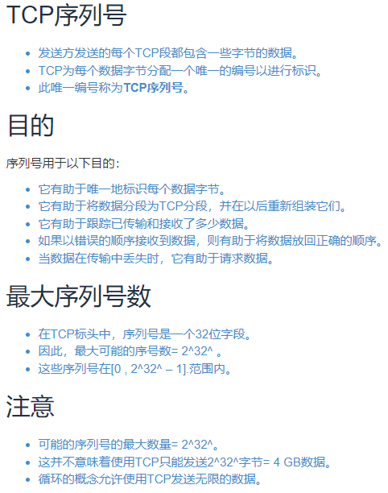

---
# 这是页面的图标
icon: page

# 这是文章的标题
title: 【腾讯】Java岗 暑期实习面经

# 设置作者
author: lllllan

# 设置写作时间
# time: 2020-01-20

# 一个页面只能有一个分类
category: 面经

# 一个页面可以有多个标签
tag:

# 此页面会在文章列表置顶
# sticky: true

# 此页面会出现在首页的文章板块中
star: true

# 你可以自定义页脚
# footer: 

---

::: warning 

转载自以下文章：

1. [【腾讯】Java岗-暑假实习面经](https://www.iamshuaidi.com/2251.html)
2. [MySQL存储引擎精讲](http://c.biancheng.net/view/2418.html)
2. [Mysql 中 MyISAM 和 InnoDB 的区别有哪些？](https://www.zhihu.com/question/20596402/answer/211492971)
2. [TCP 、UDP、IP包的最大长度 - 江召伟](https://www.cnblogs.com/jiangzhaowei/p/9273854.html)
2. [TCP序列号 与 序列号循环介绍](https://www.gingerdoc.com/tcp-seq-and-loop)
2. [TCP协议中的序列号 - alifpga](https://www.cnblogs.com/alifpga/p/7675799.html)
2. [一文搞懂TCP与UDP的区别 - Fundebug](https://www.cnblogs.com/fundebug/p/differences-of-tcp-and-udp.html)

:::

## 一、项目

（应该就是和面试官聊聊自己的项目，做了什么，应用了什么）

## 二、MySQL 存储引擎及使用场景

### 2.1 什么是存储引擎

**数据库引擎是数据库 ==底层软件组织==**

MySQL中的数据用各种不同的技术存储在文件（或者内存）中。这些技术中的每一种技术都使用不同的存储机制、索引技巧、锁定水平并且最终提供广泛的不同的功能和能力。通过选择不同的技术，你能够获得额外的速度或者功能，从而改善你的应用的整体功能。

### 2.2 MySQL 各种存储引擎

|     功能     | MyISAM  | MEMORY  | InnoDB  | Archive |
| :----------: | :-----: | :-----: | :-----: | :-----: |
|   存储限制   |  256TB  |   RAM   |  64TB   |  None   |
|   支持事务   |   No    |   No    | ==Yes== |   No    |
| 支持全文索引 | ==Yes== |   No    |   No    |   No    |
|  支持树索引  |   Yes   |   Yes   |   Yes   |   No    |
| 支持哈希索引 |   No    | ==Yes== |   No    |   No    |
| 支持数据缓存 |   No    |   N/A   | ==Yes== |   No    |
|   支持外键   |   No    |   No    | ==Yes== |   No    |

### 2.3 存储引擎的选择

1. 如果需要提供提交、回滚和恢复的 ==事务安全== 能力，并要求 ==并发控制==  → InnoDB
2. 如果数据表主要用来 ==插入和查询== 记录 → MyISAM
3. 如果只是临时存放数据，==数据量不大==，并且**不需要提高数据的安全性** → MEMORY
4. 如果 ==只有插入和查询== → Archive，支持高并发的插入，但是非事务安全

### 2.4 MyISAM 和 InnoDB 的区别

**区别：**

1. InnoDB 支持事务，MyISAM 不支持事务。这是 MySQL 将默认存储引擎从 MyISAM 编程的 InnoDB 的重要原因之一。
2. InnoDB 支持外键，MyISAM 不支持。
3. InnoDB 事聚集索引，MyISAM 是非聚集索引。
4. InnoDB 不保存表的具体行数，执行 `select count(*) from table` 需要全表扫描。 而 MyISAM 用一个变量保存了整个表的行数，查询行数时速度更快。
5. InnoDB 最小的锁粒度是行锁，MyISAM 最小的锁粒度是表锁。一个更新语句会锁住整张表，导致其他查询和更新都会被阻塞，因此并发访问受限。

**如何选择：**

1. 需要支持事务，InnoDB
2. 主要是查询工作，MyISAM；如果读写也频繁，InnoDB
3. MyISAM 系统崩溃后恢复更困难

## 三、B+树（待学）

B+树是一种树数据结构，通常用于[数据库](https://baike.baidu.com/item/数据库)和[操作系统](https://baike.baidu.com/item/操作系统)的[文件系统](https://baike.baidu.com/item/文件系统)中。B+树的特点是能够保持数据稳定有序，其插入与修改拥有较稳定的[对数](https://baike.baidu.com/item/对数/91326)时间复杂度。B+树元素自底向上插入，这与[二叉树](https://baike.baidu.com/item/二叉树)恰好相反。

## 四、TCP

### 4.1 三次握手

三次握手：为了对每次发送的数据量进行跟踪与协商，**确保数据段的发送和接收同步**，根据所接收到的数据量而确认数据发送、接收完毕后何时撤销联系，并建立虚连接。

具体看 [计算机网络-常见面试题 | lllllan](../../../3-cs-basic/1-network/2-interview-questions/#_2-1-三次握手流程)

1. 客户端向服务器端发送连接请求，`SYN = 1, seq = x`
2. 服务器端接收后返回确认报文，`ACK = 1, SYN = 1, ack = x + 1, seq = y`
3. 客户端再次发送确认，`ACK = 1, ack = y + 1, seq = x + 1`

### 4.2 四次挥手

四次挥手，别名连接终止协议。其性质为终止协议。

具体看 [计算机网络-常见面试题 | lllllan](../../../3-cs-basic/1-network/2-interview-questions/#_3-1-四次挥手流程)

1. 客户端向服务器端发送释放连接报文，`FIN = 1, seq = x`
2. 服务器端接收到返回确认报文，`ACK = 1, ack = x + 1, seq = y`
3. 服务器端向客户端发送释放连接报文，`FIN = 1, ack = x + 1, seq = y`
4. 客户端接收到返回确认报文，`ACK = 1, ack = y + 1, seq = x + 1`

### 4.3 TCP 包一次最多发送多少数据

1. 链路层，数据帧的内容最大为 1500（不包括帧头和帧尾），即 MTU 为1500.
2. 网络层，IP 包的首部要占用20字节
3. 传输层：
    1. UDP 包首部占用8字节，MSS = 1500 - 20 - 8 = 1472
    2. TCP 包首部占用20字节，MSS = 1500 - 20 - 20 = 1460

### 4.4 TCP 序列号

TCP 协议工作在OSI的传输层，是一种可靠的面向连接的数据流协议，TCP之所以可靠，是因为它保证了传送数据包的顺序。顺序是用一个序列号来保证的。响应包内也包括一个序列号，表示接收方准备好这个序列号的包。在TCP传送一个数据包时，它会把这个数据包放入重发队列中，同时启动计时器，如果收到了关于这个包的确认信息，便将此数据包从队列中删除，如果在计时器超时的时候仍然没有收到确认信息，则需要重新发送该数据包。另外，TCP通过数据分段中的序列号来 保证所有传输的数据可以按照正常的顺序进行重组，从而保障数据传输的完整。

在TCP通讯中主要有连接的建立、数据的传输、连接的关闭三个过程！每个过程完成不同的工作，而且序列号和确认号在每个过程中的变化都是不同的。

TCP会话的每一端都包含一个32位（bit）的序列号，该序列号被用来跟踪该端发送的数据量。每一个包中都包含序列号，在接收端则通过确认号用来通知发送端数据成功接收。

## 五、TCP 和 UDP 

### 5.1 TCP和UDP的区别总结

具体看 [一文搞懂TCP与UDP的区别 - Fundebug](https://www.cnblogs.com/fundebug/p/differences-of-tcp-and-udp.html)

|              |                    UDP                     |                  TCP                   |
| :----------: | :----------------------------------------: | :------------------------------------: |
|   是否连接   |                   无连接                   |                面向连接                |
|   是否可靠   |    不可靠传输，不使用流量控制和拥塞控制    |    可靠传输，使用流量控制和拥塞控制    |
| 连接对象个数 | 支持一对一，一对多，多对一和多对多交互通信 |            只能是一对一通信            |
|   传输方式   |                  面向报文                  |               面向字节流               |
|   首部开销   |            首部开销小，仅8字节             |       首部最小20字节，最大60字节       |
|   适用场景   | 适用于实时应用（IP电话、视频会议、直播等） | 适用于要求可靠传输的应用，例如文件传输 |

- TCP向上层提供面向连接的可靠服务 ，UDP向上层提供无连接不可靠服务。
- 虽然 UDP 并没有 TCP 传输来的准确，但是也能在很多实时性要求高的地方有所作为
- 对数据准确性要求高，速度可以相对较慢的，可以选用TCP

### 5.2 可靠传输

可靠传输，就是采用一系列技术来保障信息在发送方和接收方准确、精确的传输。

具体见 [计算机网络-常见面试题 | lllllan](../../../3-cs-basic/1-network/2-interview-questions/#五、tcp协议如何保证可靠传输)

## 六、未完

