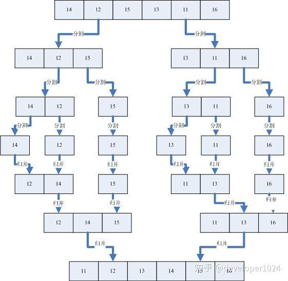

---
# 这是页面的图标
icon: page

# 这是文章的标题
title: 排序算法

# 设置作者
author: lllllan

# 设置写作时间
# time: 2020-01-20

# 一个页面只能有一个分类
category: 数据结构和算法

# 一个页面可以有多个标签
tag:
- 算法
- 排序

# 此页面会在文章列表置顶
# sticky: true

# 此页面会出现在首页的文章板块中
star: true

# 你可以自定义页脚
# footer: 
---


::: warning 转载声明

- [java实现10种排序算法](https://blog.csdn.net/weixin_44531966/article/details/116464294)
- [十大经典排序算法的复杂度分析](https://blog.csdn.net/alzzw/article/details/98100378)

- [排序：希尔排序](https://www.jianshu.com/p/d730ae586cf3)
- [10大经典排序算法动图演示，看这篇就够了！](https://www.cnblogs.com/aishangJava/p/10092341.html)
- 

:::


## 一、冒泡排序

时间复杂度：O(n^2^)

空间复杂度：O(1)

```java
import java.util.Arrays;

public class Solution {
    public static void main(String[] args) {
        int[] arr = {3, 44, 38, 5, 47, 15, 36, 26, 27, 2, 46, 4, 19, 50, 48};

        for (int i = 0, len = arr.length; i < len; ++i) {
            for (int j = len - 1; j > i; --j) {
                if (arr[j] < arr[j - 1]) {
                    int tmp = arr[j];
                    arr[j] = arr[j - 1];
                    arr[j - 1] = tmp;
                }
            }
        }

        System.out.println(Arrays.toString(arr));
    }
}
```


## 二、选择排序

时间复杂度：O(n^2^)

空间复杂度：O(1)


```java
import java.util.Arrays;

public class Solution {
    public static void main(String[] args) {
        int[] arr = {3, 44, 38, 5, 47, 15, 36, 26, 27, 2, 46, 4, 19, 50, 48};

        for (int i = 0, len = arr.length; i < len; ++i) {
            int idx = i;
            for (int j = i + 1; j < len; ++j) {
                if (arr[j] < arr[idx]) idx = j;
            }
            int tmp = arr[i];
            arr[i] = arr[idx];
            arr[idx] = tmp;
        }

        System.out.println(Arrays.toString(arr));
    }
}
```


## 三、插入排序

时间复杂度：O(n^2^)

空间复杂度：O(1)


```java
import java.util.Arrays;

public class Solution {
    public static void main(String[] args) {
        int[] arr = {3, 44, 38, 5, 47, 15, 36, 26, 27, 2, 46, 4, 19, 50, 48};

        for (int i = 0, len = arr.length; i < len; ++i) {
            int val = arr[i];
            int idx = i - 1;

            while (idx >= 0 && arr[idx] > val) {
                arr[idx + 1] = arr[idx];
                idx--;
            }
            arr[idx + 1] = val;
        }

        System.out.println(Arrays.toString(arr));
    }
}
```


## 四、希尔排序

时间复杂度：O(nlog~2~n)

空间复杂度：O(1)

希尔排序是将待排序的数组元素 按下标的一定增量分组 ，分成多个子序列，然后对各个子序列进行直接插入排序算法排序；然后依次缩减增量再进行排序，直到增量为1时，进行最后一次直接插入排序，排序结束。


```java
import java.util.Arrays;

public class Solution {
    public static void main(String[] args) {
        int[] arr = {3, 44, 38, 5, 47, 15, 36, 26, 27, 2, 46, 4, 19, 50, 48};

        int len = arr.length;
        for (int step = len / 2; step > 0; step /= 2) {
            for (int i = step; i < len; ++i) {
                for (int j = i - step; j >= 0; j -= step) {
                    if (arr[j] > arr[j + step]) {
                        int tmp = arr[j];
                        arr[j] = arr[j + step];
                        arr[j + step] = tmp;
                    }
                }
            }
        }

        System.out.println(Arrays.toString(arr));
    }
}
```


## 五、快速排序

时间复杂度：O(nlog~2~n)

空间复杂度：O(logn)

排序算法的思想非常简单，在待排序的数列中，我们首先要找一个数字作为基准数（这只是个专用名词）。为了方便，我们一般选择第 1 个数字作为基准数（其实选择第几个并没有关系）。接下来我们需要把这个待排序的数列中小于基准数的元素移动到待排序的数列的左边，把大于基准数的元素移动到待排序的数列的右边。这时，左右两个分区的元素就相对有序了；接着把两个分区的元素分别按照上面两种方法继续对每个分区找出基准数，然后移动，直到各个分区只有一个数时为止。


```java
import java.util.Arrays;

public class Solution {

    public static void sort(int[] arr, int l, int r) {
        if (l > r) return;

        int i = l, j = r;
        int tmp = arr[l];
        while (i < j) {
            while (tmp <= arr[j] && i < j) --j;
            while (tmp >= arr[i] && i < j) ++i;
            if (i < j) {
                int tem = arr[i];
                arr[i] = arr[j];
                arr[j] = tem;
            }
        }
        arr[l] = arr[i];
        arr[i] = tmp;

        sort(arr, l, j - 1);
        sort(arr, j + 1, r);
    }

    public static void main(String[] args) {
        int[] arr = {3, 44, 38, 5, 47, 15, 36, 26, 27, 2, 46, 4, 19, 50, 48};

        sort(arr, 0, arr.length - 1);

        System.out.println(Arrays.toString(arr));
    }
}
```


## 六、归并排序

时间复杂度：O(nlog~2~n)

空间复杂度：O(n)




```java
import java.util.Arrays;

public class Solution {

    public static void merge(int[] arr, int l1, int r1, int l2, int r2) {
        int L = l1, R = r2;
        int[] tar = new int[arr.length];

        int idx = l1;
        while (l1 <= r1 && l2 <= r2) {
            if (arr[l1] < arr[l2]) {
                tar[idx++] = arr[l1++];
            } else {
                tar[idx++] = arr[l2++];
            }
        }
        while (l1 <= r1) {
            tar[idx++] = arr[l1++];
        }
        while (l2 <= r2) {
            tar[idx++] = arr[l2++];
        }

        System.arraycopy(tar, L, arr, L, R - L + 1);
    }

    public static void sort(int[] arr, int l, int r) {
        if (l < r) {
            int mid = l + (r - l) / 2;
            sort(arr, l, mid);
            sort(arr, mid + 1, r);
            merge(arr, l, mid, mid + 1, r);
        }
    }

    public static void main(String[] args) {
        int[] arr = {3, 44, 38, 5, 47, 15, 36, 26, 27, 2, 46, 4, 19, 50, 48};

        sort(arr, 0, arr.length - 1);

        System.out.println(Arrays.toString(arr));
    }
}
```

