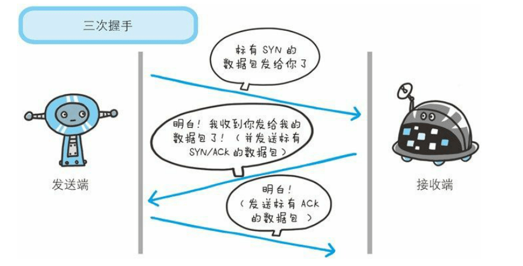

---
# 这是页面的图标
icon: info

# 这是文章的标题
title: 三次握手

# 设置作者
author: lllllan

# 设置写作时间
# time: 2020-01-20

# 一个页面只能有一个分类
category: 计算机基础

# 一个页面可以有多个标签
tag:
- 计算机网络
- 面试题

# 此页面会在文章列表置顶
# sticky: true

# 此页面会出现在首页的文章板块中
star: true

# 你可以自定义页脚
# footer: 
---

三次握手：为了对每次发送的数据量进行跟踪与协商，**确保数据段的发送和接收同步**，根据所接收到的数据量而确认数据发送、接收完毕后何时撤销联系，并建立虚连接。

所谓三次握手(Three-way Handshake)，是指建立一个TCP连接时，需要客户端和服务器总共发送3个包。

##  TCP 三次握手漫画图解

- 客户端 → 发送带有 SYN 标志的数据包 → 服务端
- 服务端 → 发送带有 SYN/ACK 标志的数据包 → 客户端
- 客户端 → 发送带有带有 ACK 标志的数据包 → 服务端

## 三次握手流程

> **最开始的时候客户端和服务器都是处于CLOSED状态。主动打开连接的为客户端，被动打开连接的是服务器。**

1. **服务器进入监听状态 - LISTEN**：TCP服务器进程先创建传输控制块TCB，时刻准备接受客户进程的连接请求，此时服务器就进入了LISTEN（监听）状态；
2. **客户发送连接请求 - SYN-SENT**：TCP客户进程也是先创建传输控制块TCB，然后向服务器发出连接请求报文，这是报文首部中的同部位 `SYN = 1`，同时选择一个初始序列号 `seq = x` ，此时，TCP客户端进程进入了 `SYN-SENT`（同步已发送状态）状态。TCP规定，SYN报文段（SYN=1的报文段）不能携带数据，但需要消耗掉一个序号。
3. **服务器返回确认报文 - SYN-RCVD**：TCP服务器收到请求报文后，如果同意连接，则发出确认报文。确认报文中应该 `ACK = 1，SYN = 1`，确认号是 `ack = x+1`，同时也要为自己初始化一个序列号 `seq = y`，此时，TCP服务器进程进入了SYN-RCVD（同步收到）状态。这个报文也不能携带数据，但是同样要消耗一个序号。
4. **客户再次发送确认 - ESTABLSHED**：TCP客户进程收到确认后，还要向服务器给出确认。确认报文的`ACK = 1，ack = y + 1`，自己的序列号 `seq = x + 1`，此时，TCP连接建立，客户端进入ESTABLISHED（已建立连接）状态。TCP规定，ACK报文段可以携带数据，但是如果不携带数据则不消耗序号。
5. **开始通信 - ESTABLISHED**：当服务器收到客户端的确认后也进入ESTABLISHED状态，此后双方就可以开始通信了。

::: center

|                            客户端                            |                            服务器                            |
| :----------------------------------------------------------: | :----------------------------------------------------------: |
|                                                              |         创建传输控制块TCB 进入监听状态 - LISTEN          |
| 创建传输控制块TCB 发送请求报文，`SYN=1, seq=x` 进入同步已经发送状态 - SYN-SENT |                                                              |
|                                                              | 发送确认报文，`ACK=1, SYN=1, ack=x+1, seq=y` 进入同步收到状态 - SYN-RCVD |
| 发送确认把稳，`ACK=1, ack=y+1, seq=x+1` 进入已建立连接状态 - ESTABLISHED |                                                              |
|                                                              |               进入已建立连接状态 - ESTABLISHED               |

:::

## 为什么要三次握手 ⭐

**三次握手的目的是建立可靠的通信信道，就是双方确认自己与对方的发送与接收是正常的。**

1. 第一次握手：Client 什么都不能确认；Server 确认了对方发送正常，自己接收正常
2. 第二次握手：Client 确认了：自己发送、接收正常，对方发送、接收正常；Server 确认了：对方发送正常，自己接收正常
3. 第三次握手：Client 确认了：自己发送、接收正常，对方发送、接收正常；Server 确认了：自己发送、接收正常，对方发送、接收正常

## 第二次握手传回了ACK，为什么还要传SYN？

> 发送ACK是对客户端请求的确认。
>
> 回传SYN是服务器对客户端的连接请求。

**SYN 同步序列编号**(Synchronize Sequence Numbers) 是 TCP/IP 建立连接时使用的握手信号。在客户机和服务器之间建立正常的 TCP 网络连接时，客户机首先发出一个 SYN 消息，服务器使用 SYN-ACK 应答表示接收到了这个消息，最后客户机再以 ACK(Acknowledgement）消息响应。这样在客户机和服务器之间才能建立起可靠的 TCP 连接，数据才可以在客户机和服务器之间传递

## 为什么还需要第三次握手？⭐

**主要防止已经失效的连接请求报文突然又传送到了服务器，从而产生错误。**

如果使用的是两次握手建立连接，假设有这样一种场景，客户端发送了第一个请求连接并且没有丢失，只是因为在网络结点中滞留的时间太长了，由于TCP的客户端迟迟没有收到确认报文，以为服务器没有收到，此时重新向服务器发送这条报文，此后客户端和服务器经过两次握手完成连接，传输数据，然后关闭连接。此时此前滞留的那一次请求连接，网络通畅了到达了服务器，这个报文本该是失效的，但是，两次握手的机制将会让客户端和服务器再次建立连接，这将导致不必要的错误和资源的浪费。

如果采用的是三次握手，就算是那一次失效的报文传送过来了，服务端接受到了那条失效报文并且回复了确认报文，但是客户端不会再次发出确认。由于服务器收不到确认，就知道客户端并没有请求连接。

## TCP 三次握手期间的异常

### 第一次握手丢失

当客户端想和服务端建立 TCP 连接的时候，首先第一个发的就是 SYN 报文，然后进入到 `SYN-SENT` 状态。

如果这份报文丢失了，服务端就接收不到，自然就不会向客户端返回确认报文；而客户端迟迟都接收不到确认报文，就会触发超时重传机制。

不同版本的操作系统可能超时时间不同，这个超时时间是写死在内核里的。当客户端在 1 秒后没收到服务端的 SYN-ACK 报文后，客户端就会重发 SYN 报文。

在 Linux 里，客户端的 SYN 报文最大重传次数由 `tcp_syn_retries` 内核参数控制，这个参数是可以自定义的，默认值一般是 5。

通常，第一次超时重传是在 1 秒后，第二次超时重传是在 2 秒，第三次超时重传是在 4 秒后，第四次超时重传是在 8 秒后，第五次是在超时重传 16 秒后。没错，每次超时的时间是上一次的 2 倍。

当第五次超时重传后，会继续等待 32 秒，如果服务端仍然没有回应 ACK，客户端就不再发送 SYN 包，然后断开 TCP 连接。

所以，总耗时是 1+2+4+8+16+32=63 秒，大约 1 分钟左右。

### 第二次握手丢失

当服务端收到客户端的第一次握手后，就会回 `SYN-ACK` 报文给客户端，这个就是第二次握手，此时服务端会进入 `SYN-RCVD` 状态。

第二次握手的 SYN-ACK 报文其实有两个目的 ：

- ACK， 是对第一次握手的确认报文
- SYN，是服务端发起建立 TCP 连接的报文

因为第二次握手报文里是包含对客户端的第一次握手的 ACK 确认报文，所以，如果客户端迟迟没有收到第二次握手，那么客户端就觉得可能自己的 SYN 报文（第一次握手）丢失了，于是**客户端就会触发超时重传机制，重传 SYN 报文**。

因为第二次握手中包含服务端的 SYN 报文，所以当客户端收到后，需要给服务端发送 ACK 确认报文（第三次握手），服务端才会认为该 SYN 报文被客户端收到了。那么，如果第二次握手丢失了，服务端就收不到第三次握手，于是**服务端这边会触发超时重传机制，重传 SYN-ACK 报文**。

因此，当第二次握手丢失了，客户端和服务端都会重传：

- 客户端会重传 `SYN` 报文，也就是第一次握手，最大重传次数由 `tcp_syn_retries` 内核参数决定。；
- 服务端会重传 `SYN-ACK` 报文，也就是第二次握手，最大重传次数由 `tcp_synack_retries` 内核参数决定。

### 第三次握手丢失

客户端收到服务端的 SYN-ACK 报文后，就会给服务端回一个 ACK 报文，也就是第三次握手，此时客户端状态进入到 ESTABLISH 状态。

因为这个第三次握手的 ACK 是对第二次握手的 SYN 的确认报文，所以当第三次握手丢失了，如果服务端那一方迟迟收不到这个确认报文，就会触发超时重传机制，重传 SYN-ACK 报文，直到收到第三次握手，或者达到最大重传次数。

注意，ACK 报文是不会有重传的，当 ACK 丢失了，就由对方重传对应的报文。
