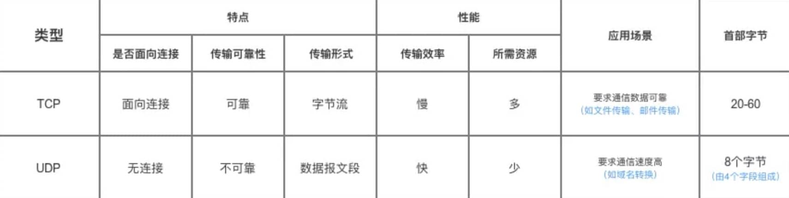

---
# 这是页面的图标
icon: page

# 这是文章的标题
title: 计算机网络-常见面试题

# 设置作者
author: lllllan

# 设置写作时间
# time: 2020-01-20

# 一个页面只能有一个分类
category: 

# 一个页面可以有多个标签
tag:

# 此页面会在文章列表置顶
# sticky: true

# 此页面会出现在首页的文章板块中
star: true

# 你可以自定义页脚
# footer: 
---

::: warning

本文转载自以下文章，略有改动。

- [什么是 JWT -- JSON WEB TOKEN - 简书 (jianshu.com)](https://www.jianshu.com/p/576dbf44b2ae)
- [JWT如何实现登录、鉴权 - 简书 (jianshu.com)](https://www.jianshu.com/p/e4d9dcda0558)
- [面试题：聊聊TCP的粘包、拆包以及解决方案 - 知乎 (zhihu.com)](https://zhuanlan.zhihu.com/p/356225028)
- [服务器端一个端口可以响应很多客户端的请求吗？-CSDN社区](https://bbs.csdn.net/topics/40099566)

:::

## TCP、UDP协议的区别

UDP 在传送数据之前不需要先建立连接，远地主机在收到 UDP 报文后，不需要给出任何确认。虽然 UDP 不提供可靠交付，但在某些情况下 UDP 却是一种最有效的工作方式（一般用于即时通信），比如： QQ 语音、 QQ 视频 、直播等等

TCP 提供面向连接的服务。在传送数据之前必须先建立连接，数据传送结束后要释放连接。 TCP 不提供广播或多播服务。由于 TCP 要提供可靠的，面向连接的传输服务（TCP 的可靠体现在 TCP 在传递数据之前，会有三次握手来建立连接，而且在数据传递时，有确认、窗口、重传、拥塞控制机制，在数据传完后，还会断开连接用来节约系统资源），这一难以避免增加了许多开销，如确认，流量控制，计时器以及连接管理等。这不仅使协议数据单元的首部增大很多，还要占用许多处理机资源。TCP 一般用于文件传输、发送和接收邮件、远程登录等场景。

## TCP协议如何保证可靠传输

1. 应用数据被分割成 TCP 认为最适合发送的数据块。
2. TCP 给发送的每一个包进行编号，接收方对数据包进行排序，把有序数据传送给应用层。
3. **校验和：** TCP 将保持它首部和数据的检验和。这是一个端到端的检验和，目的是检测数据在传输过程中的任何变化。如果收到段的检验和有差错，TCP 将丢弃这个报文段和不确认收到此报文段。
4. TCP 的接收端会丢弃重复的数据。
5. **流量控制：** TCP 连接的每一方都有固定大小的缓冲空间，TCP 的接收端只允许发送端发送接收端缓冲区能接纳的数据。当接收方来不及处理发送方的数据，能提示发送方降低发送的速率，防止包丢失。TCP 使用的流量控制协议是可变大小的滑动窗口协议。 （TCP 利用**滑动窗口**实现流量控制）
6. **拥塞控制：** 当网络拥塞时，减少数据的发送。
7. **ARQ 协议：** 也是为了实现可靠传输的，它的基本原理就是每发完一个分组就停止发送，等待对方确认。在收到确认后再发下一个分组。
8. **超时重传：** 当 TCP 发出一个段后，它启动一个定时器，等待目的端确认收到这个报文段。如果不能及时收到一个确认，将重发这个报文段。

### ARQ协议

**自动重传请求**（Automatic Repeat-reQuest，ARQ）是 OSI 模型中数据链路层和传输层的错误纠正协议之一。它通过使用 **确认** 和 **超时** 这两个机制，在不可靠服务的基础上实现可靠的信息传输。如果发送方在发送后一段时间之内没有收到确认帧，它通常会重新发送。ARQ 包括<u>停止等待 ARQ 协议和连续 ARQ 协议</u>。

#### 停止等待 ARQ 协议

停止等待协议是为了实现可靠传输的，它的基本原理就是每发完一个分组就停止发送，等待对方确认（回复 ACK）。如果过了一段时间（超时时间后），还是没有收到 ACK 确认，说明没有发送成功，需要重新发送，直到收到确认后再发下一个分组。

在停止等待协议中，若接收方收到重复分组，就丢弃该分组，但同时还要发送确认。

::: tip 优缺点

- **优点：** 简单
- **缺点：** 信道利用率低，等待时间长

:::

1. **无差错情况:**

    发送方发送分组, 接收方在规定时间内收到, 并且回复确认. 发送方再次发送。

2. **出现差错情况（超时重传）:**

    停止等待协议中超时重传是指只要超过一段时间仍然没有收到确认，就重传前面发送过的分组（认为刚才发送过的分组丢失了）。因此每发送完一个分组需要设置一个超时计时器，其重传时间应比数据在分组传输的平均往返时间更长一些。这种自动重传方式常称为 **自动重传请求 ARQ** 。另外在停止等待协议中若收到重复分组，就丢弃该分组，但同时还要发送确认。**连续 ARQ 协议** 可提高信道利用率。发送维持一个发送窗口，凡位于发送窗口内的分组可连续发送出去，而不需要等待对方确认。接收方一般采用累积确认，对按序到达的最后一个分组发送确认，表明到这个分组位置的所有分组都已经正确收到了。 

3. **确认丢失** ：确认消息在传输过程丢失。当 A 发送 M1 消息，B 收到后，B 向 A 发送了一个 M1 确认消息，但却在传输过程中丢失。而 A 并不知道，在超时计时过后，A 重传 M1 消息，B 再次收到该消息后采取以下两点措施：

    1. 丢弃这个重复的 M1 消息，不向上层交付。 
    2. 向 A 发送确认消息。（不会认为已经发送过了，就不再发送。A 能重传，就证明 B 的确认消息丢失）。

4. **确认迟到** ：确认消息在传输过程中迟到。A 发送 M1 消息，B 收到并发送确认。在超时时间内没有收到确认消息，A 重传 M1 消息，B 仍然收到并继续发送确认消息（B 收到了 2 份 M1）。此时 A 收到了 B 第二次发送的确认消息。接着发送其他数据。过了一会，A 收到了 B 第一次发送的对 M1 的确认消息（A 也收到了 2 份确认消息）。处理如下：

    1. A 收到重复的确认后，直接丢弃。
    2. B 收到重复的 M1 后，也直接丢弃重复的 M1。

#### 连续 ARQ 协议

**连续 ARQ 协议可提高信道利用率**。发送方维持一个发送窗口，凡位于发送窗口内的分组可以连续发送出去，而不需要等待对方确认。接收方一般采用累计确认，对按序到达的最后一个分组发送确认，表明到这个分组为止的所有分组都已经正确收到了。

::: tip 优缺点

- **优点：** 信道利用率高，容易实现，即使确认丢失，也不必重传。
- **缺点：** 不能向发送方反映出接收方已经正确收到的所有分组的信息。 比如：发送方发送了 5 条 消息，中间第三条丢失（3 号），这时接收方只能对前两个发送确认。发送方无法知道后三个分组的下落，而只好把后三个全部重传一次。这也叫 Go-Back-N（回退 N），表示需要退回来重传已经发送过的 N 个消息。

:::

### 滑动窗口和流量控制

**TCP 利用滑动窗口实现流量控制。流量控制是为了控制发送方发送速率，保证接收方来得及接收。** 接收方发送的确认报文中的窗口字段可以用来控制发送方窗口大小，从而影响发送方的发送速率。将窗口字段设置为 0，则发送方不能发送数据。 

### 拥塞控制

在某段时间，若对网络中某一资源的需求超过了该资源所能提供的可用部分，网络的性能就要变坏。这种情况就叫拥塞。拥塞控制就是为了防止过多的数据注入到网络中，这样就可以使网络中的路由器或链路不致过载。拥塞控制所要做的都有一个前提，就是网络能够承受现有的网络负荷。拥塞控制是一个全局性的过程，涉及到所有的主机，所有的路由器，以及与降低网络传输性能有关的所有因素。相反，流量控制往往是点对点通信量的控制，是个端到端的问题。流量控制所要做到的就是抑制发送端发送数据的速率，以便使接收端来得及接收。

为了进行拥塞控制，TCP 发送方要维持一个 **拥塞窗口(cwnd)** 的状态变量。拥塞控制窗口的大小取决于网络的拥塞程度，并且动态变化。发送方让自己的发送窗口取为拥塞窗口和接收方的接受窗口中较小的一个。

TCP 的拥塞控制采用了四种算法，即 **慢开始** 、 **拥塞避免** 、**快重传** 和 **快恢复**。在网络层也可以使路由器采用适当的分组丢弃策略（如主动队列管理 AQM），以减少网络拥塞的发生。

- **慢开始：** 慢开始算法的思路是当主机开始发送数据时，如果立即把大量数据字节注入到网络，那么可能会引起网络阻塞，因为现在还不知道网络的符合情况。经验表明，较好的方法是先探测一下，即由小到大逐渐增大发送窗口，也就是由小到大逐渐增大拥塞窗口数值。cwnd 初始值为 1，每经过一个传播轮次，cwnd 加倍。
- **拥塞避免：** 拥塞避免算法的思路是让拥塞窗口 cwnd 缓慢增大，即每经过一个往返时间 RTT 就把发送放的 cwnd 加 1.
- **快重传与快恢复：** 在 TCP/IP 中，快速重传和恢复（fast retransmit and recovery，FRR）是一种拥塞控制算法，它能快速恢复丢失的数据包。没有 FRR，如果数据包丢失了，TCP 将会使用定时器来要求传输暂停。在暂停的这段时间内，没有新的或复制的数据包被发送。有了 FRR，如果接收机接收到一个不按顺序的数据段，它会立即给发送机发送一个重复确认。如果发送机接收到三个重复确认，它会假定确认件指出的数据段丢失了，并立即重传这些丢失的数据段。有了 FRR，就不会因为重传时要求的暂停被耽误。当有单独的数据包丢失时，快速重传和恢复（FRR）能最有效地工作。当有多个数据信息包在某一段很短的时间内丢失时，它则不能很有效地工作。

## TCP粘包和拆包  ★

[面试题：聊聊TCP的粘包、拆包以及解决方案 - 知乎 (zhihu.com)](https://zhuanlan.zhihu.com/p/356225028)

- 如果一次请求发送的数据量比较小，没达到缓冲区大小，TCP则会将多个请求合并为同一个请求进行发送，这就形成了粘包问题。
- 如果一次请求发送的数据量比较大，超过了缓冲区大小，TCP就会将其拆分为多次发送，这就是拆包。

对于粘包和拆包问题，常见的解决方案有四种：

- 发送端将每个包都封装成固定的长度，比如100字节大小。如果不足100字节可通过补0或空等进行填充到指定长度；
- 发送端在每个包的末尾使用固定的分隔符，例如\r\n。如果发生拆包需等待多个包发送过来之后再找到其中的\r\n进行合并；例如，FTP协议；
- 将消息分为头部和消息体，头部中保存整个消息的长度，只有读取到足够长度的消息之后才算是读到了一个完整的消息；
- 通过自定义协议进行粘包和拆包的处理。

## 状态码

下面是常见的 HTTP 状态码：

- 200 - 请求成功
- 301 - 资源（网页等）被永久转移到其它URL
- 404 - 请求的资源（网页等）不存在
- 500 - 内部服务器错误

## 如何保存用户状态

**HTTP 是一种不保存状态，即无状态（stateless）协议。**也就是说 HTTP 协议自身不对请求和响应之间的通信状态进行保存。

Session 机制的存在就是为了解决这个问题，Session 的主要作用就是**通过服务端记录用户的状态**。典型的场景是购物车，当你要添加商品到购物车的时候，系统不知道是哪个用户操作的，因为 HTTP 协议是无状态的。服务端给特定的用户创建特定的 Session 之后就可以标识这个用户并且跟踪这个用户了（一般情况下，服务器会在一定时间内保存这个 Session，过了时间限制，就会销毁这个 Session）。

在服务端保存 Session 的方法很多，最常用的就是内存和数据库(比如是使用内存数据库 redis 保存)。既然 Session 存放在服务器端，那么我们如何实现 Session 跟踪呢？大部分情况下，我们都是**通过在 Cookie 中附加一个 Session ID 来方式来跟踪**。

### Cookie被禁用怎么办

最常用的就是利用 URL 重写把 Session ID 直接附加在 URL 路径的后面。

### Cookie 和 Session

Cookie 和 Session 都是用来跟踪浏览器用户身份的会话方式，但是两者的应用场景不太一样。

**Cookie 一般用来保存用户信息** ：

1. 我们在 Cookie 中保存已经登录过的用户信息，下次访问网站的时候页面可以自动帮你把登录的一些基本信息给填了；
2. 一般的网站都会有保持登录，也就是说下次你再访问网站的时候就不需要重新登录了，这是因为用户登录的时候我们可以存放了一个 Token 在 Cookie 中，下次登录的时候只需要根据 Token 值来查找用户即可(为了安全考虑，重新登录一般要将 Token 重写)；
3. 登录一次网站后访问网站其他页面不需要重新登录。

**Session 的主要作用就是通过服务端记录用户的状态。** 典型的场景是购物车，当你要添加商品到购物车的时候，系统不知道是哪个用户操作的，因为 HTTP 协议是无状态的。服务端给特定的用户创建特定的 Session 之后就可以标识这个用户并且跟踪这个用户了。

Cookie 存储在客户端中，而 Session 存储在服务器上，相对来说 Session 安全性更高。如果要在 Cookie 中存储一些敏感信息，不要直接写入 Cookie 中，最好能将 Cookie 信息加密，然后使用到的时候再去服务器端解密。

## URI 和 URL 的区别

- URI(Uniform Resource Identifier) 是统一资源标志符，可以唯一标识一个资源。
- URL(Uniform Resource Locator) 是统一资源定位符，可以提供该资源的路径。它是一种具体的 URI，即 URL 可以用来标识一个资源，而且还指明了如何 locate 这个资源。

URI 的作用像身份证号一样，URL 的作用更像家庭住址一样。URL 是一种具体的 URI，它不仅唯一标识资源，而且还提供了定位该资源的信息

## Json Web Token

Json web token（JWT）是为了网络应用环境间传递声明而执行的一种基于JSON的开发标准（RFC 7519），该token被设计为紧凑且安全的，特别适用于分布式站点的单点登陆（SSO）场景。

::: note 传统的session认证

客户端向服务器发送用户信息，服务器验证之后向客户端发放 sessionid。客户端将 sessionid 保存在cookie 中，需要用时将 sessionid 发给服务器验证即可。

基于session认证的问题

- session：通常而言 session 都是保存在内存中，而随着认证用户的增多，服务端的开销会明显增大
- 扩展性：用户认证之后，服务端做认证记录，如果认证的记录被保存在内存中的话，这意味着用户下次请求还必须要请求在这台服务器上，这样才能拿到授权的资源，这样在分布式的应用上，相应的限制了负载均衡器的能力。这也意味着限制了应用的扩展能力。
- 安全性：信息如果被截获，用户就会很容易受到跨站请求伪造的攻击

:::

### JWT 认证流程

1. 浏览器发起请求登陆，携带用户名和密码；
2. 服务端验证身份，根据算法，将用户标识符打包生成 token
3. 服务器返回 JWT 信息给浏览器，JWT不包含敏感信息；
4. 浏览器发起请求获取用户资料，把刚刚拿到的 token 一起发送给服务器；
5. 服务器发现数据中有 token，验明正身；
6. 服务器返回该用户的用户资料；

### JWT 优缺点

优点：

- json 的通用性，可以跨语言
- 组成简单，字节占用笑，便于传输
- 服务端无需保存会话信息，便于扩展

缺点：

- payload 部分进行简单编码，不宜存放敏感信息

 

### JWT 构成

JSON Web Token由【头部(Header)、载荷(Payload)、签证(Signature)】三部分组成，它们之间用圆点(.)连接。

- 头部。头部承载两部分信息：声明类型，这里是jwt；声明加密的算法，通常直接使用 HMAC SHA256
- 载荷。Payload 部分也是一个 JSON 对象，用来存放实际需要传递的数据。
- 签证。Signature 部分是对前两部分的签名，防止数据篡改。

首先，需要指定一个密钥（secret）。这个密钥只有服务器才知道，不能泄露给用户。然后，使用 Header 里面指定的签名算法（默认是 HMAC SHA256），按照下面的公式产生签名。

>  HMACSHA256(  base64UrlEncode(header) + "." +  base64UrlEncode(payload),   secret) 

算出签名以后，把 Header、Payload、Signature 三个部分拼成一个字符串，每个部分之间用"点"（.）分隔，就构成整个JWT对象TOKEN， 就可以返回给用户。

## 服务端一个端口响应多个客户端请求

服务端至少要有一个SOCKET处于监听状态（Listen），负责监听针对某个端口（Port）的连接请求；
当客户端的请求到达时，动态创建（new）一个SOCKET用于连接，此时，用于监听的SOCKET再次进入监听状态（调用Listen），此后，由参与连接的SOCKET完成与客户端的通信过程。
通常，创建几百个连接是可以，但不会同时启动上百个线程同时处理所有的请求；如果同时请求的客户端比较多（比如＞50），则通常启动固定数目（低于请求）的线程，请求排队等待处理。
线程的数目参考处理的速度，如果是瞬间完成的，则可以少，如果处理较慢，则可以多
