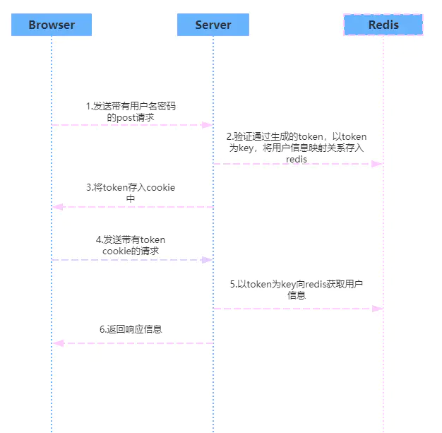

---
# 这是页面的图标
icon: page

# 这是文章的标题
title: 计算机网络-常见面试题

# 设置作者
author: lllllan

# 设置写作时间
# time: 2020-01-20

# 一个页面只能有一个分类
category: 

# 一个页面可以有多个标签
tag:

# 此页面会在文章列表置顶
# sticky: true

# 此页面会出现在首页的文章板块中
star: true

# 你可以自定义页脚
# footer: 
---

::: warning

本文转载自以下文章，略有改动。

- [什么是 JWT -- JSON WEB TOKEN - 简书 (jianshu.com)](https://www.jianshu.com/p/576dbf44b2ae)
- [JWT如何实现登录、鉴权 - 简书 (jianshu.com)](https://www.jianshu.com/p/e4d9dcda0558)
- [面试题：聊聊TCP的粘包、拆包以及解决方案 - 知乎 (zhihu.com)](https://zhuanlan.zhihu.com/p/356225028)
- [服务器端一个端口可以响应很多客户端的请求吗？-CSDN社区](https://bbs.csdn.net/topics/40099566)

:::

## IP地址和MAC地址

> 网上看到的一些区别和联系，感觉总结的有点无关痛痒。我觉得最重要的一点是，两个都是地址，那共存的必要和意义在哪里。下面是我的一些口胡，不一定对。

IP地址的划分是基于网络的拓扑结构、基于地理区域，这样的好处是，我能很快地找到某个IP地址。比如我想和 `192.168.1.20` 取得通信，我可以先找到 `192.0.0.0` 的位置，进而再找到 `192.168.0.0` 的位置，最后摸索到 `192.168.1.20` 的位置（当然，这是路由器干的活）。

IP地址的意义在于，根据地理区域划分；具有相同网络号的（就当是ip地址的前缀）的IP地址会被划分到一起。这样的划分下，我们能够较快地找到某个IP地址。

~~那好了，有IP地址就够了咯。再整一个MAC地址多烦人~~

IP地址是方便了，但是基于地理区域划分之后的问题是，你带不走他。如果你的电子设备从上海带到了北京，哪怕只是换了个小区，都会离开原来的IP地址。但是一个设备又必须拥有自己的【唯一标识】，于是需要MAC地址。

通过IP地址与MAC地址的捆绑，想要和某一台主机进行通信。则需要通过IP地址快速定位到该主机所在的区域，尽可能地缩小范围之后，通过MAC地址去确认主机的【身份】。

::: note 比喻

把网络通信当作是寄快递，IP地址就是你的家庭住址，MAC地址是你的身份证。

通过家庭住址<国家-省份-城市-区-街-小区-楼幢-楼层-门牌号>一步一步找到你家里来，然后签收的时候核验一下你的身份证，确认接收方无误之后把快递交给你。

:::

## TCP、UDP协议的区别

UDP 在传送数据之前不需要先建立连接，远地主机在收到 UDP 报文后，不需要给出任何确认。虽然 UDP 不提供可靠交付，但在某些情况下 UDP 却是一种最有效的工作方式（一般用于即时通信），比如： QQ 语音、 QQ 视频 、直播等等

TCP 提供面向连接的服务。在传送数据之前必须先建立连接，数据传送结束后要释放连接。 TCP 不提供广播或多播服务。由于 TCP 要提供可靠的，面向连接的传输服务（TCP 的可靠体现在 TCP 在传递数据之前，会有三次握手来建立连接，而且在数据传递时，有确认、窗口、重传、拥塞控制机制，在数据传完后，还会断开连接用来节约系统资源），这一难以避免增加了许多开销，如确认，流量控制，计时器以及连接管理等。这不仅使协议数据单元的首部增大很多，还要占用许多处理机资源。TCP 一般用于文件传输、发送和接收邮件、远程登录等场景。

## TCP粘包和拆包  ★

[面试题：聊聊TCP的粘包、拆包以及解决方案 - 知乎 (zhihu.com)](https://zhuanlan.zhihu.com/p/356225028)

- 如果一次请求发送的数据量比较小，没达到缓冲区大小，TCP则会将多个请求合并为同一个请求进行发送，这就形成了粘包问题。
- 如果一次请求发送的数据量比较大，超过了缓冲区大小，TCP就会将其拆分为多次发送，这就是拆包。

对于粘包和拆包问题，常见的解决方案有四种：

- 发送端将每个包都封装成固定的长度，比如100字节大小。如果不足100字节可通过补0或空等进行填充到指定长度；
- 发送端在每个包的末尾使用固定的分隔符，例如\r\n。如果发生拆包需等待多个包发送过来之后再找到其中的\r\n进行合并；例如，FTP协议；
- 将消息分为头部和消息体，头部中保存整个消息的长度，只有读取到足够长度的消息之后才算是读到了一个完整的消息；
- 通过自定义协议进行粘包和拆包的处理。

## 状态码

下面是常见的 HTTP 状态码：

- 200 - 请求成功
- 301 - 资源（网页等）被永久转移到其它URL
- 404 - 请求的资源（网页等）不存在
- 500 - 内部服务器错误

## 如何保存用户状态

**HTTP 是一种不保存状态，即无状态（stateless）协议。**也就是说 HTTP 协议自身不对请求和响应之间的通信状态进行保存。

Session 机制的存在就是为了解决这个问题，Session 的主要作用就是**通过服务端记录用户的状态**。典型的场景是购物车，当你要添加商品到购物车的时候，系统不知道是哪个用户操作的，因为 HTTP 协议是无状态的。服务端给特定的用户创建特定的 Session 之后就可以标识这个用户并且跟踪这个用户了（一般情况下，服务器会在一定时间内保存这个 Session，过了时间限制，就会销毁这个 Session）。

在服务端保存 Session 的方法很多，最常用的就是内存和数据库(比如是使用内存数据库 redis 保存)。既然 Session 存放在服务器端，那么我们如何实现 Session 跟踪呢？大部分情况下，我们都是**通过在 Cookie 中附加一个 Session ID 来方式来跟踪**。

### Cookie被禁用怎么办

最常用的就是利用 URL 重写把 Session ID 直接附加在 URL 路径的后面。

### Cookie 和 Session

Cookie 和 Session 都是用来跟踪浏览器用户身份的会话方式，但是两者的应用场景不太一样。

**Cookie 一般用来保存用户信息** ：

1. 我们在 Cookie 中保存已经登录过的用户信息，下次访问网站的时候页面可以自动帮你把登录的一些基本信息给填了；
2. 一般的网站都会有保持登录，也就是说下次你再访问网站的时候就不需要重新登录了，这是因为用户登录的时候我们可以存放了一个 Token 在 Cookie 中，下次登录的时候只需要根据 Token 值来查找用户即可(为了安全考虑，重新登录一般要将 Token 重写)；
3. 登录一次网站后访问网站其他页面不需要重新登录。

**Session 的主要作用就是通过服务端记录用户的状态。** 典型的场景是购物车，当你要添加商品到购物车的时候，系统不知道是哪个用户操作的，因为 HTTP 协议是无状态的。服务端给特定的用户创建特定的 Session 之后就可以标识这个用户并且跟踪这个用户了。

Cookie 存储在客户端中，而 Session 存储在服务器上，相对来说 Session 安全性更高。如果要在 Cookie 中存储一些敏感信息，不要直接写入 Cookie 中，最好能将 Cookie 信息加密，然后使用到的时候再去服务器端解密。

## URI 和 URL 的区别

- URI(Uniform Resource Identifier) 是统一资源标志符，可以唯一标识一个资源。
- URL(Uniform Resource Locator) 是统一资源定位符，可以提供该资源的路径。它是一种具体的 URI，即 URL 可以用来标识一个资源，而且还指明了如何 locate 这个资源。

URI 的作用像身份证号一样，URL 的作用更像家庭住址一样。URL 是一种具体的 URI，它不仅唯一标识资源，而且还提供了定位该资源的信息

## Json Web Token

Json web token（JWT）是为了网络应用环境间传递声明而执行的一种基于JSON的开发标准（RFC 7519），该token被设计为紧凑且安全的，特别适用于分布式站点的单点登陆（SSO）场景。

::: note 传统的session认证

客户端向服务器发送用户信息，服务器验证之后向客户端发放 sessionid。客户端将 sessionid 保存在cookie 中，需要用时将 sessionid 发给服务器验证即可。

基于session认证的问题

- session：通常而言 session 都是保存在内存中，而随着认证用户的增多，服务端的开销会明显增大
- 扩展性：用户认证之后，服务端做认证记录，如果认证的记录被保存在内存中的话，这意味着用户下次请求还必须要请求在这台服务器上，这样才能拿到授权的资源，这样在分布式的应用上，相应的限制了负载均衡器的能力。这也意味着限制了应用的扩展能力。
- 安全性：信息如果被截获，用户就会很容易受到跨站请求伪造的攻击

:::

### JWT 认证流程

1. 浏览器发起请求登陆，携带用户名和密码；
2. 服务端验证身份，根据算法，将用户标识符打包生成 token
3. 服务器返回 JWT 信息给浏览器，JWT不包含敏感信息；
4. 浏览器发起请求获取用户资料，把刚刚拿到的 token 一起发送给服务器；
5. 服务器发现数据中有 token，验明正身；
6. 服务器返回该用户的用户资料；

### JWT 优缺点

优点：

- json 的通用性，可以跨语言
- 组成简单，字节占用笑，便于传输
- 服务端无需保存会话信息，便于扩展

缺点：

- payload 部分进行简单编码，不宜存放敏感信息

 

### JWT 构成

JSON Web Token由【头部(Header)、载荷(Payload)、签证(Signature)】三部分组成，它们之间用圆点(.)连接。

- 头部。头部承载两部分信息：声明类型，这里是jwt；声明加密的算法，通常直接使用 HMAC SHA256
- 载荷。Payload 部分也是一个 JSON 对象，用来存放实际需要传递的数据。
- 签证。Signature 部分是对前两部分的签名，防止数据篡改。

首先，需要指定一个密钥（secret）。这个密钥只有服务器才知道，不能泄露给用户。然后，使用 Header 里面指定的签名算法（默认是 HMAC SHA256），按照下面的公式产生签名。

>  HMACSHA256(  base64UrlEncode(header) + "." +  base64UrlEncode(payload),   secret) 

算出签名以后，把 Header、Payload、Signature 三个部分拼成一个字符串，每个部分之间用"点"（.）分隔，就构成整个JWT对象TOKEN， 就可以返回给用户。

## 服务端一个端口响应多个客户端请求

服务端至少要有一个SOCKET处于监听状态（Listen），负责监听针对某个端口（Port）的连接请求；
当客户端的请求到达时，动态创建（new）一个SOCKET用于连接，此时，用于监听的SOCKET再次进入监听状态（调用Listen），此后，由参与连接的SOCKET完成与客户端的通信过程。
通常，创建几百个连接是可以，但不会同时启动上百个线程同时处理所有的请求；如果同时请求的客户端比较多（比如＞50），则通常启动固定数目（低于请求）的线程，请求排队等待处理。
线程的数目参考处理的速度，如果是瞬间完成的，则可以少，如果处理较慢，则可以多
