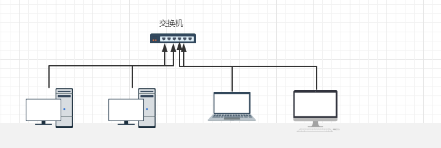
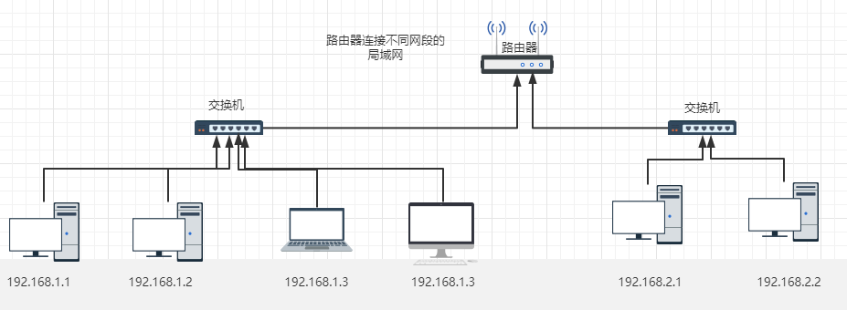
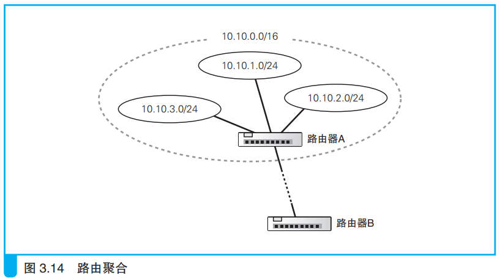
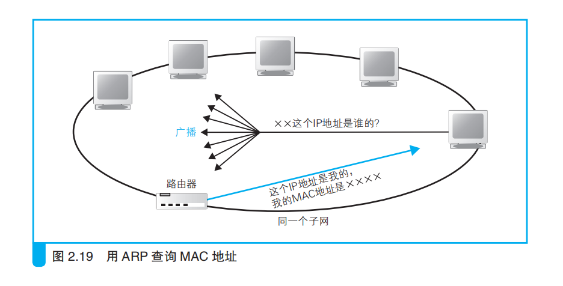
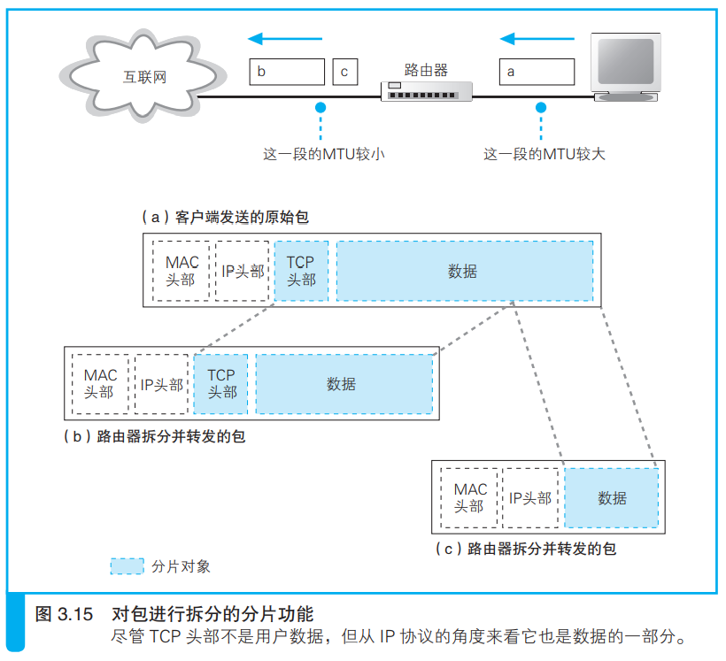

---
# 这是页面的图标
icon: page

# 这是文章的标题
title: 路由器和交换机

# 设置作者
author: lllllan

# 设置写作时间
# time: 2020-01-20

# 一个页面只能有一个分类
category: 

# 一个页面可以有多个标签
tag:

# 此页面会在文章列表置顶
# sticky: true

# 此页面会出现在首页的文章板块中
star: true

# 你可以自定义页脚
# footer: 
---

::: warning 转载声明

- 《网络是怎样连接的》

- [计算机网络-学习交换机_新林。的博客-CSDN博客_计算机网络交换机](https://blog.csdn.net/qq_21187515/article/details/119375576)
- [计算机网络-学习路由器_新林。的博客-CSDN博客_计算机网络路由器](https://blog.csdn.net/qq_21187515/article/details/119383038)
- [计算机网络-路由器和交换机的区别_新林。的博客-CSDN博客_计算机网络路由器和交换机的区别](https://blog.csdn.net/qq_21187515/article/details/119416934)

:::

## 集线器

> 有交换机之前，我们都是用集线器连接成一个局域网的。集线器将信号发送给所有连接在它上面的线路。

集线器的工作原理是把接收到的数据包直接广播给插入集线器的所有计算机，在这个局域网的计算机都能接收到这个数据包，然后判断这个数据包发送的MAC（物理地址）是否发送给自己，是给自己的就接收，不是就丢掉

## 交换机

> 交换机是一种用于电(光)信号转发的网络设备，能连接多台设备形成一个局域网，简单来说就是可以把多台计算机连接起来，形成一个局域网。交换机是用于连接多台设备，让这些设备相互具备网络互通。

==交换机端口的MAC模块不具有MAC地址==

交换机的端口不核对接收方MAC地址，直接接收所有的包并存放到缓冲区中。

接下来查询MAC地址表，对于接收方的MAC地址在表中有记录的包会直接从对应的端口发送出去，没有记录的包则需要通过广播找到对应计算机连接的端口，将信息记录到表中并把包沿对应端口发送出去。

### MAC地址表

交换机中有一个MAC地址表，用于记录局域网中不同MAC地址连接着交换机的对应端口。

- 当收到计算机发送的包时，会将发送方的MAC地址和经过的输入端口写入/更新到MAC地址表
- 定时将MAC地址表中的信息删除，防止设备移动时产生问题
- 当表中找不到接收方的MAC地址时，需要给所有端口发送广播，接收到响应之后记录到表中

## 路由器

> 路由器是连接两个或多个网络的硬件设备，在网络间起网关的作用。简单来说，路由器就是用来连接两个或多个不同的局域网的。即一个局域网里面的网络请求要访问外面，就需要路由器作为网关，通过路由器访问出去。

==路由器的各个端口都具有MAC地址和IP地址。==

路由器在接收到包之后，会核对MAC头部的接收方MAC地址，如果是发送给自己的则放到缓冲区中，否则丢弃这个包。

::: info 路由器的端口都具有MAC地址，只接收与自身地址匹配的包

:::

接下来路由器根据MAC头部后方的IP头部中的内容进行包的转发操作。从路由表中找到匹配的记录，在数据包前加上MAC头部再转发出去；如果路由表中无法找到匹配的记录则直接丢弃这个包，并通过ICMP消息告知发送方。

::: danger 路由器工作的网络规模远大于交换机，广播的方式会产生大量的网络包从而造成网络拥塞

:::

::: info MAC头部

此时MAC地址就是用来找到路由器的，当一个包正确到达一个路由器的时候，这个MAC头部就已经完成它的使命了，可以丢弃了。

当还需要再转发给下一个路由器的时候，从路由表中查询记录，将下一个路由器的MAC地址添加到数据包签名，形成新的MAC头部，继续发送出去。

:::

### 路由表

路由器中的路由表对应交换机中的MAC地址表，拥有相似的功能。

交换机是通过MAC头部中的接收方MAC地址来判断转发目标的，而路由器是根据IP头部中的IP地址来判断的。

==路由器在转发时会忽略主机号、只匹配网络号部分。==

> 打个比方，路由器在转发包的时候只看接收方地址属于哪个区，XX区发往这一边，XX区发往那一边。

---

#### 路由表维护

路由表记录维护的方式和交换机也有所不同。交换机中对 MAC 地址表的维护是包转发操作中的记录 MAC 地址，而路由器中对路由表的维护是与包转发操作相互独立的，也就是说，在转发包的过程中不需要对路由表的内容进行维护。

- 人手动维护路由记录
- 根据路由协议机制，通过路由器之间的信息交换由路由器自行维护路由表中的记录。RIP、OSPC、BGP协议

### IP地址匹配

子网是用来区分我们的IP地址的网络号和主机号的
例如我们查看IP地址，我们的IP地址是192.168.1.20，子网掩码：255.255.255.0，即192.168.1.20/24，那么就表示192.168.1是IP段【网络号】，后面的20是这个IP段的【主机号】。

匹配数据包和路由器的目标地址对上的网络号的记录即可。

> 就好比寄快递一样，得写明哪个小区哪个房间号，小区就像网络号，房间号就像主机号。写明了快递员就可以把东西寄到相应的小区，再由小区转发到房间号，这样分类效率大幅提高。所以我们在路由器也是这样，找到对应网络号的就转出去就可以了，如果没有网络号，路由器就要保存大量主机号的IP，数据量多时每次查询效率就会很低，如果有网络号路由器保存的记录就会减少很多。

---

#### 路由聚合

路由聚合会将几个子网合并成一个子网，并在路由表中只产生一条记录。

有些时候，发往子网A、子网B、子网C都要经过路由器X，此时干脆将 ABC 合并成一个子网，路由表中也只记录路由器X的信息，从而减少路由表中的记录数量。

---

#### 匹配到多条记录

如果匹配符合的记录有多个，例如 192.168.1.10 匹配到路由表的目标地址的两行记录：192.168.1.0/24，192.168.1.10/32。这种情况，路由器首先寻找网络号比特数最长的一条记录 。网络号比特数越长，说明主机号比特数越短，也就意味着该子网内可分配的主机数量越少，即子网中可能存在的主机数量越少，这一规则的目的是尽量缩小范围，所以根据这条记录判断的转发目标就会更加准确。

然而，有时候路由表中会存在网络号长度相同的多条记录，例如考虑到路由器或网线的故障而设置的备用路由就属于这种情况。这时，需要根据跃点计数的值来进行判断。跃点计数越小说明该路由越近，因此应选择跃点计数较小的记录。

::: note 跳跃点计数

跃点计数，它表示距离目标 IP 地址的距离是远还是近。这个数字越小，表示距离目的地越近；数字越大，表示距离目的地越远 。一般情况下，如果有多条到达相同目的地的路由记录，路由器会采用metric值小的那条路由

:::

---

#### 默认路由

路由表还有一行默认路由（发往更高层级的路由），目标地址为 0.0.0.0，子网掩码为 0.0.0.0 的记录，即匹配所有 IP，如果找不到其他网络号更长的记录，就会把数据包转发到默认的路由记录上去。

### 转发

根据包里面发送的目的地IP地址，在路由表中进行匹配，匹配到的记录，

- 如果网关IP不为空，则网关IP是发往下一个的地址
- 如果网关为空，则目标地址的IP是发往下一个的地址。

知道对方的 IP 地址之后，路由器首先会在 ARP 缓存中查询该 IP 对用的 MAC 地址。如果找不到记录就需要通过 ARP 根据 IP 地址查询 MAC 地址，并将查询的结果作为接收方MAC 地址。

把查询到的MAC头部加入数据包（上一个MAC地址包被丢掉），最后网络包封装完成后，接下来会将其转换成电信号并通过端口发送出去。

### 包的有效期

数据包的 IP 头部中记录一个 TTL（time to live，生存时间）字段，每经过一个路由器该值就会减1，当这个值变为 0 的时候，就表示超过了有限期，这个包就会被丢弃。

这个机制是为了防止包在一个地方陷入死循环。

> TTL 一般会设为 64 或 128，正常的通信一个包只需要经过几十个路由器就能被正确的转发；如果转发过程 TTL 减少为零，就认为他在某处陷入了死循环。

### 拆分大网络包

路由器连接着的不同局域网允许的最大包长度可能不同，可能出现接收到一个包，但是包的长度超出了接下来要转发的局域网允许的最大包长度。遇到这种情况，可以使用 IP 协议中定义的分片功能对包进行拆分，缩短每个包的长度。

::: info IP协议分片 & TCP拆分

TCP拆分数据的操作是在将数据装到包里之前进行的。IP分片是对一个完整的包进行拆分。

:::

::: danger IP头部有标志字段表示是否允许对数据包进行分片，如果不允许只好丢弃这个包，并通过ICMP消息通知发送方

:::

## 路由器和交换机的区别

- 路由器是基于IP协议设计的，交换机是基于以太网设计的
- 交换机用于连接局域网，数据包在局域网内部转发；路由器用于连接局域网和外网，数据包可以在不同局域网之间转发
- 交换机工作于数据链路层，路由器工作与网络层
- （纯粹的）交换机没有MAC地址和IP地址，（纯粹的）的路由器有MAC地址和IP地址

