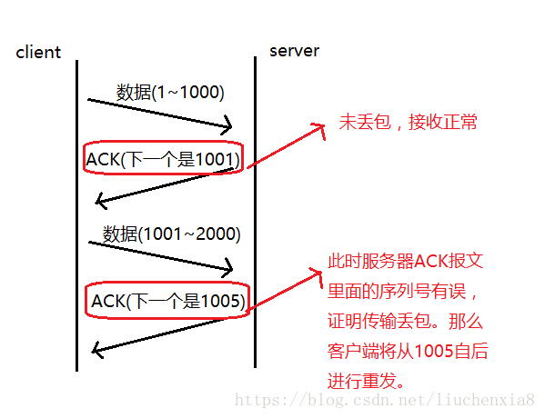
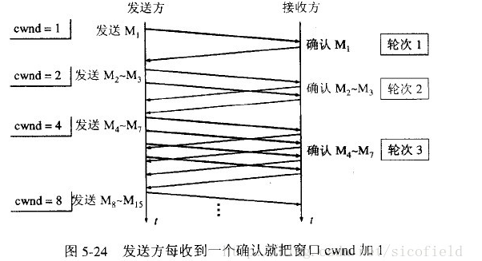
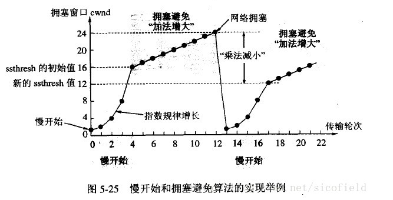
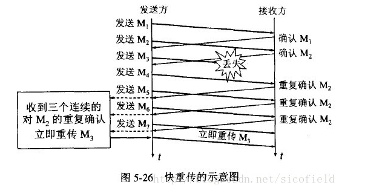
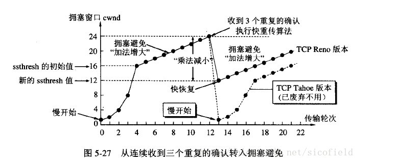

---
# 这是页面的图标
icon: page

# 这是文章的标题
title: TCP可靠传输

# 设置作者
author: lllllan

# 设置写作时间
# time: 2020-01-20

# 一个页面只能有一个分类
category: 

# 一个页面可以有多个标签
tag:

# 此页面会在文章列表置顶
# sticky: true

# 此页面会出现在首页的文章板块中
star: true

# 你可以自定义页脚
# footer: 

---

::: warning 转载声明

- [网络基础：TCP协议-如何保证传输可靠性_ricardoleo的博客-CSDN博客_tcp如何保证可靠传输](https://blog.csdn.net/liuchenxia8/article/details/80428157)
- [TCP的可靠性传输是如何保证的 - 知乎 (zhihu.com)](https://zhuanlan.zhihu.com/p/112317245)
- [计算机网络——TCP的拥塞控制（超详细） - 特务依昂 - 博客园 (cnblogs.com)](https://www.cnblogs.com/tuyang1129/p/12439862.html)
- [TCP拥塞避免 - hongdada - 博客园 (cnblogs.com)](https://www.cnblogs.com/hongdada/p/11206679.html)

:::

1. 连接管理
2. 校验和
3. 序列号/确认应答
4. 超时重传
5. 滑动窗口/流量控制
6. 拥塞控制

## 连接管理

三次握手和四次挥手，保证可靠的连接

## 校验和

通过检验和的方式，接收端可以检测出来数据是否有差错和异常，假如有差错就会直接丢弃TCP段，重新发送。

## 序列号/确认应答

序列号：TCP传输时将每个字节的数据都进行了编号。
确认应答：TCP传输的过程中，每次接收方收到数据后，都会对传输方进行确认应答。也就是发送ACK报文。这个ACK报文当中带有对应的确认序列号，告诉发送方，接收到了哪些数据，下一次的数据从哪里发。

## 超时重传

在进行TCP传输时，由于确认应答与序列号机制，也就是说发送方发送一部分数据后，都会等待接收方发送的 ACK 报文，并解析 ACK 报文，判断数据是否传输成功。如果发送方发送完数据后，迟迟没有等到接收方的 ACK 报文，原因可能有两点：

1. 数据在传输过程中由于网络原因等直接全体丢包，接收方根本没有接收到。
2. 接收方接收到了响应的数据，但是发送的ACK报文响应却由于网络原因丢包了。

只要发送方在规定时间内没有接收到对方的 ACK 报文，就会认为对方没有接收到数据，需要重新发送。

1. 如果之后能收到对方的 ACK 报文，则进行下一步的发送
2. 如果重复几次之后仍然不能收到回复，就认为 TCP 连接失效了，会关闭连接。

## 滑动窗口/流量控制

> 滑动窗口就是维护了一个缓冲区。

发送方可以连续发送一个缓冲区能够接纳的数据，而不用每发送一个包就等待一个响应，从而提升了效率。

但接收方不是一直都能接收那么多的数据，因此 TCP 双方都有一个缓冲区，接收方在返回 ACK 包的时候，附带窗口字段向发送方确认窗口大小，从而约束发送方的发送速率。

## 拥塞控制

窗口控制解决了 两台主机之间因传送速率而可能引起的丢包问题，在一方面保证了TCP数据传送的可靠性。然而如果网络非常拥堵，此时再发送数据就会加重网络负担，那么发送的数据段很可能超过了最大生存时间也没有到达接收方，就会产生丢包问题。

> 详见 [TCP拥塞避免 - hongdada - 博客园 (cnblogs.com)](https://www.cnblogs.com/hongdada/p/11206679.html)

拥塞控制就是为了防止过多的数据注入到网络中，这样就可以使网络中的路由器或链路不致过载。TCP 发送方要维持一个 **拥塞窗口(cwnd)** 的状态变量。拥塞控制窗口的大小取决于网络的拥塞程度，并且动态变化。发送方让自己的发送窗口取为拥塞窗口和接收方的接受窗口中较小的一个。

- **MSS**：最大报文段长度，`TCP` 双方发送的报文段中，包含的数据部分的最大字节数；
- **cwnd**：拥塞窗口，`TCP` 发送但还没有得到确认的报文的序号都在这个区间；
- **RTT**：往返时间，发送方发送一个报文，到接收这个报文的确认报文所经历的时间；
- **ssthresh**：慢启动阈值，慢启动阶段，若 `cwnd` 的大小达到这个值，将转换到拥塞避免模式；

### 慢启动

慢开始算法的思路是当主机开始发送数据时，如果立即把大量数据字节注入到网络，那么可能会引起网络阻塞，因为现在还不知道网络的符合情况。

慢开始算法的思路就是，不要一开始就发送大量的数据，先探测一下网络的拥塞程度，也就是说由小到大逐渐增加拥塞窗口的大小。

### 拥塞避免

拥塞避免算法让拥塞窗口缓慢增长，即每经过一个往返时间RTT就把发送方的拥塞窗口cwnd加1，而不是加倍。这样拥塞窗口按线性规律缓慢增长。

无论是在**慢开始阶段**还是在**拥塞避免阶段**，只要发送方判断网络出现拥塞（其根据就是没有收到确认，虽然没有收到确认可能是其他原因的分组丢失，但是因为无法判定，所以都当做拥塞来处理），就把慢开始门限设置为出现拥塞时的发送窗口大小的一半。然后把拥塞窗口设置为1，执行慢开始算法。

### 快重传

快重传要求接收方在收到一个失序的报文段后就立即发出重复确认（为的是使发送方及早知道有报文段没有到达对方）而不要等到自己发送数据时捎带确认。快重传算法规定，发送方只要一连收到三个重复确认就应当立即重传对方尚未收到的报文段，而不必继续等待设置的**重传计时器时间**到期。

### 快恢复

快重传配合使用的还有快恢复算法，有以下两个要点:

- 当发送方连续收到三个重复确认时，就执行【乘法减小】算法，把 ssthresh 门限减半。但是接下去并不执行慢开始算法。
- 考虑到如果网络出现拥塞的话就不会收到好几个重复的确认，所以发送方现在认为网络可能没有出现拥塞。所以此时不执行慢开始算法，而是将 cwnd 设置为 ssthresh 的大小，然后执行拥塞避免算法。

