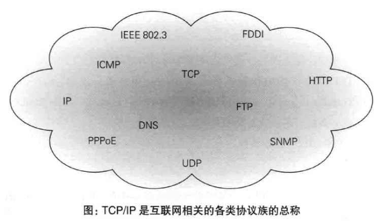
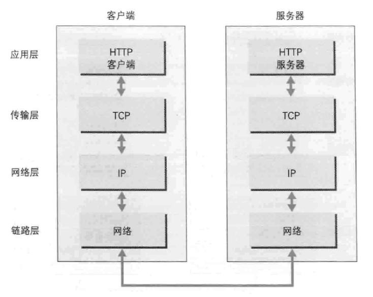
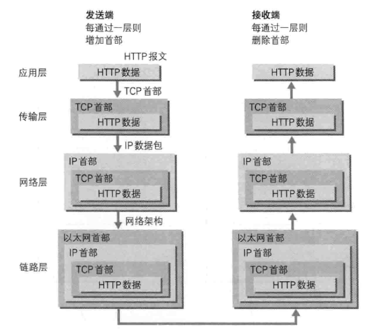
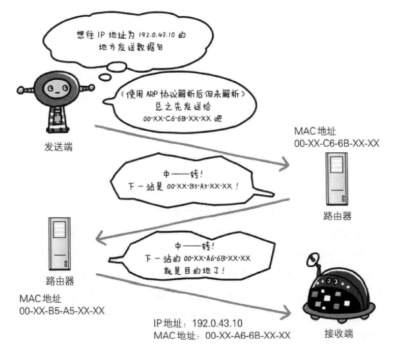
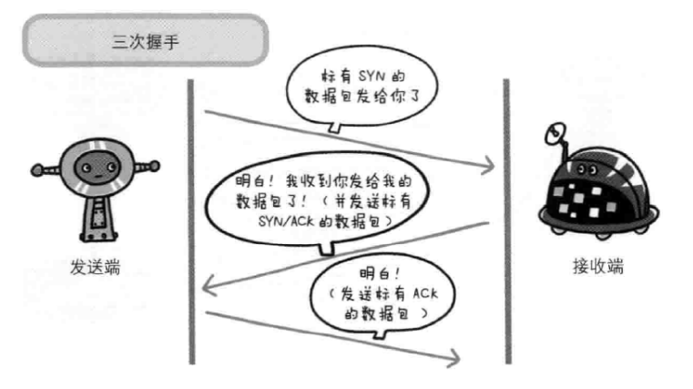
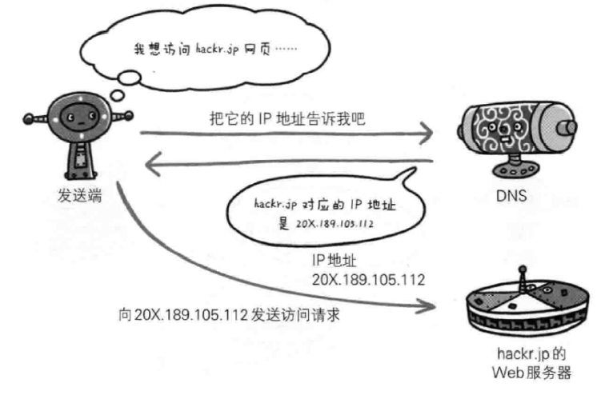
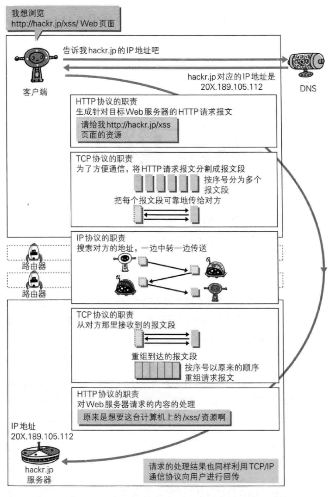
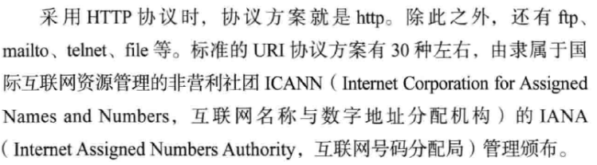
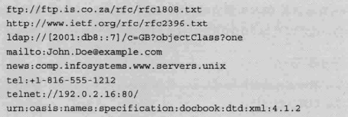
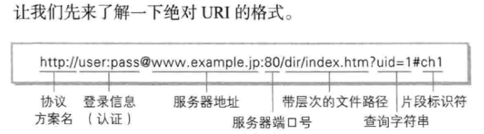

---
# 这是页面的图标
icon: page

# 这是文章的标题
title: 第一章、了解Web及网络基础

# 设置作者
author: lllllan

# 设置写作时间
# time: 2020-01-20

# 一个页面只能有一个分类
category: 计算机基础

# 一个页面可以有多个标签
tag:
- 计算机网络
- 图解HTTP

# 此页面会在文章列表置顶
# sticky: true

# 此页面会出现在首页的文章板块中
star: true

# 你可以自定义页脚
# footer: 

---

::: warning

本文作为 《图解HTTP》 的笔记，绝大部分内容均抄自该书。

:::

## 一、使用HTTP协议访问Web

Web使用一种名为 HTTP(HyperText Transfer Protocal，超文本传输协议)的协议作为规范，完成从客户端到服务器等一系列运作流程。

## 二、HTTP的诞生

（简单了解）

## 三、网络基础 TCP/IP

通常使用的网络是在 TCP/IP 协议族的基础上运作的，而 HTTP 属于它内部的一个子集。

### 3.1 TCP/IP 协议族

TCP/IP 协议族规定了通信双方必须遵守的一些规则。

### 3.2 TCP/IP 的分层管理

TCP/IP 协议族按层次分别为： **应用层、传输层、网络层、数据链路层**

::: tip 分层的好处

如果互联网只由一个协议统筹，某个地方需要改变设计时，就必须把所有部分整体替换掉。而分层之后只需把变动的层替换掉即可。

设计也变得相对简单。处于应用层上的应用可以只考虑分派给自己的任务，而不需要弄清对方在地球上哪个地方、对方的传输路线是怎么样的、是否能确保传输送达等问题

:::

#### 3.2.1 应用层

应用层决定了向用户提供应用服务时通信的活动。HTTP、FTP

#### 3.2.2 传输层

传输层对上层应用层，提供处于网络连接中的两台计算机之间的数据传输。TCP、UDP

#### 3.2.3 网络层（网际层）

网络层用来处理在网络上流动的数据包。数据包时网络传输的最小数据单位。该层规定了通过怎样的路径（所谓的传输路线）到达对方计算机，并把数据传送给对方。

与对方计算机之间通过多台计算机或网络设备传输时，网络层的作用就是在众多的选项内选择一条传输路线。

#### 3.2.4 数据链路层（网络接口层）

用来处理连接网络的硬件部分。操作系统、设备驱动、网卡、光纤等物理课件部分。

### 3.3 TCP/IP通信传输流

1. 客户端在应用层（HTTP协议）发出 HTTP 请求
2. 为了传输方便，在传输层（TCP协议）把从应用层收到的数据（HTTP请求报文）进行分割，并在各个报文打上标记序号及端口号后转发给网络层
3. 网络层（IP协议）增加作为通信目的地的 MAC 地址后转发给链路层

发送端在层与层之间传输数据时，每经过一层必定会被打上一个该层所属的首部信心。反之，接收端在层与层传输数据时，每经过一层时会把对应的首部消去、

::: tip 封装

把数据信息包装起来的做法叫做封装

:::

## 四、IP、TCP、DNS

### 4.1 负责传输的 IP 协议

IP 网际协议属于网络层。

IP 协议作用就是把各种数据包传送给对方，而要确保确实传送到对方那里，血药满足各类条件，其中最重要的两个条件是 **IP地址和MAC地址**

IP地址指明了节点被分配到的地址，MAC地址是指网卡所属的固定地址。IP地址可以和MAC地址进行配对，IP地址可以变换，但MAC地址基本上不会更改。

#### 4.1.1 使用ARP协议凭借MAC地址进行通信

IP间的通信依赖MAC。

通信的双方在同一局域网的情况较少，通常需要经过多台计算机和网络设备中转才能连接到对方。而在进行中转时，会利用下一站中转设备MAC地址来搜索下一个中转目标。

采用ARP协议用以解析地址，根据通信方的IP地址就可以反查除对应的MAC地址。

#### 4.1.2 没人能够全面掌握互联网中的传输状况

在到达通信目标前的中转过程中，计算机和路由器等网络被只能获悉粗略的传输路线。

### 4.2 确保可靠性的TCP协议

TCP位于传输层，提供可靠的字节流服务。

所谓字节流服务，是指为了方便传输，将大块数据分割成以报文段为单位的数据包进行管理。可靠的传输是指能够把数据准确可靠地传给对方。

#### 确保数据能到达目标

为了准确无误地将数据发送到目标出，TCP协议采用了三次握手策略。

### 4.3 负责域名解析的DNS服务

DNS 和 HTTP 位于应用层。提供域名到IP地址之间的解析服务。

## 五、各种协议和HTTP协议的关系

## 六、URI和URL

- URI 统一资源标识符
- URL 统一资源定位符

### 6.1 统一资源标识符

URI Uniform Resource Identifier。URI是某个协议方案表示的资源的定位标识符。

URI用字符串标识某一互联网资源，而URL表示资源的地点（互联网上的位置），可以见URL是URI的子集。

URI的例子：

### 6.2 URI格式

