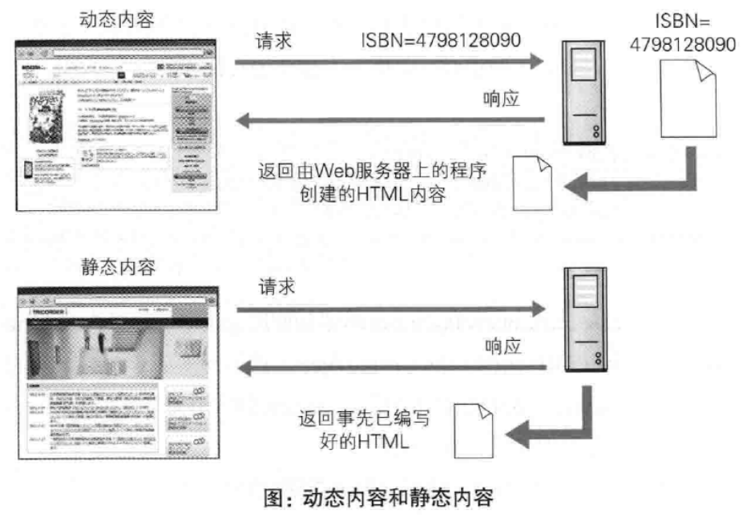

---
# 这是页面的图标
icon: page

# 这是文章的标题
title: 第十章、构建Web内容的技术

# 设置作者
author: lllllan

# 设置写作时间
# time: 2020-01-20

# 一个页面只能有一个分类
category: 计算机基础

# 一个页面可以有多个标签
tag:
- 计算机网络
- 图解HTTP

# 此页面会在文章列表置顶
# sticky: true

# 此页面会出现在首页的文章板块中
star: true

# 你可以自定义页脚
# footer: 

---


::: warning 转载声明

- 《图解HTTP》 

:::


## 一、HTML


### 1.1 Web 页面几乎全由 HTML 构建


HTML（HyperText Markup Language，超文本标记语言）是为了发送 Web 上的超文本而开发的标记语言。


**超文本**

超文本是一种文档系统，可将文档中任意位置的信息与其他信息（文本或图片）简历关联，即超链接文本


**标记语言**

通过在文档的某部分穿插特别的字符串标签，用来修饰文档的语言。


### 1.2 HTML 版本


### 1.3 CSS

CSS（Cascading Style Sheets，层叠样式表）可以指定如何展现 HTML 内的各种元素，属于央视表标准之一。


## 二、动态 HTML


### 2.1 HTML

动态语言，使用客户端脚本语言将静态的 HTML 语言内容变成动态的技术的总称。

动态 HTML 技术是通调用客户端脚本语言 JavaScript，实现对 HTML 的 Web 页面的动态改造。利用 DOM（Document Object Model，文档对象模型）可指定欲发生动态变化的 HTML 元素。


### 2.2 DOM

DOM 是用以操作 HTML 文档和 XML 文档的 API(ApplicationProgramming Interface，应用编程接口)。使用 DOM 可以将 HTML 内的元素当作对象操作，如取出元素内的字符串、改变那个 CSS 的属性等，使页面的设计发生改变。


## 三、Web 应用


### 3.1 Web 应用

Web应用是指通过Web功能提供的应用程序。




### 3.2 CGI

CGI( Common Gateway Interface,，通用网关接口)是指Web服务器在接收到客户端发送过来的请求后转发给程序的一-组机制。


### 3.3 Servlet

Servlet 是一种能在服务器上创建动态内容的程序。Servlet 是用 Java 语言实现的一个接口，属于面向企业级Java ( JavaEE，Java Enterprise Edition)的一部分。


之前提及的CGI，由于每次接到请求，程序都要跟着启动一次。因此一旦访问量过大，Web服务器要承担相当大的负载。而 Servlet 运行在与 Web 服务器相同的进程中，因此受到的负载较小。Servlet 的运行环境叫做 Web 容器或 Servlet 容器。


## 四、数据发布的格式及语言


### 4.1 可扩展标记语言

XML ( eXtensible Markup Language，可扩展标记语言)是一种可按应用目标进行扩展的通用标记语言。旨在通过使用XML，使互联网数据共享变得更容易。


```xml
<研讨会编号="TR001" 主题="Web应用程序脆弱性诊断讲座">
    <类别>安全</类别>
    <概要>为深入研究Web应用程序脆弱性诊断必要的-</概要>
</研讨会>
<研讨会编号="TR002”主题=”网络系统脆弱性诊断讲座">
    <类别>安全</类别>
    <概要>为深入研究网络系统脆弱性诊断必要的-</概要>
</研讨会>
```

XML和HTML一样，使用标签构成树形结构，并且可自定义扩展标签。
从XML文档中读取数据比起HTML更为简单。由于XML的结构基本上都是用标签分割而成的树形结构，因此通过语法分析器( Parser )的解析功能解析XML结构并取出数据元素，可更容易地对数据进行读取。


### 4.2 RSS/Atom

RSS(简易信息聚合，也叫聚合内容 ) 和 Atom 都是发布新闻或博客日志等更新信息文档的格式的总称。两者都用到了XML。


### 4.3 JSON

JSON ( JavaScript Object Notation)是-种以JavaScript ( ECMAScript )的对象表示法为基础的轻量级数据标记语言

```json
{name: "Web Application Security", "num": "TR001" }
```

JSON 让数据更轻更纯粹，并且 JSON 的字符串形式可被JavaScript 轻易地读人。当初配合 XML 使用的 Ajax 技术也让 JSON 的应用变得更为广泛。另外，其他各种编程语言也提供丰富的库类，以达到轻便操作 JSON 的目的。
