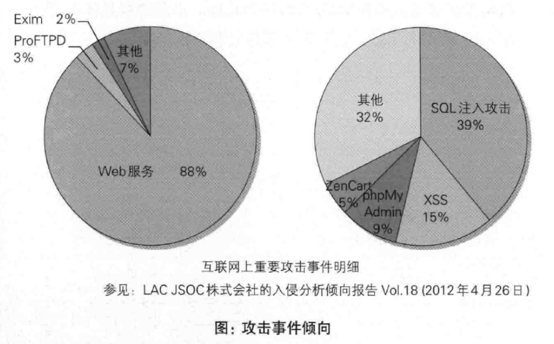
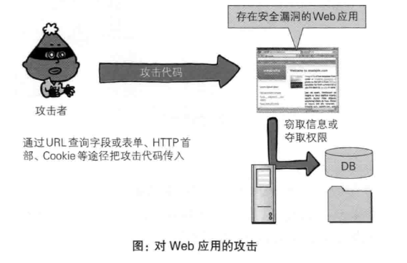
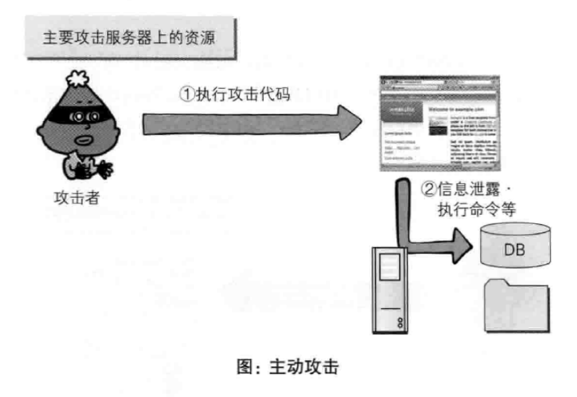
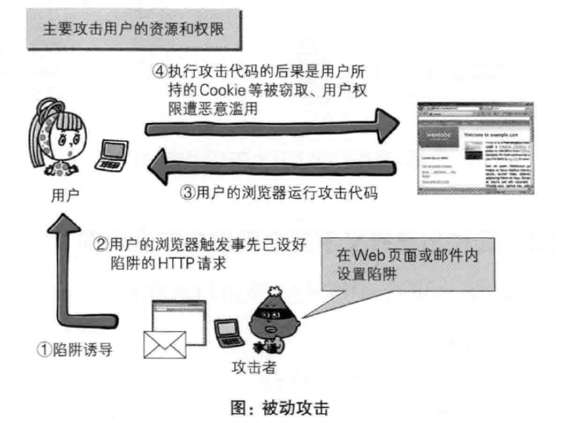
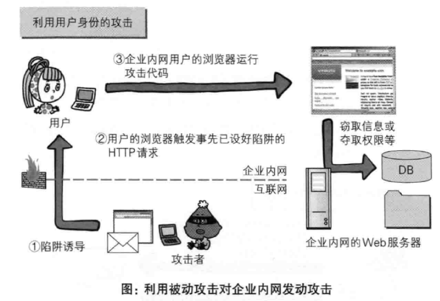
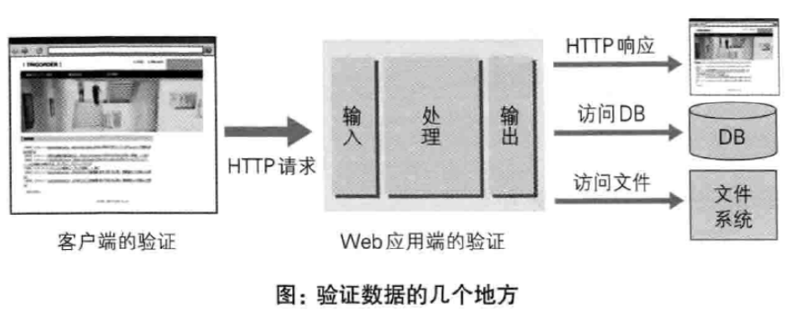

---
# 这是页面的图标
icon: page

# 这是文章的标题
title: 第十一章、Web的攻击技术

# 设置作者
author: lllllan

# 设置写作时间
# time: 2020-01-20

# 一个页面只能有一个分类
category: 计算机基础

# 一个页面可以有多个标签
tag:
- 计算机网络
- 图解HTTP

# 此页面会在文章列表置顶
# sticky: true

# 此页面会出现在首页的文章板块中
star: true

# 你可以自定义页脚
# footer: 

---

::: warning 转载声明

- 《图解HTTP》 

:::

## 一、针对Web的攻击技术

### 1.1 HTTP不具备必要的安全功能

从整体上看，HTTP就是一个通用的单纯协议机制。因此它具备较多优势，但是在安全性方面则呈劣势。

就拿远程登录时会用到的SSH协议来说，SSH具备协议级别的认证及会话管理等功能，HTTP协议则没有。另外在架设SSH服务方面，任何人都可以轻易地创建安全等级高的服务，而HTTP即使已架设好服务器，但若想提供服务器基础上的Web应用，很多情况下都需要重新开发。

因此，开发者需要自行设计并开发认证及会话管理功能来满足Web应用的安全。

### 1.2 在客户端即可篡改请求

在Web应用中，从浏览器那接收到的HTTP请求的全部内容，都可以在客户端自由地变更、篡改。所以Web应用可能会接收到与预期数据不相同的内容。

### 1.3 针对Web应用的攻击模式

**以服务器为目标的主动攻击**

主动攻击(activeattack)是指攻击者通过直接访问Web应用，把攻击代码传 人的攻击模式。由于该模式是直接针对服务器上的资源进行攻击，因此攻击者需要能够访问到那些资源。

主动攻击模式里具有代表性的攻击是 ==SQL注人攻击== 和 ==OS命令注人攻击==

----

**以服务器为目标的被动攻击**

被动攻击( passive attack )是指利用圈套策略执行攻击代码的攻击模式。在被动攻击过程中，攻击者不直接对目标Web应用访问发起攻击。

> 步骤1：攻击者诱使用户触发已设置好的陷阱，而陷阱会启动发送已嵌人攻击代码的HTTP请求。
>
> 步骤2：当用户不知不觉中招之后，用户的浏览器或邮件客户端就会触发这个陷阱。
>
> 步骤3：中招后的用户浏览器会把含有攻击代码的HTTP请求发送给作为攻击目标的Web应用，运行攻击代码。
>
> 步骤4：执行完攻击代码，存在安全漏洞的Web应用会成为攻击者的跳板，可能导致用户所持的Cookie等个人信息被窃取，登录状态中的用户权限遭恶意滥用等后果。被动攻击模式中具有代表性的攻击是跨站脚本攻击和跨站点请求伪造。

## 二、因输出值转义不完全引发的安全漏洞

### 2.1 跨站脚本攻击

跨站脚本攻击(Cross Site Scripting, XSS)是指通过存在安全漏洞的Web网站注册用户的浏览器内运行非法的HTML标签或JavaScript进行的一种攻击。动态创建的HTML部分有可能隐藏着安全漏洞。

