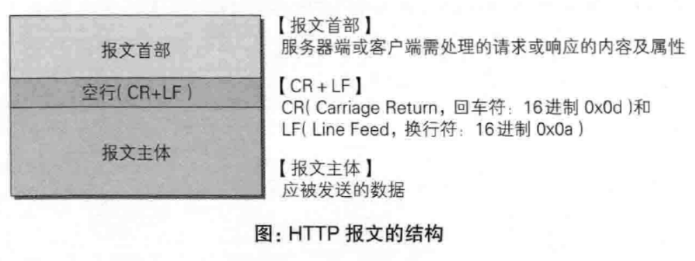
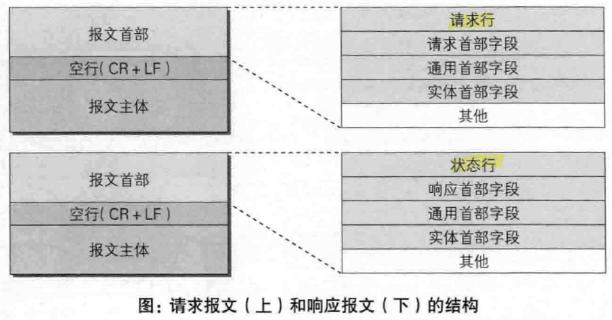
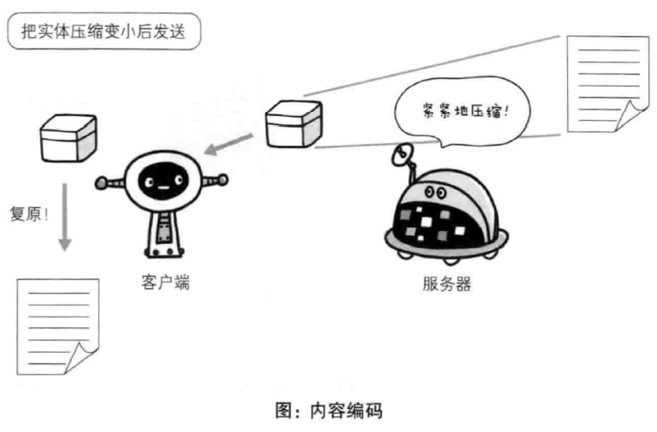
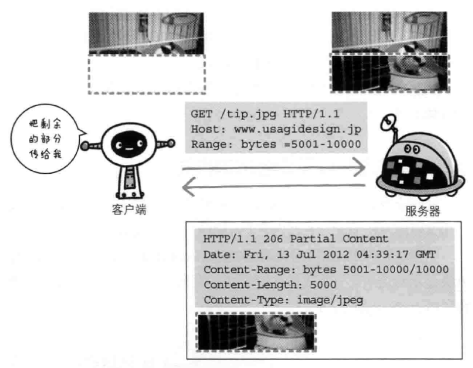
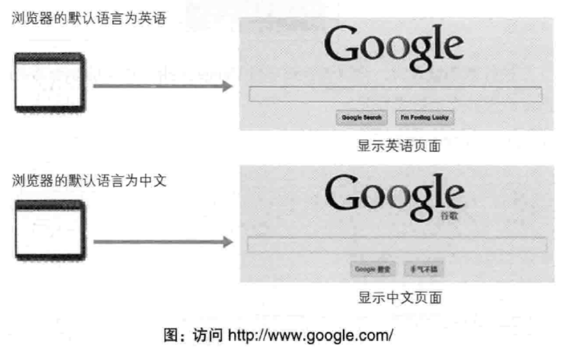

---
# 这是页面的图标
icon: page

# 这是文章的标题
title: 第三章、HTTP报文

# 设置作者
author: lllllan

# 设置写作时间
# time: 2020-01-20

# 一个页面只能有一个分类
category: 计算机基础

# 一个页面可以有多个标签
tag:
- 计算机网络
- 图解HTTP

# 此页面会在文章列表置顶
# sticky: true

# 此页面会出现在首页的文章板块中
star: true

# 你可以自定义页脚
# footer: 
---

::: warning 转载声明

- 《图解HTTP》 

:::

## 一、HTTP 报文

用于HTTP协议交互的信息称为HTTP报文，大致可以分为**报文首部和报文主体**两部分。

## 二、报文结构

- **请求行**：包含用于请求的方法，请求URI和HTTP版本
- **状态行**：包含表明响应结果的状态码，原因短语和HTTP版本
- **首部字段**：包含表示请求和响应的各种条件和属性的各类首部（通用、请求、响应、实体）

## 三、编码提升传输速率

### 3.1 报文主体和实体主体的差异

- **报文**：HTTP通信中的基本单位，由8位组字节流组成，通过HTTP通信传输
- **实体**：作为请求或响应的有效载荷数据被传输，其内容由实体首部和实体主体组成

HTTP报文的主体用于传输请求或响应的实体主体。

### 3.2 压缩传输的内容编码

==内容编码== 指明应用在实体内容上的编码格式，并保持实体信息原样压缩。内容编码后的实体由客户端接收并负责解码

常用的内容编码：

- gzip（GNU zip）
- compress（NUIX 系统的压缩标准）
- deflate（zlib）
- identity（不进行编码）

### 3.3 分割发送的分块传输编码

在传输大容量数据时，通过把数据分割成多块，能够让页面逐步显示页面。这种把实体主体分块的功能称为 ==分块传输编码==。

## 四、发送多种数据的多部分对象集合

==多部分对象集合== 用来容纳多份不同类型的数据。

## 五、获取部分内容的范围请求

在下载资源的过程中如果遇到网络中断的情况，那就必须重新开始。为了解决这种问题，需要一种恢复的机制（从之前下载中断处恢复下载）。

要实现该功能需要指定下载的实体范围，即 ==范围请求==

针对范围请求，响应会范围状态码为 `206 Partial Content` 的响应报文。如果服务器无法响应范围请求，则会返回状态码 `200 OK` 和完整的内容实体。

## 六、内容协商后返回最合适的内容

==内容协商==：当浏览器的默认语言是中文或者英文时，访问相同URI的Web页面会显示对应的语言。

内容协商机制是指客户端和服务器端就响应的资源内容进行交涉，然后提供客户端最为合适的内容。内容协商会以**响应资源的语言、字符集、编码方式**等作为判断的基准。

### 6.1 服务器驱动协商 Server-driven Negotitaion

由服务器进行内容协商。以请求的首部字段为参考，在服务器端自动处理。

### 6.2 客户端驱动协商 Agent-driven Negotiation

由客户端进行内容协商的方式。用户从浏览器显示的可选项列表中手动选择。

### 6.3 透明协商 Transparent Negotiation

是服务器驱动和客户端驱动的结合体，由服务器和客户端各自进行内容协商的一种方法。
