---
# 这是页面的图标
icon: page

# 这是文章的标题
title: 第七章、确保Web安全的HTTPS

# 设置作者
author: lllllan

# 设置写作时间
# time: 2020-01-20

# 一个页面只能有一个分类
category: 计算机基础

# 一个页面可以有多个标签
tag:
- 计算机网络
- 图解HTTP

# 此页面会在文章列表置顶
# sticky: true

# 此页面会出现在首页的文章板块中
star: true

# 你可以自定义页脚
# footer: 
---

::: warning 转载声明

- 《图解HTTP》 

:::

## 一、HTTP 的缺点

::: tip HTTP 的不足

- 通信使用明文（不加密），内容可能被窃听
- 不验证通信方的身份，因此有可能遭遇伪装
- 无法证明报文的完整性，所以有可能遭篡改

:::

### 1.1 通信使用明文可能会被窃听

#### **HTTP 本身不具备加密的功能。**

即使已经加密处理过的通信，也会被窥视到通信内容，这点和未加密的通信是相同的。只是说如果通信经过加密，就有可能让人无法破解报文信息的含义，但加密处理后的报文信息本事还是会被看到的。

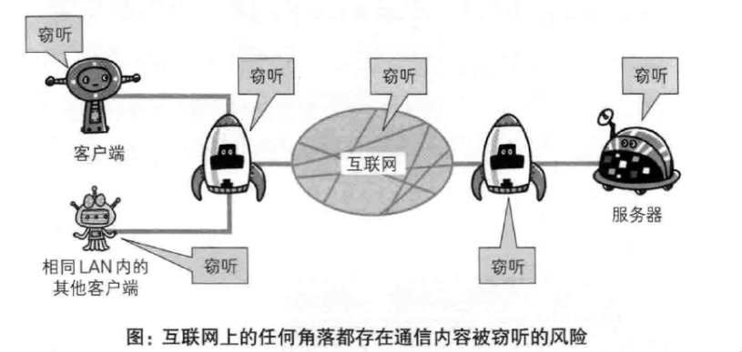

窃听相同段上的通信并非难事，只需要收集在互联网上流动的数据包（帧）就行了。

----

#### **通信的加密**

HTTP 协议中没有加密机制，但可以通过和 ==SSL(Secure Socket Layer，安全套接层)== 或 ==TLS(Transport Layer Security，安全层传输协议)== 的组合使用，加密HTTP的通信内容。

用 SSL 简历安全通信线路之后，就可以在这条线路上进行 HTTP 通信了。与 SSL 组合使用的 HTTP 被称为 HTTPS（HTTP Secure，超文本传输安全协议）或 HTTP over SSL

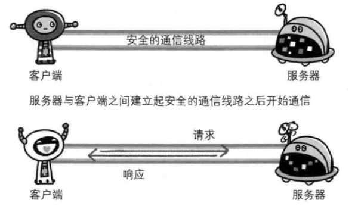

----

#### **内容的加密**

内容加密即对 HTTP 报文里所含的内容进行加密处理再发送请求。但是这么做的前提是要求客户端和服务器同时具备加密和解密机制。

::: note

该方式不同于 SSL 或 TLS 将整个通信线路加密处理，所以内容仍然有被篡改的风险。

:::

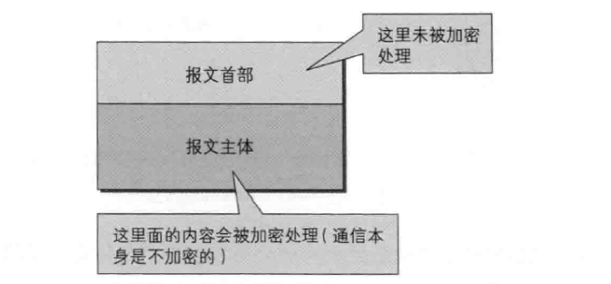

### 1.2 不验证通信方的身份就可能遭遇伪装

**HTTP协议中的请求和响应不会对通信方进行确认。** 也就是说存在 "服务器是否就是发送请求中URI真正指定的主机、返回的响应是否真的返回到实际提出请求的客户端" 等类似问题

---

#### **任何人都可以发起请求**

由于不存在确认通信方的处理步骤，任何人都可以发起请求。并且服务器只要接收到请求，不管对方是谁都会返回一个响应。

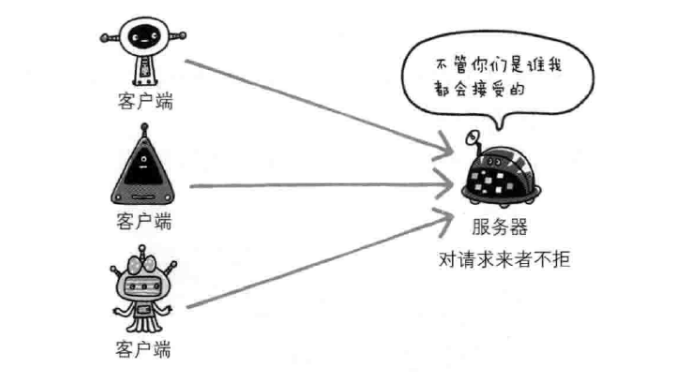

::: tip 隐患

- 无法确定请求发送至目标的 Web 服务器是否按真实意图返回响应的那台服务器. 有可能是伪装的服务器
- 无法确定响应返回到的客户端是否是按真实意图接收响应的那个客户端. 有可能是伪装的客户端
- 无法确定正在通信的对方是否具备访问权限. 因为某些 Web 服务器上保存着重要的信息, 只想发给特定用户通信的权限
- 无法判定请求是来自何方、出自谁手
- 即使是无意义的请求也会照单全收。无法组织海量请求下的 DoS 攻击（Deinal of Service，拒绝服务攻击）

:::

---

#### **查明对手的证书**

SSL 不仅提供加密处理，而且还使用了一种被称为证书的手段，可用于确定方。

::: info 证书

是值得信任的第三方机构颁发，用以证明服务器和客户端是实际存在的。伪造证书从技术角度来说异常困难，所以只要能够确认通信放持有的证书即可判断通信方的真实意图

:::

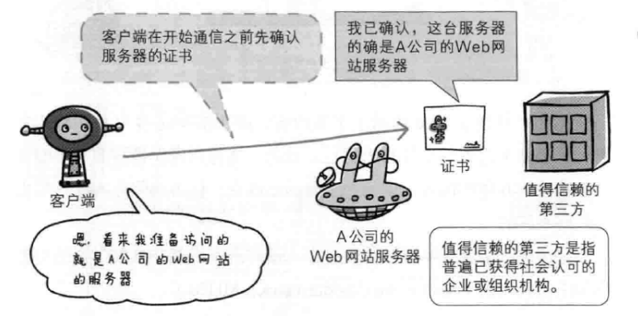

### 1.3 无法证明报文完整性，可能已遭篡改

由于 HTTP 协议无法证明通信的报文完整性，因此即使报文内容在传输过程中遭到篡改，也没办法获悉。

::: info 中间人攻击

像这样在请求或响应的传输途中，遭攻击者拦截并篡改内容的攻击称为 中间人攻击（Man-in-the-Middle attack，MITM）

:::

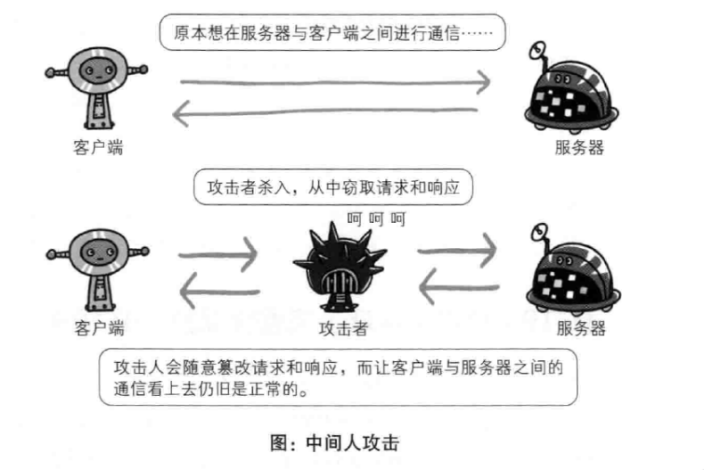

---

#### **如何防止篡改**

虽然有 MD5 和 SHA-1 等散列值校验的方法，以及用来确认文件的数字签名方法。但是这些依然不能百分百保证结果正确。

为了有效防止这些弊端，有必要使用 HTTPS

## 二、HTTP + 加密 + 认证 + 完整性保护 = HTTPS

### 2.1 HTTPS

**我们把添加了加密及认证机制的 HTTP 称为 HTTPS（HTTP Secure）**

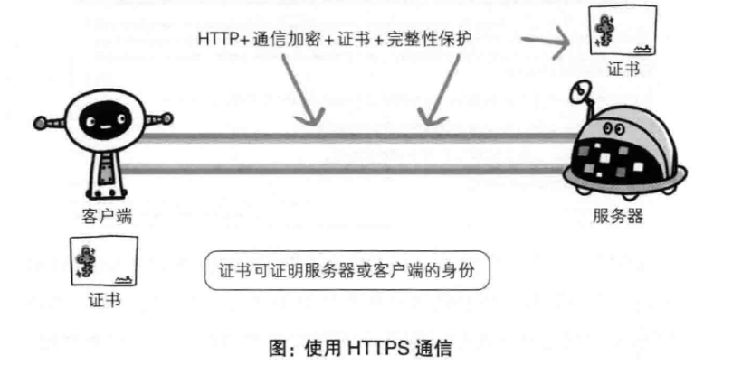

### 2.2 身披 SSL 外壳的 HTTP

HTTPS 并非是应用层的一种新协议，只是 HTTP 通信接口部分用 SSL和TLS 协议代替而已。

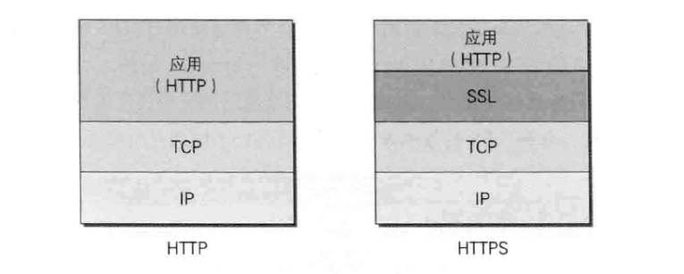

SSL 独立于 HTTP，所以其他运行在应用层的 SMTP、Telnet 等协议都可以配合 SSL 协议使用。

### 2.3 公开密钥加密技术

**SSL 采用一种叫做 ==公开密钥加密== 的加密处理方式**

::: info 密钥

密钥是一种参数，它是在明文转换为密文或将密文转换为明文的算法中输入的参数

:::

近代的加密方法中加密算法是公开的，而密钥确实保密的。通过这种方式得以保持加密方法的安全性。

加密和解密都会用到密钥。没有密钥就无法对密码解密，任何人只要持有密钥就能解密。如果密钥被攻击者获得，那加密就是去了意义。

---

#### **共享密钥加密的困境**

::: info 共享密钥加密

加密和解密同用一个密钥的方法称为共享密钥加密，也被叫做 **对称密钥加密**。

:::

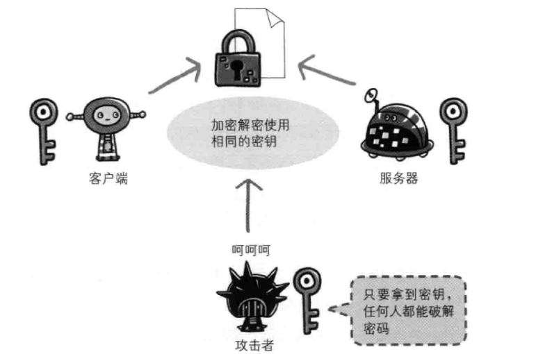

以共享密钥方式加密时必须将密钥也发给对方。可要怎样才能安全的转交密钥？

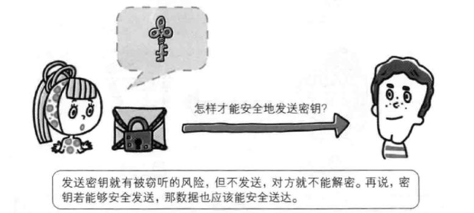

---

#### **公开密钥加密**

::: info 公开密钥

公开密钥加密使用一对非对称的密钥。一把叫做私有密钥、另一把叫做公开密钥。

:::

使用公开密钥的加密方式，发送密文的一方使用对方的公开密钥进行加密处理，对方收到被加密的信息后，在使用自己的私有密钥进行解密。

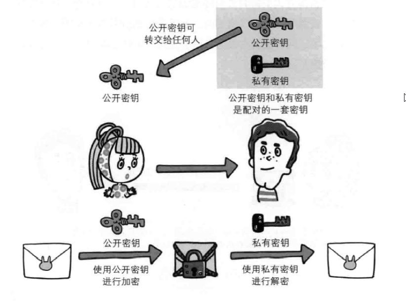

---

#### **HTTPS 采用混合加密机制**

**HTTPS 采用共享密钥加密和公开密钥加密两者并用的混合加密机制。**

若密钥能够实现安全交换，那么有可能会考虑仅使用公开密钥加密来通信。但是公开密钥加密与共享密钥加密相比，处理速度要稍慢。

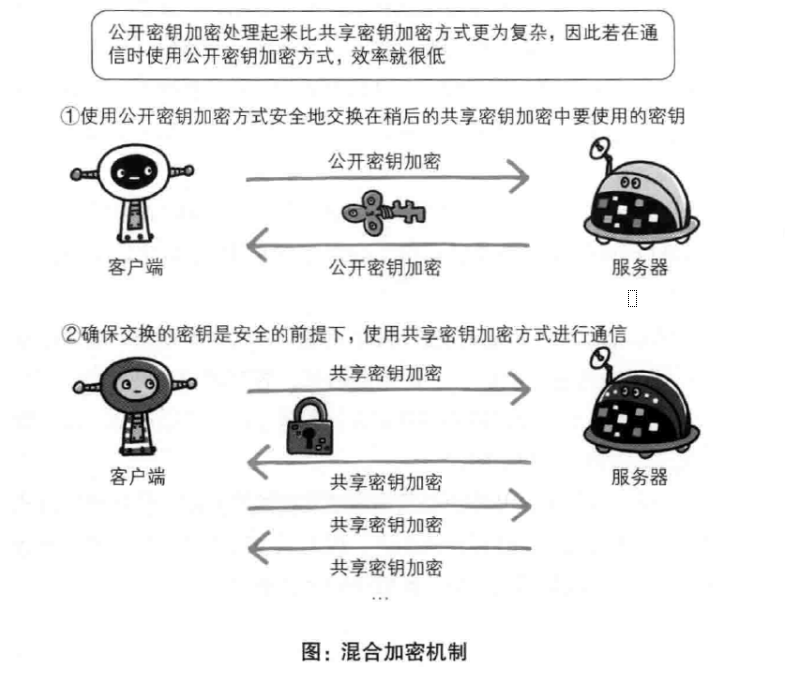

### 2.4 证明公开密钥正确性的证书

公开密钥无法证明本身是货真价实的。可能存在公开密钥传输的过程中，真正的公开密钥以及被攻击者替换掉了。

为了解决上述问题，可以使用由数字证书认证机构和其他相关机关颁发的公开密钥证书。

1. 服务器的运营人员向数字证书认证机构提出公开密钥的申请
2. 数字证书认证机构在判明提出申请的身份之后，对已申请的公开密钥做数字签名。然后分配这个已签名的公开密钥，并将该公开密钥放入公钥证书后绑定在一起
3. 服务器将这份由数字证书认证机构颁发的公钥证书发送给客户端
4. 客户端对证书上的数字签名进行验证

::: tip 公开密钥必须安全转交

认证机关的公开密钥必须安全地转交给客户端，多数浏览器开发商发布版本时，会事先在内部植入常用认证机关的公开密钥。

:::

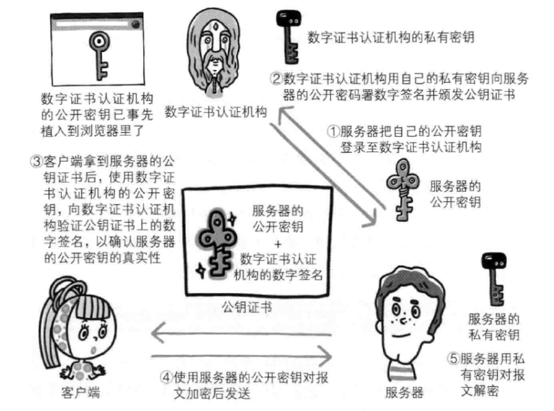

---

#### **可证明组织真实性的EV SSL证书**

::: tip 证书的作用

- 证明作为通信一方的服务是否规范
- 确认对方服务器背后运营的企业是否真实存在。

:::

---

**用以确认客户端的客户端证书**

客户端证书进行客户端认证，证明服务器正在通信的对方始终是预料之内的客户端。

1. 证书的获取和发布

    > 客户端需要付费购买。安全性极高的认证机构可颁发客户端证书但仅用于特殊用途的业务。

2. 客户端证书只能证明客户端实际存在，不能证明用户本人的真实有效性

    > 只要获得了安装有客户端证书的计算机的使用权限，就意味着同时拥有了客户端证书的使用权限。

### 2.5 HTTPS 的安全通信机制

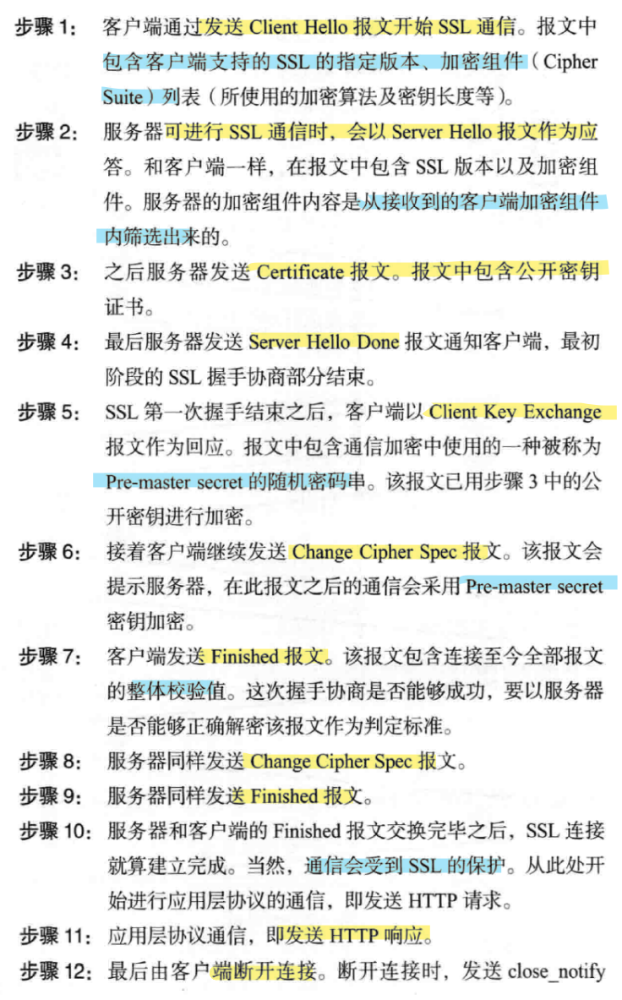

在以上流程中，应用层发送数据时会附加一种叫做 ==MAC== 的报文摘要。**能够查知报文是否遭到篡改，从而保护报文的完整性**

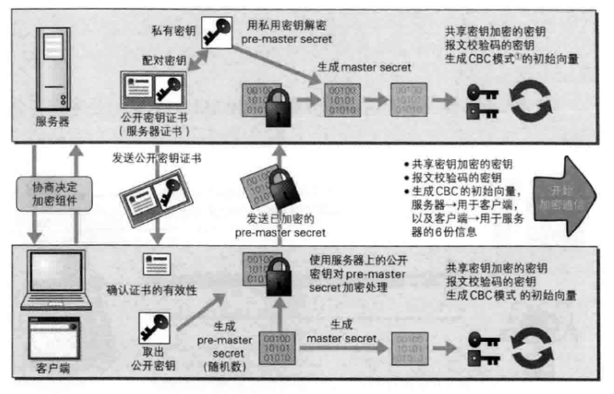

---

#### **SSL 和 TLS**

::: tip HTTPS 的问题

1. 使用 HTTPS 处理速度会变慢
    1. 通信慢
    2. 大量消耗 CPU及内存等资源，处理速度变慢
2. SSL 必须进行加密处理，消耗更多的硬件资源、导致负载增强

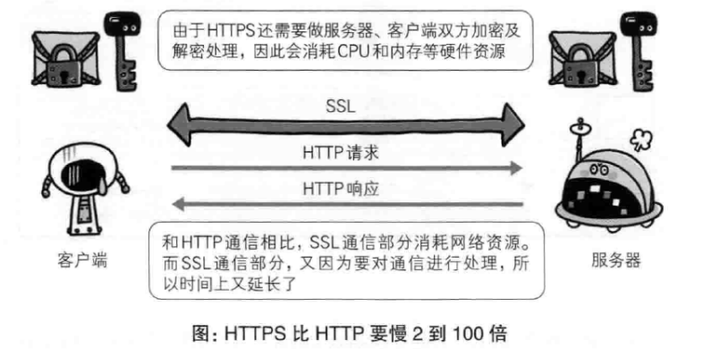

:::

