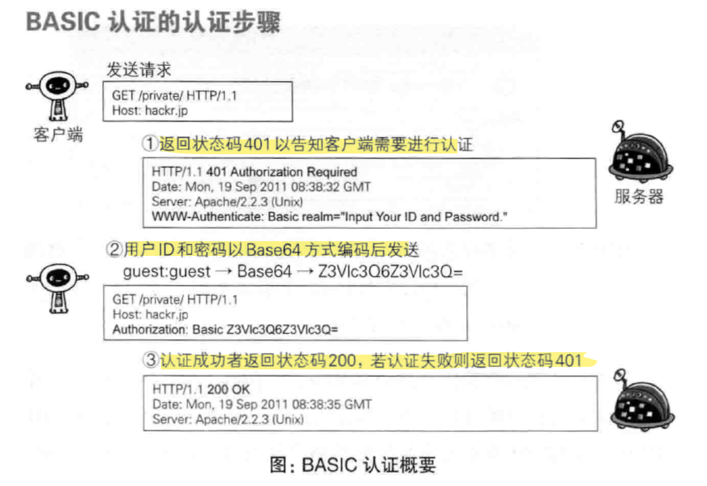
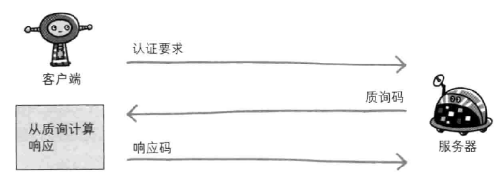
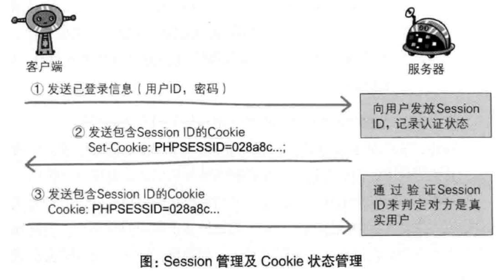

---
# 这是页面的图标
icon: page

# 这是文章的标题
title: 第八章、确认访问用户身份的认证

# 设置作者
author: lllllan

# 设置写作时间
# time: 2020-01-20

# 一个页面只能有一个分类
category: 计算机基础

# 一个页面可以有多个标签
tag:
- 计算机网络
- 图解HTTP

# 此页面会在文章列表置顶
# sticky: true

# 此页面会出现在首页的文章板块中
star: true

# 你可以自定义页脚
# footer: 
---

::: warning 转载声明

- 《图解HTTP》 

:::

## 一、何为认证

计算机本身无法判断坐在显示器前的使用者的身份。

为确认使用者的身份，是否真的具有访问系统的权限，就需要核对登陆者本人才知道的信息。

但即便对方是假冒的用户，只要能通过用户验证，那么计算机就会默认是出自本人的行为。因此掌控机密信息的密码绝不能让他人得到。

::: info HTTP 使用的认证方式

- BASIC 认证（基本认证）
- DIGEST 认证（摘要认证）
- SSL 客户端认证
- FormBase 认证（基于表单认证）

:::

## 二、BASIC 认证

BASIC 认证是从HTTP/1.0 就定义的认证方式。是Web服务器与通信客户端之间进行的认证方式

::: tip Base64编码不是加密

BASIC 认证虽然采用 Base64 编码方式，但这不是加密处理。在非加密通信的线路上进行认证的过程中，如果被人窃听，被盗的可能性极高。

:::

## 三、DIGEST 认证

DIGEST 认证同样使用 **质询/响应** 的方式，但不会像 BASIC 认证那样直接发送明文密码。

::: info 质询/响应

一开始一方会先发送认证要求给另一方，接着使用从另一方那接收到的质询码计算生成响应码。最后将响应码返回给对方进行认证的方式。

:::

## 四、SSL 客户端认证

SSL 客户端认证是借由 HTTPS 的客户端证书完成认证的方式。凭借客户端证书认证，服务器可确认访问是否来自已登录的客户端。

### 认证步骤

1. 接收到需要认证资源的请求，服务器会发送 `Certificate Request` 报文，要求客户端提供客户端证书
2. 用户选择将发送的客户端证书后，客户端会把客户端证书信息以 `Client Certificate` 报文方式发送给服务器
3. 服务器验证客户端证书验证通过后方可领取证书内客户端的公开密钥，然后开始 HTTPS 加密通信

### 双因素认证

SSL 客户端认证一般会依靠证书和基于表单认证组合形成一种双因素认证。

::: info 双因素认证

认证过程中不仅需要密码这一个因素，还需要申请认证者提供其他持有信息，从而作为另一个因素，与其组合使用的认证方式

:::

### SSL 客户端认证必要的费用

SSL 客户端认证需要从认证机构购买。

## 五、基于表单认证

客户端会向服务器上的Web应用程序发送登录信息，按登录信息的验证结果认证

### 认证多半基于表单认证

- BASIC和DEGEST存在便利性及安全性问题，几乎不怎么使用。
- SSL客户端认证因为费用问题，还尚未普及。

对于Web网站的认证功能，能够满足其安全使用级别的标准规范并不存在，所以只好使用由Web应用程序各自实现基于表单的认证方式。

### Session 管理及 Cookie 应用

鉴于 HTTP 是无状态协议，已成功认证的用户状态无法通过协议层面保存下来。因此使用 Cookie 来管理 Session，以弥补 HTTP 协议中不存在的状态管理功能

