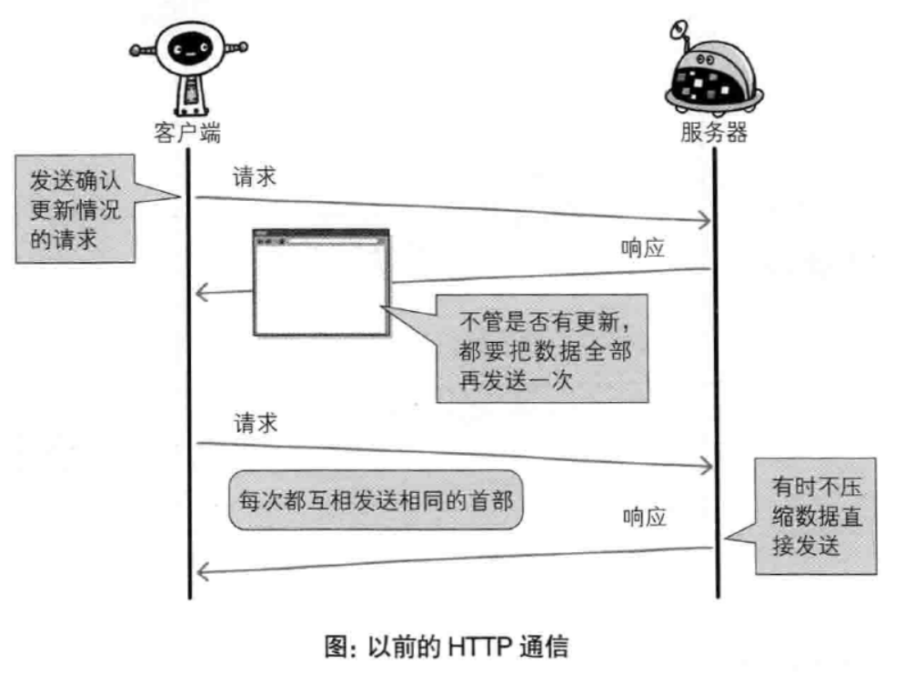
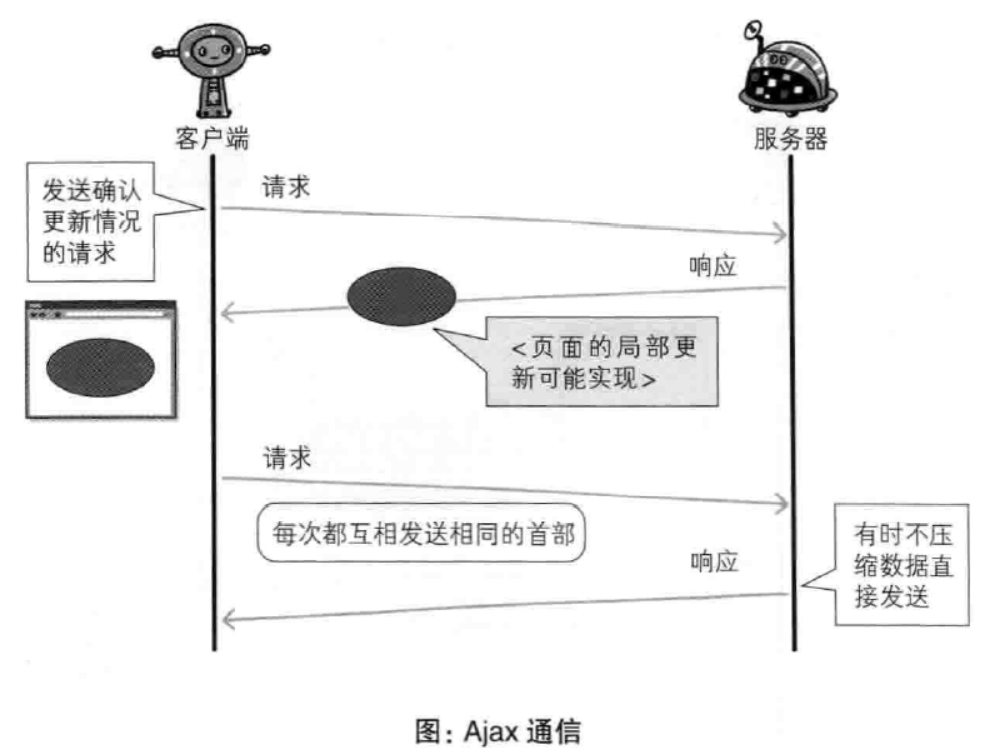
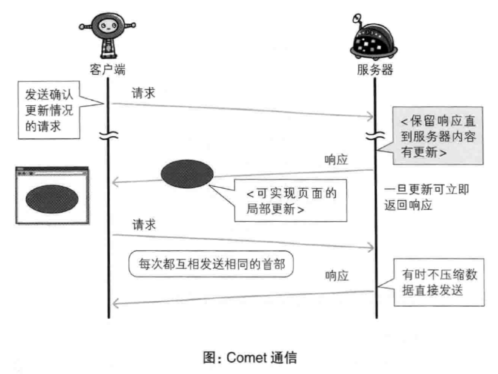
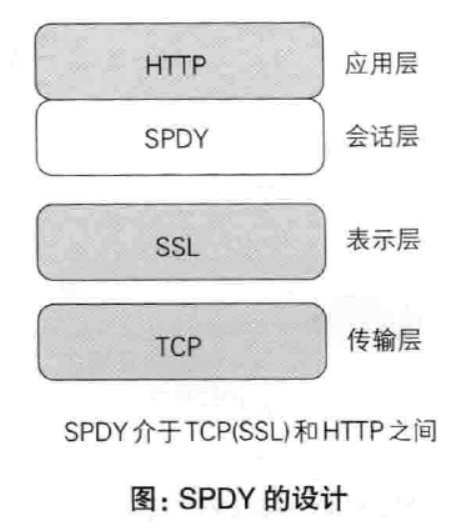
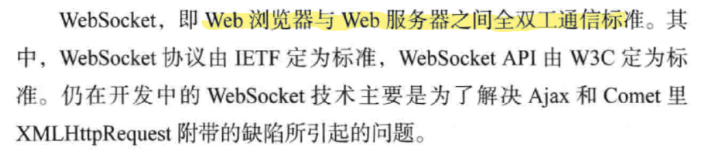
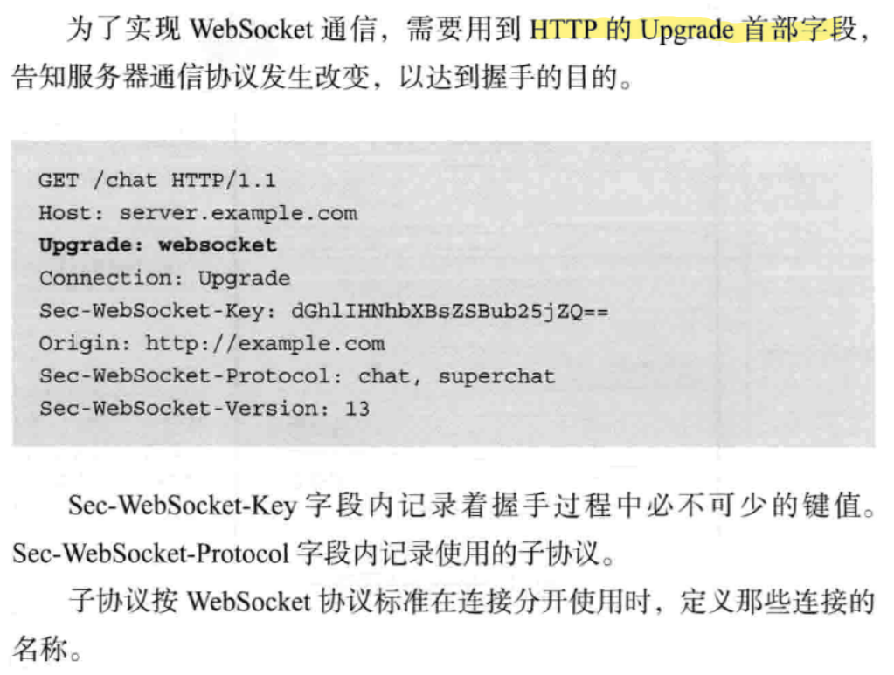
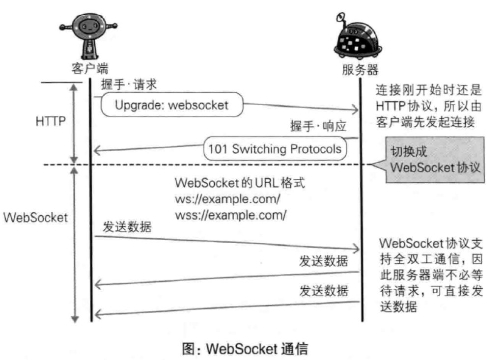

---
# 这是页面的图标
icon: page

# 这是文章的标题
title: 第九章、追加协议

# 设置作者
author: lllllan

# 设置写作时间
# time: 2020-01-20

# 一个页面只能有一个分类
category: 计算机基础

# 一个页面可以有多个标签
tag:
- 计算机网络
- 图解HTTP

# 此页面会在文章列表置顶
# sticky: true

# 此页面会出现在首页的文章板块中
star: true

# 你可以自定义页脚
# footer: 
---

::: warning 转载声明

- 《图解HTTP》 

:::

## 一、基于HTTP协议

目前基于 HTTP 的 Web 浏览器的使用环境已经遍布全球，因此无法完全抛弃 HTTP。

::: info SPDY

SPDY（读作“SPeeDY”）是[Google](https://baike.baidu.com/item/Google)开发的基于[TCP](https://baike.baidu.com/item/TCP/33012)的会话层 [1] 协议，用以最小化网络延迟，提升网络速度，优化用户的网络使用体验。SPDY并不是一种用于替代HTTP的协议，而是对[HTTP](https://baike.baidu.com/item/HTTP)协议的增强。新协议的功能包括数据流的多路复用、请求优先级以及HTTP报头压缩。谷歌表示，引入[SPDY协议](https://baike.baidu.com/item/SPDY协议/15652060)后，在实验室测试中页面加载速度比原先快64%

:::

## 二、SPDY

SPDY 的开服目标旨在解决 HTTP 的性能瓶颈，缩短 Web 页面的加载时间。

### 2.1 HTTP 的瓶颈

使用 HTTP 协议探知服务器上是否有内容更新，就必须频繁地从客户端到服务器进行确认。如果服务器上内容没有更新，那么就会产三徒劳的通信。

::: info 制约因素

- 一条连接上只可以发送一个请求
- 请求只能从客户端开始，客户端不可以接收除响应意外的指令
- 请求/响应首部未经压缩就发送，首部信息越大延迟越大
- 每次互相发送相同的、冗长的首部造成很多浪费
- 可任意选择数据压缩格式

:::

---

#### **Ajax的解决办法**

Ajax 是一种有效利用 JavaScript 和 DOM的操作，以达到局部 Web 页面替换加载的异步通信手段。

---

#### **Comet的解决办法**

通过延迟应答，模拟实现服务器端向客户端推送的功能。

通常服务器端接收到请求，在处理完毕后就会立即返回响应，但为了实现推送功能，Comet会先将响应置于挂起状态，当服务器端有内容更新时，再返回该响应。

### 2.2 SPDY 的设计和功能

SPDY 没有完全改写 HTTP 协议，而是在 TCP/IP 的 ==应用层与运输层之间通过新加会话层的形式运作，并且使用SSL==。

---

#### **多路复用流**

通过单一的TCP连接，可以无限制处理多个HTTP请求。

---

#### **赋予请求优先级**

可以给请求逐个分配优先级顺序，是为了在发送多个请求时，解决因带宽低而导致响应变慢

---

#### **压缩HTTP首部**

通过压缩HTTP首部，减少数据包中的字节数。

---

#### **推送功能**

支持服务器主动向客户端推送数据的功能。

---

#### **服务器提示功能**

服务器可以主动提示客户端请求所需的资源。由于在客户端发现资源之前就可以获知资源的存在，因此在资源已缓存等情况下，可以避免发送不必要的请求

### 2.3 SPDY 消除Web瓶颈了吗

SPDY 的确是一种可以有效消除 HTTP 瓶颈的技术，但很多 Web 网站存在的问题并非仅仅是由 HTTP 瓶颈所导致

## 三、全双工通信的 WebSocket

利用 Ajax 和 Comet 技术进行通信可以提升 Web 的浏览速度，但问题在于通信如果使用 HTTP就无法彻底解决瓶颈问题

::: info WebSocket

**WebSocket**是一种在单个[TCP](https://baike.baidu.com/item/TCP)连接上进行[全双工](https://baike.baidu.com/item/全双工)通信的协议。

WebSocket使得客户端和服务器之间的数据交换变得更加简单，允许服务端主动向客户端推送数据。在WebSocket API中，浏览器和服务器只需要完成一次握手，两者之间就直接可以创建持久性的连接，并进行双向数据传输。

:::

### 3.1 WebSocket 的设计和功能

### 3.2 WebSocket 协议

一旦 Web 服务器和客户端之间建立起 WebSocket 协议的通信连接，之后所有的通信都依靠这个协议进行传输。

#### **推送功能**

支持由服务器向客户端发送数据的推送功能

---

#### **减少通信量**

只要建立起 WebSocket 连接，就希望一直保持连接状态。和 HTTP 相比，每次连接的总开销更小，并且首部信息量也很小，减少了通信量

### 3.3 握手-请求

为了实现 WebSocket 通信，在 HTTP 连接建立之后，需要完成一次握手的步骤

### 3.4 握手-响应

成功握手确立 WebSocket 连接之后，通信时不再使用 HTTP 的数据帧，而采用 WebSocket 独立的数据帧

